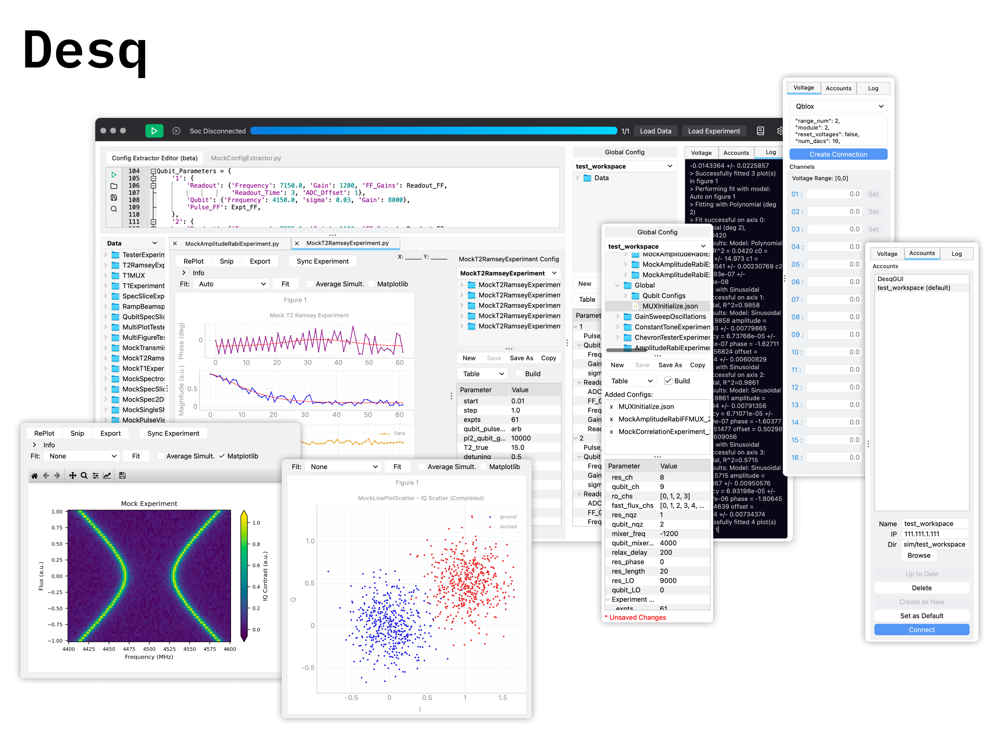

<!-- Improved compatibility of back to top link: See: https://github.com/othneildrew/Best-README-Template/pull/73 -->

#### Houck Lab - Princeton University

 

<h3 align="center">The Quantum Desq</h3>

  

    The research platform for all quantum RFSoC experiments.
     
     
    <a href="https://sonnyloweus.github.io/DESQ/"><strong>Documentation »</strong></a>
     
    <a href="https://github.com/houcklab/HouckLab_QICK/tree/desq_dev/MasterProject/Client_modules/Desq_GUI"><strong>Houcklab Github Repo »</strong></a>
     
     
    <a href="https://github.com/sonnyloweus">Sonny Lowe</a>
    &middot;
    <a href="https://github.com/mdmolinelli">Matthew Molinelli</a>
    &middot;
    <a href="https://github.com/levkrayzman">Lev Krayzman</a>
    &middot;
    <a href="https://scholar.google.com/citations?user=0Hyk7XAAAAAJ&hl=en">Jake Bryon</a>
  

[//]: # ([![YouTube Demo]&#40;https://img.shields.io/badge/YouTube-Demo-FF0000?style=for-the-badge&logo=youtube&logoColor=white&#41;]&#40;https://youtu.be/WknE6hNdmEc&#41;)

## Built With
[![Python][Python.org]][Python-url]
[![PyQt][PyQt.org]][PyQt-url]
[![Conda][Conda.io]][Conda-url]

[Python.org]: https://img.shields.io/badge/Python-3776AB?style=for-the-badge&logo=python&logoColor=white
[Python-url]: https://www.python.org/

[PyQt.org]: https://img.shields.io/badge/PyQt-41CD52?style=for-the-badge&logo=qt&logoColor=white
[PyQt-url]: https://riverbankcomputing.com/software/pyqt/

[Conda.io]: https://img.shields.io/badge/Conda-3FC75B?style=for-the-badge&logo=anaconda&logoColor=white
[Conda-url]: https://docs.conda.io/
