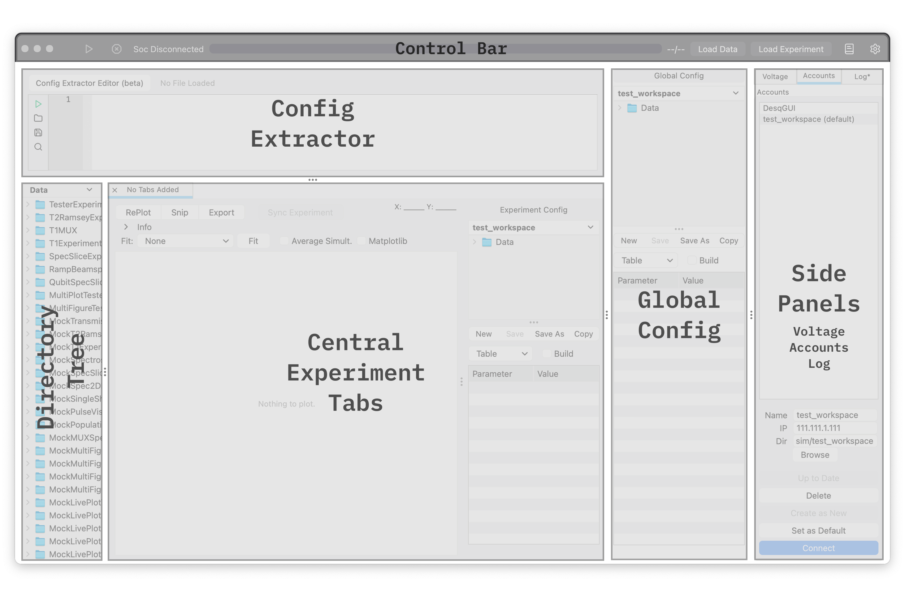

Desq Basics
-----------

.. _desq_basics:

A comprehensive guide to Desq, including its main components, navigation, workflow, and backend architecture.

Organizing Your Desq
^^^^^^^^^^^^^^^^^^^^

Desq is a PyQt5-based research tool platform for managing superconducting qubit experiments on RFSoC hardware.
The interface is organized into several key regions that work together to provide a complete experiment control environment.

Main Window Layout
~~~~~~~~~~~~~~~~~~

The Desq main window follows a hierarchical layout structure:

Custom Menu Bar
~~~~~~~~~~~~~~~

The top menu bar provides quick access to essential functions (from left to right):

    - **Run**: Start the currently selected experiment
    - **Stop**: Stop the running experiment (offers Safe Stop or Force Stop)
    - **Progress Bar**: Visual indicator of experiment progress
    - **Load Exp**: Open a Python experiment file (creates experiment tabs)
    - **Load Data**: Open an HDF5 dataset file for visualization
    - **Documentation**: Link to online documentation
    - **Settings**: Application preferences (theme, font size)

Central Tabs Container
~~~~~~~~~~~~~~~~~~~~~~

The central area hosts experiment and data tabs. Each tab (:class:`QDesqTab`) provides:

    - **Plot Utilities Bar**: Buttons for RePlot, Snip (clipboard), Export, and Sync
    - **Plot Settings**: Matplotlib toggle, fitting options
    - **Plot Area**: Visualization space using PyQtGraph (default) or Matplotlib
    - **Figure Carousel**: Thumbnail navigation when multiple figures exist
    - **Experiment Info Bar**: Source file, estimated runtime, hardware requirements (Collapsible)
    - **Experiment Config Panel**: Experiment-specific configuration parameters

For detailed implementation, see :mod:`DesqTab`.

Configuration Panels
~~~~~~~~~~~~~~~~~~~~

Desq uses two configuration panels:

**Global Config Panel**
   Contains parameters shared across all experiments (e.g., qubit frequencies, readout settings). Located in the main splitter area.

**Experiment Config Panel**
   Experiment-specific parameters that override or extend global config. Embedded within each :class:`QDesqTab`.

Both panels support:
    - Can load in a .json config file, or in "build" mode, can combine multiple .json files.
    - Tree view display of configuration hierarchy
    - Inline editing of parameter values
    - Directory browser for loading config files

For implementation details, see :mod:`ConfigTreePanel`.

Side Tabs Panel
~~~~~~~~~~~~~~~

The right-side panel contains three tabs:

**Voltage Tab**
   Interface for controlling voltage sources (Yoko, Qblox). See :mod:`VoltagePanel`.

**Accounts Tab**
   RFSoC connection management with saved account profiles. Each account profile saves the workspace directory as well. See :mod:`AccountsPanel`.

**Log Tab**
   Real-time log output from Qt message handlers for debugging. See :mod:`LogPanel`.

Directory Tree Panel
~~~~~~~~~~~~~~~~~~~~

The left-side file browser enables quick experiemnt, data, or image tab creation:

- Python experiment files (``.py``)
- HDF5 dataset files (``.h5``)
- Image files for reference (``PNG, JPG, JPEG, GIF, BMP, SVG, WebP``)

Double-clicking a file loads it into the appropriate context. See :mod:`DirectoryTreePanel`.

******************

Running an Experiment Workflow
^^^^^^^^^^^^^^^^^^^^^^^^^^^^^^

This section describes the complete workflow from RFSoC connection to data collection and storage.

Step 1: Connecting to an RFSoC Account
~~~~~~~~~~~~~~~~~~~~~~~~~~~~~~~~~~~~~~

Before running experiments, establish a connection to the RFSoC hardware:

1. Navigate to the **Accounts** tab in the side panel
2. Select an existing account or create a new one:

   - **Account Name**: Descriptive identifier (e.g., "houcklab")
   - **IP Address**: RFSoC network address (e.g., "192.168.1.100")
   - **Workspace**: Directory path for experiment data/results storage (absolute path)

3. Click **Connect** to establish the Pyro4 proxy connection
4. On successful connection:

   - A checkmark appears next to the account name
   - The **Connect** button changes to **Disconnect**
   - The ``soc`` and ``soccfg`` objects become available for experiments

.. code-block:: python

   # Account data is stored locally in JSON format:
   # LocalStorage/accounts/<account_name>.json
   {
       "ip_address": "192.168.1.100",
       "account_name": "houcklab",
       "workspace": "/path/to/workspace"
   }

Step 2: Setting the Workspace Directory
~~~~~~~~~~~~~~~~~~~~~~~~~~~~~~~~~~~~~~~

The workspace defines where experimental data is saved:

- Set via the **Workspace** field in the Accounts panel
- Automatically updates when switching accounts
- Creates a ``Data/`` subdirectory for experiment outputs that automatically save config, dataset, and plot images.

.. note::

   The workspace path is also injected into experiments via the ``outerFolder`` attribute, enabling consistent file organization across experiment types.

Step 3: Loading an Experiment
~~~~~~~~~~~~~~~~~~~~~~~~~~~~~

Load experiment files using either method:

**Method A: Menu Bar**
   Click **Load Exp** and select a Python file containing experiment classes.

**Method B: Directory Tree**
   Double-click a ``.py`` file in the Directory Tree panel.

The loading process:

1. :func:`ExperimentLoader.load_module` installs the custom matplotlib backend
2. The module is imported with ``socProxy`` blocked (to prevent premature connections)
3. :func:`ExperimentLoader.find_experiment_classes` discovers all classes in a file inheriting from ``ExperimentClass``
4. A new :class:`QDesqTab` is created for each discovered experiment
5. The tab extracts default configuration from the experiment's ``config_template`` attribute

.. seealso::

   Each experiments should follow the ``ExperimentClass`` template and override their own ``.acquire()`` and ``.display()`` functons. See the ExperimentHub.

.. code-block:: python

   # Example experiment file structure
   class MyExperiment(ExperimentClass):
       def __init__(self, soc, soccfg, cfg):
           super().__init__(soc, soccfg, cfg)
           # Experiment initialization

       def acquire(self):
           # Data acquisition logic
           return {"data": {...}}

       def display(self, data, plotDisp=True):
           # Custom plotting logic
           plt.figure()
           plt.plot(data["x"], data["y"])

For implementation details, see :mod:`ExperimentLoader` and :mod:`ExperimentObject`.

Step 4: Building Configuration
~~~~~~~~~~~~~~~~~~~~~~~~~~~~~~

Configuration is assembled from the two sources:

1. Global Configuration
   Base parameters shared across experiments, loaded from JSON files or manually entered in the Global Config panel.

2. Experiment Configuration
   Tab-specific overrides and additions, managed in each tab's Experiment Config panel.

**Config Code Extraction**
   The universal config editor (top section) allows pasting or loading Python code and extracts all dictionary variables to load into
   either the experiment-specifc of global config sections. Sometimes configs need to be made dynamically via ``Runner`` files and this
   allows for that to be utilized. see :mod:`MockConfigExtractor``.

At experiment runtime, configurations are merged:

.. code-block:: python

   # In Desq.run_experiment():
   experiment_format_config = {}
   experiment_format_config.update(current_global_config)
   experiment_format_config.update(current_experiment_config)  # Overrides duplicates

   if "sets" not in experiment_format_config:
       experiment_format_config["sets"] = 1

Step 5: Connecting Voltage Interface (Optional)
~~~~~~~~~~~~~~~~~~~~~~~~~~~~~~~~~~~~~~~~~~~~~~~

For experiments requiring voltage control:

1. Navigate to the **Voltage** tab
2. Configure voltage channels for your hardware:

   - **Yokogawa GS200**: Precision DC voltage source
   - **Qblox**: Multi-channel fast flux control

3. Channels can be linked to config parameters for automatic updates

The voltage interface provides:

- Real-time voltage readout
- Manual voltage adjustment

See :mod:`VoltagePanel`, :mod:`VoltageInterface`, :mod:`YOKOGS200`, and :mod:`QBLOX` for implementation details.

Step 6: Running the Experiment
~~~~~~~~~~~~~~~~~~~~~~~~~~~~~~

Execute the experiment by clicking **Run** (green arrow) in the menu bar:

1. **Validation**: Checks RFSoC connection status (unless ``TESTING=True``)
2. **Session Setup**: Calls ``tab.start_plot_session()`` to:

   - Clear previous plots and carousel
   - Generate a new ``session_id`` for figure isolation
   - Snapshot the plot area size for consistent rendering

3. **Worker Creation**: Creates :class:`ExperimentThread` with:

   - Merged configuration dictionary
   - Reference to ``soc`` and ``soccfg``
   - Plot sink manager for matplotlib interception
   - Target tab and session ID

4. **Thread Execution**: Moves worker to a QThread and starts the experiment loop

.. code-block:: python

   # Simplified experiment execution flow
   plot_session_id = self.current_tab.start_plot_session()

   self.experiment_worker = ExperimentThread(
       config=experiment_format_config,
       soccfg=self.soccfg,
       exp=experiment_instance,
       soc=self.soc,
       plot_sink_manager=self.plot_sink_manager,
       target_tab=self.current_tab,
       session_id=plot_session_id
   )

   self.experiment_worker.moveToThread(self.thread)
   self.thread.started.connect(self.experiment_worker.run)
   self.thread.start()

**During Execution:**

- The experiment's ``.acquire()`` method runs in the worker thread
- Matplotlib draw operations are intercepted by :class:`BackendDesq`
- Figures are routed to the correct tab via Qt signals
- Progress bar updates after each completed set
- Data is saved automatically after each set

**Stopping the Experiment:**

- **Safe Stop**: Completes current set, then stops (click Stop → Safe Stop)
- **Force Stop**: Interrupts immediately using async exception injection (click Stop → Force Stop)

See :mod:`ExperimentThread` for threading implementation.

Step 7: What Gets Saved
~~~~~~~~~~~~~~~~~~~~~~~

After each experiment set, three files are saved to the workspace:

**Directory Structure:**

.. code-block:: text

   <workspace>/Data/
   └── <ExperimentName>/
       └── <ExperimentName>_YYYY_MM_DD/
           ├── <ExperimentName>_YYYY_MM_DD_HH_MM_SS.h5    # Data
           ├── <ExperimentName>_YYYY_MM_DD_HH_MM_SS.json  # Config
           └── <ExperimentName>_YYYY_MM_DD_HH_MM_SS.png   # Plot image

    **HDF5 Data File (.h5)**

    Contains experiment data in HDF5 format:

    - Numeric arrays stored as datasets
    - Dictionary metadata stored as JSON attributes
    - Jagged arrays automatically padded with NaN

    .. code-block:: python

       # Data structure
       {
           "data": {
               "x_data": np.array([...]),
               "y_data": np.array([...]),
               "set_num": 0,
               # Additional experiment outputs
           }
       }

    **JSON Config File (.json)**

    Complete configuration snapshot:

    .. code-block:: json

       {
           "Base Config": {
               "qubit_freq": 5.0e9,
               "readout_length": 1000
           },
           "Experiment Config": {
               "sweep_start": 0,
               "sweep_stop": 100,
               "num_points": 101
           }
       }

    **PNG Plot Image (.png)**

Screenshot of the current plot visualization, captured from either the PyQtGraph or Matplotlib widget depending on the active rendering mode.

For custom export logic, experiments can define an ``exporter`` method. Otherwise, :meth:`QDesqTab.backup_exporter` handles generic data serialization.

******************

Backend Architecture: Plot Interception
---------------------------------------

Desq uses a sophisticated matplotlib backend interception system to capture and route plots from experiment code to the GUI. This section explains the architecture and how it works.

The Problem: Matplotlib in GUI Applications
~~~~~~~~~~~~~~~~~~~~~~~~~~~~~~~~~~~~~~~~~~~

Standard matplotlib usage (``plt.show()``) creates OS-level windows that:

- Block the GUI event loop
- Cannot be integrated into Qt widget layouts
- Don't support live updating during experiments
- Cause threading issues when called from worker threads

Previous approaches like monkey-patching ``plt.show()`` were brittle and missed many code paths.

The Solution: Custom Backend Interception
~~~~~~~~~~~~~~~~~~~~~~~~~~~~~~~~~~~~~~~~~

Desq implements a custom matplotlib backend (:mod:`BackendDesq`) that intercepts ALL rendering operations at the canvas level:

.. code-block:: text

   ┌─────────────────────────────────────────────────────────────────────────┐
   │                     Matplotlib Rendering Pipeline                       │
   ├─────────────────────────────────────────────────────────────────────────┤
   │                                                                         │
   │   plt.show()   ─┐                                                       │
   │                 │                                                       │
   │   fig.savefig()─┼──▶  FigureCanvas.draw()  ──▶  FigureCanvasDesq        │
   │                 │                              (Custom Backend)         │
   │   animation    ─┤                                    │                  │
   │                 │                                    ▼                  │
   │   GUI paint    ─┘                           Notify Plot Sink            │
   │                                                    │                    │
   │                                                    ▼                    │
   │                                            PlotSinkManager              │
   │                                            (Qt Signal Emission)         │
   │                                                    │                    │
   │                                                    ▼                    │
   │                                            QDesqTab.receive_figure()    │
   │                                            (GUI Thread Handler)         │
   │                                                                         │
   └─────────────────────────────────────────────────────────────────────────┘

BackendDesq Module
~~~~~~~~~~~~~~~~~~

The :mod:`BackendDesq` module provides a custom matplotlib backend:

**Key Components:**

:class:`FigureCanvasDesq`
   Extends ``FigureCanvasAgg`` and overrides ``draw()`` and ``draw_idle()`` to notify the thread-local plot sink.

:class:`FigureManagerDesq`
   Minimal manager that prevents OS window creation.

:func:`set_plot_sink`
   Sets the sink callback for the current thread. Each experiment thread has its own sink.

:func:`clear_plot_sink`
   Removes the sink after experiment completion.

.. code-block:: python

   # Backend installation (in Desq.py, before any matplotlib imports)
   BACKEND_MODULE = 'module://MasterProject.Client_modules.Desq_GUI.scripts.BackendDesq'
   os.environ["MPLBACKEND"] = BACKEND_MODULE
   matplotlib.use(BACKEND_MODULE, force=True)

**Thread-Local Storage:**

Each thread maintains its own plot sink, enabling concurrent experiments without figure mixing:

.. code-block:: python

   _thread_local = threading.local()

   def set_plot_sink(sink):
       _thread_local.plot_sink = sink

   def get_plot_sink():
       return getattr(_thread_local, 'plot_sink', None)

PlotSinkManager
~~~~~~~~~~~~~~~

The :class:`PlotSinkManager` coordinates between worker threads and the GUI:

**Responsibilities:**

1. Create thread-specific sinks with session IDs
2. Emit Qt signals when figures are drawn
3. Route figures to the correct :class:`QDesqTab`
4. Handle debouncing for rapid updates

.. code-block:: python

   class PlotSinkManager(QObject):
       figureReceived = pyqtSignal(object, object, str, int)
       # Args: (figure, target_tab, event_type, session_id)

       def create_sink_for_tab(self, tab, session_id):
           """Create a sink that routes figures to a specific tab."""
           def sink(figure, event_type):
               if event_type == 'draw':
                   self.figureReceived.emit(figure, tab, event_type, session_id)
           return sink

**Context Manager Usage:**

.. code-block:: python

   # In ExperimentThread.run()
   if self.plot_sink_manager and self.target_tab:
       self.plot_sink_manager.setup_sink_for_thread(self.target_tab, self.session_id)

   try:
       # Run experiment - all matplotlib draws are captured
       data = self.experiment_instance.acquire()
   finally:
       if self.plot_sink_manager:
           self.plot_sink_manager.cleanup_sink_for_thread()

Session-Based Isolation
~~~~~~~~~~~~~~~~~~~~~~~

Session IDs prevent cross-contamination between experiment runs:

1. Each run/replot generates a new ``session_id`` via ``tab.start_plot_session()``
2. The sink tags all captured figures with this session ID
3. The receiving tab validates the session ID and rejects stale figures

.. code-block:: python

   def start_plot_session(self):
       """Start a new plot session with isolation."""
       self._plot_session_id += 1
       self.clear_plots()  # Clear carousel and widgets
       return self._plot_session_id

   def receive_figure(self, figure, event_type, session_id):
       """Receive figure with session validation."""
       if session_id != -1 and session_id != self._plot_session_id:
           # Reject figure from old session
           return
       # Process figure...

PyQtGraph Conversion
~~~~~~~~~~~~~~~~~~~~

When the "Matplotlib" checkbox is unchecked, figures are converted to PyQtGraph:

**Conversion Process:**

1. Parse matplotlib figure structure (axes, lines, images, scatter plots)
2. Create corresponding PyQtGraph widgets
3. Map matplotlib colors, styles, and layouts to PyQtGraph equivalents
4. Support live updates by updating data on existing widgets

**Stacked Widget Architecture:**

Each tab maintains dual rendering stacks:

.. code-block:: python

   # Mode switching is instant - just change stack index
   self.plot_stack = QStackedWidget()
   self.plot_stack.addWidget(self.pyqtgraph_stack)   # Index 0
   self.plot_stack.addWidget(self.matplotlib_stack)  # Index 1

   # Each sub-stack contains:
   # Index 0: Default placeholder ("Nothing to plot")
   # Index 1+: One widget per figure from carousel

**Live Update Support:**

The system tracks plot signatures to enable in-place updates:

.. code-block:: python

   def _compute_pyqtgraph_signature(self, figures):
       """Compute structure signature (not data values)."""
       sig_parts = []
       for fig in figures:
           for ax in fig.get_axes():
               pos = ax.get_position()
               ax_sig = (
                   round(pos.x0, 2), round(pos.y0, 2),
                   len(ax.get_lines()) > 0,
                   len(ax.get_images()) > 0,
               )
               sig_parts.append(ax_sig)
       return tuple(sig_parts)

   # If signature matches, update data in place
   if self._pyqtgraph_signature == new_sig:
       for i, fig in enumerate(figures):
           self._update_pyqtgraph_plot_data(plot, axes[ax_idx])

Figure Carousel
~~~~~~~~~~~~~~~

When experiments generate multiple figures, the :class:`FigureCarousel` provides navigation:

**Features:**

- Horizontal scrollable thumbnail strip
- Click to switch displayed figure (instant, no re-rendering)
- Auto-hide when only one figure exists
- Proper memory management for pixmap cleanup

.. code-block:: python

   # Adding a figure to carousel
   carousel.add_figure(matplotlib_figure, make_active=True)

   # Switching display (just changes stack index)
   def _on_carousel_figure_selected(self, index):
       self._displayed_figure_index = index
       if self.use_matplotlib_checkbox.isChecked():
           self.matplotlib_stack.setCurrentIndex(index + 1)
       else:
           self.pyqtgraph_stack.setCurrentIndex(index + 1)

See :mod:`FigureCarousel` for implementation details.

Threading Safety Notes
~~~~~~~~~~~~~~~~~~~~~~

.. warning::

   **Critical Threading Rules:**

   1. Never use ``qDebug()``, ``qInfo()``, ``qWarning()`` from worker threads - they update a QTextEdit which is not thread-safe. Use ``print()`` instead.

   2. Never touch Qt widgets directly from worker threads - always use Qt signals with ``QueuedConnection``.

   3. Figure objects are passed by reference - use session-based isolation rather than copying (Qt canvases cannot be pickled).
