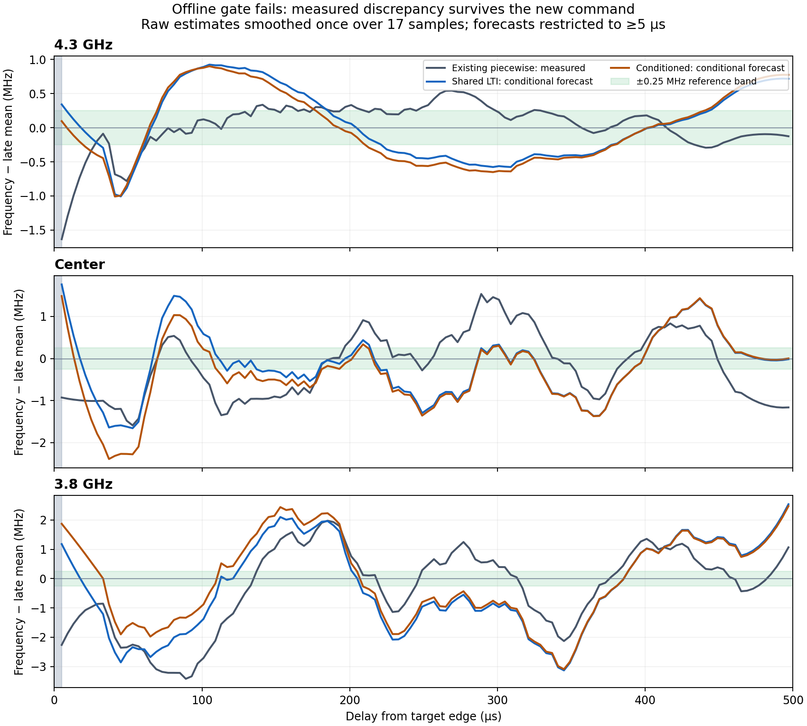
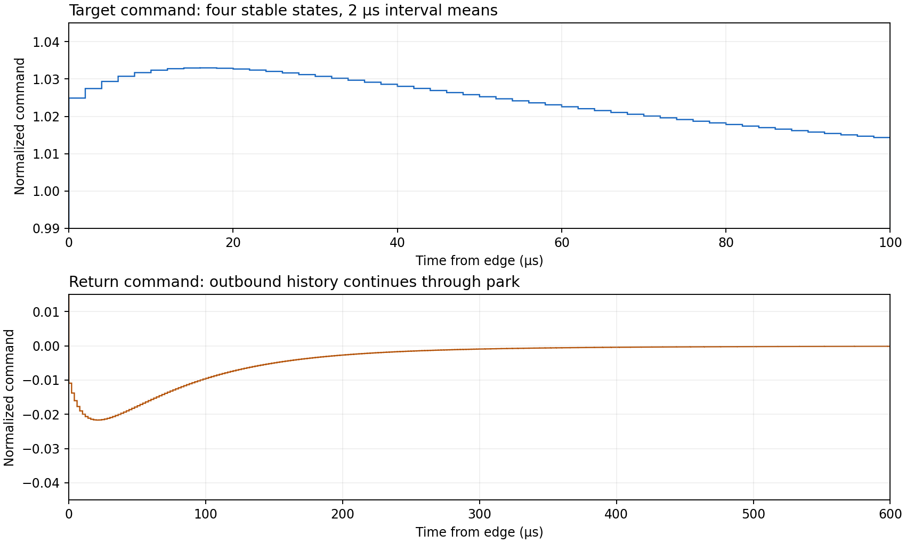

# Controller-neutral flux predistortion: offline result

**Status: implemented and software-validated; scientific and hardware acceptance fail.** Keep the existing correction as the operational fallback. No hardware was run, no measurement files were changed, and neither measurement branch was pushed.

The implementation fits an owned stable state-space inverse and generates identical normalized commands in Python for QUA and QICK. It does not use OPX built-in FIR/IIR output filters. The data do not justify claiming <0.25 MHz smooth RMS throughout the q5 band. The conditioned extension improves ideal model cancellation, but does not improve the independent measured-residual forecasts enough to accept it.

## Scope and provenance

QICK starts at `da387a3` (`origin/tls-spectroscopy`); QUA starts at `422b6c9` (`origin/marty-branch`). Both local branches are `codex/controller-neutral-predistortion`, in isolated worktrees. All changed files are new. The main checkouts' unrelated five-point files are preserved.

The frozen [input snapshot](../reports/neutral_flux/input_traces.json) contains 17 step-response traces: 13 q5 and four q3. It records original PKL/CSV paths, hashes, native coordinates, commands, unsmoothed local estimates, saved smoothed estimates, support masks, and estimator sensitivity. The extractor reads source bytes twice and checks file metadata for consistency. It does not import experiment classes or open instrument connections. The original pickles are trusted lab data; the repeatable fitting runner consumes JSON, not pickle. A new 14:54 center repeat appeared while the audit was running; it is included only as additional held-out reproducibility evidence. The three training and three validation identities remain fixed.

Training q5 traces: `12_57_45` (4.3 GHz), `12_18_02` (center), `13_21_04` (3.8 GHz). Later validation: `14_22_26`, `14_30_44`, `14_39_01`, all using the multi-amplitude piecewise candidate named in the task. Source data stay under `/Volumes/ourphoton/FluxTeam/Data/{q5,q3}/2026_09_13/predistortion_validation/`. The exact snapshot hash is in every candidate and [comparison.json](../reports/neutral_flux/comparison.json).

## Audit: what is actually measured

1. **Measurement noise is not identified separately.** These are averaged spectroscopy maps, without independent shot-level frequency estimates. The 0.5 MHz frequency grid is not a confidence interval. Neither the line width nor raw-minus-smooth scatter is an independent noise estimate. At the three later q5 amplitudes, raw-minus-smooth RMS is 0.544, 1.177, and 1.702 MHz; median spectral widths are 3.47, 8.22, and 8.83 MHz. These combine noise, line shape, real dynamics, and estimator error.
2. **Ridge tracking matters at the requested tolerance.** Local centroid half-windows of 6 and 10 MHz versus the saved 8 MHz shift centers by RMS 0.088/0.196 MHz, 0.483/0.648 MHz, and 0.587/0.859 MHz respectively. The original GHz coordinate comparisons must be retained: converting to MHz before testing an exact window boundary changes which bins are included. The importer now reproduces the saved 8 MHz centroid within about 10^-12 MHz. QICK's support mask principally indicates a finite estimate, not an SNR certification. QUA has additional score/refinement checks, but a bright in-window feature can still be the wrong ridge.
3. **Saved “extracted” traces are already smoothed.** Their 17-point Savitzky–Golay window spans 64 µs between its first/last samples. The former multi-amplitude fitter then smooths the consensus over seven more samples. The new fit uses unsmoothed local estimates; smoothing is only a named evaluation operation. Blocked time validation is conditional on already globally ridge-tracked estimates, so extraction itself is not independent between time blocks.
4. **Voltage conversion is a model assumption.** Frequency response is nonlinear in flux. A normalized frequency step is not a normalized voltage step. The new importer inverts the recorded monotonic parametric branch, reports values outside that branch, and never silently clamps them. Old QUA inversion clamps overshoot to the baseline-to-target interval; QICK extrapolates endpoints. Static fit error remains: fitted per-trace offsets are about -1.78%, -1.26%, and -0.65% of the target excursion. They are nuisance offsets for flatness, not corrections to absolute target frequency or measured DC gains.
5. **The old acquisition is a truncated-command experiment.** At each delay it plays only the correction prefix, freezes the final command during the 500 ns probe, and retains target through readout/reset. QUA then hard-sets park and rearms for 100 µs. This is not one continuously played waveform sampled at many times. At an exact delay/breakpoint coincidence, the preceding interval is latched. The new forward calculation handles this convention and analytically averages the frozen probe. Forecasts for the new command instead integrate a continuously updated waveform over the probe window.
6. **The first sample does not establish fast dynamics.** Delays are 1, 5, 9, … µs. The old candidate alternates approximately unity and 1.03 every 2 µs through much of the first 60 µs. This is strongly phase-sensitive on the 4 µs probe grid. Narrow early frequency windows and this command aliasing confound the 1 µs sample. Fitting from 5 µs makes amplitude-dependent fitted tails much more similar; including 1 µs changes coefficients materially. Both fits are recorded. No inference below 5 µs is validated here.
7. **Round-trip history is not interchangeable.** QICK's `m(H+r)-m(r)` helper correctly superposes one outbound/return pair, but the default 40 µs truncation and reset/shot boundaries do not preserve arbitrary history. QUA's existing independent reverse-step schedule resets the table at return. Its composition helper also omits pairwise-sum breakpoints: steps at 500 and 1000 ns need a new convolution edge at 1500 ns. The serialized approximation was not used for the prior fit's advertised residual.
8. **Operational conditions differ.** The existing ThreePoint QUA runner uses park 0.1625 V while this validation uses 0.1827868 V; both current apples-to-apples runners explicitly disable their compensation. The new candidates bind the coordinate and reject a different park/scale. QUA config helpers can insert built-in filter taps from legacy metadata even when a top-level flag is false; the new emitter checks the final addressed analog port before emitting.

Detailed source references and counterexamples: [QICK audit](audit-qick.md), [QUA audit](audit-qua.md). The [QICK pulse API](https://docs.qick.dev/latest/_autosummary/qick.asm_v1.html) specifies fabric-cycle pulse lengths and persistent `stdysel="last"`; the [QUA API](https://docs.quantum-machines.co/1.2.0/docs/API_references/qua/dsl_main/) specifies DC offset and clock-cycle waits. Those native rules motivate separate lowerers, not separate correction mathematics.

## Algorithm and fitting

A sample-grid FIR would be stable but require many coefficients to span the measured tail and be poorly constrained by the early samples. An unconstrained pole-zero inverse could be unstable. We use a small fixed bank of real stable poles, with regularized fitted coefficients:

```
Forward plant: P(s) = 1 + sum_j a_j s/(s + 1/tau_j)
Inverse:       g_j(r) = r c_j(r)
               dz_j/dt = (g_j(r) - z_j)/tau_j
               u = r + sum_j (g_j(r) - z_j)
```

For LTI, every `c_j` is constant. For conditioning, interpolate each coefficient linearly in desired normalized amplitude, with constant continuation toward zero and no deployment extrapolation above the largest calibration knot. `g(0)=0`; previous states are never reset on return. A transition adds the **difference in the same potential** `g(new)-g(old)`. This supplies a consistent causal model for multilevel targets and park returns. It is a parallel Hammerstein inverse hypothesis, not proof of a nonlinear physical plant.

All poles are stable and at least twice the 4 µs measurement spacing. The selected bank is **8, 24, 64, 192 µs**. It was chosen from two prespecified banks and regularizations 10^-5, 10^-4, 10^-3 by five contiguous time-block prediction. The selected plant penalty is 10^-5; raw blocked RMS is 0.001561 in normalized voltage. DC gain is exactly one. Coefficient L1 norm is capped at 0.25; malformed/unstable/out-of-range models are rejected, not silently clipped.

The shared forward coefficients are approximately `[0.013444, 0.019422, -0.047316, -0.008107]`. The shared inverse coefficients are `[-0.015322, -0.018817, 0.049766, 0.007251]`. Inverse coefficients solve a regularized linear least-squares problem against the forward response to the **emitted** waveform, with a 10^-5 penalty. This is not the old multiplier table under a new name: there are four dynamic coefficients for LTI, twelve for three conditioned amplitudes, instead of 78 freely specified command levels.

Exact state updates and exact interval means generate the output. The emitted mean is

`u_bar = r + sum((g-z_start)*tau/dt*(1-exp(-dt/tau)))`.

The final emission grid is **2 µs**, a numerical refinement from the initial 4 µs design. It changes only zero-order-hold approximation; the fitted poles/data resolution remain unchanged. No 2 µs dynamics are inferred. Explicit requested target/return edges can fall between emission-grid boundaries, and those intervals are kept exact before hardware quantization.

The same `fluxpred` Python sources and JSON model can be used by either controller. QUA emits literal `set_dc_offset`/`wait`; QICK emits quantized constant pulses. Neither lowerer estimates parameters, restarts inverse state, nor substitutes another transfer function.

## Cross-validation and comparison

All MHz metrics below use RMS about the mean at delays >=300 µs. Early-to-late is the mean at delays <=21 µs minus that late mean. Forecasts exclude the unresolved 1 µs sample, apply one 17-point smoothing operation to unsmoothed estimates, and never count filled unsupported samples as evidence. This explicit early window differs from earlier informal summaries. Using other windows changes the reported early-to-late errors; it cannot turn these data into a tolerance pass.

The old saved smoothed traces, including their original support, give:

| q5 calibration | Existing saved smooth RMS (MHz) | Early − late (MHz) |
|---|---:|---:|
| 4.3 GHz | 0.275 | -0.298 |
| Center | 0.792 | -0.726 |
| 3.8 GHz | 1.548 | -2.855 |

For a fair comparison on identical retained raw samples and smoothing, predict `y_new = y_measured + P(u_new-u_old)`. This retains the independent measured discrepancy instead of replacing the data with the fitted plant. It assumes that discrepancy transports unchanged to the new command; it is a **conditional forecast**, not hardware evidence:

| q5 calibration | Piecewise measured RMS | Shared LTI forecast RMS | Conditioned forecast RMS | Shared / conditioned early − late |
|---|---:|---:|---:|---:|
| 4.3 GHz | 0.346 | 0.513 | 0.528 | +0.130 / -0.102 |
| Center | 0.800 | 0.792 | 0.892 | +0.615 / +0.142 |
| 3.8 GHz | 1.434 | 1.564 | 1.474 | +0.427 / +1.358 |

All values are MHz. **Every forecast fails the 0.25 MHz RMS target.** Conditioning is not supported as an operational improvement by these held-out data.

Nested leave-one-amplitude-out validation reselects poles/regularization using only the two retained amplitudes, then refits their plants and inverses. Smooth forecast RMS is shared/conditioned: **0.818/1.080**, **0.815/0.822**, **1.710/1.774 MHz**. The center fold tests interpolation. The endpoint folds use a flagged constant-boundary diagnostic and cannot establish extrapolation validity. No held-out amplitude is used to tune its fold's hyperparameters.

Ideal model-only conditioned cancellation gives RMS **0.070, 0.104, 0.128 MHz**, with early-to-late **+0.007, -0.004, -0.037 MHz**. The shared inverse on the separate fitted plants gives **0.083, 0.238, 0.519 MHz** RMS. This justifies implementing the conditioned hypothesis for testing, but its much better model-only score does not survive the measured-discrepancy forecast.



## Shared LTI, amplitude dependence, and reproducibility

The three voltage-domain slow responses are sufficiently similar to support a shared low-order component. Separate amplitude fits have raw normalized RMS about 0.000502, 0.000616, 0.000821; pooled fit RMS is 0.000671. These are approximate residuals conditional on the nominal command, static calibration, and initial-state assumptions. A slightly lower conditioned in-sample error does not distinguish physical amplitude dependence from estimator bias.

Same-command center repeats have late-centered raw difference RMS **1.383 and 1.746 MHz**. Their smooth difference RMS is **0.854 and 1.123 MHz**, with early-to-late differences **1.621 and -2.565 MHz**. That variability is already larger than the requested residual tolerance. It could include measurement noise, ridge errors, readout/line-shape changes, and real drift; these data do not separate them. It would be incorrect either to claim a universally adequate LTI filter or to claim that all LTI filters are disproved.

q3 has only one measured amplitude. Its existing residual-composed scan reaches about 0.39 MHz raw-minus-smooth scatter; the saved smooth residual metrics and all four source scans are in the JSON audit. A separate single-amplitude instance of the same owned algorithm is fitted to the uncorrected q3 trace. Changed-command conditional forecasts remain roughly 1.08–1.11 MHz RMS with about -3.7 to -3.9 MHz early-to-late errors. It fails acceptance and cannot support cross-amplitude validation. q3 and q5 plant coefficients are not interchangeable. The cross-controller waveform witness deliberately uses one common normalized artifact; it is not permission to apply a q5 calibration to q3 hardware.

## Emission approximation, memory, and lifecycle

Each lowerer rounds **cumulative** edges, then amplitude, with ties-to-even rounding. It rejects clipping. QICK merges adjacent equal integer gains and splits long pulses into balanced legal chunks without adding time. QUA checks the actual final analog port for nonempty built-in output filters and rejects too-short waits. Its module is safe to import without loading `qm` or the hardware-initializing experiment base.

Illustrative profiles use QICK park -25146, excursion +10396 DAC gain units, and QUA park 0.1827868 V, excursion +0.2396430633 V. The source snapshots do **not** save actual QICK `soccfg`, so 4 ns and 2.5 ns fabric clocks are explicitly examples. Reconstructed commands are compared exactly on the union of their breakpoints, retaining amplitude quantization and edge-time error.

At aligned edges, maximum normalized difference is below **8.1e-5** and full-horizon RMS is below **3.1e-5** for tested holds 1, 13.004, 100, 497 µs. With a 2.5 ns QICK clock, the 13.004 µs return rounds 1 ns later than QUA: instantaneous discrepancy reaches approximately **1.02** for that 1 ns, while full-horizon RMS is about **8.06e-4**. A small RMS must not hide the displaced edge. Timing-sensitive production use should choose mutually representable edges or assess this exact difference with the physical plant.

The 2 µs grid requires at most **9376** conservatively allowed QICK instructions for these individual schedules under the illustrative profiles. QUA reports source operations, not a compiled instruction-memory count. Bank preparation sums every condition and rejects an over-budget bank; it does not only test the largest condition. These are software planning checks. Actual firmware compiler sizes, QICK dispatch/FIFO lead time, and QOP DC-write timing remain unverified.

Every prepared shot includes the return and a terminal park plateau. The terminal bound is the omitted **inverse command** tail, not a guarantee that the physical plant has settled. Variable active reset happens at park before the common timeline origin. To represent incomplete settling, state must be carried through the reset dwell; it is never set to zero simply because reset completed. Tests cover multiple reset dwells, short/fractional-grid holds, and repeated target/return schedules. The integration helpers align once at the start, queue flux, and let the caller schedule drive/readout on their own timeline before a final align. They are new dedicated hooks, not modifications of legacy measurements.



## Reproduce and inspect

Run from either isolated repository using Python with NumPy, SciPy, pytest, and matplotlib. These commands are offline only:

```bash
python -m pytest tests -q
python -m fluxpred.run_offline --out reports/neutral_flux
python tools/plot_neutral_flux.py
```

The frozen numerical snapshot is committed, so fitting does not require a mounted data drive. To deliberately import a new snapshot, inspect `python tools/import_neutral_flux_evidence.py --help`; keep its output local and review changed source identities/hashes before fitting.

Prepare QUA diagnostic commands after software checks:

```bash
python -m fluxpred.prepare --mode neutral --backend qua \
  --model reports/neutral_flux/conditioned_candidate.json \
  --park 0.1827868 --scale 0.23964306326392007 \
  --holds-ns 13004 100000 --diagnostic \
  --out reports/neutral_flux/qua_diagnostic_plan.json
```

QICK's matching module requires an explicit actual fabric clock; the committed `qick_illustrative_plan.json` uses 4 ns only as a software example. The q3 candidate is bound to `DAC_gain`, park -25146, scale +10396. Do not infer its clock from this report. `--mode legacy-piecewise --legacy <existing-json>` selects the old table with causal two-edge playback; `--mode uncorrected` selects a rectangular excursion. The original legacy runners remain available and unchanged. None of these plans starts acquisition. Omitting `--diagnostic` on a failed candidate raises a scientific-gate error.

## What remains before a hardware candidate is justified

The software implementation, tests, audits, fitted artifacts, comparison, and diagnostic runners are complete. No measurement-ready runner is released because the offline scientific gate fails. A useful next dataset would hold the new continuous command through each probe, use matched park/recovery and active-reset timing, record actual emitted samples/configuration, include uncorrected responses at all three amplitudes, include outbound and return edges, and include repeated/interleaved scans with independent frequency-estimation uncertainty. Its 4 µs delay spacing should be retained unless a separately justified faster measurement is actually acquired. First resolve the current ridge/line-shape and repeat variability; adding more inverse coefficients cannot fix unidentified measurement bias.
