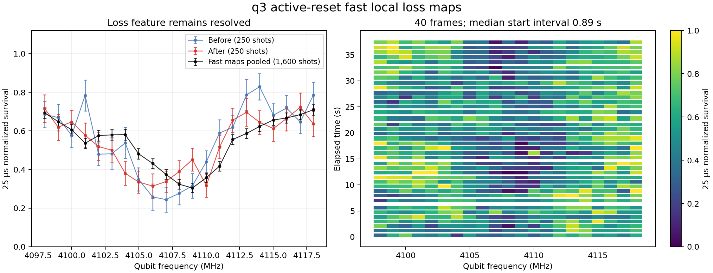
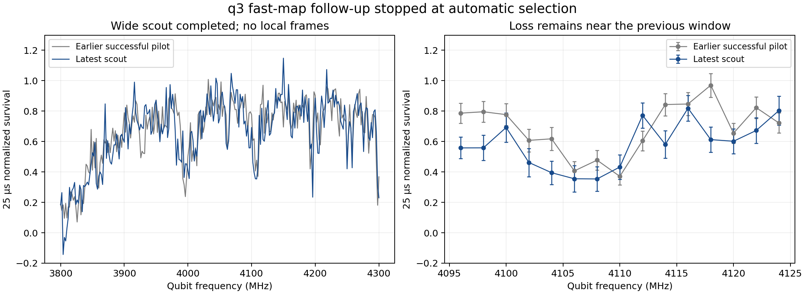
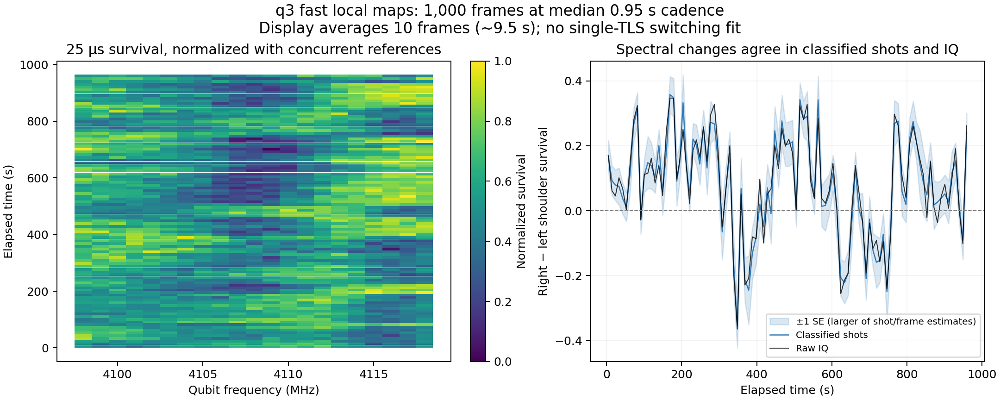
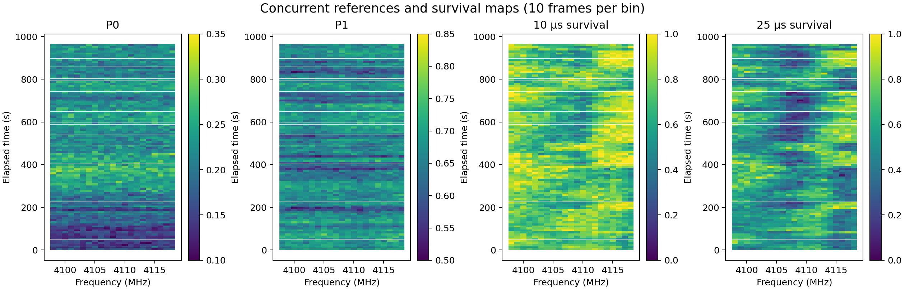
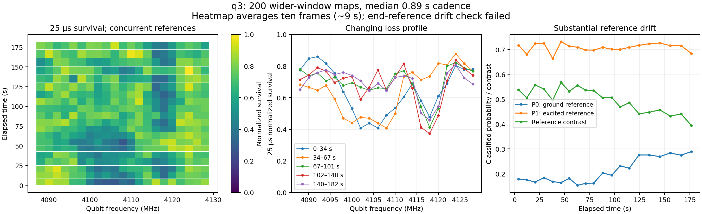
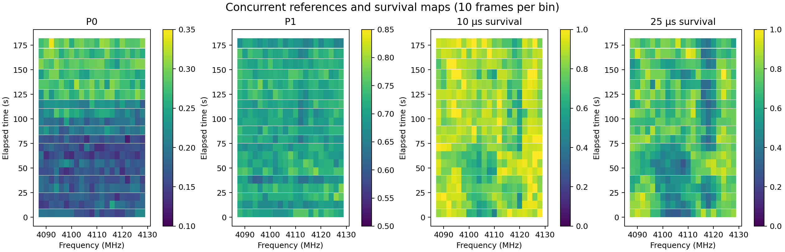
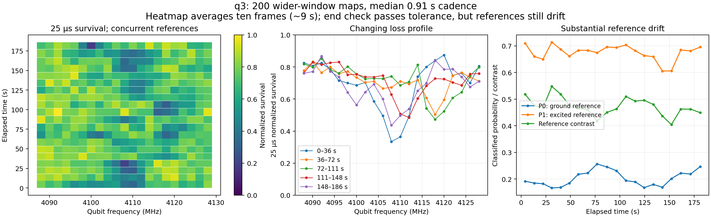
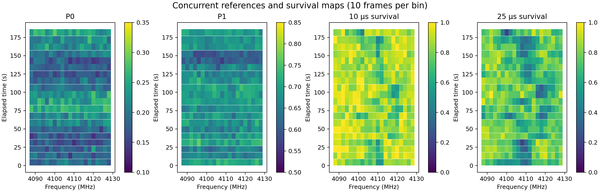
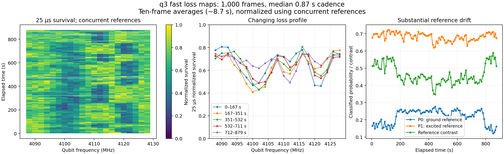
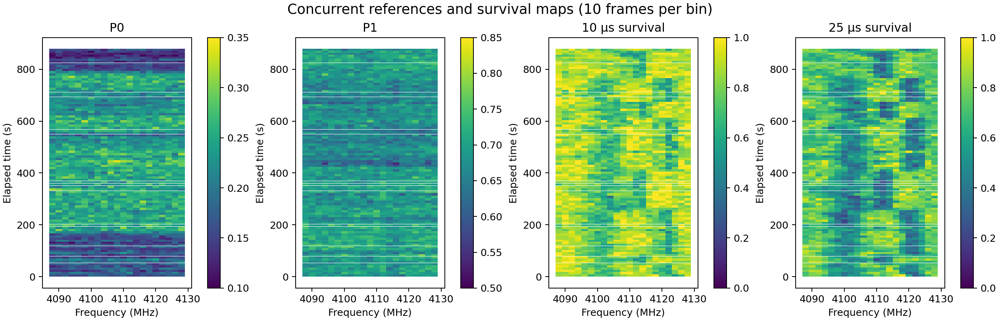

# q3 fast local loss-map pilot — October 5, 2026

## Question and decision

Can a smaller frequency window and fewer shots resolve a q3 loss feature at
a substantially shorter frame cadence than the production wide scan? This
is a timing/contrast pilot before committing to long switching/diffusion
measurements. It does not revive the unresolved e–f or afterglow routes.

The production scans use active reset. A passive-relax timing estimate is
not a bound on their speed. The new runner also uses production active
reset, without falling back to passive reset if calibration fails.

The Oliver-group [adaptive spectroscopy paper](https://arxiv.org/html/2608.02086v1)
demonstrates fast maps with an FPGA estimator and adaptive delays. This
pilot keeps the existing fixed five-condition sequence and benchmarks a
small window first. It does not implement that estimator or promise the
paper's full-band cadence.

## Acquisition

1. Production active-reset/readout calibration with the explicit q3 settings.
2. One fresh 3.8–4.3 GHz scout, 2 MHz steps, 251 frequencies, 250 shots per
   condition. Select one bilateral loss trough reproduced in both scan
   directions. No second line or e–f quiet window is required.
3. One local 20 MHz window, 1 MHz steps, 21 frequencies; 250-shot local pre.
4. Forty local frames, 40 shots per condition per frequency per frame.
5. A 250-shot local post at the identical frequencies; then stop.

Each map contains P0, P1, and survival at additional 2, 10 and 25 µs delays.
The P0/P1 reference hold is 0.1 µs. Each logical scan shot alternates the
frequency direction, retaining the production fixed condition order.
Preparation and readout remain at park. The native correction and full
40 µs return are retained. There are no target microwave pulses.

Expected total duration is approximately **5–10 minutes**, including the
scout/calibration, compilation, host transport and NAS writes. Actual local
cadence is an output, not an established performance claim. Progress/ETA
counts maps; the scout and local reference maps take longer than a frame.

The scout selector requires reference contrast ≥0.2 at the center and both
flanks. It propagates normalized-survival uncertainty using paired-shot
influence functions, including covariance between conditions/frequencies.
Both flanks must have a depth ≥0.12 and shot-noise score ≥4.5 over all shots;
each direction independently requires depth ≥0.06 and score ≥2. The score
guard is conservative for the wide candidate search. These criteria select
a pilot window; they do not establish TLS identity or a formal discovery
significance. No qualified trough means a finite unresolved scout, not an
automatic rerun or evidence that the band contains no TLSs.

## Files and interpretation

Output: `q3/q3_fast_loss_map_<UTC>_<ID>/` under the normal RFSOC root.

- `manifest.json`: plan, source/commit/correction hashes, selection and status.
- `board_configuration.json`, `config.json`, production calibration files,
  and per-map configs/preflight/stream plans.
- `scout`, `local_pre`, `frame_0000`…`frame_0039`, `local_post` NPZ/JSON pairs.
  Arrays contain **integer integrated I/Q and every binary classified shot**,
  in condition × canonical frequency × shot order. Scan-direction metadata
  records the actual alternating order. Target frequencies, realized model
  frequencies and integer DC gains are saved.
- Frame start/end wall and monotonic times, compilation duration, and
  cumulative host receipt times for decoded banks. These are **host timing**,
  not individual hardware shot timestamps. Acquisition time includes
  hardware configuration/transport. Start-to-start cadence also includes
  analysis, compilation and NAS gaps.
- `summary.json`: actual acquisition durations, frame periods, pooled pre/post
  P0/P1 drift checks; no automatic switching claim.
- `fast_loss_map.png/.svg`: 10 µs normalized survival using pooled local
  pre/post references. Rectangles span actual frame acquisition intervals;
  gaps remain blank. Frequencies with reference contrast below 0.2 are masked.
  Values are not clipped in the saved data; the display color scale is 0–1.

The local window stays fixed for these forty frames. A moving line can leave
it; the data then constrain this window, not the entire band. Local frame
P0/P1 probabilities and raw shots are retained for later drift/noise checks.
The pooled pre/post reference check cannot prove per-frequency/sub-frame
stability. If it fails, the run is `complete_reference_drift` and interpretation
is unresolved. Low-shot frames are not fitted to full T1 curves here.

Ctrl+C or errors abort the controller/generators and preserve already decoded
records for the current map through acquisition, classification and file
publication. Complete NPZ files are published by a same-directory atomic
rename. Partial records remain in acquisition order and are not presented
as a complete canonical map. No automatic restart occurs.

## Scope and verification

New runner/test/doc files only. Production TLS spectroscopy, shared active
reset, `initialize.py`, YOKO bias and measurement-PC local overrides are not
edited. A scoped q3 configuration prevents stale q4 settings from selecting
the wrong qubit. The correction environment pins native gain 1.0 and the
checksum-verified production JSON; prior settings are restored on exit.

The observer subclass only records parent DMEM decoder output. Offline QICK
0.2.133 compilation against the saved board configuration confirms **identical
instruction binaries and stream plans** to `OPXResetT15PointProgram` for the
wide scout, local frame/reference, and both band-edge windows. Preflight
passes all five cases, maximum 5,777/8,192 instructions. This verifies pulse
equivalence/resource feasibility, not hardware cadence or readout quality.

Thirteen focused tests with offline QICK cover alternating-shot reconstruction,
known loss/flat/directional-artifact scouts, reference drift, finite collection,
acquisition gaps, correction/q3 scoping/restoration, raw integer IQ, atomic
publication, and interruption through acquisition and processing. A separate
100-seed flat 250-shot low-contrast null audit selected zero pilot windows.
Full maintained suite: **1,435 tests passed in 41.76 s**. Independent code
review found no remaining actionable P1/P2 issues after the selector,
environment-scoping and interruption-preservation fixes.

## Measurement-PC command

Stop any other hardware acquisition first, then:

```bash
git -c gc.auto=0 pull --ff-only origin tls-spectroscopy
python -u -m WorkingProjects.TLS_Spectroscopy.Client_modules.Runners.TLSFastLossMap --run
```

The script enforces q3 even if the PC's local settings still describe q4.
Report completion; inspect timing, local contrast and reference stability
before choosing a longer run or implementing adaptive acquisition.

## First hardware result and bounded extension

`q3_fast_loss_map_20261005T052318Z_c0263e35`, commit `fc38b5a8`, completed
all 43 maps in approximately 1m42s. Source hash matches; explicit q3 park,
readout and π parameters, active reset, 10 µs readout thermalization and
40 µs corrected return are confirmed in the saved config. All 534,250
integer-IQ/classified records are present, with matching transfer counts,
array shapes and the identical local frequency grid in every frame.

Scout: 46.60 s acquisition, selected 4.108 GHz. Local window:
4.098–4.118 GHz, 21 points at 1 MHz. Local references: 3.93 s each.
Forty low-shot frames: acquisition median **0.684 s** (0.631–0.896 s);
start-to-start median **0.894 s** (0.813–1.378 s), including compile/save
gaps. The local recording spans **37.79 s**. This is a local-window result,
not a sub-second 500 MHz map or an adaptive FPGA result.

The loss remains resolved in independent pre/post scans and the pooled fast
frames. At 25 µs, pooled normalized survival reaches **0.304 at 4.109 GHz**,
versus approximately **0.65–0.71 at the window edges**. Pooled pre/post
references pass: P0 0.1335→0.1280, P1 0.6844→0.7082; reference contrast
0.5509→0.5802. The actual classifier contrast is approximately 0.5–0.6;
these are preparation-relative survival values, not absolute thermometry.

Individual frames are visibly noisy. A single Gaussian-notch center fitted
to five-frame groups depends materially on local versus pooled reference
normalization and on broad/secondary loss structure. Do not report its
few-MHz center excursions as a resolved switching result. The saved fit
numbers are descriptive audit data, not diffusion/linewidth estimates.
The pilot establishes useful cadence and persistent loss contrast; it does
not yet establish dynamics or a particular microscopic TLS model.



Raw NAS source remains under the run folder above. Local copied raw files,
analysis script and plots: `.codex/visualizations/2026/10/05/q3_fast_loss_map_052318Z`
under the user's home directory. Summary/audit statistics are also in
`docs/q3_fast_loss_map_20261005_audit.json`.

Next: keep the identical 21-point/40-shot sequence and acquire **1,000
frames**, expected approximately **15–22 min** with fresh calibration/scout
and local pre/post. `--frames` changes only the finite host frame count,
manifest, progress total and duration estimate; default remains 40 and the
accepted range is 1–2,000. No pulse instructions, shot count, feature
selector, return, reset defaults or automatic recentering change. This
longer record is justified by the successful speed/contrast pilot; inspect
raw references and both scan orders before interpreting apparent line
motion. Stop the controller with Ctrl+C if needed; partial preservation is
unchanged.

Extension verification: 15 focused tests with offline QICK and 1,437 full
suite tests pass (41.27 s); all five offline production/observer instruction
comparisons still match. Independent review found no actionable P1/P2 issues.

```bash
git -c gc.auto=0 pull --ff-only origin tls-spectroscopy
python -u -m WorkingProjects.TLS_Spectroscopy.Client_modules.Runners.TLSFastLossMap --run --frames 1000
```

## Longer attempt stopped at discovery; explicit-window follow-up

`q3_fast_loss_map_20261005T054544Z_e04e1bb0`, commit `b29ed706`, ended
`unresolved` after 46.86 s. It acquired the complete 251×250×5 scout
(313,750 records, 37.51 s acquisition) and **zero local references/frames**.
The source hash matches and the production active-reset calibration passed.
This is not a 1,000-frame measurement or a negative switching result.

Loss remains visible near 4.106–4.108 GHz (25 µs normalized survival about
0.354), but the scout reference contrast median is 0.480 versus 0.556 in
the successful pilot. No candidate passes the conservative discovery gate.
At 4.106 GHz, bilateral depth is 0.235 and score 3.243 over all shots;
the reverse score is 1.201, below the required 4.5/2 scores. The strongest
pooled candidate, 4.062 GHz, has score 4.590 but forward score 1.868.
Thus the rejection is reproduced from the raw shots; it is not a corrupt
file, missing acquisition, calibration exception or frequency-grid error.
These shot-noise scores do not identify the microscopic absorber or show
that a TLS disappeared.



The automatic gate is suitable for discovering a new window across 500 MHz,
but reapplying it before every recording obstructs monitoring a previously
observed window when the signal weakens or changes. Add an **explicit model
frequency window** option, `--center-ghz 4.108`: record 4.098–4.118 GHz
directly with fresh active-reset calibration and 250-shot local pre/post,
plus the requested 1,000 unchanged 40-shot frames. There is no wide scout
in this mode. Data are recorded even if the region is flat; specifying a
window is not evidence of a fresh feature. Plan/manifest explicitly say
`explicit_window` and `fresh_feature_claim=False`. Default discovery behavior,
scores, pulse instructions, reset/calibration gates, return and shot count
remain unchanged. Progress total is frames+2 rather than frames+3.

This targets the recently observed region for dynamics measurement rather
than repeatedly attempting whole-band discovery. If loss moves outside the
window, the result only describes the requested window. No automatic
recenter, new TLS identity, or motion significance is inferred by the runner.

The audited scout and candidate scores are in
`docs/q3_fast_loss_scout_20261005_audit.json`; raw/analysis copies are under
the user's `.codex/visualizations/2026/10/05/q3_fast_loss_scout_054544Z`.
Focused regressions include flat explicit-window acquisition, CLI/plan
propagation, finite counts and band validation.

Explicit-window verification: 17 focused tests with offline QICK and
1,439 full suite tests pass (41.66 s). Six production/observer instruction
comparisons, including the exact 4.108 GHz requested window, match and
pass preflight; latest saved board configuration matches the successful
pilot. Independent review found no actionable P1/P2 issues.

Next measurement-PC command (approximately 15–22 min):

```bash
git -c gc.auto=0 pull --ff-only origin tls-spectroscopy
python -u -m WorkingProjects.TLS_Spectroscopy.Client_modules.Runners.TLSFastLossMap --run --frames 1000 --center-ghz 4.108
```


## Completed 1,000-frame recording and wider-window follow-up

`q3_fast_loss_map_20261005T060449Z_70ee3b0a`, source commit `98043fc4`,
completed 1,000 science frames plus local pre/post references in 16 min
43.43 s. The requested 4.098–4.118 GHz window has 21 frequencies at 1 MHz
spacing, 40 shots per condition per science frame. Production active reset,
park preparation/readout and the native corrected 40 µs return are retained.
All 4,252,500 records are present (4,200,000 science records). Every raw
integer-IQ frame has the expected axes/counts; recomputing classifications
from the saved runtime projector matches every recorded state. Source and
correction hashes match, and all 1,000 transfer receipts account for 4,200
records each. No interrupted or missing frame is included.

Median frame acquisition is 0.721 s; median start-to-start cadence is
0.950 s, including recompilation, processing and NAS checkpoints. Science
frames span 964.42 s. These are host timings, not individual hardware-shot
timestamps. Plots average ten consecutive frames (400 shots per condition
per frequency, approximately 9.5 s) to make spectral changes interpretable.

The preset end-reference check passes its tolerance, but the references
are not stationary: pooled P0 rises 0.174→0.224, P1 falls 0.693→0.680,
and contrast falls 0.519→0.456. Accordingly, use each concurrent bin's
P0/P1 for normalization rather than fixed endpoint references. This does
not remove every possible preparation or readout systematic.



The spectrum changes visibly. Central loss around 4.107–4.110 GHz and
upper-edge loss near 4.115–4.117 GHz vary; some intervals contain both.
A single moving Gaussian would therefore impose an unsupported TLS identity.
A predefined shoulder comparison, S(4.110–4.112) minus S(4.104–4.106),
using band-pooled concurrent references, has 25 µs standard deviation 0.155,
versus median paired-shot SE 0.054 and ten-frame cluster SE 0.064. The paired
influence calculation retains condition/frequency covariance; cluster SE
also accounts for correlations within each ten-frame bin. Neither bounds
arbitrary long-correlated systematics.

Disjoint forward/reverse shot halves give correlation 0.765. The 10 µs and
25 µs shoulder traces correlate 0.869; binary classifications and a linear
raw-IQ projection correlate 0.980. Regressing concurrent reference spectral
imbalances and global P0/P1 leaves a residual SD of 0.140 and 10/25 µs
correlation 0.841. These checks support time-dependent relaxation-spectrum
shape beyond independent-shot noise and a threshold-only artifact. They
are not proof of one TLS switching, a microscopic identity, intrinsic
linewidth, or exclusion of qubit-frequency drift. Descriptive stationarity
statistics in the audit are not a formal TLS-discovery significance.



Raw NAS provenance and numerical checks are saved in
`docs/q3_fast_loss_map_1000_20261005_audit.json`. The local analysis folder
`/Users/rummanrahman/.codex/visualizations/2026/10/05/q3_fast_loss_map_060449Z`
contains `load.py`, `analyze.py`, `robust.py`, cached classified shots and
projected IQ statistics, saved raw configuration/reference files and SVGs.
The complete frame IQ remains in the source NAS folder.

The next test widens the requested window to **4.088–4.128 GHz at 2 MHz**:
still 21 frequencies and 40 shots per condition, preserving the frame shot
budget while capturing the changing upper-edge structure. First run only
200 frames (approximately 4–7 minutes including calibration/references),
then assess coverage and contrast before extending. Actual cadence must
be measured again. Explicit mode records even a flat region; no new feature
selection or automatic recenter gate is introduced.

The runner now accepts bounded `--width-mhz` (integer 2–100 MHz) and
`--step-mhz` (0.5, 1 or 2 MHz), requiring an integer number of intervals.
Grids stay inside 3.8–4.3 GHz and shift at a band edge. Default 20 MHz/1 MHz
behavior, reset, shots, pulse generation, return, interrupt preservation,
production modules and initialize.py are unchanged. Plan/manifest and
DAC-grid reporting include the requested spacing and point count.

Verification: 19 focused tests with offline QICK and 1,441 full suite tests
pass (45.44 s). Seven saved-board production/observer program comparisons,
including the proposed wider grid, have identical instruction binaries and
pass preflight (maximum 5,777/8,192 instructions). Independent review found
no actionable P1/P2 findings.

```bash
git -c gc.auto=0 pull --ff-only origin tls-spectroscopy
python -u -m WorkingProjects.TLS_Spectroscopy.Client_modules.Runners.TLSFastLossMap --run --frames 200 --center-ghz 4.108 --width-mhz 40 --step-mhz 2
```


## Wider 200-frame recording: coverage works, reference drift limits interpretation

`q3_fast_loss_map_20261005T070818Z_d88b4281`, commit `bd8230ba`,
acquired all 200 frames and local pre/post in 3 min 23.34 s. It is explicitly
marked **complete_reference_drift**, not clean complete: P0 rises
0.1589→0.2806 (delta 0.1217, SE 0.0080), P1 falls 0.7358→0.7110,
and pooled contrast falls 0.5770→0.4305. No raw acquisition is missing.
This gate failure must remain visible in reporting; do not relax the gate.

All 892,500 records are present, including 840,000 science records. Each
frame contains 21 frequencies across 4.088–4.128 GHz at 2 MHz, five
conditions and 40 shots. Integer-IQ classifications recomputed with the
saved runtime payload match all science states; axes, directions, transfer
counts and source/correction hashes match. Production active reset and full
corrected 40 µs return are unchanged. Median acquisition is 0.645 s and
median start-to-start interval 0.891 s. The science sequence spans 182.01 s;
its ten-frame display bins are approximately 9 s, not subsecond resolved
TLS events. Widening coverage did not degrade cadence in this recording.



Concurrent-reference normalized 25 µs survival shows central loss across
roughly 4.100–4.110 GHz early, with stronger loss near 4.116–4.118 GHz later.
These structures need not be the same TLS moving; multiple components,
qubit-frequency changes and preparation/readout systematics remain possible.
The upper structure was missed or truncated by the narrower window.

The previous shoulder comparison (4.104/4.106 versus 4.110/4.112 GHz) has
SD 0.116 versus median shot SE 0.060 and frame-cluster SE 0.066.
Forward/reverse correlation is 0.742, classified versus linear raw-IQ
correlation 0.949, and 10/25 µs correlation 0.566. Reference regression
leaves residual SD 0.090 and 10/25 µs correlation 0.429. Thus the signal
is weaker than in the 1,000-frame recording but not just a classification
threshold artifact. Stationarity statistics are descriptive only and
serial systematic errors are not bounded by these SEs.

An **exploratory**, post-viewing region comparison pools 4.100–4.110 GHz
and 4.114–4.120 GHz separately. First 80 frames (~0–67 s) versus remaining
120 (~67–182 s): central 25 µs survival rises 0.461→0.687, while upper
survival falls 0.673→0.525. Linear raw-IQ ratios give 0.467→0.699 and
0.681→0.528, respectively. Concurrent P0 is nearly identical between
these two regions within each period (~0.169 early, ~0.236 late), so a
uniform additive probability shift alone cannot describe the opposing
changes. This does not exclude more general state/preparation/reference
changes; the transition overlaps the rising P0 and is not a clean isolated
TLS-switching observation. The regions and division are not independent
predefined tests and must not be assigned a discovery significance.



The next measurement repeats the **same bounded 200-frame wider recording**
with a fresh production calibration, rather than extending this drifting
session. It records a full sequence regardless of whether loss is present;
there is no rediscovery gate. A second independently calibrated record can
check both the spectrum and whether reference drift recurs before spending
15–20 min on a longer run. Expected approximately 3–5 min based on this
record; actual time depends on calibration/reset/transfer performance.
No runner, reset, production or initialize changes are needed this turn.
Raw provenance, integrity checks and both descriptive comparisons are in
`docs/q3_fast_loss_map_wide_200_20261005_audit.json`; complete raw IQ remains
on NAS. Scripts and cached classified/IQ statistics are retained in
`/Users/rummanrahman/.codex/visualizations/2026/10/05/q3_fast_loss_map_070818Z`.

```bash
git -c gc.auto=0 pull --ff-only origin tls-spectroscopy
python -u -m WorkingProjects.TLS_Spectroscopy.Client_modules.Runners.TLSFastLossMap --run --frames 200 --center-ghz 4.108 --width-mhz 40 --step-mhz 2
```


## Independently calibrated wider repeat: acquisition reproducible, drift remains

`q3_fast_loss_map_20261005T072829Z_7813fdc4`, commit `3dc8c1eb`,
completed all 200 science frames plus local pre/post in 3 min 24.86 s.
All 892,500 records are present (840,000 science). Every science integer-IQ
classification matches the saved runtime projector, with matching axes,
alternating scan directions, transfer totals and source/correction hashes.
This is the same 4.088–4.128 GHz/2 MHz/21-point, 40-shot, five-condition
window with newly acquired production active-reset calibration. Native
correction/full 40 µs return, park preparation/readout and initialize settings
are unchanged. Median acquisition is 0.673 s, start interval 0.905 s and
science span 186.14 s. Wider-window cadence is reproduced independently.

The preset endpoint check passes, status `complete`, but **references are
not stationary**. P0 rises 0.1916→0.2636 (delta 0.0720, SE 0.00815),
P1 rises 0.6554→0.6741 and contrast falls 0.4638→0.4105. P0's change is
about 8.8 reported SE, just inside the preset absolute 0.05 plus 3-SE
tolerance. Fresh calibration did not remove reference variation. Do not
call this a stable-reference run or weaken/retune the gate to hide the drift.



Concurrent-reference normalized 25 µs survival changes shape again: early
loss is strongest around 4.108–4.110 GHz, intermediate profiles have loss
near 4.118 GHz, and late profiles have stronger central loss again. Other
low-frequency structure appears. This is a repeat observation of changing
spectral shape, not replication of a specific TLS jump, a stationary line
identity or the exact previous time course. Ten-frame heatmap bins contain
400 shots/condition/frequency and represent approximately 9 s.

For the existing shoulder bands (4.104/4.106 versus 4.110/4.112 GHz),
25 µs imbalance SD is 0.125 versus median paired-shot SE 0.063 and
frame-cluster SE 0.072. Disjoint forward/reverse correlation is 0.594,
10/25 µs correlation 0.782, and classified/raw-linear-IQ correlation 0.953.
Thus classified and raw-IQ traces agree and both directions share some
variation. These checks cannot exclude common preparation/readout/flux
systematics. In particular, regression on concurrent reference imbalances
and global P0/P1 reduces residual SD to 0.076, comparable to cluster SE;
residual 10/25 µs correlation is 0.535. This record alone does not cleanly
isolate TLS dynamics from reference/preparation changes. Descriptive
stationarity statistics must not be presented as microscopic discovery
significance.

Single-frame imbalance SD is 0.269 versus median paired-shot SE 0.206;
forward/reverse correlation is only 0.171 at that resolution. Approximately
one-second acquisition is useful, but this recording does **not** establish
one-second-resolved TLS events. Ten-frame averages remain more reliable;
subsecond dynamics would need more signal, different allocation or a
validated estimator rather than simply treating noisy raw frames as events.



Both bounded wider pilots record useful coverage at similar cadence, with
changing spectra and substantial reference sensitivity. Next collect a
bounded **1,000-frame wider-window** recording to obtain more temporal
statistics while retaining all concurrent P0/P1 and raw IQ. The purpose is
to characterize profile changes and assess reliability, not to declare
single-TLS telegraph dynamics. Expected approximately 16–20 min based on
recorded cadence and earlier long-run overhead. No further discovery gate,
automatic recenter, pulse, production/reset or initialize changes are needed.
Do not repeat short calibration pilots indefinitely; use the accumulated
record to quantify which spectral changes survive reference sensitivity,
and report an inconclusive dynamics result if they do not.

The audit is `docs/q3_fast_loss_map_wide_repeat_20261005_audit.json`;
full frame IQ remains on NAS. Analysis scripts, cached states and projected
IQ statistics, raw reference/configuration copies and SVGs are retained in
`/Users/rummanrahman/.codex/visualizations/2026/10/05/q3_fast_loss_map_072829Z`.
This turn changes only documentation/artifacts; no measurement code changed.

```bash
git -c gc.auto=0 pull --ff-only origin tls-spectroscopy
python -u -m WorkingProjects.TLS_Spectroscopy.Client_modules.Runners.TLSFastLossMap --run --frames 1000 --center-ghz 4.108 --width-mhz 40 --step-mhz 2
```


## 1,000-frame wider recording: stronger spectral dynamics; next reduce point count

`q3_fast_loss_map_20261005T074220Z_e9212267`, source commit `d6811a60`,
completed all 1,000 frames and local pre/post references in 15 min 15.15 s.
All 4,252,500 records are present (4,200,000 science), with 21 frequencies
4.088–4.128 GHz/2 MHz, 40 shots per condition and the same five conditions.
Every science integer-IQ classification matches the saved runtime payload;
frequency/DC axes, alternating directions, per-frame transfer counts and
source/correction hashes match. Local references have the expected
5×21×250 shapes. Production active reset and native corrected full 40 µs
return remain in force. Median acquisition is 0.644 s, median start interval
0.869 s, and science span 878.64 s. The ten-frame display represents about
8.7 s per row, not individual TLS events at that interval.



The endpoint check passes: P0 changes 0.1638→0.1512, P1 changes
0.7027→0.6377 (delta −0.0650, SE 0.00916), and contrast 0.5389→0.4865.
This does not mean references were stationary. Within the series P0 rises
from roughly 0.16 to 0.25 around 170 s and falls near 800 s; P1 also varies.
Concurrent ten-frame reference contrast has median 0.4575 and minimum
0.2475 across frequency/time bins. Fixed endpoint normalization would
misrepresent parts of the recording; all reported temporal analyses use
concurrent P0/P1. Reference drift remains visible rather than being hidden
by the endpoint pass.

The changing lower loss structure spans roughly 4.100–4.112 GHz, with
another loss component around 4.120–4.122 GHz. The two components are
visible in long-period profiles; they need not represent one moving TLS
or two fixed microscopic defects. For the existing fixed shoulder bands
(4.104/4.106 versus 4.110/4.112 GHz), the 25 µs imbalance SD is **0.226**,
versus median paired-shot SE **0.065** and ten-frame cluster SE **0.066**.
Disjoint forward/reverse correlation is **0.814**, 10/25 µs correlation
**0.847**, and classified/raw-linear-IQ correlation **0.987**. Measured
reference regression leaves SD **0.187** and residual 10/25 µs correlation
**0.777**. Unlike the previous short repeat, the residual is substantially
larger than these noise estimates. This supports continuing fast monitoring:
changing spectral shape survives the available independent-shot and measured
reference sensitivity checks. It is not exclusion of all common systematics
or qubit-frequency drift, nor a new microscopic TLS-physics claim.



Multiscale analysis of the same fixed shoulders gives:

| Frames averaged | Approximate interval | Imbalance SD | Median paired-shot SE | Forward/reverse correlation |
| --- | --- | --- | --- | --- |
| 1 | 0.87 s | 0.323 | 0.207 | 0.339 |
| 2 | 1.74 s | 0.279 | 0.145 | 0.556 |
| 5 | 4.34 s | 0.246 | 0.091 | 0.727 |
| 10 | 8.69 s | 0.226 | 0.065 | 0.814 |

Shared variation already remains in two-frame direction comparisons, which
is encouraging for few-second spectral monitoring. Single frames remain
noisy. These ratios/correlations and descriptive stationarity statistics
do not identify individual TLS jumps, infer an intrinsic switching time,
or establish a diffusion coefficient. Scan halves are interleaved sets of
shots, not independent simultaneous instruments. Arbitrary long-correlated
systematics are not bounded by the reported SEs.

### Next bounded configuration: nine frequencies, unchanged shots and pulses

Use 200 frames, explicit center 4.106 GHz, width 16 MHz, step 2 MHz: **nine
points 4.098–4.114 GHz**. This concentrates on the strongest changing lower
structure and reduces science records/frame 4,200→1,800. Forty shots per
frequency/condition are retained, so per-point shot precision is not
improved by the smaller grid; it aims to collect frames faster, allowing
equal-shot averages over a shorter wall-clock interval. It omits the upper
4.120 GHz component and may miss loss that leaves the window. Absence in
the requested grid is not evidence that a TLS disappears. No rediscovery
or automatic recenter gate is added.

Run only 200 frames first to measure the cadence gain rather than assume
linear scaling. The existing runner plan estimates approximately 2.2–4.6
min including startup/reference overhead; use approximately 2–5 min as the
user estimate. No measurement code, shared reset, production or initialize
edit is required. Newest saved-board QICK 0.2.133 offline checks compile
both nine-point science and 250-shot reference configurations: observer
and production parent binaries/stream plans match, active reset/full 40 µs
return are preserved, both pass preflight (5,777/8,192 instructions), and
maximum realized model-frequency error is 0.025 MHz. This is configuration
verification, not measured hardware cadence. No broad suite rerun is
needed for this documentation/parameter-only step.

Raw provenance, all numerical sensitivity checks, multiscale analysis and
next-configuration preflight are in
`docs/q3_fast_loss_map_wide_1000_20261005_audit.json`. Full frame IQ remains
on NAS. Scripts, raw configuration/reference copies, cached classified shots
and projected-IQ statistics, SVGs and audit intermediates remain in
`/Users/rummanrahman/.codex/visualizations/2026/10/05/q3_fast_loss_map_074220Z`.

```bash
git -c gc.auto=0 pull --ff-only origin tls-spectroscopy
python -u -m WorkingProjects.TLS_Spectroscopy.Client_modules.Runners.TLSFastLossMap --run --frames 200 --center-ghz 4.106 --width-mhz 16 --step-mhz 2
```
