# q3 pump–probe notebook: 26 September 2026

Measurement-PC workflow: pull `tls-spectroscopy`, run the named Python module,
then inspect NAS results before selecting another experiment. No hardware is
accessed by `--plan`. Do not run another acquisition concurrently.

NAS root: `Z:/FluxTeam/Data/FTT02_AlOxJJ_2026_08_28/RFSOC`
(Mac mount: `/Volumes/ourphoton/FluxTeam/Data/FTT02_AlOxJJ_2026_08_28/RFSOC`).

## Baseline findings

The full-band localizer found strong loss near 4.098 GHz. The subsequent
eight-delay measurement put the feature nearer 4.106 GHz, but changed both the
delay protocol and program chunking. Those measurements alone did not establish
TLS motion.

The unchunked A–B–A comparison used a shared calibration, 2-us reference holds,
40-us returns, and A=[25,60,100] versus B=[4,8,25] us survival increments.
Session `q3/q3_pump_probe_protocol_check_20260926T200743Z_138f511c`
completed at commit `3d4fc6b`. In the common 25-us observable, B was displaced
by about +2.1 MHz relative to the average A curve; IQ centroids showed the same
effect. This implicated protocol dependence without identifying a mechanism.

The follow-up session
`q3/q3_pump_probe_history_check_20260926T201656Z_1ae78613` completed all eight
arms at commit `8852cad`:
A10, B10, A500, B500, B500, A500, B10, A10. The numbers are park idle in us
after readout and feedback reset. Each arm acquired 91 frequencies from
4.080–4.125 GHz and 500 shots per condition, with one shared calibration.

Descriptive translations of B against A, using the shared normalized 25-us
population and linear interpolation over 4092–4114 MHz:

| Comparison | 10-us idle | 500-us idle |
| --- | ---: | ---: |
| First adjacent A/B pair | +2.360 MHz | −0.240 MHz |
| Final adjacent A/B pair | +1.714 MHz | +0.718 MHz |
| Repeat-averaged curves | +1.862 MHz | +0.242 MHz |
| Repeat-averaged IQ projections | +1.778 MHz | +0.249 MHz |

These are shape-alignment estimates, not independently calibrated TLS
frequencies or confidence intervals. A500 also drifted about −1.28 MHz between
its two scans. Median classified P0 was 0.276–0.338 at 10-us idle and
0.116–0.140 at 500-us idle; median P1−P0 improved from 0.316–0.356 to
0.414–0.456. These reference signals include assignment/preparation effects and
must not be interpreted directly as thermal populations.

The longer pause substantially reduces the protocol mismatch. It does not
distinguish flux memory, bath dynamics, reset effects, or other causes, and does
not remove all drift. The next experiment therefore sweeps a small region and
uses nearby-in-time controls instead of assuming one fixed TLS frequency.

## First direct-microwave pilot

```powershell
python -u -m WorkingProjects.TLS_Spectroscopy.Client_modules.Runners.TLSPumpProbePilot --run
```

Seven target frequencies: 4.094, 4.098, 4.100, 4.102, 4.104, 4.106, 4.110 GHz.
At each target, pump and probe use the same flux excursion. The microwave tone
is 15 us at gain 3000, with controls: zero-gain sham, nominal resonance from the
frozen flux model, and ±20 MHz detunings. Each condition has ground/excited
preparation and 2/10-us probe holds (an 8-us increment). The ground preparation
plays a zero-gain pi-length waveform to preserve timing.

There are three randomized repeats of 200 shots: 336 blocks, 67,200 recorded
probe shots. The four microwave controls for a given frequency/state/hold are
adjacent. Native reset runs before the pump and again after it. All conditions
retain the pinned native correction, 0.5-us arrival, 40-us complete pre-readout
return, and 500-us idle after the probe readout. Unlike the preceding scan,
the next pre-pump reset follows that idle. One calibration is shared.

Zero **additional** recovery does not mean zero pump-to-probe time: the
40-us return, readout, variable feedback reset, and probe preparation intervene.
After each reset, a 20-us reference-time guard from the final readout endpoint
includes the 10-us feedback wait and 10-us instruction headroom. This is needed
because QICK `wait_all` does not advance its pulse reference time
([QICK timing documentation](https://docs.qick.dev/latest/_autosummary/qick.asm_v1.html#qick.asm_v1.QickProgram.sync_all)).
The actual guard is recorded in per-block telemetry; total reset latency is not.
This pilot is not sensitive to every
possible short-lived TLS response and does not test persistent displacement.

Outputs are under `q3/q3_pump_probe_pilot_<UTC>_<id>/`: `manifest.json`,
`config.json`, `summary.csv`, and raw IQ `point_*.npz`. Completed blocks are
checkpointed and acquisition stops on error. Do not resume a partial session
by mixing a new calibration into it.

The first pilot session, `q3_pump_probe_pilot_20260926T203812Z_94120f74`,
stopped before block 8 after a Windows `WinError 5` during manifest replacement.
Blocks 0–7 have intact 200-shot raw IQ files and CSV rows. The subsequent error
checkpoint succeeded, indicating the denial was intermittent. Checkpoint
replacement now retries access conflicts up to eight attempts over 3.55 seconds;
it does not repeat acquisition or fall back to truncating the manifest. A
persistent denial still stops the run and retains `.pending` for recovery.
Restart this short partial pilot as a fresh session and calibration.

Evaluate excited survival together with ground-probe excitation, reference
contrast, both detuned controls, repeat consistency, and raw IQ changes. Any
effect remains a pump-dependent response until follow-up controls establish its
origin. A persistent-spectrum test needs a separate pump-once/observe protocol.

## Completed pilot and pump-frequency follow-up

Session `q3_pump_probe_pilot_20260926T204545Z_4de3530d` completed all 336
blocks at commit `6731141`, from 20:45:50 to 20:48:00 UTC. The summary has
67,200 probe shots and every manifest block reports 200 records, a 40-us complete
return, and a 20-us reset reference guard. Each condition pools three independent
acquisition blocks of 200 shots.

The strongest 10-us loss lies at model coordinates 4.104 and 4.106 GHz. There
is no convincing selective survival improvement from the nominally resonant
pump at this dose:

| Target (GHz) | Excited-prepared P10: sham | near | −20 MHz | +20 MHz |
| --- | ---: | ---: | ---: | ---: |
| 4.100 | .4333 | .5117 | .4983 | .5183 |
| 4.104 | .3650 | .3933 | .3800 | .3567 |
| 4.106 | .2917 | .3250 | .3283 | .3467 |

At 4.104/4.106 GHz the near-minus-sham differences are +.0283 ± .0280 and
+.0333 ± .0266 (one binomial standard error). At 4.100 GHz, the apparent
improvement also occurs with detuned pumps, so it is not selective evidence.

At 4.098 GHz, ground-prepared P10 is .2483 near versus .1817 sham: +.0667
± .0236, with repeat differences +.035, +.075, +.090. The six raw IQ blocks
were reclassified using the saved payload calibration and exactly reproduce
the stored counts. This is a candidate extra-excitation signal, not a confirmed
upward-transition rate: short-reference P_g also differs, several conditions
were inspected, and drift is not included in these errors. Across frequencies,
the mean near-minus-sham ground P10 difference grows from −.0071 to +.0043 to
+.0707 over the three repeats. Reference signals also drift, so pooling shots
alone overstates precision for physical conclusions.

The follow-up keeps gain 3000 and 15-us duration and maps pump frequency:

```powershell
python -u -m WorkingProjects.TLS_Spectroscopy.Client_modules.Runners.TLSPumpProbePilot --run --frequency-check
```

Probe targets are 4.098 (candidate extra excitation), 4.104/4.106 (strong loss),
and 4.110 GHz (flank). For every target/state/hold, a sham precedes and follows
a randomized sweep of pump detunings −20, −10, −8, −6, −4, −2, 0, +2, +4,
+6, +8, +10, +20 MHz. The two shams provide a check on drift during the sweep.
There are four repeats of 400 shots per block, 960 blocks total. Preparation,
holds, return timing, resets and idle timing remain those of the pilot.
Outputs use `q3/q3_pump_probe_frequency_check_<UTC>_<id>/`; `control_position`
identifies the bracketing references in the CSV and manifest. Check these
references and repeat consistency before interpreting any narrow response.

## Frequency-check results and locally bracketed confirmation

Session `q3_pump_probe_frequency_check_20260926T205654Z_d0b21866` completed
all 960 blocks (384,000 shots) at commit `267986e`, from 20:56:58 to 21:06:44
UTC. CSV populations/counts match the manifest; every block reports 400 records.
The pulse/reset telemetry retains the 40-us return and 20-us reset guard.

For each target/repeat/preparation/hold, interpolate the two sham populations
linearly in acquisition start time and subtract that estimate from each pump
population. This removes an assumed linear trend, not arbitrary fluctuations
or pump carryover. The 64 sweeps span a median 8.52 seconds between their sham
starts (maximum 10.83 seconds). The median absolute before/after sham change is
0.045; the maximum is 0.220. Consequently binomial shot errors alone substantially
understate uncertainty in a repeatable physical effect. All detunings within a
sweep share the same references and their errors are correlated.

Selected exploratory contrasts (classified population, not calibrated thermal
population):

| Probe target | Pump detuning | Preparation / hold | Mean pump minus interpolated sham | Individual repeats |
| --- | ---: | --- | ---: | --- |
| 4.098 GHz | +8 MHz | g / 10 us | +0.0764 | +0.0206, +0.1167, +0.1596, +0.0086 |
| 4.098 GHz | +8 MHz | g / 2 us | +0.0445 | −0.0223, +0.0936, +0.0423, +0.0643 |
| 4.110 GHz | +8 MHz | g / 2 us | +0.0564 | +0.0489, +0.0210, +0.0092, +0.1466 |
| 4.110 GHz | +8 MHz | e / 2 us | −0.0646 | −0.0367, −0.0113, −0.0689, −0.1416 |

For the first row the binomial standard error of the mean is 0.0135, while the
standard error estimated from four repeat contrasts is 0.0368. These exploratory
comparisons were selected after examining many conditions; they are not a
confirmatory significance test. At 4.098 GHz the near-pump ground/10-us contrast
is only +0.0129, with repeat standard error 0.0418, so the earlier near-pump
candidate did not reproduce as a stable effect. There is still no clear,
repeatable selective improvement of excited survival at 4.104/4.106 GHz.

All twelve raw IQ files for the 4.098-GHz ground/10-us +8-MHz pump and its
bracketing shams were reclassified with this run's saved payload classifier;
they reproduce the CSV counts exactly. Unthresholded IQ projections also show
large repeat variation. At 4.110 GHz, the +8-MHz short-reference contrast change
warns against interpreting the signal as relaxation alone. No TLS suppression,
frequency displacement, or upward-transition rate is established.

The next stage concentrates on these candidates and measures a zero-drive null:

```powershell
python -u -m WorkingProjects.TLS_Spectroscopy.Client_modules.Runners.TLSPumpProbePilot --run --confirmation-check
```

At each of 4.098 and 4.110 GHz, collect ground/excited preparations and 2/10-us
holds. Randomize four tests: pump at 0, +8, or −20 MHz detuning, and a zero-gain
null at +8 MHz. **Every individual test** gets its own three-block sequence:
sham-before, test, sham-after. All three use the same programmed tone frequency,
flux, preparation, and hold. The null test and both surrounding shams all take
the existing `no_pump` path. `test_condition` identifies the candidate/null and
`comparison_id` identifies its triplet in both CSV and manifest.

Eight repeats of 400 shots produce 768 blocks: 192 driven, 576 zero-gain,
307,200 total probe shots. Gain 3000, 15-us pump duration, idle, reset and pulse
timing remain unchanged. This reduces the separation of each test from its
references and exposes false contrasts from drift/noise; it does not eliminate
rapid fluctuations or distinguish persistent carryover by itself. Outputs use
`q3/q3_pump_probe_confirmation_check_<UTC>_<id>/`. Evaluate each candidate against
its local references, the null distribution, repeat consistency, and the short
reference/IQ changes before deciding on a dose or delay scan.

## Confirmation results and amplitude dependence

Session `q3_pump_probe_confirmation_check_20260926T211749Z_abb5ca0f` completed
all 768 blocks (307,200 shots) at commit `c794ee5`, from 21:17:56 to 21:25:19
UTC. CSV counts/populations match the manifest and all blocks report 400 records.
The median before/after sham separation fell to 1.12 seconds (maximum 2.39),
but the median absolute sham change is still 0.0325 and the maximum is 0.2275.

Use each triplet's acquisition start times to interpolate its local sham, then
form one test-minus-sham contrast per repeat. Report repeat scatter, not merely
pooled binomial error. For comparison with the zero-drive null or detuned pump,
subtract the corresponding contrast within the same repeat, target, preparation,
and hold. Those triplets are nearby but not simultaneous. The intervals below
are unadjusted 95% Student-t intervals across eight repeat contrasts; they assume
independent repeats and do not account for the full set of inspected comparisons.

The clearest candidate is **4.110 GHz, +8 MHz pump, ground preparation, 2-us
hold**. Its local contrasts are +0.0688, +0.0601, +0.0428, +0.0405, +0.0803,
+0.0639, +0.0329, +0.0141: all eight positive, mean +0.0504. Relative to the
−20-MHz control's local contrasts, the difference is +0.0634 with interval
[+0.0404, +0.0864]. Relative to the noisier zero-drive null, it is +0.0326
with interval [−0.0232, +0.0885]. Thus it is a repeatable candidate relative to
its local references and detuned control, with uncertainty remaining in the
explicit null comparison. All 24 raw IQ files for these eight triplets reproduce
the saved classified counts. The unthresholded IQ-axis contrast has the same
positive mean sign.

The earlier 4.098-GHz ground/10-us +8-MHz candidate is +0.0348 relative to
its local shams, while its null is +0.0337. Their difference is +0.0011 with
interval [−0.0734, +0.0757]; it does not separate from this null check. At
4.110 GHz, +8 MHz no longer gives a consistent excited-prepared short-reference
decrease. There is no established relaxation improvement or TLS suppression.
The positive ground/short-hold signal may involve excitation, preparation/reset,
or another pump-dependent mechanism. Classified populations are not calibrated
thermal populations, and the intervening feedback-reset latency is not recorded.

The next stage tests amplitude dependence at fixed 15-us duration:

```powershell
python -u -m WorkingProjects.TLS_Spectroscopy.Client_modules.Runners.TLSPumpProbePilot --run --dose-check
```

Probe only 4.110 GHz. For each ground/excited preparation and 2/10-us hold,
randomize five tests: +8 and −20 MHz each at programmed gains 1500 and 3000,
and the zero-gain null at +8 MHz. Every test retains its own matching-frequency
sham-before/test/sham-after triplet. Gain is saved per manifest point and the
effective waveform gain is recorded as `effective_pump_gain` in the CSV.
`test_condition` includes gain for nonzero tests, and `comparison_id` pairs the
three blocks. Gains are DAC settings, not a calibrated microwave power scale.

Twelve repeats of 400 shots yield 720 blocks (192 driven, 528 zero-gain),
288,000 recorded probe shots. All prior reset, flux, return, idle, and pulse
settings remain fixed, and no pump gain exceeds the already tested 3000.
Outputs use `q3/q3_pump_probe_dose_check_<UTC>_<id>/`. Look for repeatable
amplitude dependence at +8 MHz relative to both null and −20 MHz, and inspect
short-reference and hold-dependent changes before assigning a relaxation model.

## Amplitude results and added park-wait scan

Session `q3_pump_probe_dose_check_20260926T213400Z_b5d62447` completed all
720 blocks (288,000 shots) at commit `3811248`, from 21:34:10 to 21:40:56 UTC.
CSV counts/populations match the manifest; all blocks report 400 records.
Effective gain counts are 528 zero, 96 at 1500, and 96 at 3000. Median sham
separation is 1.14 seconds and median absolute before/after change is 0.035.
The same start-time interpolation and repeat-paired analysis as above was used.

At 4.110 GHz, ground preparation and 2-us hold:

| Test | Mean test minus local sham |
| --- | ---: |
| +8 MHz, gain 1500 | +0.0190 |
| +8 MHz, gain 3000 | +0.0510 |
| −20 MHz, gain 1500 | −0.0163 |
| −20 MHz, gain 3000 | −0.0182 |
| Zero-gain null | +0.0192 |

The +8-MHz gain-3000 contrast repeats the preceding run's +0.0504 average,
although only 10/12 local contrasts are positive in this run. Relative to the
same-gain −20-MHz control it is +0.0692, with unadjusted repeat-based 95% t
interval [+0.0271, +0.1112]. Relative to the null it is +0.0317 with interval
[−0.0148, +0.0782]. The gain-3000 minus gain-1500 contrast at +8 MHz is
+0.0320 with interval [−0.0143, +0.0783]. Thus the higher mean at larger gain
is suggestive but does not establish amplitude dependence. The corresponding
frequency-by-amplitude interaction also includes zero: +0.0339, interval
[−0.0223, +0.0900]. These intervals assume independent repeat contrasts and
are not adjusted for multiple comparisons.

All 36 raw IQ files for the +8-MHz gain-3000 ground/2-us triplets reproduce the
saved counts. Their mean unthresholded IQ-axis contrast is also positive.
Excited-prepared 10-us changes are similar for +8 and −20 MHz; there is still
no selective relaxation improvement established. Neither this experiment nor
the preceding ones establish TLS suppression or a calibrated excitation rate.

The next stage asks whether the pump-dependent contrast changes with an added
wait at park, using the existing backend's recovery interval:

```powershell
python -u -m WorkingProjects.TLS_Spectroscopy.Client_modules.Runners.TLSPumpProbePilot --run --recovery-check
```

At 4.110 GHz, use +8 and −20 MHz at gain 3000, plus the zero-gain null.
Randomize ground/excited preparation, 2/10-us hold, and additional park waits
of 0, 100, or 500 us within each repeat. Each test retains its own matched
sham-before/test/sham-after triplet, including the same additional wait. Eight
repeats of 400 shots produce 864 blocks (192 driven, 672 zero), 345,600 shots.
The 15-us pump, native flux correction/return, reset settings and final 500-us
idle remain fixed. `additional_recovery_us` is saved per point and in the CSV;
the acquisition API receives it as `recovery_us`. Outputs use
`q3/q3_pump_probe_recovery_check_<UTC>_<id>/`.

The additional wait occurs **after the post-pump reset and its reference-time
guard, before probe preparation**. Zero remains a nonzero total pump-to-probe
latency because the return, readout and variable reset intervene. Longer waits
also permit qubit-state evolution at park and lengthen the shot period; no
extra reset follows this added interval. Accordingly this is a controlled
sequence-memory test, not a direct TLS lifetime measurement. Compare pump,
detuned and null contrasts separately at each wait and inspect both short
references and hold dependence before fitting any decay model.

## Recovery results and probe-hold scan

Session `q3_pump_probe_recovery_check_20260926T214935Z_f3398562` completed all
864 blocks (345,600 shots) at commit `935b77c`, from 21:49:48 to 22:00:50 UTC.
CSV counts/populations match the manifest and every block reports 400 records.
Median absolute before/after sham change is 0.0225, with median separation
1.42 seconds. The same local time interpolation and repeat-paired contrasts
were used; intervals below are unadjusted 95% t intervals across eight repeats.

Mean +8-MHz pump minus its local sham, ground preparation:

| Additional post-reset wait | 2-us probe hold | 10-us probe hold |
| ---: | ---: | ---: |
| 0 us | +0.0412 | +0.0375 |
| 100 us | +0.0312 | +0.0036 |
| 500 us | −0.0013 | −0.0079 |

At 500 us both ground-probe contrasts are consistent with zero. For the 10-us
probe at zero added wait, the +8-minus-null contrast is +0.0383 with interval
[+0.0086, +0.0679], and +8-minus-20 is +0.0374 with interval [+0.0035, +0.0713].
The latter contrast changes by −0.0440 between 0 and 500 us, interval
[−0.0829, −0.0051]. This is evidence consistent with a transient pump-dependent
response, with multiplicity and the changing shot period still relevant.

The explicit null matters: ground/2-us at zero added wait has a positive null
contrast +0.0183 in all eight repeats (interval [+0.0107, +0.0259]). The
corresponding +8-minus-null result is only +0.0229, interval [+0.0003, +0.0455].
For that probe, the 500-minus-0-us change after null subtraction includes zero,
[−0.0472, +0.0134]. Local shams therefore do not remove every systematic or
history effect, and the ground/2-us curve alone does not establish a decay.

Ground-state reference populations also fall with added wait: the local shams
for +8-MHz ground/2-us change from about 0.135 at zero wait to 0.078 at 500 us.
These are classified signals, not calibrated thermal populations. The wait
changes preparation history as well as elapsed time, while the reset latency
remains unmeasured. No TLS lifetime is fitted, and no TLS suppression or
persistent frequency displacement is established. Excited-prepared probes do
not show a consistent selective survival improvement.

A raw-data check reclassified 120 blocks: all three zero-wait ground/2-us test
conditions and their references, plus the +8 ground/10-us triplets at 0 and
500 us. All counts match. The ground/2-us null offset remains in the final
350 shots as well as the first 50; it is not explained by simply discarding
the first 50 shots. Unthresholded IQ gives the same broad pattern of smaller
ground-probe response at 500 us.

Next, separate an early probe offset from changes with target hold time:

```powershell
python -u -m WorkingProjects.TLS_Spectroscopy.Client_modules.Runners.TLSPumpProbePilot --run --probe-time-check
```

At 4.110 GHz, keep pump gain 3000 and duration 15 us, +8/−20-MHz controls,
and the zero-gain null. Randomize ground/excited preparation and programmed
probe holds 0.1, 2, 10, and 30 us, with no additional recovery wait. Every test
retains its own matching sham-before/test/sham-after triplet. Twelve repeats
of 400 shots produce 864 blocks (192 driven, 672 zero), 345,600 shots. Output
prefix is `q3/q3_pump_probe_probe_time_check_<UTC>_<id>/`.

The 0.1-us point still has a 0.5-us arrival and 40-us return; it is not zero
interaction time or a readout immediately after reset. The pinned native
correction generates finite positive-duration segments for all four requested
holds: target windows 0.6/2.5/10.5/30.5 us followed by the same 40-us complete
return. This was checked without hardware. No pulse backend changes are made.
An offset at the earliest point versus growth during the hold will guide a
subsequent location/reset control; neither outcome alone identifies a TLS.

## Probe-hold results and probe-location control

Session `q3_pump_probe_probe_time_check_20260926T220924Z_3cad5178` completed
864 blocks (345,600 shots) at commit `29ad774`, from 22:09:38 to 22:18:19 UTC.
CSV counts/populations match the manifest; all blocks report 400 records.
Median absolute before/after sham change is 0.03625, with median separation
1.18 seconds. Contrasts use the same local interpolation and repeat pairing.

| Programmed probe hold | +8-MHz ground-prepared test minus local sham | +8-MHz excited-prepared test minus local sham |
| ---: | ---: | ---: |
| 0.1 us | +0.0490 | +0.0173 |
| 2 us | +0.0401 | +0.0165 |
| 10 us | +0.0142 | +0.0200 |
| 30 us | +0.0210 | +0.0334 |

The extra ground signal is already present at the earliest programmed hold.
That point still includes the 0.5-us arrival and 40-us return, so this does not
locate the effect before the entire probe excursion. At 0.1 us the local
contrast has an unadjusted repeat-based 95% t interval [+0.0115, +0.0865], but
subtracting the null gives +0.0451 with interval [−0.0253, +0.1154], and
subtracting the −20-MHz control gives +0.0292 with interval [−0.0137, +0.0721].
Null fluctuations include one +0.241 contrast; they materially limit inference.

None of the ground-prepared pump-control changes between 0.1 us and the later
holds excludes zero with these repeat-based intervals. Excited/10-us +8-minus-20
is +0.0310, interval [+0.0048, +0.0572], but its increase relative to 0.1 us
includes zero, [−0.0342, +0.0524]. Thus the data do not establish an extra
excitation rate during the hold or selective relaxation suppression. These
are unadjusted intervals over twelve repeats, not multiplicity-corrected claims.
A check of 72 raw blocks (ground/0.1-us +8 and null triplets) reproduced all
saved classified counts. Unthresholded IQ also has a positive early +8 offset.

Next, test whether the probe excursion to 4.110 GHz is required:

```powershell
python -u -m WorkingProjects.TLS_Spectroscopy.Client_modules.Runners.TLSPumpProbePilot --run --location-check
```

Pump at the same 4.110-GHz flux target in every block, with +8/−20-MHz tones
at gain 3000 for 15 us, plus the zero-gain null. Randomize probe location
(`target` or `park`), ground/excited preparation, and 0.1/10-us hold. Twelve
repeats of 400 shots give 864 blocks (192 driven, 672 zero), 345,600 shots.
Every test has its own matched-location, matched-hold sham-before/test/sham-after
triplet. Additional recovery stays zero; reset and final idle settings are fixed.

The park probe remains at DAC −25146 (configured park frequency about 4.367 GHz)
while the target probe visits DAC −16151 (model frequency 4.110021 GHz). Both
use the same native compensated segment durations, generator pulse lengths,
and synchronization barriers. For park, every segment's displacement from park
is zero; compensation and stepping stay enabled to preserve timing. The pump's
configured target is restored after emitting the probe. Park mode rejects
unsupported non-native/ramp/overlapping-return settings rather than silently
using a differently timed path. Preparation pulses and readout remain at park.

The real flux-command emission path was checked with both synthetic and this
run's saved native correction: for 0.1/10-us holds, target/park instruction
sequences match apart from flux gain, and every park gain equals −25146.
This is software verification, not a measurement of physical flux settling.

Outputs use `q3/q3_pump_probe_location_check_<UTC>_<id>/`. `probe_location` and
`probe_dc_gain` identify the probe; the existing `target_frequency_ghz`,
`realized_frequency_ghz`, and `dc_gain` continue to identify the pump target.
Compare pump-control contrasts within each location, then their difference.
A response that also appears at park would implicate effects not requiring the
probe's loss-region excursion. A difference between locations would still not
by itself identify a microscopic TLS, because relaxation and flux histories
differ between the two locations.

## Location-stage calibration rejection and timing diagnostic

Session `q3_pump_probe_location_check_20260926T222531Z_cbda4df8` failed during
`prepare_reset_session` at commit `7414ec3`. All 864 measurement points remain
pending; no park/target probe comparison was acquired. The `pynq` import notice
was not the stopping error: the PC successfully connected to the remote QICK.

The three saved attempts under `q3_2026_09_26/q3_18_25_39_...` show:

| Attempt | Payload peak fit score | Loop peak fit score | Loop held-out ground acceptance |
| ---: | ---: | ---: | ---: |
| 1 | 0.7225 | 0.6755 | 0.0010 |
| 2 | 0.7345 | 0.6980 | 0.0000 |
| 3 | 0.7215 | 0.6795 | 0.0000 |

`qua_thresholds` searches for a training threshold with score greater than 0.7.
When none exists, its fallback selects the first positive-score threshold near
the minimum projection. That accepts essentially no ground shots. The separate
20% confident-assignment guard then correctly rejects the calibration. These
peak values are training fit scores, not measured reset fidelity. The prior
successful loop calibration at 18:09:34 had peak score 0.7010 and ground
acceptance 0.684: the fit was already close to the policy boundary. Payload IQ
centers/separation remain broadly comparable, and all arrays contain 2000 records.

All three failed attempts and the preceding success share config SHA256
`df81b794e6baecad99e998f6515891d773be1158f9b6f6033476e4c3e9877588`.
No changed calibration settings or executed location-probe code explain this
failure. The overlapping loop reference distributions fail the current fitting
criterion; why they became insufficiently separated is not yet established.

Code inspection found a pre-existing timing mismatch: production calibration
uses `build_calibration_config(tls.BaseConfig, ...)`, leaving the reference
program's default legacy accumulator timing and 2-us read delay. The pump-probe
runner applies `official_wait_all`, pre-measure synchronization, flush off, and
10-us read delay only after calibration. Calibration also deliberately uses
ramped per-shot park references, unlike persistent-park active acquisition.
These differences justify a diagnostic, but do not prove the cause of this
particular failure. Do not weaken thresholds or reuse a stale calibration.

Run the new calibration-only diagnostic:

```powershell
python -u -m WorkingProjects.TLS_Spectroscopy.Client_modules.Runners.TLSPumpProbeResetCheck --run
```

It acquires profiles in forward/reverse order:
legacy, official, official_guard20, official_guard20, official, legacy.
Each profile collects 2000 ground and 2000 pi-prepared records in each of
payload and loop contexts: 48,000 reference shots total. The legacy profile
preserves the current production calibration config. Official changes only the
four feedback timing fields used by the pump-probe runner. Official_guard20
additionally increases loop recovery from 10 to 20 us. Drive frequencies,
amplitudes, reference flux protocol and the 0.7/0.2 policy values stay fixed.

Every profile saves `config.json`, `calibration.json`, and `calibration_raw.npz`
in a distinct subfolder, including rejected fits. The manifest records the
baseline config hash, profile results, acceptance/rejection reason and commit.
Expected quality rejections do not stop this diagnostic; transport or unexpected
acquisition failures do. No active feedback loop, TLS pump, or location scan is
run, and no fitted calibration is installed automatically. Output prefix:
`q3/q3_pump_probe_reset_check_<UTC>_<id>/`.

Compare repeated profiles, raw distributions, and both contexts before choosing
a repair. Even improved scores under official timing would not alone establish
root cause or validate equivalence to the full active acquisition sequence.

## Reset timing diagnostic result and location retry

Session `q3_pump_probe_reset_check_20260926T223505Z_7adae581`, commit
`0b27e6d`, completed all six profiles between 22:35:05 and 22:35:28 UTC.
All 48,000 reference shots were saved. Offline refitting of both contexts in
every profile exactly reproduces the saved classifiers and manifest metrics;
all six bundles pass the unchanged 20% confident-assignment guard. Saved config
digests also reproduce exactly, including the unchanged legacy baseline hash.

| Profile, acquisition order | Payload peak fit score | Loop peak fit score | Loop held-out ground acceptance |
| --- | ---: | ---: | ---: |
| Legacy, first | 0.7375 | 0.7545 | 0.528 |
| Official, first | 0.7765 | 0.7470 | 0.549 |
| Official + 20-us recovery, first | 0.7625 | 0.7740 | 0.515 |
| Official + 20-us recovery, second | 0.7695 | 0.7925 | 0.505 |
| Official, second | 0.7545 | 0.7480 | 0.571 |
| Legacy, second | 0.7450 | 0.7570 | 0.556 |

The original calibration settings now pass at both ends of the comparison.
Official timing alone does not improve the loop peak score in these repeats.
The 20-us profiles have higher peak scores, but two adjacent repetitions do not
establish a robust improvement, explain the prior rejection, or measure active
reset fidelity. The earlier failure was not reproduced; its physical cause
remains unresolved. Do not describe this as a confirmed timing repair.

Next step: retry the existing location check without changing calibration or
acquisition settings. It acquires and validates a fresh production calibration;
none of the diagnostic fits is reused. This preserves comparability with prior
pump-probe stages and retains the existing rejection guard.

```powershell
python -u -m WorkingProjects.TLS_Spectroscopy.Client_modules.Runners.TLSPumpProbePilot --run --location-check
```

The planned run remains 864 measurement blocks, comparing target and park
probes after identical target pumping. If fresh calibration fails again,
inspect that failure rather than weakening the acceptance policy or repeatedly
retrying until a marginal calibration passes.

## Completed location comparison

Session `q3_pump_probe_location_check_20260926T224556Z_2aba0564`, commit
`ed0ba6a`, completed all 864 blocks / 345,600 shots from 22:46:01 to
22:55:17 UTC. Payload and loop peak calibration fitting scores were 0.7110
and 0.7290; loop held-out ground acceptance was 0.559. These scores do not
measure reset fidelity. The payload classifier's held-out false-positive
fraction was 0.192, so classified excited fractions are not corrected physical
populations.

For each triplet, subtract a time-interpolated before/after sham. The following
are ground-prepared +8-MHz responses, in percentage points; intervals are
unadjusted 95% Student-t intervals across twelve repeats:

| Hold | Target response | Park response | Target minus park |
| --- | --- | --- | --- |
| 0.1 us | +0.97 [-3.22, +5.15] | +2.12 [-3.31, +7.56] | -1.16 [-8.12, +5.81] |
| 10 us | +3.01 [-0.67, +6.70] | +3.81 [-0.27, +7.89] | -0.80 [-7.60, +6.00] |

All location interactions after additionally subtracting the null or -20-MHz
control include zero, for both preparations and both holds. No target-specific
response or equivalence between locations is established. At park, the g/10-us
+8-minus-null contrast is +5.72 points [0.14, 11.30]; the g/0.1-us
+8-minus-minus20 contrast is +8.44 [2.45, 14.42]. These are exploratory,
unadjusted comparisons among multiple endpoints. The latter includes a negative
-20-MHz response, not a resolved positive +8-MHz response alone. Neither
establishes TLS excitation, cooling, or improved lifetime.

Median absolute before/after sham change is 3.375 points (maximum 24 points),
over a median 1.244-second triplet span. Repeat scatter substantially limits
precision. All 864 manifest/summary rows, shot counts, probe DAC labels and
effective pump gains agree. Raw IQ reclassification reproduces 144 blocks
(57,600 shots): g/10-us, both locations, +8 and null triplets. Discarding the
first 50 or 200 shots retains a similar park contrast but widens its interval
to include zero; this sensitivity check is not a replacement primary analysis.

Next: one independent repeat of the unchanged `--location-check` experiment,
with a new production calibration and the same quality guards. Retain this
first run regardless of the repeat outcome. Assess repeatability of the
predefined location contrasts and null controls across both sessions; do not
select whichever hold, control, or session happens to look significant. If
large fluctuations persist without a reproducible contrast, prioritize
readout/reset stability diagnostics over further pump-parameter scans.

## Independent location repeat and reference-stability next step

Session `q3_pump_probe_location_check_20260926T230016Z_fa6209b8`, commit
`e5ccf98`, completed 864 blocks / 345,600 shots from 23:00:21 to 23:09:52 UTC.
Payload/loop peak calibration fit scores were 0.7250/0.7245, and loop held-out
ground acceptance was 0.646. All manifest/summary counts and probe DAC/pump-gain
labels agree. Raw IQ independently reproduces the g/10-us +8/null triplets at
both locations (144 blocks / 57,600 shots).

The short-hold park +8/null triplets were also checked directly from raw IQ
in both sessions: 72 blocks / 28,800 shots per session. Reclassification exactly
reproduces their counts and the +4.79/+5.02-point null-corrected contrasts.

The planned repeat retains an interesting park response but does not establish
TLS-specific probe dynamics. Ground-prepared short-hold park contrasts were:

| Contrast, percentage points | First location run | Repeat |
| --- | ---: | ---: |
| +8 MHz minus its local sham | +2.12 | +4.94 |
| Above contrast minus null contrast | +4.79 | +5.02 |
| Above contrast minus -20-MHz contrast | +8.44 | +4.31 |

Equal-session averages give short-hold park +8-minus-null +4.90 points
[+0.33, +9.47] and +8-minus-minus20 +6.37 [+2.88, +9.87]. These are exploratory,
unadjusted 95% intervals using within-session repeat variances and a
Welch-Satterthwaite degrees-of-freedom approximation. They are conditional on
these two sessions; two sessions do not provide a reliable estimate of
between-session reproducibility. The two runs use the same randomized schedule.

All target-minus-park interactions after null or -20-MHz subtraction still
include zero, for both preparations and holds. A few unadjusted contrasts with
local sham alone exclude zero (including excited-prepared location differences),
but these are not robust across the additional control corrections. The first
run's g/10-us park +8-minus-null contrast was +5.72 points; the repeat is -0.12.
Thus no clear target-specific effect or lifetime improvement is established,
and the earlier 10-us park endpoint did not reproduce. Do not interpret an
unresolved difference as proof that locations are equivalent.

Median absolute local sham change remains 3.5 points (maximum 26), over median
1.354-second triplets. Follow the prior decision to investigate reference
stability before further pump-parameter scans. Extend the existing calibration
diagnostic with `--stability-check`: twelve identical legacy profiles with
scheduled starts 30 seconds apart, each containing 2000 shots for ground/pi in
payload/loop contexts (96,000 total). Starts are monotonic deadlines and actual
acquisition start times are recorded separately from scheduling waits; late
slots are acquired without dropping data. The last scheduled start is at
330 seconds, so normal runtime is about six minutes.

Keep drive, readout, timing, reference flux protocol, and 0.7/0.2 policies fixed.
Save rejected fits and all raw references; install none. Offline analysis will
compare IQ centers/separation, original versus freshly fitted classifiers, and
quality metrics over time. This is an unpumped reference test with per-shot
park ramps and sequential ground/pi acquisitions, not a direct measurement of
active-reset fidelity or a full reproduction of the pump sequence. A stable
result would not rule out pump-induced or feedback-specific effects.

```powershell
python -u -m WorkingProjects.TLS_Spectroscopy.Client_modules.Runners.TLSPumpProbeResetCheck --run --stability-check
```

Output prefix: `q3/q3_pump_probe_reference_stability_<UTC>_<id>/`.

## Reference-stability result: failure reproduced without pumping

Session `q3_pump_probe_reference_stability_20260926T231759Z_361196be`,
commit `7f2fcd9`, completed all twelve references / 96,000 shots. Actual starts
were within 0.047 seconds of scheduled offsets 0 through 330 seconds. All
twelve config hashes equal the original legacy baseline. All 24 independently
refitted classifiers exactly reproduce the saved classifiers and manifest
metrics; every raw array has 2000 finite records.

Only five bundles passed: indices 0 and 8–11. Indices 1–7 failed because the
loop training peak did not exceed 0.7. Loop peak scores in time order were
0.7010, 0.6935, 0.6750, 0.6835, 0.7000, 0.6985, 0.6890, 0.6975, 0.7065,
0.7130, 0.7310, 0.7390. The exactly 0.7000 score also fails the strict `>`
criterion. One payload fit (index 7, peak 0.6905) likewise fell below the
fitting criterion. Rejected loop ground acceptance was 0–0.004 because of the
existing fallback threshold, not a measured disappearance of ground population.

Offline application of the *first* classifier to odd-index held-out shots in
each later reference provides a comparison unaffected by threshold refitting:

| Metric range across twelve references | Payload | Loop |
| --- | ---: | ---: |
| Fresh fit held-out balanced score | 0.6970–0.7365 | 0.6645–0.7280 |
| First classifier held-out balanced score | 0.6965–0.7385 | 0.6645–0.7280 |
| First ground-threshold acceptance | 0.703–0.765 | 0.665–0.786 |
| First excited-threshold false-positive fraction | 0.108–0.158 | 0.214–0.335 |

The abrupt near-zero acceptance is a fitting-policy discontinuity. Holding
thresholds fixed removes that discontinuity but does not recover high
classification quality; refitting provides no consistent benefit on held-out
shots. These ranges are descriptive, not simultaneous confidence intervals.
They do not establish a specific hardware fault, isolate readout from state
preparation, or measure active-reset fidelity. The pump is not necessary to
produce the calibration rejection. This also does not prove that prior pump
contrasts were entirely caused by calibration variation. No stale fit is
installed and no threshold is weakened.

Next, compare all three already-tested timing profiles repeatedly within the
same run, while this marginal regime is relevant. Add `--compare-timing` to
`--stability-check`: each of twelve 30-second slots contains legacy, official,
and official_guard20 references. All six profile orders occur twice, balancing
each profile's position within the group; `comparison_round` identifies matched
groups. There are 36 fits / 288,000 reference shots. All drive/readout settings
and fitting/acceptance criteria stay fixed; only the documented timing-profile
fields differ. This remains an unpumped, non-feedback reference diagnostic.

Compare within-round held-out separation, error/acceptance rates, and quality
rejection rates, keeping both contexts and all rounds. An alternative passing
more frequently is useful evidence but is not itself validation of the full
active acquisition. Groups are sequential, with actual timestamps retained;
counterbalancing reduces rather than eliminates history and drift confounding.

```powershell
python -u -m WorkingProjects.TLS_Spectroscopy.Client_modules.Runners.TLSPumpProbeResetCheck --run --stability-check --compare-timing
```

Normal runtime is about six minutes; output prefix is
`q3/q3_pump_probe_timing_stability_<UTC>_<id>/`.

## Repeated timing comparison result and operational reset check

Session `q3_pump_probe_timing_stability_20260926T233203Z_7a30eeb3`, commit
`eb352720`, completed all 36 calibrations / 288,000 reference shots. All 72
classifiers refit exactly from raw arrays; all profile configs, hashes,
acceptance decisions and manifest metrics agree. Final acquisition began at
337.25 seconds. Each profile was measured once in every round.

| Profile | Bundles passing guard | Mean payload held-out balanced score | Mean loop held-out balanced score |
| --- | ---: | ---: | ---: |
| Legacy | 10/12 | 0.7197 | 0.7106 |
| Official | 11/12 | 0.7408 | 0.7448 |
| Official + 20-us loop recovery | 12/12 | 0.7418 | 0.7498 |

Within-round candidate-minus-legacy held-out score differences are +2.21
percentage points [1.19, 3.23] for payload and +3.93 [2.95, 4.90] for loop.
Intervals are unadjusted 95% t intervals across twelve paired rounds. Official
alone improves loop score by +3.42 [2.18, 4.66]. The additional 20-us profile
versus official alone gives +0.50 [-0.75, 1.75] on held-out loop score: its
incremental improvement is unresolved. Candidate loop training peaks range
0.7245–0.7780; ground acceptance is 0.453–0.611, with excited references
falsely accepted as ground at 0.113–0.188. Thus passing the guard is not evidence
of high reset fidelity, and 12/12 success does not establish a long-term failure
rate. Still, the repeated reference results support testing candidate timing
in an actual feedback sequence before using it for more pump-probe data.

`TLSPumpProbeResetValidation` performs that bounded operational check. It
acquires and saves one fresh candidate calibration, applies the unchanged
quality guard, and stops before feedback if rejected. It then holds that
classifier fixed for twelve rounds of four conditions: native unbounded reset
or no feedback, each with nominal no-pi or pi preparation. Each block has 400
shots, for 19,200 benchmark shots; pre/post reference sets add 16,000 shots.
Each condition occupies each ordinal position three times. Round starts are
scheduled at 30-second offsets through 330 seconds, with actual times saved.

The existing `OPXResetBenchmarkProgram` stays at persistent park with hard-step
initialization; it has no TLS pump or target excursion. After the initial
decision measurement and optional feedback reset, an additional verification
readout follows a 20-us synchronization delay. Inter-shot idle is 500 us.
Candidate timing is applied after production session overrides, retaining the
20-us loop recovery. Per-shot NPZs retain all eight record fields: preparation,
initial decision projection, reset attempts, pi count, terminal status,
verification I/Q, and final decision projection. The last projection is a reset
decision, not the verification readout. Both payload- and loop-classifier
verification fractions are reported as uncorrected observables.

No-feedback and feedback arms have different elapsed times and readout counts;
the no-feedback arm is not a duration-matched causal control. Nominal ground
preparation means no pi pulse, not a certified ground state. This tests
operational behavior and separate verification readouts, not absolute reset
fidelity or equivalence to the full pump sequence. No calibration or timing
default is changed globally. End references are saved and evaluated without
updating the classifier; a rejected end reference is reported for analysis.

An incomplete returned block is saved before rejection. A streaming timeout
saves recovered shot records and completed/recovered counts before re-raising
the original timeout; it never silently retries the acquisition. Mocked tests
cover the full 48-block run and final references, rejected initial calibration
preventing feedback, and saved partial records on watchdog failure.

```powershell
python -u -m WorkingProjects.TLS_Spectroscopy.Client_modules.Runners.TLSPumpProbeResetValidation --run
```

Normal duration is about six minutes. Output prefix:
`q3/q3_pump_probe_reset_validation_<UTC>_<id>/`.

## Operational reset result: termination does not erase preparation dependence

Session `q3_pump_probe_reset_validation_20260926T234722Z_791c9c1e`, commit
`af5cc460`, completed 48 benchmark blocks and both reference sets. All 19,200
benchmark shots and 16,000 reference shots were independently checked. Saved
verification fractions, attempt/pi counts, preparation and terminal labels
agree with raw records; all four reference classifiers refit exactly. The
runtime classifier equals the initial saved bundle and stays fixed throughout.

Both reference bundles passed. Initial payload/loop training peak scores were
0.7515/0.7195; final scores were 0.7425/0.7065. Using the original loop classifier
on held-out initial/final reference shots gives balanced scores 0.7090/0.7165,
ground false-positive fractions 0.329/0.310, and pi-positive fractions
0.747/0.743. There is no large endpoint degradation in these metrics; they do
not exclude intervening drift or a calibration-versus-benchmark context mismatch.

Mean verification fractions labeled excited by the fixed loop classifier:

| Nominal preparation | Active feedback | No feedback |
| --- | ---: | ---: |
| No pi (g label) | 0.2346 | 0.2898 |
| Pi (e label) | 0.3054 | 0.4458 |

Paired active-minus-no-feedback differences are -5.52 percentage points
[-8.40, -2.64] for g and -14.04 [-18.16, -9.92] for e. Within the active arm,
e-minus-g remains +7.08 points [2.75, 11.42]. The payload classifier gives the
same qualitative result (+6.73 [2.45, 11.01]). These are unadjusted 95% t
intervals across twelve rounds. Active/control durations differ, so the lower
active signal is not a clean causal estimate of feedback benefit. Fractions
are not corrected excited populations or reset fidelities; do not invert the
reference confusion matrix across these different sequence contexts.

All 9600 active shots report `CONFIRMED_GROUND`, with no watchdog failures.
Mean reset attempts are 1.024 (g) and 2.734 (e); pooled 99th percentiles are
14 and 18, and maxima 37 and 38. Mean pi counts are 0.732 and 2.338. Zero
feedback attempts occur in 68.7% of g and 17.7% of e shots. These conditional
fractions select different shot populations and should not be used to infer
which pathway causes the residual signal. Operationally, a terminal ground
decision has not removed dependence on nominal initial preparation in the
separate verification observable. This supports continuing pump-off checks.

Next: `--delay-check` repeats this same benchmark with verification delays of
20, 100, and 500 us. Keep reset-loop recovery at 20 us, the reference profile,
drive/readout settings, and fit/acceptance policies unchanged. Only the wait
before the additional verification readout changes. Twelve rounds contain all
twelve reset/preparation/delay combinations; each occupies each ordinal
position once. There are 144 blocks / 57,600 benchmark shots plus 16,000
pre/post reference shots. Earliest round starts remain 30 seconds apart; actual
starts are saved and the typical run remains about six minutes.

Primary comparison: e-minus-g verification contrast within the active arm at
each delay, and its paired change from 20 us; retain the no-feedback comparisons,
both classifiers, null result possibilities, and pre/post references. This
tests whether longer waits reduce the preparation dependence. It does not
identify its microscopic source, establish absolute reset fidelity, or justify
a lifetime fit. Longer waits may also erase a desired pump-induced response;
do not promote them into pump-probe defaults without inspecting the result.

```powershell
python -u -m WorkingProjects.TLS_Spectroscopy.Client_modules.Runners.TLSPumpProbeResetValidation --run --delay-check
```

Output prefix: `q3/q3_pump_probe_reset_delay_check_<UTC>_<id>/`.

## Verification-delay result and first-readout drive control

Session `q3_pump_probe_reset_delay_check_20260927T002012Z_b7a77792`, commit
`bb47105e`, completed all 144 benchmark blocks and both reference sets. All
57,600 benchmark shots and 16,000 reference shots were checked against the
manifest; all four reference fits reproduce exactly. All 28,800 active shots
have confirmed-ground terminal status, and all no-feedback records have
no-reset status. No runtime classifier update occurred.

Using the fixed loop classifier, the nominal pi-minus-no-pi verification
contrast in the active arm is:

| Verification delay | Contrast, percentage points | Unadjusted 95% paired t interval |
| --- | ---: | --- |
| 20 us | +5.48 | [2.29, 8.67] |
| 100 us | +3.35 | [0.89, 5.82] |
| 500 us | +1.125 | [-0.027, 2.277] |

The paired change at 500 versus 20 us is -4.35 points [-7.86, -0.85]; the
100-versus-20 change remains unresolved. Payload-classifier analysis agrees
qualitatively. At 500 us, an unresolved difference is not proof of equivalence
or perfect initialization: a residual difference of about two points is still
compatible with these data. The no-feedback contrast also drops, from +18.29
points at 20 us to +1.44 [0.16, 2.72] at 500 us. Active/no-feedback differences
at 500 us include zero for both preparations.

The nominal ground verification fraction itself falls substantially: active
0.2465 to 0.1135 and no-feedback 0.2442 to 0.1063 from 20 to 500 us. Both
reference bundles pass; original-classifier held-out loop balanced score is
0.7165 initially and 0.7020 finally (ground false-positive 0.289 to 0.311).
These observations support a transient preparation/readout-related background,
without distinguishing qubit relaxation, measurement effects, or readout-chain
memory. They do not establish a microscopic cause or a TLS lifetime. A 500-us
wait may also suppress the pump-associated transient of interest, so it is not
automatically promoted into the pump-probe sequence.

Next: `--readout-memory-check` directly varies the preceding readout drive.
Feedback is disabled in every arm. Compare the initial readout pulse at its
normal amplitude versus zero amplitude, retain its ADC trigger/integration and
digital timing, and use the normal amplitude for the final verification pulse.
Use both nominal preparations and all three delays (20/100/500 us), twelve
balanced rounds, 400 shots per block: 57,600 benchmark shots plus 16,000 fresh
pre/post reference shots. Initial and final physical gain values are saved in
each manifest entry. The zero-amplitude initial projection is not a calibrated
state measurement; it is retained for auditing and never drives feedback.

The dedicated `OPXReadoutMemoryBenchmarkProgram` subclasses the existing
benchmark, rejects feedback and periodic readout, and permits only zero or
normal initial drive gain. It emits the same pulse-register setup calls for both
arms, measures/projects the first capture, and restores normal readout registers
before verification on every shot. Base benchmark behavior and production
defaults are unchanged. Tests compare the actual readout-register helper's
emitted settings, require gain restoration, and exercise all 144 mocked blocks.

Primary comparison: normal-minus-zero initial drive within each preparation
and delay, and its change with delay, retaining both classifier analyses and
pre/post raw-reference checks. This tests whether the applied first readout
drive changes the later observable; it cannot by itself distinguish qubit
excitation from resonator/readout memory. The zero-drive arm still runs readout
electronics and ADC capture. Sequential blocks and cyclic order balance
ordinal position but do not eliminate predecessor effects or rapid drift.

```powershell
python -u -m WorkingProjects.TLS_Spectroscopy.Client_modules.Runners.TLSPumpProbeResetValidation --run --readout-memory-check
```

Typical duration is six minutes. Output prefix:
`q3/q3_pump_probe_readout_memory_check_<UTC>_<id>/`.

## First-readout drive result and reduced-amplitude screen

Session `q3_pump_probe_readout_memory_check_20260927T003357Z_70ec1322`, commit
`dfe9f566`, completed all 144 benchmark blocks and both reference sets. All
57,600 benchmark shots and 16,000 reference shots were checked. All four fits
refit exactly; raw verification fractions match the manifest; every block has
zero reset attempts/pi feedback pulses and no-reset terminal status. Manifest
gains are first 0 or 1880, final 1880. Both reference bundles passed, although
classification improved during the run: initial-classifier held-out loop
balanced score was 0.7125 initially and 0.7605 finally. Local round pairing
reduces sensitivity to slow drift but does not eliminate all history effects.

With a 20-us verification delay, the fixed loop-classifier observable is:

| Nominal preparation | Zero-amplitude first pulse | Normal first pulse |
| --- | ---: | ---: |
| No pi | 0.0919 | 0.2242 |
| Pi | 0.6194 | 0.4015 |

Normal-minus-zero paired differences are +13.23 percentage points [9.10, 17.36]
for no-pi and -21.79 [-23.83, -19.75] for pi preparation. At 100 us they are
+13.60 [10.04, 17.17] and -9.31 [-12.93, -5.70]. At 500 us the no-pi effect
remains +3.17 [2.13, 4.21], while the pi difference is unresolved at -0.56
[-2.48, 1.36]. Intervals are unadjusted 95% t intervals across twelve paired
rounds. The payload-classifier analysis agrees closely. The first readout
drive therefore changes the later observable substantially under this control,
with opposite signs for the two nominal preparations. This exceeds the scale
of earlier few-point pump contrasts but does not prove those contrasts were
entirely artifacts or identify qubit-state transitions versus readout-system
memory. These are uncorrected readout fractions, not physical populations.

Next screen reduced first-readout amplitude while preserving normal final
readout. `--readout-gain-check` uses amplitude fractions 0, 0.25, 0.5, 0.75, 1
(DAC gains 0, 470, 940, 1410, 1880 with current configuration), both nominal
preparations, and a fixed 20-us verification delay. Feedback and pump remain
off. Ten rounds cycle ten conditions so each occupies each ordinal position
once; 400 shots per block give 40,000 benchmark shots plus 16,000 pre/post
references. Earliest round starts are 30 seconds apart through 270 seconds,
so typical duration is about five minutes. No gain exceeds the normal setting.

Primary assessment: gain dependence of the later verification shift relative
to zero drive, alongside first-capture separation along the saved fixed payload
axis. `initial_z` is the hardware assembly projection: account for
`payload.assembly_plan()['excited_above']` when converting to the Python
classifier's projection convention. A held-out one-dimensional threshold
comparison can screen separation, but only projected initial data are saved;
this cannot optimize IQ angle separately at each gain. Do not interpret the
normal-gain classifier's raw first-readout excited fraction at reduced gain as
a population, or install a reduced-gain threshold without a fresh calibration.

The existing dedicated no-feedback program now permits integer first gains
between zero and the normal gain, rejecting negative, fractional, and larger
values. It preserves the normal final pulse, timing, ADC acquisition, and
raw-record layout. Existing modes retain their schedules and physical settings.
Tests exercise all five register settings and a full mocked 100-block run,
including actual gain metadata and fixed final gain. Production defaults stay
unchanged pending a usable discrimination/disturbance tradeoff and validation.

```powershell
python -u -m WorkingProjects.TLS_Spectroscopy.Client_modules.Runners.TLSPumpProbeResetValidation --run --readout-gain-check
```

Output prefix: `q3/q3_pump_probe_readout_gain_check_<UTC>_<id>/`.

## Amplitude screen result and half-gain feedback validation

Session `q3_pump_probe_readout_gain_check_20260927T024044Z_5e264892`, commit
`ccad8c4c`, completed all 100 blocks and both references. All 40,000 benchmark
shots and 16,000 reference shots were verified against the saved manifest;
all four calibration fits refit exactly. Feedback was off throughout and the
verification gain stayed 1880. Initial/final references both passed. The fixed
initial classifier's held-out loop balanced score changed from 0.7510 to
0.7775 (payload 0.7365 to 0.7715), so the session was not perfectly stationary.

| First amplitude / normal | Final no-pi excited fraction | Final pi excited fraction | Initial held-out balanced score |
| --- | ---: | ---: | ---: |
| 0 | 0.0765 | 0.6090 | 0.5105 |
| 0.25 | 0.0718 | 0.6138 | 0.6298 |
| 0.50 | 0.0820 | 0.6040 | 0.7343 |
| 0.75 | 0.0715 | 0.3370 | 0.7410 |
| 1 | 0.1345 | 0.3818 | 0.8165 |

Final fractions use the fixed loop classifier. Initial scores use the fixed
payload projection axis, converting assembly sign to Python convention
(`excited_above=False`, sign -1), fitting a one-dimensional threshold on even
shots and evaluating odd shots separately in each round. They measure
separation of nominal preparations, not physical readout or reset fidelity.
Half-amplitude initial score has unadjusted 95% t interval [0.7210, 0.7475];
normal [0.8030, 0.8300]. This analysis does not optimize the IQ angle at each
amplitude or demonstrate stability of one installed threshold.

At half amplitude, paired verification shifts relative to zero are +0.55
percentage points [-1.55, 2.65] for no-pi and -0.50 [-2.59, 1.59] for pi.
Neither is resolved; this does not establish zero disturbance. At 0.75
amplitude the pi shift is -27.20 [-29.11, -25.29] points. At normal amplitude
no-pi is +5.80 [1.95, 9.65] and pi -22.73 [-26.73, -18.72] points. Intervals
are unadjusted 95% t intervals across ten paired rounds; the payload analysis
agrees. The amplitude response is not monotonic. Half amplitude is a candidate
for lower disturbance with usable separation; the underlying mechanism and
any genuine TLS pump response remain unresolved.

The next `--half-gain-reset-check` uses the existing operational benchmark,
with fresh payload/loop calibrations at gain 940 and a separate fresh normal
1880 bundle for classifying final verification IQ. Both starting bundles must
pass the unchanged quality guard, with no retry or stale calibration fallback.
All first and feedback-loop readouts use gain 940. Only the independent final
readout uses 1880, after the same 20-us verification delay; a dedicated
benchmark subclass restores gain 940 before the next shot. Global defaults
and other stages are unchanged. The normal verification reference remains an
uncorrected observable; its calibration context is not identical to every
possible feedback history.

Twelve rounds compare native unbounded feedback and no feedback from no-pi
and pi preparation, 400 shots each: 48 blocks / 19,200 benchmark shots.
Both reference bundles are repeated at the end without replacing either
initial classifier, adding 32,000 reference shots total. Actual gains and
classifier source paths are recorded. Both final reference entries must be
saved before collection is complete, and the terminal report reflects their
combined acceptance. Quality rejection stops before benchmarking and retains
raw references; acquisition timeouts retain recovered partial shot records.
The run takes about six minutes. The primary assessment is residual dependence
on starting preparation after feedback, alongside no-feedback controls,
reference drift, and reset latency/attempt telemetry. Active and no-feedback
arms are not elapsed-time matched, and this test does not validate the full
pump sequence or install production settings.

```bash
python -u -m WorkingProjects.TLS_Spectroscopy.Client_modules.Runners.TLSPumpProbeResetValidation --run --half-gain-reset-check
```

Output prefix: `q3/q3_pump_probe_half_gain_reset_check_<UTC>_<id>/`.

## Half-gain reset result and required-loop control

Session `q3_pump_probe_half_gain_reset_check_20260927T030145Z_21b4ba3e`, commit
`807fca95`, completed all 48 blocks and four reference sets. All 19,200 benchmark
shots and 32,000 reference shots were verified, including all eight exact
calibration refits, gain metadata, classifier provenance, raw fractions,
preparation labels, counters, and terminal statuses. All 9,600 active shots
returned CONFIRMED_GROUND, a controller status rather than proof of physical
state. Both starting and both ending reference bundles passed.

The half-gain payload training peak was marginal at 0.7070 and its initial
held-out balanced score was 0.6940 (fixed initial classifier on ending data:
0.7235). Half-gain loop held-out score was 0.7755 initially / 0.7600 finally.
For normal-gain verification, fixed payload score was 0.7465 / 0.7520, but
fixed loop score drifted 0.7935 / 0.7455; loop reference ground false-positive
fraction rose 0.176 to 0.231. Thus the main comparisons use interleaved local
rounds and both verification axes; absolute fractions remain uncorrected.

| Nominal preparation | No feedback, loop verification | Half-gain reset, loop verification |
| --- | ---: | ---: |
| No pi | 0.1131 | 0.1148 |
| Pi | 0.6454 | 0.1833 |

Paired active-minus-none is +0.17 percentage points [-1.59, 1.92] for no-pi
and -46.21 [-49.40, -43.02] for pi. Residual pi-minus-no-pi after reset is
+6.85 [4.63, 9.08] points; the independent payload-axis analysis agrees at
+6.60 [4.95, 8.25]. All intervals are unadjusted 95% t intervals across twelve
rounds. There is a large operational reduction of preparation dependence,
but it is still resolved after feedback. Active and no-feedback durations
are unequal; do not attribute the entire reduction solely to corrective pi
pulses or infer a physical reset fidelity.

Mean attempts were 1.0767 (no-pi) and 2.1104 (pi), p99 8 and 10, maximum 16
for both. Initial ground acceptance produced zero feedback attempts on
63.42% of no-pi and 15.06% of pi shots. Every zero-attempt flag matches the
saved initial payload projection's ground decision exactly. Within pi shots,
zero-attempt verification was 0.4993 (723 shots), compared with 0.1273 among
those entering the loop (4,077 shots). For no-pi these conditional fractions
were 0.0917 (3,044) and 0.1549 (1,756). These subsets are selected by a noisy
measurement, not randomized causal comparisons. They motivate testing the
initial acceptance rule rather than assuming its contribution has been proven.

`--half-gain-confirm-check` interleaves three policies at the same half decision
gain and full verification gain: ordinary unbounded reset, unbounded reset
requiring at least one loop readout, and no feedback; each starts from no-pi
or pi. Twelve rounds cycle six conditions so every condition occupies every
ordinal position twice. 72 blocks x 400 = 28,800 benchmark shots, with the
same 32,000 starting/ending reference shots. Round start offsets run from
0 to 330 seconds; typical duration remains about six minutes.

The intervention suppresses only the first ground-exit branch. An initially
ground or ambiguous result waits through the existing ringdown and is
remeasured without a pi pulse; an initially excited result follows its usual
pi/remeasurement path. The existing loop classifier and ground stopping rule
then apply. This does not require two consecutive ground classifications.
Extra elapsed time and measurement are part of the intervention, so the
comparison assesses operational performance rather than isolating those
mechanisms. Thresholds, quality guards, readout amplitudes, verification delay,
and pi settings are fixed within the session. Production defaults remain off
for this diagnostic flag. Required-loop blocks must have at least one attempt
per shot; violations fail only after raw records have been saved.

Tests execute the emitted branch graph for both projection signs, including
threshold boundaries and initial ground/ambiguous/excited paths, and check
runner propagation, balancing, normal verification, and unchanged prior modes.
No measurement hardware is invoked locally.

```bash
python -u -m WorkingProjects.TLS_Spectroscopy.Client_modules.Runners.TLSPumpProbeResetValidation --run --half-gain-confirm-check
```

Output prefix: `q3/q3_pump_probe_half_gain_confirm_check_<UTC>_<id>/`.

## Repeated half-gain run exposed signed-multiplier overflow

Session `q3_pump_probe_half_gain_reset_check_20260927T032506Z_63856a40`, commit
`ba720e95`, ran the ordinary `--half-gain-reset-check` again, not the requested
confirmation stage: its manifest has `half_gain_reset_check=true`,
`half_gain_confirm_check=false`, and zero required-loop blocks. It completed
all 48 blocks and four reference sets. All 19,200 benchmark shots and 32,000
reference shots were checked; original fits refit exactly under the pre-fix
code and normal-gain verification fractions agree with raw IQ. This repeat is
useful but does not test the confirmation intervention.

The result deteriorated dramatically despite accepted reference reports:

| Preparation | No-feedback loop verification | Ordinary reset loop verification |
| --- | ---: | ---: |
| No pi | 0.1196 | 0.2077 |
| Pi | 0.6481 | 0.6502 |

Paired active-minus-none was +8.81 percentage points [6.71, 10.91] for no-pi
and +0.21 [-2.33, 2.75] for pi. Residual active pi-minus-no-pi was +44.25
[41.76, 46.74] points. Intervals are unadjusted 95% t intervals over twelve
rounds; payload-axis analysis agrees. Mean attempts increased to 3.5596
(no-pi) and 13.2881 (pi), maxima 143/162. All active records still reported
CONFIRMED_GROUND. This controller label cannot validate physical preparation.
The ordinary runtime configuration matches the preceding half-gain run apart
from freshly fitted calibrations; the new confirmation flag was false.

The initial loop fit had `c_int=-32768`, `s_int=-61`. Our assembly emitted
absolute coefficients, including **+32768**, into `mathi('*')`. Upstream
tProc-v1 uses a 32-bit ALU, but its multiplier takes each operand's signed
**lower 16 bits**. Thus the emitted +32768 becomes -32768. The original
coefficient selection constrained 32-bit product overflow but missed this
operand-width constraint. This is a deterministic arithmetic error, not a
statistical quality rejection, and the existing Python fit scores could not
catch it because Python used full-width multiplication.

Source inspected at upstream QICK commit
`4da51a5154e448fa3613257a967bfa6a58959a8b`:
- [tProc width B=32](https://github.com/openquantumhardware/qick/blob/4da51a5154e448fa3613257a967bfa6a58959a8b/firmware/ip/axis_tproc64x32_x8_v1/src/tproc64x32_x8.v)
- [ALU width propagation](https://github.com/openquantumhardware/qick/blob/4da51a5154e448fa3613257a967bfa6a58959a8b/firmware/ip/axis_tproc64x32_x8_v1/src/alu/alu.v)
- [Signed low-half multiplier](https://github.com/openquantumhardware/qick/blob/4da51a5154e448fa3613257a967bfa6a58959a8b/firmware/ip/axis_tproc64x32_x8_v1/src/alu/math.vhd)

Emulating this arithmetic on the saved initial loop references changes
nominal-ground acceptance from the intended 51.65% to 0.10%, and labels 98.35%
of those nominal-ground references excited. This predicts unnecessary pi
pulses and long loops, consistent with the observed failure. The actual
installed FPGA image was not read out in this analysis; hardware verification
of the correction remains the next step. Final loop calibration also had
`c_int=-32768` and `s_int=93`, but was never installed during the run. Among
148 fits in the local pump-probe diagnostic archives checked, these were the
only two with unsafe multiplier coefficients or raw magnitude metadata.
Previously successful half-gain and amplitude-screen fits passed this audit.

The fix reduces the fixed-point shift until **both absolute coefficients are
at most 32767**, retaining the existing product-headroom calculation. It refits
all thresholds in that new scale, without changing the 70% threshold-selection
policy or confident-state quality requirements. `assembly_plan()` now rejects
unsafe legacy coefficients and calibration raw-IQ magnitude metadata above
32767, and the existing calibration guard checks that plan. The raw-IQ check
is conservative at magnitude 32768 because stored metadata does not distinguish
valid -32768 from invalid +32768. Historical calibrations remain loadable and
projectable offline; they cannot silently be emitted for feedback. Reference
artifacts are saved before the guard rejects them. This check covers observed
reference range, not unforeseen runtime IQ excursions.

Refitting the archived data changes initial loop coefficients to -16384/-30
and final loop to -16384/47. The other six fits retain their coefficients.
All 32,000 reference shots then have exact Python/emulated-tProc projection
parity, and all four refitted bundles pass the unchanged statistical guards.
Regression tests cover the original wrap, all projection quadrants, independent
I/Q endpoint combinations, small-signal coefficient scaling, historical unsafe
fit rejection, and the production quality guard. Offline replay establishes
the arithmetic correction, not restored hardware reset performance.

Next repeat the ordinary half-gain reset check with fresh corrected fits.
Defer the required-loop policy experiment until this baseline is trustworthy:

```bash
python -u -m WorkingProjects.TLS_Spectroscopy.Client_modules.Runners.TLSPumpProbeResetValidation --run --half-gain-reset-check
```

## Half-gain reset after signed-multiplier correction

Session `q3_pump_probe_half_gain_reset_check_20260927T034723Z_ca6f9958`, commit
`3ef8e587`, completed 48 benchmark blocks and all four reference sets. All
19,200 raw benchmark shots and 32,000 reference shots were checked, with all
eight fits reproducing the saved calibrations. Decision gain was 940, separate
verification gain 1880, all active terminal statuses CONFIRMED_GROUND, and
zero-attempt records exactly matched initial payload ground classifications.
Every saved coefficient and raw-reference magnitude is within the new signed
16-bit guard. Both initial and final reference bundles passed. The fixed
full-gain loop classifier's held-out balanced score changed 0.7240 to 0.7470,
so absolute fractions still have some calibration drift.

| Nominal preparation | No-feedback loop verification | Active half-gain reset loop verification |
| --- | ---: | ---: |
| No pi | 0.1567 | 0.1406 |
| Pi | 0.6433 | 0.2219 |

Across twelve paired rounds, active-minus-none is -1.60 percentage points
[-3.22, +0.01] for no-pi and -42.15 [-44.45, -39.85] for pi. Residual active
pi-minus-no-pi is +8.13 [6.23, 10.02] points. Intervals are unadjusted 95% t
intervals; independent payload-axis verification gives +8.17 [6.20, 10.13].
This recovers the useful operational response seen in the first half-gain run
(+6.85-point residual), after the intervening unsafe-coefficient run produced
+44.25 points and long feedback loops. The run supports the arithmetic fix in
hardware but does not establish physical ground-state fidelity or the exact
installed FPGA provenance.

Mean feedback attempts are 1.034 no-pi and 2.258 pi, p99 9 and 10, maxima 18
and 22. The pi zero-attempt fraction is 18.02% (865/4800); these selected
shots have 55.14% later excited classification, versus 14.94% among the 3935
shots that entered feedback. For no-pi the corresponding fractions are 12.91%
and 16.51%. This reproduces the association between initial acceptance and
residual preparation dependence, but the subsets are selected by a noisy
measurement. The already pushed `--half-gain-confirm-check` is the direct
interleaved comparison of ordinary reset with an arm requiring one loop readout.

## Required-loop half-gain reset, first interleaved run

Session `q3_pump_probe_half_gain_confirm_check_20260927T040710Z_2289752d`, commit
`54d60bf1`, completed all 72 benchmark blocks and four reference sets. All
28,800 benchmark shots and 32,000 reference shots were checked, including
exact refits of all eight classifiers, raw verification fractions, decision and
verification gains 940/1880, terminal statuses, and shot counters. All starting
and ending reference bundles passed. No required-loop shot had zero attempts;
ordinary reset zero-attempt decisions exactly matched the saved initial payload
projection. The fixed initial full-gain loop classifier's held-out balanced
score stayed near 0.7200 at the start and 0.7225 at the end, though both are
modest. Original statistical guard thresholds were unchanged.

| Nominal preparation | No feedback | Ordinary reset | Require one loop readout |
| --- | ---: | ---: | ---: |
| No pi | 0.1242 | 0.1094 | 0.1231 |
| Pi | 0.5935 | 0.1783 | 0.1327 |
| Pi minus no-pi | 0.4694 | 0.0690 | 0.0096 |

These are uncorrected final fractions labeled excited by one fixed normal-gain
loop classifier at 20-us verification delay. Across twelve paired rounds,
required-minus-ordinary is +1.38 percentage points [-0.59, 3.34] for no-pi
and -4.56 [-6.21, -2.91] for pi. The remaining preparation gap after the
required-loop policy is +0.96 [-0.82, 2.74] points, unresolved from zero in
this session. The change in that gap versus ordinary reset is -5.94
[-8.35, -3.53] points. Independent payload-axis classification agrees: the
required-loop gap is +0.88 [-0.49, 2.24] points and the gap change is -5.81
[-7.85, -3.78]. All intervals are unadjusted 95% t intervals. The large
no-feedback pi-minus-no-pi gap confirms the reference contrast remained
observable; the active and no-feedback arms have different time histories.

Ordinary reset used mean attempts 1.212/2.508 and mean pi pulses 0.758/1.700
for no-pi/pi. Required-loop reset used mean attempts 2.853/2.959 and pi pulses
1.240/1.883. Both required-loop maxima were 18; ordinary maxima were 27/21.
Ordinary zero-attempt fractions were 64.48% no-pi and 15.96% pi. In the pi
zero-attempt subset, the later excited fraction was 0.4739 (766 shots), versus
0.1222 among shots entering feedback (4034 shots). These are selected subsets,
not randomized proof of the mechanism. The required-loop arm adds measurement
and elapsed time along with eliminating the initial stopping branch; it
establishes an operational improvement in this session, not ground-state
fidelity or a TLS pump response. Repeat it under a fresh calibration before
using it as the basis for a new pump-probe sequence or any production policy.

## Required-loop half-gain reset, independent repeat and pump-probe pivot

Session `q3_pump_probe_half_gain_confirm_check_20260927T043053Z_89ce25d4`,
commit `1457ce64`, completed all 72 benchmark blocks and both ending reference
sets. All 28,800 benchmark shots had 400-record raw blocks; the four reference
sets and all required-loop attempt counters were present. Starting and ending
calibrations passed the established quality guard. These are fixed initial
normal-gain loop-classifier fractions, not physical reset fidelities:

| Nominal preparation | No feedback | Ordinary half-gain reset | Required-loop half-gain reset |
| --- | ---: | ---: | ---: |
| No pi | 0.0704 | 0.0823 | 0.0842 |
| Pi | 0.4825 | 0.0988 | 0.0921 |
| Pi minus no-pi | 0.4121 | 0.0165 | 0.0079 |

Across twelve paired rounds, required-minus-ordinary was +0.19 percentage
points [-1.06, +1.43] for no-pi and -0.67 [-1.76, +0.43] for pi (unadjusted
95% t intervals). This repeat does not resolve an advantage between the two
active policies. The initial half-gain payload calibration accepted only 0.1%
of known ground shots, versus 77.2% in the ending half-gain reference; the
quality guard still passed because its payload requirement is confident
excited firing, while loop decisions require confident ground acceptance.
The ordinary arm had only 4/9600 zero-attempt shots (0.04%), so it almost
always entered the feedback loop, making its path closer to the required-loop
arm in this run. The ending probe
reference also passed, but this reference change limits absolute comparisons.

The next stage returns to a matched pump--probe measurement using the
experiment-only `TLSPumpProbeConfirmed` runner. It uses fresh half-gain
decision and normal-gain probe calibrations with the same official/20-us
feedback timing, then requires a loop decision in resets both before and after
the pump. At the 4.110-GHz target, eight randomized rounds of 400 shots compare
+8 and -20 MHz pumps with adjacent same-frequency zero-drive shams and a
zero-drive null. Ground probes hold 0.1 us at either target or park, yielding
144 pump--probe blocks (57,600 shots); initial and ending references add 32,000
shots. Final probe IQ is classified with the initial normal-gain bundle, and
both classifier axes and all raw IQ are saved. Ending reference failure marks
the run failed while retaining data. The new runner and program leave the
production TLS spectroscopy path and defaults unchanged.

On the measurement PC after stopping other acquisitions:

```bash
python -u -m WorkingProjects.TLS_Spectroscopy.Client_modules.Runners.TLSPumpProbeConfirmed --run
```

## Confirmed-reset short-hold pump--probe result and transfer follow-up

Session `q3_pump_probe_confirmed_20260927T045322Z_509b23af`, commit
`ee7a1445`, completed 144 pump--probe blocks (57,600 shots) and all four
reference sets. Starting and ending half-gain decision and normal-gain probe
references passed. Independent replay of all 144 raw IQ files reproduces both
saved classifier fractions exactly; every file has 400 shots and the recorded
read length. All 48 adjacent sham--test--sham triplets have matching detuning,
probe location, and preparation. The full-gain payload reference's held-out
peak score changed from 0.745 to 0.707, and ground acceptance from 0.650 to
0.817; the acquisition uses the frozen starting classifier throughout.

Each value below is a test block minus the mean of its immediately adjacent
shams, in percentage points of the frozen payload classifier's excited label.
Intervals are unadjusted 95% Student-t intervals across eight repeats:

| Probe at 4.110 GHz, ground preparation, 0.1-us hold | Park | Target |
| --- | ---: | ---: |
| +8-MHz pump | +0.03 [-1.60, +1.66] | +0.34 [-1.22, +1.91] |
| -20-MHz pump | +0.69 [-0.73, +2.10] | -0.27 [-2.32, +1.79] |
| Zero-drive null | -0.25 [-2.59, +2.09] | -0.64 [-2.50, +1.22] |

The independent loop classifier and reclassification with the ending probe
bundle likewise show no statistically resolved change in the classified
population. An
unthresholded Q shift for the target +8-MHz pump is -0.107 in normalized IQ
units, but the target zero-drive null is also -0.079; their within-round
difference is -0.028 [-0.136, +0.080]. None of these data establishes a
target-specific microwave effect or TLS transfer at this short hold. The
earlier strongest candidate was a **2-us target probe**, so this short-hold
result does not directly repeat it.

The `--transfer-check` follow-up keeps the same fresh dual calibrations,
required-loop half-gain resets, normal-gain final readout, +8/-20-MHz pumps,
adjacent shams and zero-drive null. It uses a **2-us hold with both ground and
excited probes at target and park**. Eight rounds of 400 shots give 288 blocks
(115,200 probe shots), plus 32,000 reference shots. The predeclared priority is
whether the earlier +8-MHz target ground-probe signal repeats against both its
shams and null, with an excited-probe response and a target-versus-park
contrast. The -20-MHz arm monitors detuning specificity. A positive response
would still require current loss-feature localization and persistence tests
before assigning a TLS mechanism.

On the measurement PC after stopping other acquisitions:

```bash
python -u -m WorkingProjects.TLS_Spectroscopy.Client_modules.Runners.TLSPumpProbeConfirmed --run --transfer-check
```

## Two-microsecond transfer check: candidate did not reproduce

Session `q3_pump_probe_transfer_check_20260927T050733Z_4c90b982`, commit
`57b0e009`, completed all 288 blocks (115,200 probe shots) and all four
reference sets. The starting and ending decision and probe calibrations passed.
Independent replay of every 400-shot raw IQ file reproduces the saved frozen
full-gain payload and loop fractions; all 96 sham--test--sham trios have
matching preparation, hold, detuning and location. Reclassifying with the
ending probe bundle gives the same qualitative conclusion.

The predeclared +8-MHz target comparison at a 2-us probe hold was:

| Preparation | Driven test minus adjacent shams | Zero-drive null minus adjacent shams | Driven minus null |
| --- | ---: | ---: | ---: |
| Ground | -0.52 [-3.08, +2.05] | +1.13 [-0.58, +2.83] | -1.64 [-4.99, +1.71] |
| Excited | +1.77 [-1.93, +5.46] | +0.63 [-3.66, +4.91] | +1.14 [-5.69, +7.97] |

Values are percentage-point changes in the frozen full-gain payload
classifier's excited label, with unadjusted 95% Student-t intervals across
eight paired rounds. The +8-MHz park response is +0.00 [-1.89, +1.89] points
for ground preparation and -1.30 [-4.33, +1.73] for excited preparation,
also unresolved. A park/excited zero-drive null produces -2.81 [-5.13, -0.50]
points versus its own shams; this exploratory nonzero null cautions against
assigning small contrasts to the pump. The earlier +8-MHz ground/2-us target
candidate does **not** repeat under this newly calibrated reset/readout
protocol. This does not distinguish a past transient feature from earlier
readout/reset or selection effects. It supplies no evidence for TLS population
transfer, suppression, or persistent frequency control at 4.110 GHz.

Stop tuning the pump around this unconfirmed target. The next experiment-only
stage is `--relocalize`: a **microwave-pump-off** screening scan over
3.900–4.300 GHz in 2-MHz steps using the same half-gain required-loop reset,
normal-gain probe readout, pinned flux compensation and complete return.
At each of 201 model-frequency targets, acquire nearby-in-time excited 2-us,
excited 10-us and ground 10-us probes. One forward and one reverse pass,
250 shots per block, give 1206 blocks (301,500 probe shots) plus 32,000
reference shots. Compare the local excited 2-to-10-us loss against neighboring
frequencies and the reverse pass before selecting any new pump coordinate.
This is a coarse screen: narrow features can fall between 2-MHz samples, and
the model coordinate is not an independently measured TLS frequency. The
no-drive pre-probe flux excursion remains part of the pump--probe sequence so
the eventual target is localized under the same history.

On the measurement PC after stopping other acquisitions:

```bash
python -u -m WorkingProjects.TLS_Spectroscopy.Client_modules.Runners.TLSPumpProbeConfirmed --run --relocalize
```

## Broadband pump-off screen finds a new repeatable loss candidate

Session `q3_pump_probe_relocalize_20260927T052905Z_ad01fe40`, commit
`2f262b45`, completed all 1206 blocks (301,500 probe shots) and all four
reference sets. The 201 model-frequency targets span 3.900–4.300 GHz in
2-MHz steps; the second pass reversed order. All references passed. Initial
and ending full-gain payload/loop held-out peak scores were 0.7495/0.7675
and 0.7505/0.7745, respectively. The manifest and summary agree on all
blocks; 102 selected raw files (25,500 shots) around the leading and
secondary candidate windows reproject exactly to both saved classifier
fractions and IQ means.

The clearest localized feature is at model coordinates **4.044–4.046 GHz**.
The adjacent excited 2-us and excited 10-us blocks give a larger loss
increment there than on the nearby flanks. In the forward pass,
`P_e(2 us)-P_e(10 us)` averages 0.190 across the two center bins, versus
0.046 across 4.036/4.038/4.040 and 4.050/4.052/4.054 GHz. In the reverse
pass the corresponding values are 0.242 versus 0.035. The center was visited
about 8.5 minutes apart. Center ground/10-us fractions remain low in both
passes. These differences were selected after inspecting the 201-point
screen; they are descriptive evidence for a current loss feature, not a
predeclared significance test or microscopic TLS identification. Structure
around 4.114–4.118 GHz is a secondary, less isolated candidate. The earlier
4.110-GHz pump target need not have coincided with the strongest current loss.

The next stage is an **independent fine localization** of the 4.045-GHz
candidate before any new pumping. `--fine-localize` screens 4.036–4.054 GHz
at 0.5-MHz spacing (37 targets), with four alternating forward/reverse passes.
At every target it locally shuffles the same pump-off excited 2-us,
excited 10-us and ground 10-us probes, now with 400 shots each. That is 444
blocks (177,600 probe shots), plus 32,000 reference shots. A candidate for
later pump tests must recur in these new passes with identifiable low-loss
flanks; the scan does not yet supply a full decay curve or an independently
calibrated TLS resonance frequency. The production TLS pipeline is unchanged.

On the measurement PC after stopping other acquisitions:

```bash
python -u -m WorkingProjects.TLS_Spectroscopy.Client_modules.Runners.TLSPumpProbeConfirmed --run --fine-localize
```

## Fine scan weakens the first candidate; check the second broadband feature

Session `q3_pump_probe_fine_localize_20260927T060406Z_39e09da8`, commit
`82374867`, completed all 444 pump-off blocks (177,600 probe shots) and its
final references. It revisited the same integer DC coordinates used in the
broadband screen. The 4.044–4.046-GHz, 2-to-10-us loss contrast fell from
0.190/0.242 in the two broadband passes to 0.044/0.058/0.051/0.048 in the
four fine-scan passes (five 0.5-MHz bins). The fine-scan 4.050–4.054-GHz
upper flank averaged 0.053/0.078/0.046/0.067, so the earlier sharp feature
did not recur as an isolated peak. Both payload and loop classifiers agree;
reprojecting 96 selected raw fine-scan blocks (38,400 shots) reproduces all
saved counts and IQ means. Cross-projecting the earlier and later raw blocks
with each other's payload classifiers changes the relevant contrasts by
about 0.01 or less, far too little to explain the lost peak. All starting and ending
references passed, although this does not by itself establish whether the
change was microscopic TLS motion or another time-varying device effect.

The broadband screen had a second candidate at 4.114–4.118 GHz. Across
those three 2-MHz bins, the 2-to-10-us contrast averaged 0.132 in the
forward pass and 0.173 in reverse; the adjacent 4.112- and 4.120-GHz bins
were near zero or negative. This was selected after looking at the screen
and remains a candidate rather than an identified TLS. `--secondary-localize`
checks it independently, pump-off, from 4.108 to 4.122 GHz in 0.5-MHz steps:
29 integer-DAC targets, four alternating passes, 400 shots each for excited
2-us, excited 10-us, and ground 10-us probes. The production TLS pipeline is
unchanged. A pump coordinate is deferred until a localized loss feature
recurs with low-loss flanks.

On the measurement PC after stopping other acquisitions:

```bash
python -u -m WorkingProjects.TLS_Spectroscopy.Client_modules.Runners.TLSPumpProbeConfirmed --run --secondary-localize
```

## Secondary scan finds a strong lower-frequency loss region

Session `q3_pump_probe_secondary_localize_20260927T062230Z_77f08842`, commit
`b5af3897`, completed all 348 pump-off blocks (139,200 probe shots) and its
final references. All four initial/final references passed. The manifest and
CSV agree on every block, and 108 selected raw blocks (43,200 shots) reproduce
their saved payload/loop excited counts and IQ means. Reprojecting selected
raw blocks through the broadband and secondary classifiers leaves the main
frequency contrast largely unchanged.

The strongest current loss is **4.109–4.111 GHz**, lower than the broadband
4.114–4.118-GHz candidate. Mean excited 2-to-10-us loss contrast across the
five 0.5-MHz center bins is 0.275/0.292/0.290/0.266 in the four passes,
versus 0.031/0.050/0.035/0.027 over the 4.1145–4.1175-GHz upper low-loss
window. The center excited 2-us population remains near the upper window;
the center excited 10-us population is lower, consistent with stronger
decay. Ground 10-us controls remain comparable across these windows. The
center was revisited in both scan directions over about three minutes. Loss
is already substantial at the 4.108-GHz lower boundary, so this scan does
not locate the lower flank. These are model frequency coordinates; neither
the same microscopic TLS nor its resonance motion has been established.

`--drift-track` is a passive time baseline before assigning any microwave
response: 4.094–4.122 GHz at 1-MHz spacing, 29 distinct integer-DAC targets,
12 alternating forward/reverse passes. Each local triplet has 250-shot
excited 2-us, excited 10-us, and ground 10-us blocks. This is 1044 blocks
(261,000 probe shots) plus 32,000 calibration shots. It covers both flanks
and tests whether the loss maximum jumps or moves during a single session.
The production TLS pipeline is unchanged.

On the measurement PC after stopping other acquisitions:

```bash
python -u -m WorkingProjects.TLS_Spectroscopy.Client_modules.Runners.TLSPumpProbeConfirmed --run --drift-track
```

## Park reference rejected twice before drift tracking could begin

Drift-track sessions `q3_pump_probe_drift_track_20260927T171242Z_bf54c07c`
and `q3_pump_probe_drift_track_20260927T172545Z_1d55fc4e` stopped during
initial calibration; all 1044 scan blocks remained pending in each session.
The first half-gain decision reference passed with loop peak fidelity 0.7335,
but its separate normal-gain probe reference had loop peak fidelity 0.681 and
`loop.ground_accept=0`. The second attempt failed earlier: its half-gain
decision loop peak fidelity was 0.610, again with zero confident ground
assignments. Both were properly rejected by the unchanged 0.20 acceptance
guard. The same calibration config hashes and pinned correction were used in
the successful secondary scan and both failures. The later opt-in step-response
commit does not change this reference configuration.

Ground-state IQ medians and spread remained roughly stable, while the
prepared-excited cluster approached ground across the successful scan and two
failures. At half readout gain, the median I separation fell from about 3200
to 2660 to 1130 raw counts. This supports loss of excited-state preparation
contrast, but does not distinguish a detuned park pi pulse from faster decay or
another device change. Repeating the drift tracker again without diagnosing
the park reference would be uninformative.

`TLSPumpProbeParkPiSweep` is a calibration-only diagnostic. It uses the
same half-gain park reference and `official_guard20` timing, varying only the
park pi frequency around its configured 4367.292 MHz. It measures 0,
then alternating ±2, ±4, …, ±20 MHz, and finally 0 again, with 500 shots
per ground/excited state and payload/loop context at each of 22 points
(44,000 total reference shots). Every raw IQ set and fit is saved, including
rejected fits. It installs no calibration and leaves the production settings
and quality guard unchanged. A recovered contrast away from zero would point
toward frequency detuning; persistently poor contrast would require a different
preparation/readout investigation.

On the measurement PC after stopping other acquisitions:

```bash
python -u -m WorkingProjects.TLS_Spectroscopy.Client_modules.Runners.TLSPumpProbeParkPiSweep --run
```

## Park pi sweep result and time stability follow-up

The 22-point park pi sweep `q3_pump_probe_park_pi_sweep_20260927T173742Z_53bfbd34`
completed without a TLS pump or drift scan. Its first 4367.292 MHz reference
failed the normal guard (loop peak fidelity 0.604; loop IQ centroid separation
about 1,000 raw counts). The intervening ±2 through ±20 MHz references all
failed and had still smaller loop separation. The final repeat at 4367.292 MHz,
roughly 25 seconds after the first, passed (loop peak fidelity 0.752; loop
centroid separation about 3,043 counts). Ground IQ medians stayed near the
same location; the prepared-excited loop median moved much farther from ground
at the final point. Frequency and time changed together, so these data do not
establish a frequency optimum or explain why the nominal-frequency contrast
changed. Payload-context median separation at the two center points was
roughly 1,800 counts both times; the larger change was in the loop context,
which measures after an initial readout and recovery. The final passing
half-gain reference does not establish that the
normal-gain probe reference would pass too.

The follow-up `--stability-check` holds 4367.292 MHz fixed. At each of twelve
20-second slots it captures the exact half-gain decision and normal-gain probe
reference configurations used by the drift tracker, saving raw IQ before any
fit and continuing past rejected references. It installs no calibration and
does not run a TLS pump or flux scan. This tests whether both tracker references
remain usable long enough to justify resuming drift tracking.

On the measurement PC after stopping other acquisitions:

```bash
python -u -m WorkingProjects.TLS_Spectroscopy.Client_modules.Runners.TLSPumpProbeParkPiSweep --run --stability-check
```

## Fixed-frequency reference instability and guarded pump-off scout

The 24-point stability run
`q3_pump_probe_park_reference_stability_20260927T174709Z_f89dd2fb`
completed at a fixed 4367.292 MHz park pi frequency, with paired half-gain
decision and normal-gain probe references every 20 seconds. The half-gain
reference passed in 5/12 slots; the normal-gain reference passed in 7/12.
Both passed in slots 2 and 8–11; both failed in slots 1, 3–5, and 7. The final
four pairs passed over a 60-second span. Prepared-excited IQ moved relative to
ground while the frequency remained fixed. Thus the gate failures are not
simply a wrong choice of readout gain, and one late passing reference is not
enough to certify the planned 1,044-block drift tracker. The record does not
identify whether the underlying cause is qubit-frequency motion, changing
excitation/decay, or readout-history dependence.

`TLSPumpProbeConfirmed --guarded-scout` returns to the pump-off loss question
over 4.094–4.122 GHz at 1-MHz spacing. It makes two alternating-direction
passes (174 data blocks, 250 shots each), with the original initial and final
reference pairs. It adds paired decision/probe references after each ten target
trios and at the end of the first pass. Each failed reference stops the scan,
leaving all preceding raw IQ and CSV rows for analysis. Classifiers stay frozen
within a run and the same quality guard remains active; checkpoint references
validate their continued usability and are saved for drift comparison.

On the measurement PC after stopping other acquisitions:

```bash
python -u -m WorkingProjects.TLS_Spectroscopy.Client_modules.Runners.TLSPumpProbeConfirmed --run --guarded-scout
```

## Return to the direct on-target pump question

The earlier clean pump tests at 4.110 GHz used +8 and -20 MHz drive detunings,
and did not resolve a response. They preceded the later pump-off localization
that found the strongest current loss around 4.109–4.111 GHz. Thus they do not
answer whether an on-target microwave pump changes that newly localized loss.
The guarded pump-off scout remains available, but the next run should test the
mechanism directly rather than keep mapping passive drift.

`TLSPumpProbeConfirmed --direct-pump` uses the model's 4.110-GHz target and
zero pump detuning, with a 15-us, gain-3000 pump. Four randomized rounds compare
each driven block with same-tone zero-drive blocks immediately before and after
it. Excited and ground probes at 2 and 10 us distinguish a change in excited
survival from direct ground excitation. A zero-drive null at +8 MHz checks for
drift or selection effects. This is 96 data blocks (38,400 probe shots), with
decision/probe reference pairs at the beginning, midpoint, and end. A rejected
reference stops the run and preserves the preceding data. The drive coordinate
is the flux-model qubit frequency, not an independently measured TLS transition.

On the measurement PC after stopping other acquisitions, **run this direct
pump test instead of the guarded scout above**:

```bash
python -u -m WorkingProjects.TLS_Spectroscopy.Client_modules.Runners.TLSPumpProbeConfirmed --run --direct-pump
```

## Direct pump attempt stopped before the first driven block

Session `q3_pump_probe_direct_pump_20260927T180212Z_4f14540c`, commit
`a64a62f2`, rejected its initial half-gain decision reference with
`loop.ground_accept=0.002` (required minimum 0.20), loop peak fidelity 0.613,
and payload peak fidelity 0.601. All 96 pump/sham data blocks remained pending.
This is a reference failure, not a negative TLS result.

The direct-pump runner now waits for up to twelve fresh decision/probe
reference attempts, starting them at 20-second intervals. It saves each
attempt and starts the **same** on-target pump/sham comparison only after both
references pass the unchanged guard. If no pair passes, it stops without a
pump block. Checkpoint and ending reference failures still stop a running scan
and retain its completed raw data. No rejected classifier is used for feedback
or probe analysis.

On the measurement PC after stopping other acquisitions:

```bash
python -u -m WorkingProjects.TLS_Spectroscopy.Client_modules.Runners.TLSPumpProbeConfirmed --run --direct-pump
```

## Wide passive-reset loss scan before choosing another pump target

The next stage is a single, pump-off survey from **4.300 down to 3.800 GHz**
at 2-MHz model-frequency spacing (251 points). It uses the existing q3
five-condition TLS scan with passive reset, so the intermittently rejected
active-reset classifier is not a prerequisite. Each frequency receives 250
shots for a ground reference, excited reference, and excited survival after
2, 10, and 25 us additional target hold beyond a 0.1-us reference hold
(313,750 measurements). The same pinned native flux-tail correction and
40-us completed return are retained. The established DAC inversion is
monotonic across the requested range: local validation gives -20522 through
-11830 DAC and at most 0.042 MHz nearest-DAC model error.

This scan locates a current loss feature for a later pump/sham comparison;
its flux-model coordinate is not by itself a TLS transition frequency.
Passive and active-reset results should not be combined without a fresh
protocol comparison. The runner uses one isolated pass and a distinct output
suffix, without changing production scan defaults.

The first wide-passive launch on September 27 failed before acquiring any
frequency point: the shared five-point runner passed `calib_params=None` to a
passive T1 experiment, which requires a preceding `SingleShot1Q` readout
calibration. Its finite-run cap counted only successful passes, so the same
setup error repeated until interrupted after more than 600 attempts. The
wide-scan runner now opts into the existing step-5 single-shot calibration
(1000 shots, minimum fidelity 0.60) and passes its discrimination parameters
to the five-point experiment. It also stops after the first failed pass and
reports the original exception. Both options are enabled only by this wide
scan; the production five-point defaults remain unchanged.

On the measurement PC after stopping other acquisitions:

```bash
git pull --ff-only origin tls-spectroscopy
python -u -m WorkingProjects.TLS_Spectroscopy.Client_modules.Runners.TLSPumpProbeWidePassiveScan --run
```

## September 27 wide passive scan and first pump coordinate

The repaired wide scan completed one 251-frequency pass from 4.300 to 3.800
GHz in 144.5 s. The preceding single-shot calibration had fidelity 0.862.
The output is
`q3/q3_2026_09_27/q3_14_16_35_TLS_PumpProbe_Wide_Passive_3p8_4p3_T1_5pt_vs_wall_clock_full.csv`
under the established RFSOC data root. Its most useful interior loss feature
is centered around 4.140 GHz: fitted T1 is 9.8, 12.9, and 11.1 us at
4.138, 4.140, and 4.142 GHz. At these three points, the mean 25-us survival
population is 0.151, versus mean P0=0.111 and P1=0.361. The corresponding
normalized 25-us survival is about 0.16, compared with about 0.77 at the
4.122–4.128-GHz lower flank and 0.85 at the 4.158–4.164-GHz upper flank.
Both scan directions show the dip. The previously followed 4.110-GHz region
is weaker in this pass (roughly 39-us fitted T1 over 4.106–4.114 GHz).
Another strong loss feature reaches the 3.800-GHz scan boundary, so its
center cannot yet be assigned. These data identify loss at a *model qubit
frequency*, not independently the microscopic TLS resonance.

The first pump check therefore uses 4.140 GHz. It applies a 15-us microwave
tone at the q3 park bias, where the calibrated qubit frequency is about
4.367 GHz, before preparing the probe state and making the same compensated
flux excursion used in the passive scan. A zero-gain arm plays the same
15-us pulse length; +/−20-MHz pump detunings test frequency selectivity.
Seven short scans are ordered sham/on/−20/sham/+20/on/sham, each with
500 shots per condition at 4.142, 4.140, and 4.138 GHz. Each arm has its
own single-shot readout calibration and fails after one acquisition error.
Compare the raw P0, P1, and survival populations after the run; a pump
response alone will not establish TLS identity. This opt-in pulse is inserted
only when the experimental runner supplies park-pump settings, and requires
passive reset. Production five-point defaults remain pump-free.

On the measurement PC after stopping other acquisitions:

```bash
git pull --ff-only origin tls-spectroscopy
python -u -m WorkingProjects.TLS_Spectroscopy.Client_modules.Runners.TLSPumpProbePassiveParkPump --run
```

## First passive park-pump result and immediate localization follow-up

The seven-arm park-pump test completed September 27 at 14:31–14:32. Each
arm saved all three 4.138/4.140/4.142-GHz rows with 500 shots per condition.
The seven single-shot calibrations passed, with fidelity 0.749–0.814, below
the 0.862 calibration of the 14:16 wide scan. By the pump run, the 4.140-GHz
sham T1 estimates were 69.3, 30.7, and 60.8 us, much longer and less stable
than the 12.9-us wide-scan estimate. At 4.140 GHz, raw P0/P1-normalized
25-us survival was 0.732/0.429/0.712 across shams, 0.560/0.689 across
resonant-pump arms, and 0.554/0.514 across the −20/+20-MHz arms. The
variation among the shams exceeds the apparent pump contrast, and no
repeatable frequency-selective saturation is established. A 4.142-GHz sham
fit was invalid; comparisons should use the raw populations there.

The next experimental runner performs a passive 4.090–4.170-GHz pre-scout at
1-MHz spacing and 350 shots per condition, chooses a three-point loss dip
only when both flanks and scan directions show adequate contrast, then
runs the same seven-arm park-pump comparison at that selected coordinate.
A matching post-scout checks whether the dip moved or disappeared. The
pre-scout and pump are in one PC command, avoiding the 15-minute gap that
separated the first wide scan and pump test. If no localized dip passes the
checks, it stops before pumping and retains the pre-scout CSV. The seven
arm measurements and post-scout are also retained if a later stage fails.

On the measurement PC after stopping other acquisitions:

```bash
git pull --ff-only origin tls-spectroscopy
python -u -m WorkingProjects.TLS_Spectroscopy.Client_modules.Runners.TLSPumpProbeAdaptiveParkPump --run
```

## Adaptive park-pump result and matched drift control

The September 27 adaptive sequence completed. The pre-scout at 14:38:58
selected a localized loss feature at 4.131 GHz (25-us survival depth 0.366;
both scan directions passed). At that coordinate the pre-scout fitted
T1=16.9 us. Seven pump/sham arms ran from 14:40:07 to 14:40:49, followed by
a post-scout at 14:40:56. The post-scout selected 4.138 GHz and found
T1=6.6 us there: the strongest loss moved by about 7 MHz over the sequence.
The readout contrast also changed. At 4.131 GHz, normalized 25-us survival
was 0.154, 0.305, 0.500 in the three shams and 0.398, 0.489 in the two
nominally resonant pump arms. The rising final sham and migrating loss feature
prevent a pump-specific saturation claim. The drive is applied at the parked
qubit bias, so this null/ambiguous result cannot establish whether a TLS would
respond to an on-target pump.

The next control repeats the same pre-scout, seven short arms, and post-scout,
but sets every park-pump gain to zero. This measures spontaneous feature
motion over the same timing and recalibration cadence before attributing the
shift to microwave drive. All files have a distinct `Drift_Control` suffix;
the existing driven command and production TLS defaults are unchanged.

On the measurement PC after stopping other acquisitions:

```bash
git pull --ff-only origin tls-spectroscopy
python -u -m WorkingProjects.TLS_Spectroscopy.Client_modules.Runners.TLSPumpProbeAdaptiveParkPump --run --drift-control
```

The matched pump-off control completed at 16:51–16:54. Its 81-point pre-scout
selected 4.137 GHz with depth 0.479, and the post-scout selected 4.140 GHz
with depth 0.466. This 3-MHz shift in the *selected loss coordinate* happened
with every pump gain set to zero; the broad dip does not establish that one
microscopic TLS physically moved by exactly 3 MHz. At 4.137 GHz the seven
sham arms had normalized 25-us survival
0.363/0.265/0.322/0.531/0.323/0.275/0.440, a 0.266 span without microwave
drive. P1 stayed roughly 0.63–0.70 in those arms, so the variation is not
explained solely by a collapsing excited reference. The earlier driven-run
resonant survival values (0.398 and 0.489 at 4.131 GHz) fall within this
control's sham spread, though these are different runs at different selected
coordinates. No selective pump saturation has been demonstrated.

The next comparison measures the whole loss band in each arm instead of only
three fixed probe coordinates. A fresh 81-point passive scout chooses a center,
then 41-point scans cover center ±20 MHz with equal-duration sham/pump/sham
arms (gain 0/3000/0, 15-us tone at park). A post-scout checks where the loss
lies afterward. This 1-MHz band scan permits comparison of the loss profile
and integrated dip even if the selected center shifts by a few MHz. It keeps
the established correction and passive reset; a positive result would still
require a frequency-selectivity check before calling it TLS saturation.

On the measurement PC after stopping other acquisitions:

```bash
git pull --ff-only origin tls-spectroscopy
python -u -m WorkingProjects.TLS_Spectroscopy.Client_modules.Runners.TLSPumpProbeBandComparison --run
```

The band comparison completed at 17:01–17:06. Both 81-point scouts selected
4.138 GHz (pre depth 0.366, post depth 0.447). All three 41-point arms
completed over 4.118–4.158 GHz with 350 shots per condition. Define normalized
25-us survival at each frequency as `(Ps_25us-P0)/(P1-P0)`. With the outer
4.118–4.125 and 4.151–4.158 GHz points as flanks and 4.133–4.143 GHz as the
central loss region, the mean flank-minus-center dip depths were **0.4250,
0.4248, 0.4294** for sham/pump/sham. Thus the 15-us, gain-3000 park-bias
pump at 4.138 GHz did not measurably suppress the loss feature. The center
coordinate was unchanged to the 1-MHz scout grid before and after the block.
The pumped arm raised raw P0 and P1 somewhat over both shams across the band,
so a single-frequency raw-population difference would be misleading. This is
a null for this pump placement, duration, gain, and current device state; it
does not rule out a qubit-mediated on-target pump or identify the loss as a TLS.
Do not repeat the same park-pump protocol without a new physical control or
changed preparation mechanism.

## Higher-gain bidirectional park-pump screen

The gain-3000 band comparison measured only excited-qubit loss. That observable
alone cannot test whether a pumped TLS changes the balance of downward and
upward transfer: equal changes in opposite directions can leave the normalized
decay rate unchanged. The next bounded screen doubles the park-tone DAC gain
to 6000 for the same 15-us pulse, and measures both probe preparations. It
uses the pinned compensated flux excursion and passive reset; no active-reset
classifier is involved. The experimental runner caps gain at 6000.

An 81-point pump-off pre-scout selects the current localized loss. Eight 21-point
scans over center ±20 MHz then run in the order sham-g/e, gain-3000-g/e,
gain-6000-g/e, sham-g/e. This compares the new higher gain with the old gain
in the same device state. Each frequency uses 350 shots for P0, P1, and a 25-us survival
condition beyond the 0.1-us matched reference hold. The ground survival shot
omits the park pi pulse; its `Ps_25us-P0` is saved as ground excitation and no
T1 is fitted for it. The excited scan retains the original pi preparation and
the same raw P0/P1/Ps measurements. A post-scout checks feature position.
Pump-specific changes must be localized in frequency and exceed both bracket
shams. Analyze the ground probe as `G=Ps_25us-P0` and the excited probe as
`L=P1-Ps_25us`; subtract the mean flank value of each before comparing gains.
A putative populated TLS would give more target-localized upward transfer `G`
and less downward transfer `L` as gain rises. A suggestive result then needs a
matched off-resonant pump control.

On the measurement PC after stopping other acquisitions:

```bash
git pull --ff-only origin tls-spectroscopy
python -u -m WorkingProjects.TLS_Spectroscopy.Client_modules.Runners.TLSPumpProbeHighGainBidirectional --run
```

The higher-gain bidirectional run completed at 17:31–17:35 on September 27.
Both 81-point scouts selected 4.140 GHz (pre/post dip depths 0.378/0.406).
All eight 21-point arms completed. For each arm, the target region is
4.136–4.144 GHz and the flanks are 4.120–4.128 plus 4.152–4.160 GHz. Define
the target-localized raw ground excitation as center-minus-flank of
`Ps_25us-P0`; its values for sham, gain 3000, gain 6000, final sham were
**0.0037, 0.0040, 0.0000, 0.0077**. There is no gain-dependent upward
transfer. The corresponding localized excited-qubit loss
`P1-Ps_25us` was **0.0997, 0.0491, 0.0500, 0.0480**. The first sham was the
outlier; gain 3000, gain 6000, and final sham agree. At the target center,
the first-sham excited P1 was 0.319 versus 0.267/0.271/0.263 later, while
the long-hold Ps stayed around 0.16–0.17. The apparent decrease in loss is
thus driven substantially by a changing reference, not a reversible
gain-dependent pump effect. The final ground-sham P1 also transiently rose
to 0.504, then returned to 0.263 in the next excited-sham arm. These
reference variations preclude a subtle saturation claim. The gain-6000
park-tone test is negative at its present sensitivity; the loss feature
itself remains reproducible.

## Near-maximum park-tone frequency-control screen

At the user's request, the next bounded screen tests a much stronger tone,
up to DAC gain **30000** (below the program's 32767 limit). The selected
loss coordinate comes from a fresh 81-point passive scout; the qubit remains
parked near 4.367 GHz during each 15-us tone. The screen first measures
zero-gain shams, then gain 12000 at the selected frequency, then another
sham. It next uses equal gain 30000 at −40, 0, +40, and 0 MHz detuning, and
ends with a sham and post-scout. Every arm contains ground and excited probe
preparations on the same 21-point target-flux grid, with 2- and 25-us
additional holds and 350 shots per condition. An arm stops the sequence if
the frequency-median P0 exceeds 0.20 or P1−P0 falls below 0.15. This is a
reference and gross-excitation guard, not a calibrated microwave power or
component-temperature limit.

The controls are essential because the earlier excited-loss change persisted
in the final sham, and the first sham's reference was anomalous. A narrow,
repeatable response at zero detuning that is absent at ±40 MHz and in shams
would warrant a focused follow-up. Broad response, reference collapse, or a
null at gain 30000 would argue against further escalation of this *park-tone*
mechanism. This still does not drive the qubit at the loss flux coordinate;
a negative result does not rule out qubit-mediated TLS pumping.

On the measurement PC after stopping other acquisitions:

```bash
git pull --ff-only origin tls-spectroscopy
python -u -m WorkingProjects.TLS_Spectroscopy.Client_modules.Runners.TLSPumpProbeNearMax --run
```

The near-maximum screen completed all 16 arms at 18:32–18:39. The guard
passed throughout: frequency-median P0 stayed 0.063–0.109, and median
P1−P0 stayed 0.360–0.437. The pre/post scouts selected 4.136/4.134 GHz,
with localized dip depths 0.502/0.454. The strong loss remained visible,
but moved about 2 MHz during the block. An analysis that only watches the
original 4.136-GHz bin therefore overstates loss suppression.

For a shift-tolerant comparison, take the mean normalized 25-us loss
`(P1-Ps_25us)/(P1-P0)` over 4.128–4.138 GHz and subtract the mean over
4.116–4.124 plus 4.148–4.156 GHz. The gain-30000 sequence gave **0.421**
at −40 MHz, **0.437** on-frequency (first), **0.351** at +40 MHz, and
**0.378** on-frequency (second); the final sham gave **0.387**. On-frequency
pumping did not consistently suppress the dip relative to equal-gain
off-frequency controls. The analogous target-localized normalized 2-us
ground-excitation contrasts were **+0.019, −0.015, −0.010, +0.023** in the
same order. They change sign between the two on-frequency runs. This is
not a reproducible reciprocal pump response. Both scan directions also
show substantial within-arm variation at the high gain. The conclusion is
specific to a tone delivered while q3 is parked roughly 227 MHz from the
loss coordinate; it does not rule out an on-target, qubit-mediated pump.

The next experiment stays on the pump-probe path: determine a *loading time*
for moving a prepared qubit excitation into the feature. A fresh 81-point
scout selects the current coordinate. Four 25-point passive maps span that
center ±12 MHz at 1-MHz spacing with 400 shots per condition. They use
additional target holds of 0.25/0.5/1, 1.5/2.5/4, and 6/10/20 us beyond
the 0.1-us matched reference; the earliest panel is repeated at the end,
followed by a post-scout. The existing pi pulse, corrected flux excursion,
and readout are unchanged. Analyze raw P0/P1/Ps and both scan directions for
a reproducible nonmonotonic swap minimum or, if loss is monotonic, a useful
transfer time. That time will set the subsequent hot/cold, on/off-target
loading and signed return probes; a time-domain dip alone is not TLS proof.

On the measurement PC after stopping other acquisitions:

```bash
git pull --ff-only origin tls-spectroscopy
python -u -m WorkingProjects.TLS_Spectroscopy.Client_modules.Runners.TLSPumpProbeOnTargetTiming --run
```

The September 27 timing run completed its pre/post scouts and all four
panels. The scouts selected 4.134 and 4.135 GHz, respectively. Averaging
normalized survival `(Ps-P0)/(P1-P0)` over 4.132–4.136 GHz gives 0.762,
0.696, and 0.442 at additional holds of 6, 10, and 20 us. The nearby
4.120–4.124-GHz flank gives 0.895, 0.928, and 0.825. The early and repeated
early panels show no stable oscillatory minimum at 0.25–1 us. A 20-us target
visit is consequently a useful **incoherent loading pilot**, not an observed
coherent swap time or evidence that a TLS has been excited.

The follow-up uses the prepared qubit as its pump. After the 20-us target
visit and complete 40-us corrected return, it reads out the qubit once,
waits for the readout accumulator, prepares a ground or excited probe, visits
the target for 2 us, and reads out again. Raw IQ for both readouts is saved
shot by shot. Offline analysis selects first-readout ground shots, then
compares hot/on-target loading with cold/on-target and hot/off-target
controls. The first and second readouts each have paired ground/excited
references before and after the science arms; the second-readout excited
reference is itself selected on first-readout ground. This sequence does not
use the unreliable active-reset feedback decision. A null is limited by the
roughly 40-us return plus first-readout time before the return probe. A post
loss-feature scout records drift; shifts greater than 1 MHz mark the pilot
frequency-unstable rather than treating a null as evidence against return.

The first heralded attempt on September 27 stopped during its third reference,
before any science arm. Its fresh scout selected 4.124 GHz (the feature had
moved since the earlier timing map). The ordinary single-shot calibration just
before the scout had ground/excited fidelity `(0.943+0.896)/2 = 0.9195`.
However, the pilot's first-readout reference prepared an excited qubit *before*
the target excursion and 40-us return. That state can relax before it is read;
the resulting prepared-excited IQ distribution yielded apparent fidelity
0.711 and only 7.7% prepared-ground acceptance at a 2% lower-tail cutoff.
No pump/probe result can be inferred from this stopped run.

The reference arms now perform their calibrated pi (or zero-gain matched
pulse) **after** the complete flux return, immediately before the respective
readout. They therefore calibrate the state present at readout. Science arms
still prepare before their target visit, so the loading and return test is
unchanged. Raw paired IQ and the strict reference-quality guard remain in
place; a failing readout reference still stops the run before science data.

The retry's scout selected 4.123 GHz with depth 0.397 and SS-calibration
fidelity 0.911. Its post-return first-readout reference improved to fidelity
0.880, but the fixed 2% false-ground cutoff accepted only 15.5% of the
prepared-ground shots, below the pilot's 20% minimum. Again it stopped before
all science arms. Replaying the saved paired IQ with a **5% empirical
false-ground cap** accepts 52.5% of ground-reference shots for the first
readout (fidelity 0.880) and yields a second-readout reference with fidelity
0.819, ground acceptance 50.0%, and false-ground rate 4.7%. The revised cutoff
uses a discrete order statistic rather than an interpolated percentile, so it
never exceeds its 5% cap on the finite reference sample. It retains the
original readout and science pulse sequence; this is an exploratory pilot,
with the full raw IQ preserved for alternate threshold analysis. The 5% is an
in-sample cap, not a guarantee for future shots. Odd/even reference holdouts
must independently show at most 10% false-ground labeling before science
starts. On the saved retry IQ, the two held-out rates were 3.5% and 7.0%.
Post-run references are scored against the *frozen pre-run axes* without
refitting; an unstable post readout marks the completed science block as
readout-unstable. The manifest also records a one-sided 95% upper bound on
the measured false-ground rate to make finite-sample uncertainty visible.

The next retry's scout selected 4.129 GHz with depth 0.245, but an independent
200-shot excited reference scored 12% below the candidate herald cutoff, so
the run again stopped before its first science arm. The full 400-shot paired
reference still had first-readout fidelity 0.849, and the two disjoint
holdouts scored 2% and 12% false-ground. Quarter-by-quarter IQ means did not
show a clear time trend; the extreme-tail cutoff is unstable at this sample
size. After three reference-only aborts, the hard herald gate is no longer a
sound acquisition policy. The runner now records all hot/cold, on/off-target
science arms and paired raw IQ even if offline classification is uncertain.
It suppresses unvalidated online conditional claims and marks the completed
dataset readout-unstable unless pre and post references pass. This changes
data retention and interpretation policy, not the science pulse sequence.
Per-arm conditional probabilities remain provisional until the post readout
and feature scouts finish; they are nulled in the final manifest if either
control is unstable. The paired IQ files remain available for offline work.

On the measurement PC after stopping other acquisitions:

```bash
git pull --ff-only origin tls-spectroscopy
python -u -m WorkingProjects.TLS_Spectroscopy.Client_modules.Runners.TLSPumpProbeHeralded --run
```

The September 27 retry completed all 18 arms and saved 400 paired-IQ shots per
arm in `q3_pump_probe_heralded_20260928T035041Z_782f2184`. The independent
pre-run readout checks and frozen-axis post-run checks passed. The pre/post
scouts selected 4.132/4.130 GHz, so the runner conservatively marked the
feature unstable under its 1-MHz center-shift rule. The loss itself did not
disappear: at the fixed 4.132-GHz coordinate, normalized 25-us survival was
0.298 before and 0.402 after, versus 0.771 and 0.826 at the 4.118-GHz flank.
The 2-MHz change in selected minimum should not be interpreted as loss of the
feature or a measured TLS frequency jump.

For an offline descriptive estimate, project all paired IQ onto the *frozen*
pre-run axes, retain first-readout IQ below the confident-ground limit, and
classify final-readout IQ using the pre-run threshold. In the pooled two
repetitions, final excited counts after first-readout ground selection were:

| Probe preparation | Hot/on target | Cold/on target | Hot/off target | Hot-minus-cold |
| --- | ---: | ---: | ---: | ---: |
| Ground | 29/244 = 0.119 | 40/353 = 0.113 | 15/159 = 0.094 | +0.006 |
| Excited | 214/330 = 0.648 | 242/376 = 0.644 | 104/154 = 0.675 | +0.005 |

The naive shot-binomial 95% intervals for hot-minus-cold are approximately
[-0.047, +0.058] for the ground probe and [-0.066, +0.076] for the excited
probe. These are *not* uncertainty bounds for device drift or correlated
shots. The matched differences are also small within each repetition: ground
+0.017 and +0.001; excited +0.002 and +0.007. This is a null for a population
effect that survives the compensated return, first readout, and next probe.
It does not exclude shorter-lived TLS excitation or establish that the loss
feature is a TLS.

One repeated hot/on-target ground-probe arm had only 77/400 confident-ground
first readouts, versus 167/400 in its earlier nominally identical arm and
167/400 in the immediately preceding hot/on-target excited-probe repetition.
The settings match; the raw first-IQ distribution changed. This isolated
nonstationarity precludes a stronger pooled claim, but does not by itself
establish telegraph noise or identify its cause. A follow-up should interleave
hot/cold controls on a shorter timescale and move the second probe ahead of
the 40-us return/readout latency.

## Target-resident pulse calibration

The heralded sequence cannot test population lost during its approximately
40-us corrected return and first readout. Before a shorter-gap hot/cold
sequence, first verify that a microwave pulse can re-excite q3 **at the loss
flux coordinate**. The experiment-only `TLSPumpProbeResidentDrive` runner
finds the current feature with the same 81-point passive scout, then tests
Gaussian pulses 20 us into a single compensated target visit. It also tests
the 14-MHz lower flux flank. The pinned correction is checked to be flat
through the Gaussian drive window. The pulse occupies the middle of the visit;
the 40-us return occurs only after the pulse and a 0.1-us target dwell.
There is one park readout per shot, with no feedback reset or intermediate
readout. Ground/excited readout references are prepared immediately before
readout, both before and after the scan. Separate short-return controls
prepare the qubit excited **before** a 4-us target visit and verify that an
excitation remains distinguishable through the same return and readout.

At each site, seven drive detunings from -20 to +20 MHz use gains 1000, 3000,
6000, 12000, 20000, and 30000 DAC, bracketed by zero-gain waveforms of the
same duration. Each arm has 200 raw-IQ shots, saved separately under a
manifest. Representative reference and high-gain frequency-edge programs
are constructed before any acquisition. The post scout, frozen pre-run readout
axis, and short-return
controls check whether the result can be interpreted. A post-scout center
shift above 2 MHz or a loss depth below 0.15 marks the controls unstable;
the transfer control must retain at least 0.15 readout contrast before and
after the sweep. This is a drive calibration, **not** a TLS
saturation claim. Select a usable target pulse only after inspecting its
contrast, frequency dependence, zero-drive brackets, flank response, and
pre/post feature position. A drive null can still mean rapid relaxation from
the target after the pulse; the short-return control only bounds this ambiguity.
A later runner will interleave hot/cold loading
and probe within one target visit, removing the first readout and return
from the pump-to-probe gap.

On the measurement PC after stopping other acquisitions:

```bash
git pull --ff-only origin tls-spectroscopy
python -u -m WorkingProjects.TLS_Spectroscopy.Client_modules.Runners.TLSPumpProbeResidentDrive --run
```

The September 28 calibration completed all 120 arms in
`q3_pump_probe_resident_drive_20260928T041637Z_8faee4a6`. Both scouts
selected 4.133 GHz, with dip depths 0.381/0.420. The frozen readout axis
scored fidelity 0.885 before and 0.913 after. Short-return ground/excited
controls gave 0.115/0.495 before and 0.095/0.475 after, so a prepared
excitation remained visible through their target visit and return.

The drive response is narrow and tracks the flux-model qubit frequency:
the clearest response is **model frequency +5 MHz** at both the loss
coordinate and 14-MHz lower flank. With gain 6000, final classified excited
fractions at the feature were 0.285 versus bracketing zero-gain 0.095/0.090;
at the flank they were 0.265 versus 0.100/0.105. The unthresholded IQ
projection changes in the excited direction too. At gain 30000, the same
feature arm reached 0.390 versus 0.095/0.090, while the flank reached 0.270
versus 0.100/0.105. Gain 20000 was much less effective, consistent with a
nonmonotonic drive response; the high-gain contrast must not be interpreted
as saturation. Most other detunings have only small, fluctuating contrasts.
This establishes a usable **post-return qubit-drive signal** for the next
probe, not a TLS-specific pump effect. Use gain 6000 as the lower-power
primary probe, include gain 30000 as a sensitivity check, and retain
zero-gain and detuned controls. The short-return control cannot prove that
excitation created at target survives in exactly the same way; the science
run must compare its own short- and longer-hold arms.

## Target-resident hot/cold probe

The follow-up reuses the calibrated `ResidentDriveProgram` pulse sequence,
with a fresh 81-point feature scout. A park pi prepares the hot arm (a
zero-gain waveform prepares the cold arm). The qubit stays at the selected
flux for 20 us, receives a Gaussian pulse there, then remains there for
0.1, 2, or 6 us. It returns with the complete pinned 40-us correction and
is read out once. Thus the probe hold starts immediately after the target
microwave pulse, without the intervening first readout and return that
limited the heralded pilot.

For each hold, site, and two reversed repeats, hot/cold arms are adjacent.
The tone block is bracketed by two gain-zero shams, with an on-frequency
gain-6000 primary probe, a -10-MHz detuned gain-6000 control, and an
on-frequency gain-30000 sensitivity arm. The same sequence runs at the
14-MHz lower flux flank, with its microwave frequency tracking that
coordinate. There are 120 science arms of 400 shots each, plus pre/post
readout and short-return controls. Raw IQ is retained for every arm.
The runner checks the completed resident-drive calibration, constructs
representative QICK programs before acquiring, checks the flat corrected
drive window and full return, and makes a post scout. A >2-MHz selected
feature shift, weak feature, readout failure, or failed short-return
contrast marks the finished data controls-unstable. If the fresh pre-scout
feature is more than 5 MHz from the calibrated 4.133-GHz coordinate, the
runner stops before science acquisition and requests a new drive calibration.

Analyze each arm's full readout distribution and hot/cold changes in the
**incremental** 0.1-to-2 and 0.1-to-6-us loss, not just its final excited
fraction: hot loading can leave residual qubit excitation that the target
microwave pulse partly inverts. Require a response in both repeats that
survives zero-drive bracket drift, differs from the detuned tone, and is
stronger at the feature than the flank before calling it a candidate
pump-dependent loss change. A null here is substantially more informative
about short-lived memory than the heralded result, but still does not
exclude every possible TLS or prove the loss dip's microscopic origin.
The primary planned contrast is the hot-minus-cold difference in loss from
0.1 to 2 us at gain 6000, corrected by the mean local zero-drive sham and
then by the same quantity on the flank. A negative result would have the
sign expected if hot loading reduces subsequent target loss. The 6-us and
gain-30000 arms are sensitivity checks, and the detuned drive must not
produce the same selective effect. Inspect the two repeats separately
before pooling them.

On the measurement PC after stopping other acquisitions:

```bash
git pull --ff-only origin tls-spectroscopy
python -u -m WorkingProjects.TLS_Spectroscopy.Client_modules.Runners.TLSPumpProbeResidentProbe --run
```

The first short-gap run completed 128/128 arms in
`q3_pump_probe_resident_probe_20260928T043204Z_c978173b`. The pre/post
scouts selected 4.128/4.129 GHz with depths 0.318/0.335, so the feature
persisted through the experiment. Frozen-axis reference fidelities were
0.854 before and 0.905 after; the short-return ground/excited controls
were 0.113/0.595 before and 0.070/0.633 after. All recorded NPZ shots
are present, and the saved classifications match recalculation from raw IQ.

For the planned 0.1-to-2-us hot-minus-cold loss contrast, after subtracting
the mean of the two zero-drive shams and then the flank, gain 6000 at +5 MHz
gave **+0.314 and +0.195** in the two repeats. This is repeatable but has
the **opposite sign** from the simple saturation hypothesis, in which hot
loading would reduce subsequent loss. The -10-MHz gain-6000 control also
gave +0.159 and +0.105; gain 30000 gave +0.166 and -0.013. Raw-IQ
projections confirm the gain-6000 short-gap change in both repeats, so it
is not created by the classifier threshold. However, the zero-drive short
hold still retains appreciable hot-minus-cold qubit excitation (roughly
0.12-0.17 at the feature and 0.50-0.57 at the flank). The resident drive
can rotate that residual population. These data establish a candidate
pump-dependent response, **not** TLS saturation or single-TLS memory.

## Loading-time check for the residual-qubit confound

The next bounded run repeats the target-resident sequence after either a
20- or 80-us visit before the microwave pulse. It keeps matched hot/cold
preparation, 0.1/2-us post-drive holds, gain-zero brackets, the +5-MHz
gain-6000 drive, the -10-MHz gain-6000 control, and the 14-MHz lower flank.
Both sites and both loading times run twice in reversed order: 128 science
arms at 400 raw-IQ shots each, plus the same pre/post references and feature
scouts. The drive window is checked against the pinned flux correction at
both loading times before acquisition. The nominal 80-us correction is flat
through the drive window and retains the complete 40-us return.

First compare the *zero-drive* short-hold hot-minus-cold population at 20
and 80 us. If it has not appreciably converged at 80 us, this check cannot
separate residual qubit excitation from bath memory. If it converges, ask
whether the on-tone incremental-loss contrast remains while the detuned and
flank controls do not; inspect both repeats and unthresholded IQ. Even a
selective effect would remain evidence for a pump-dependent loss mechanism,
not proof of a microscopic TLS.

On the measurement PC after stopping other acquisitions:

```bash
git pull --ff-only origin tls-spectroscopy
python -u -m WorkingProjects.TLS_Spectroscopy.Client_modules.Runners.TLSPumpProbeResidentProbe --run --loading-time-check
```

The loading-time run acquired all 136 arms in
`q3_pump_probe_loading_time_20260928T044344Z_e4999f87`. Its frozen readout
fidelity was 0.904 before and 0.891 after; short-return ground/excited
controls were 0.135/0.608 before and 0.075/0.568 after. Every NPZ has the
expected 400 shots, and raw-IQ classifications reproduce the manifest.
The loss feature remained visible, but its selected center changed from
4.128 to 4.125 GHz during the run, exceeding the 2-MHz stability gate.

More seriously, the zero-drive hot control at the feature fluctuated
between short adjacent arms: at 20-us loading in the first repeat it fell
from 0.585 to 0.238 excited fraction between the two sham brackets, roughly
two seconds apart. At 80-us loading, the first repeat's sham hot fractions
were 0.040/0.118, whereas the second repeat's were 0.398/0.430. Each 400-shot
arm is internally much steadier in 40-shot bins than these differences
between arms, and the cold controls and readout references did not show a
comparable collapse. Consequently the 20-to-80-us result is not a reliable
TLS-memory test: neither an apparent convergence nor a pooled on-tone
contrast survives the rapidly changing loss baseline.

## Pump carryover check

The next test asks a narrower question suggested by the inconsistent sham
brackets: does a driven block reproducibly change the *following* zero-drive
hot survival at the same flux, or do similar changes occur after an undriven
block? The experimental `--carryover-check` mode performs six short cycles
of feature/flank groups. Each group measures zero-drive ground and excited
baselines, then 100 hot pump shots, then zero-drive excited and ground
baselines. Pump groups rotate among gain-zero sham, +5-MHz gain-6000, and
-10-MHz gain-6000; all six tone permutations occur once and site order
alternates. A five-second park recovery separates groups, and its actual
duration is logged. The measured pre-baselines of the three tone groups at
each site/cycle must agree within 0.20 excited-fraction units for the data
to pass the stability gate; a fixed wait alone does not prove recovery.
Each arm also records the start and end of the actual QICK acquisition so
the pump-to-post interval can be reconstructed separately from file writes
and program construction.
All arms use the same 20-us target visit, 0.1-us post-pulse hold, full
corrected return, and one readout per shot. There are 180 science arms at
100 shots each, plus 400-shot pre/post readout and transfer controls. Eight
fresh 200-shot ground-drive checks at the actual feature and flank bracket
the on-tone and detuned pulses with gain-zero shams. Science acquisition
starts only if on-tone gain 6000 produces at least 0.10 excess excitation,
the detuned pulse stays within 0.10 of sham, and the sham bracket stays
within 0.10 at both sites; these checks are washed out before science. The
frozen IQ axis, raw shots, pre/post feature scouts, and exact arm order are
saved. The feature must fall within the interval in which the prior
calibration actually demonstrated gain-6000 drive contrast (4.119-4.133
GHz). The flank can fall outside that interval, which is why its fresh
drive check is mandatory.

For each group, compare the post-minus-pre change in hot-minus-cold sham
survival. A pump-induced effect requires a repeatable change after on-tone
blocks beyond the sham and detuned blocks, with an appropriate flank
control and stable readout. Even then, seconds-scale carryover alone would
not establish a microscopic TLS. A null would identify the prior bracket
divergence as a baseline nonstationarity to handle by faster interleaving
or feature tracking, rather than justify pooling the earlier pump-probe
arms.

On the measurement PC after stopping other acquisitions:

```bash
git pull --ff-only origin tls-spectroscopy
python -u -m WorkingProjects.TLS_Spectroscopy.Client_modules.Runners.TLSPumpProbeResidentProbe --run --carryover-check
```

The carryover run acquired all 196 arms in
`q3_pump_probe_carryover_20260928T045929Z_00d31985`. Both scouts selected
4.129 GHz with dip depths 0.294/0.302. Pre/post readout fidelities were
0.895/0.880, and short-return controls retained excited-minus-ground
contrast of 0.465/0.475. Fresh gain-6000 drive checks passed at both actual
sites: on-minus-sham was +0.173 at the feature and +0.185 at the flank,
while the detuned excess was +0.013/0.000. All raw IQ files contain the
requested shots and reproduce the manifest classifications. The QICK
pump-to-post acquisition gap was 0.060-0.135 seconds; the logged inter-group
recovery was at least 5.0 seconds.

The feature's pre-pump hot-minus-cold baseline remained within the 0.20
spread gate in cycles 0-2 but failed in cycles 3-5 (within-cycle spreads
0.35, 0.37, and 0.42). Sham groups themselves sometimes changed markedly
from pre to post. In the three stable cycles, the mean on-tone post-minus-pre
change relative to the mean sham/detuned change was +0.055 at the feature
and +0.045 at the flank. This tiny feature-minus-flank difference (+0.010)
does not support a selective, seconds-scale on-tone carryover. The full
six-cycle result is controls-unstable and cannot be used to claim a null or
positive microscopic TLS result. The rapid baseline changes remain the
dominant obstacle to interpreting separate-arm pump-probe comparisons.

## Shot-alternating sequencing pilot

The next step puts the four primary conditions inside one QICK program:
ground/sham, excited/sham, ground/+5-MHz gain-6000, and excited/+5-MHz
gain-6000. Each logical hardware shot executes all four complete resident
visits, corrected 40-us returns, and individual readouts, separated by the
same 500-us inter-shot delay. Two 200-shot programs use forward and reverse
condition order. The 4-IQ-per-shot stream is split by the recorded order,
with raw IQ saved per condition. Fresh scouts and pre/post readout and
short-return references bound drift. The program is constructed for both
orders before the first readout. This small pilot validates the QICK stream,
drive contrast, and order dependence. Success also requires at least 0.10
hot-minus-cold contrast in each 20-us sham condition. It is not yet a loss-vs-hold scan or
a TLS saturation result. If it works, extend the same shot-level alternation
to short/long holds, detuned control, and the flank.

On the measurement PC after stopping other acquisitions:

```bash
git pull --ff-only origin tls-spectroscopy
python -u -m WorkingProjects.TLS_Spectroscopy.Client_modules.Runners.TLSPumpProbeShotAlternating --run
```

The first pilot attempt made only its passive scout. It selected a clear
new loss feature at 4.144 GHz (depth 0.306); the previous 4.129-GHz feature
was no longer prominent. The pilot stopped before any resident-drive
acquisition because 4.144 GHz lay outside the old drive calibration's
4.119-4.133-GHz interval. This is an expected safety stop, not a failed
QICK stream. The pilot now keeps the old calibration's verified pulse and
correction settings but performs four fresh 200-shot ground-drive checks
at the newly selected feature: sham, +5-MHz gain-6000, -10-MHz gain-6000,
and sham. It starts shot-alternating acquisition only if the on-tone
response exceeds the local sham by at least 0.10, the detuned response
remains within 0.10, and the sham bracket stays within 0.10. Raw check IQ
is saved; a five-second washout separates the check from the pilot.

The subsequent pilot at `q3_pump_probe_shot_alternating_20260928T052601Z_c3f80105`
completed both QICK stream orders and saved all 1,600 interleaved IQ records.
The fresh feature was 4.129 GHz; pre/post dip depths were 0.360/0.293.
The local gain-6000 drive check passed: gain-6000 excess +0.175, detuned
excess +0.040, and sham-bracket drift 0.020. The pre/post readout references
and short-return transfer controls also passed. In the forward order,
sham ground/excited fractions were 0.080/0.270 and driven ground/excited
fractions were 0.280/0.320. In reverse order, those fractions were
0.115/0.205 and 0.265/0.305. Thus cold-drive contrast persisted in both
orders (+0.200/+0.150), while the 20-us sham hot-minus-cold contrast was
0.190 forward and 0.090 reverse. The latter misses the prespecified 0.10
gate, so the pilot status is `complete_controls_unstable`. The QICK stream
works; this still cannot be interpreted as TLS saturation.

The next check holds everything else fixed but compares 4, 8, 12, and 20-us
target visits before the resident drive. Each visit gets forward and reverse
200-shot four-condition programs, with the same raw IQ, local drive check,
readout references, corrected 40-us return, and pre/post loss scouts.
Shorter visits should preserve more of the prepared hot state. A usable
loading time needs at least 0.10 hot-minus-cold sham contrast and 0.10
ground-state drive contrast in both orders, with no large order disagreement.
This check selects timing for a subsequent short/long-hold, detuned and flank
comparison; it is not itself a TLS-memory test.

On the measurement PC after stopping other acquisitions:

```bash
git -c gc.auto=0 pull --ff-only origin tls-spectroscopy
python -u -m WorkingProjects.TLS_Spectroscopy.Client_modules.Runners.TLSPumpProbeShotAlternating --run --loading-check
```

The first loading-time attempt, `q3_pump_probe_shot_alternating_loading_20260928T053650Z_8db3dbff`,
stopped after the four preliminary drive checks and before any of the eight
shot-alternating programs. It selected a 4.131-GHz loss feature (depth 0.431)
and had a valid pre-run readout axis (fidelity 0.903). The 8-us gain-6000
check produced excited fractions 0.065/0.135/0.105/0.080 for sham/on/detuned/sham,
so on-tone excess was only 0.063 against the required 0.10. The 8-us drive
check alone cannot answer which loading time supports both hot preparation
and resident drive. For this timing diagnostic only, a weak preliminary
check is now recorded but does not abort the scan. Each of the eight programs
directly measures its own ground-state drive and sham hot-minus-cold contrast;
the final usable-time gate still requires both to pass in both shot orders.
The original two-program pilot retains its strict preliminary drive gate.

On the measurement PC:

```bash
git -c gc.auto=0 pull --ff-only origin tls-spectroscopy
python -u -m WorkingProjects.TLS_Spectroscopy.Client_modules.Runners.TLSPumpProbeShotAlternating --run --loading-check
```

The completed loading-time run is
`q3_pump_probe_shot_alternating_loading_20260928T054034Z_4b1e77d5`.
Both scouts found the same loss feature within 1 MHz (4.131/4.130 GHz),
with depths 0.472/0.389. Pre/post readout fidelities were 0.898/0.875;
short-return hot-minus-cold controls were 0.443/0.420. All 6,400 program
IQ records are present and reproduce the saved classifications. The local
8-us preliminary drive check was weak (on-tone excess 0.015), and the
eight-program scan explains why: at 4 and 8 us, sham hot-minus-cold
contrasts remained 0.35-0.41 and 0.31-0.38, but cold-drive contrasts were
between -0.03 and +0.07. At 12 us the drive contrast was also inconsistent.
At 20 us, both orders passed the prespecified gates: sham hot-minus-cold
0.195/0.125, cold-drive contrast 0.190/0.105, and hot-minus-cold drive
change -0.140/-0.030. These are timing-control results, not evidence of
TLS saturation. The need for a longer wait may reflect the target flux
or qubit frequency settling; this scan alone cannot distinguish that from
other drive-calibration changes.

The next run uses the 20-us visit and 400 logical shots per program. Sixteen
shot-alternating programs cross feature/flank, 0.1/2-us post-drive holds,
+5-MHz gain-6000/-10-MHz gain-6000 tones, and forward/reverse order. Each
program measures sham and driven hot/cold shots in one QICK stream; all raw
IQ is saved. Eight fresh drive checks at the actual feature and flank are
recorded, but program-level controls determine usability so one noisy
preliminary check cannot terminate the comparison. The prespecified effect
is the driven-minus-sham hot/cold loss between 0.1 and 2 us, subtracting
the detuned and flank responses separately in each order. Readout,
short-return, feature-stability, on-tone response, detuned response, and
sham-baseline agreement gates remain explicit in the manifest at both holds.
The 2-us sham hot contrast must remain at least 0.05 to avoid a floor, but
the driven 2-us contrast may decay. A selective effect would be a candidate
bath response, not proof of one TLS.

On the measurement PC after stopping other acquisitions:

```bash
git -c gc.auto=0 pull --ff-only origin tls-spectroscopy
python -u -m WorkingProjects.TLS_Spectroscopy.Client_modules.Runners.TLSPumpProbeShotAlternating --run --loss-check
```

The loss comparison completed all 16 programs in
`q3_pump_probe_shot_alternating_loss_20260928T055734Z_99fd68d3`.
The feature persisted at 4.130/4.129 GHz, with dip depths 0.301/0.335;
pre/post readout fidelities were 0.900/0.910. Both actual-site preliminary
gain-6000 drive checks passed (on-tone excess +0.120 feature, +0.148 flank),
and the transfer controls passed. All 25,600 science IQ records are present
and reproduce the saved classifications. The prespecified feature-specific,
tone-selective short-minus-long loss contrast was +0.195 forward and +0.110
reverse. Within-program 20-shot block resampling gave approximate 95% ranges
of [-0.040,+0.428] and [-0.115,+0.333] for the classified outcomes, before
allowing for drift between programs. Unthresholded-IQ versions were +0.223
and +0.059, also with ranges covering zero. The run's status is
`complete_controls_unstable`: the reverse feature short-hold on-tone
ground-drive contrast was +0.080, below the 0.10 gate.

More importantly, the feature sham hot-minus-cold baseline in the forward
on-tone programs rose from 0.150 at the 0.1-us hold to 0.368 at the 2-us
hold. Physical relaxation alone cannot produce that rise. Those holds were
separate QICK programs about a second apart, so fast baseline motion can
contaminate their difference. The repeated positive sign is interesting but
does not establish a pump-induced loss change or TLS saturation.

The next sequence puts both holds in each logical QICK shot. Each program
has eight complete resident visits and readouts: four sham/driven x hot/cold
subshots at 0.1 us and four at 2 us. A reverse program flips both hold and
condition order. Feature/flank and on-tone/detuned still require separate
programs, giving eight 400-shot programs total, with the same raw-IQ,
readout, transfer, scout, and control checks. This shortens the hold-pair
comparison from seconds to milliseconds and directly tests whether the
previous contrast survives better alternation. It remains a candidate bath
response measurement, not a single-TLS identification.

On the measurement PC after stopping other acquisitions:

```bash
git -c gc.auto=0 pull --ff-only origin tls-spectroscopy
python -u -m WorkingProjects.TLS_Spectroscopy.Client_modules.Runners.TLSPumpProbeShotAlternating --run --hold-alternating
```

The completed hold-alternating run is
`q3_pump_probe_hold_alternating_loss_20260928T061232Z_b39cdba0`. The loss
feature remained strong: the pre/post scouts selected 4.136/4.137 GHz with
depths 0.301/0.440. Readout fidelity was 0.904/0.903, both fresh site-drive
checks passed, and the transfer references remained usable. The predeclared
feature-specific, tone-selective short-minus-long contrast was **-0.118**
forward and **+0.005** reverse, rather than the earlier separate-program
+0.195/+0.110. The forward feature 0.1-us on-tone cold-drive contrast was
+0.0775, below its 0.10 gate; the run status is
`complete_controls_unstable`. A shot-paired bootstrap of the two-order mean
gave approximately [-0.21,+0.10] for the classified outcome. The earlier
positive hint did not reproduce with stronger hold alternation. These runs
were at selected features 4.130 and 4.136 GHz, so the comparison does not
prove why the effect changed or settle the microscopic TLS identity.

The next stage tests fast-flux delivery before trying modulation-assisted T1.
`TLSFluxModulationCalibration` first scouts the current loss feature, then
performs sideband spectroscopy at its 14-MHz lower flank. A 0.8-us arbitrary
fast-flux waveform containing 24 cycles near 30 MHz is synchronized with the
existing gain-6000 Gaussian qubit probe. The waveform has the corrected DC
target bias plus 0, 800, or 1600 DAC of AC amplitude. A 17-point unmodulated
carrier scan locates the actual qubit resonance; then fifteen frequencies
cover carrier and ±30-MHz first-sideband windows for each amplitude. Adjacent
amplitude arms reverse order between frequency points. The full corrected
40-us return precedes every park readout. Pre/post ground/excited references,
a repeated carrier, and pre/post loss scouts check drift; raw IQ and compiled
waveform samples are saved in a manifest. The script rejects DAC clipping,
waveform-memory overflow, a correction window that is not flat, and a weak
or edge-selected carrier. It does not claim a TLS response or a T1 benefit.
The sidebands will determine whether the line delivers a useful AC swing and
which amplitude to try in a later modulated-T1 comparison.

On the measurement PC after stopping other acquisitions:

```bash
git -c gc.auto=0 pull --ff-only origin tls-spectroscopy
python -u -m WorkingProjects.TLS_Spectroscopy.Client_modules.Runners.TLSFluxModulationCalibration --run
```

The calibration completed at
`q3_flux_modulation_calibration_20260928T063011Z_63ebbcfd` with status
`complete`. The loss feature remained at 4.136/4.135 GHz (pre/post depths
0.405/0.510). The corrected flank was 4.122 GHz. The pre/post park-readout
fidelities were 0.915/0.884, and the unmodulated carrier was 4.126 GHz,
with initial/repeated excess excitation 0.304/0.248. The compiled flux
waveform had 5,504 samples, 24 complete cycles in 0.79985 us at 30.0056 MHz,
and a safe -17,742..-14,542 DAC range for the 1,600-DAC flank arm.

The calibration spectra show a substantial AC response. At the carrier,
classified excited fraction was 0.397 (AC off), 0.222 (800 DAC), and 0.135
(1,600 DAC). At 4.094 GHz, the corresponding fractions were
0.105/0.212/0.183, and at 4.154 GHz they were 0.092/0.180/0.150. The
projected raw-IQ means change in the same directions. These are nearly
symmetric first-sideband responses about the carrier, though the maxima
shift by about 2 MHz from nominal ±30-MHz positions; the 1,600-DAC peak may
lie partly outside the five-point sideband window. The strong carrier
suppression does not by itself give an exact in situ modulation amplitude or
prove that the target loss feature will be suppressed.

The next bounded test interleaves AC off/on within each logical QICK shot.
Each of eight 4,000-shot programs has short/6-us target holds crossed with
off/on modulation and park-prepared ground/excited states, in forward and
reverse orders at the fresh feature and its 14-MHz lower flank. The on arms
use 800 or 1,600 DAC AC waveforms whose slowly varying DC baseline follows
the pinned correction; off arms play that correction without the sinusoid.
Every subshot receives a complete corrected 40-us return before readout.
The runner sets the compiled park-ramp envelope to 1 us so two ramp
envelopes plus both AC holds fit q3's 65,536-sample generator memory. The
resident sequence uses hard flux steps and does not play those park ramps;
the AC on/off arms share the same actual park and target timing. A preflight
records the full envelope-memory accounting before any acquisition.
The predeclared effect is the modulation-induced change in hot-minus-cold
survival from 0.1 to 6 us, then feature-minus-flank. Ground response,
preparation contrast, readout, transfer, and feature-stability controls
remain explicit. A selective response is only a candidate bath effect, not
proof of one TLS or a microscopic saturation mechanism.

On the measurement PC after stopping other acquisitions:

```bash
git -c gc.auto=0 pull --ff-only origin tls-spectroscopy
python -u -m WorkingProjects.TLS_Spectroscopy.Client_modules.Runners.TLSFluxModulatedT1 --run
```

The first modulated-T1 comparison completed at
`q3_flux_modulated_t1_20260928T064334Z_87403532`. All eight 4,000-shot
programs and raw IQ files are present. The pre/post scouts found a strong
loss feature at 4.131/4.127 GHz (depths 0.290/0.335), a 4-MHz shift that
fails the prespecified 2-MHz stability gate. Readout fidelity was 0.895
before and 0.879 after; transfer and all eight within-program hot/cold,
ground-response controls passed. The final status is
`complete_controls_unstable` because of the feature shift.

The classified feature-minus-flank, AC-induced change in hot-minus-cold
survival from 0.1 to 6 us was +0.044/-0.0495 in forward/reverse order at
800 DAC and +0.0598/+0.0200 at 1,600 DAC. Shot-paired 95% bootstrap
intervals for the latter were approximately [+0.011,+0.107] and
[-0.025,+0.067]. After normalizing continuous IQ by the pre-run ground/e
reference separation, the 1,600-DAC feature-specific values were
+0.0625/+0.0032. Thus 800 DAC reverses sign and the 1,600-DAC response
weakens substantially in the reverse repeat. This is an interesting
calibrated-AC delivery experiment, but not a reproducible suppression of
TLS-mediated loss.

The next focused repeat keeps only 1,600 DAC and uses 8,000 logical shots
per program. After the forward feature/flank pair it performs a fresh
81-point loss scout and retargets the reverse flank/feature pair to the
newly selected frequency. A final scout gives a stability check for each
pair separately. The original off/on, short/long, ground/excited conditions
remain interleaved within each hardware shot, and the corrected 40-us
return still precedes readout. This tests whether the small first-pass
1,600-DAC effect reproduces at a tracked feature; it does not infer TLS
identity from modulation alone.

On the measurement PC after stopping other acquisitions:

```bash
git -c gc.auto=0 pull --ff-only origin tls-spectroscopy
python -u -m WorkingProjects.TLS_Spectroscopy.Client_modules.Runners.TLSFluxModulatedT1 --run --focused
```

The focused run completed at
`q3_flux_modulated_t1_20260928T065416Z_8526a431`. All four 8,000-shot
programs and raw IQ files are present; readout fidelity was 0.896/0.878,
and all four within-program preparation/ground-response controls passed.
The pre/mid/post global selectors returned 4.144/4.129/4.126 GHz, so both
selector-stability gates failed. Inspection of the full scout curves shows
two coexisting features: the upper 4.143–4.145-GHz dip persists in all three
scans, while a lower 4.126–4.131-GHz dip also persists and becomes deeper.
The 15-MHz selection jump therefore cannot be called a physical shift of
one TLS. The first pair's nominal 4.130-GHz lower control fell into the
second loss feature, invalidating it as a clean flank.

The within-feature 1,600-DAC modulation-induced change in hot-minus-cold
survival from 0.1 to 6 us was only +0.0069 at 4.144 GHz and +0.0085 at
4.129 GHz (shot-paired standard errors about 0.013 each). The normalized
continuous-IQ versions were +0.0035 and +0.0132. The second pair's
feature-minus-control +0.0496 was driven mostly by a -0.0411 response at
the 4.115-GHz control, not a feature-local suppression. Thus this 30-MHz,
1,600-DAC, park-prepared modulation protocol did not reproducibly suppress
the measured loss. The earlier marginal 1,600-DAC hint is not confirmed.

The next experiment sets aside the saturation protocol and probes direct
time-domain exchange. A fresh passive scout identifies the persistent
upper loss feature within 4.142–4.146 GHz and checks that the +14-MHz
upper control is clean. A park pi prepares excited versus matched ground
shots; the qubit visits the candidate or control flux for eleven dwell times
from 0.1 to 6 us, returns with the full 40-us correction, and is read out
once. Forward and reversed dwell/site/state order, pre/post readout and
transfer references, early contrast gating, and a post-scout anchored to
the *same* upper feature protect against the selector switching between
the two dips. All 88 arms use 600 raw-IQ shots. A reproducible nonmonotonic
time trace localized to the feature would motivate a denser swap chevron;
the shortest points include flux settling and are not by themselves proof
of coherent exchange. This follows the standard qubit–defect swap protocol
used, for example, in
https://pubmed.ncbi.nlm.nih.gov/25652611/ .

On the measurement PC after stopping other acquisitions:

```bash
git -c gc.auto=0 pull --ff-only origin tls-spectroscopy
python -u -m WorkingProjects.TLS_Spectroscopy.Client_modules.Runners.TLSSwapHoldPilot --run
```

The first swap-hold attempt stopped after its pre-scout
`q3_03_06_27_TLS_SwapHold_Pilot_Scout_pre_T1_5pt_vs_wall_clock_full.csv`;
it made no science manifest and applied no swap-hold pulses. The anchored
4.144-GHz feature was no longer sufficiently deep, while the lower loss
feature near 4.127–4.129 GHz remained strong. The revised selector first
tests the upper family, then falls back to the lower family with a control
14 MHz below it; the post-scout must track whichever family was selected
pre-run, even if the other dip reappears. On the failed attempt's actual
scout it selects 4.128 GHz (depth 0.253 in both scan directions) and a
clean 4.114-GHz control (survival advantage 0.516). If neither feature or
its corresponding control passes, the runner still stops before science.

On the measurement PC after stopping other acquisitions:

```bash
git -c gc.auto=0 pull --ff-only origin tls-spectroscopy
python -u -m WorkingProjects.TLS_Spectroscopy.Client_modules.Runners.TLSSwapHoldPilot --run
```

The retargeted swap-hold run completed at
`q3_tls_swap_hold_20260928T071255Z_3f183279` with all 88 arms and raw IQ
present. Its anchored lower feature was 4.127 GHz before and 4.126 GHz
after, with depths 0.448/0.300; the clean lower control was 4.113 GHz.
Readout fidelity was 0.856 before and 0.908 after. Pre/post transfer
controls and both early hot-minus-cold contrasts passed. The 0.1–6-us
trace did **not** show a convincing coherent swap oscillation. It did show
larger late-time loss at the feature than at the control in both forward
and reverse orders. For the *post hoc* 1.5-to-6-us difference of
hot-minus-cold contrasts, feature minus control was +0.150/+0.118 by
classified outcome, and +0.197/+0.232 using continuous IQ normalized by
the pre-run reference separation. Contiguous 20-shot block bootstraps gave
classified 95% intervals of roughly [+0.060,+0.235] and
[+0.027,+0.210]; continuous-IQ intervals were [+0.059,+0.331] and
[+0.093,+0.364]. These intervals describe shot uncertainty conditional
on the selected dwell pair; the pair was noticed after examining the trace,
so they do not establish a discovery-level effect. The forward control
trace also varied with dwell time.

The next run makes 1.5 versus 6 us the *predeclared* comparison. Each
logical QICK shot contains four complete visits and readouts at one site:
ground/excited at 1.5 us and ground/excited at 6 us. Four 3,000-shot
programs cover lower feature/control in forward and reversed order. The
fresh pre-scout must find the lower 4.127-GHz family with a clean 14-MHz
lower control, and the post-scout must track that same family. Readout,
transfer, ground-drift, and preparation-contrast gates remain explicit.
The primary statistic is the extra 1.5-to-6-us hot-minus-cold loss at the
feature after subtracting the same loss at the control. Reproduction would
confirm a time-localized excess-loss feature, not microscopic TLS identity.

On the measurement PC after stopping other acquisitions:

```bash
git -c gc.auto=0 pull --ff-only origin tls-spectroscopy
python -u -m WorkingProjects.TLS_Spectroscopy.Client_modules.Runners.TLSSwapHoldConfirm --run
```

The confirmation run `q3_tls_swap_hold_confirm_20260928T072204Z_bcf25403`
completed all four 3,000-shot, four-condition programs. The predeclared
feature-minus-control extra 1.5-to-6-us loss was +0.1017 and +0.0643 in
the forward/reverse orders, pooled +0.0830. Continuous IQ projected onto
the pre-run ground/excited reference axis gave +0.1167/+0.0908, pooled
+0.1038 reference separations. Independently resampling 20-logical-shot
blocks within each program gave pooled 95% intervals of about
[+0.053,+0.114] classified and [+0.066,+0.141] continuous-IQ units.
These intervals reflect shot noise within the acquired programs; they
do not cover the observed frequency drift.
The 400-shot readout references had fidelity 0.9075/0.9113 pre/post;
transfer controls and all four preparation/ground-drift checks passed.
The anchored lower feature remained visible but its selected center moved
from 4.125 to 4.128 GHz, beyond the predeclared 2-MHz stability gate,
so the manifest is `complete_controls_unstable`. The data support a
repeatable frequency-local excess late loss at the measured point, but
the shift prevents claiming a stationary resonant microscopic TLS.

The next measurement maps the same predeclared 1.5-to-6-us contrast over
17 frequencies spaced 1 MHz apart and centered on the new fresh lower
feature. An ascending and descending sweep each have a clean control
before and after them (38 programs total, 1,000 logical shots per
program, four subshots per logical shot). The post-scout tracks movement
again. A narrow extra-loss peak that follows the loss feature in both
directions would strengthen the resonant-interaction interpretation;
a broad or order-dependent signal would argue for ordinary drift or
flux-dependent qubit relaxation.

On the measurement PC after stopping other acquisitions:

```bash
git -c gc.auto=0 pull --ff-only origin tls-spectroscopy
python -u -m WorkingProjects.TLS_Spectroscopy.Client_modules.Runners.TLSSwapHoldConfirm --run --flux-map
```

The bidirectional flux map completed at
`q3_tls_swap_hold_flux_map_20260928T073005Z_ade6d323`: 38/38 programs,
all program preparation and ground-drift checks usable, and 0.910/0.884
pre/post readout fidelity. In the ascending sweep, the control-subtracted
extra 1.5-to-6-us loss was largest at 4.126 GHz (+0.171 classified);
the descending sweep had +0.130 at 4.126 GHz and +0.151 at 4.124 GHz.
The broad 4.124–4.130-GHz band was higher than the ten outer map points
in both directions (+0.120/+0.058 classified and +0.140/+0.067
continuous-IQ reference separations). This band and contrast were chosen
after seeing the map, so those numbers describe a pattern rather than an
independent significance test. The old narrow post-scout selector found
no anchored feature, but direct inspection showed a substantial lower
loss trough that had moved down and broadened. A qualified wider selector
locates 4.126 GHz in the pre-scout and 4.120 GHz in the post-scout, with
clean 14-MHz-lower controls in both scan directions. Thus the data do
not yet distinguish a moving resonance from two nearby loss processes.

The next one-cycle follow-up uses the same four-program, 3,000-shot
short/long-hold comparison but relocates the deepest qualified dip over
4.116–4.134 GHz before the experiment. It rejects flat/noisy scans,
records pre/post movement, and measures a clean control 14 MHz below
the new dip. Seeing the extra late loss at a newly shifted dip would
test whether the effect follows the loss feature.

On the measurement PC after stopping other acquisitions:

```bash
git -c gc.auto=0 pull --ff-only origin tls-spectroscopy
python -u -m WorkingProjects.TLS_Spectroscopy.Client_modules.Runners.TLSSwapHoldConfirm --run --follow-moving-dip
```

The retargeted confirmation
`q3_tls_swap_hold_moving_dip_20260928T074757Z_0996a6c1` found strong
loss near 4.115–4.116 GHz. The run selected 4.116 GHz with a 4.102-GHz
control; readout fidelity was 0.901/0.911 pre/post, both transfer
controls passed, and all four science-program contrast and ground-drift
checks passed. The predeclared extra 1.5-to-6-us loss at feature minus
control was +0.1087/+0.1870 in the two orders, pooled +0.1478
classified. Continuous-IQ normalization gave +0.1223/+0.2307, pooled
+0.1765 reference separations. Twenty-logical-shot block bootstrap
intervals for the pooled effects were [+0.118,+0.178] classified and
[+0.137,+0.217] continuous-IQ units. These intervals capture within-run
shot variation, not uncertainty about whether this and the earlier
4.127-GHz trough are the same microscopic object. Widening the selector's
lower edge from 4.116 to 4.110 GHz finds a three-point center at 4.116
before and 4.115 GHz after this run; the old selection was clipped at
the lower search boundary. Both scouts show a pronounced local minimum
at 4.115 GHz, and the 1-MHz three-point shift is within the stability
gate. Thus excitation-dependent excess loss reappeared at a substantially
lower-frequency loss feature with stable readout and control behavior.

The next measurement uses the already checked 88-arm passive swap-hold
time-trace protocol at the freshly selected lower-band dip: eleven dwell
times from 0.1 to 6 us, ground/excited preparation, feature/control, and
forward/reverse orders, with 600 shots per arm and pre/post scouts. This
tests whether the shifted feature supports reproducible exchange structure
or a simple extra decay envelope.

On the measurement PC after stopping other acquisitions:

```bash
git -c gc.auto=0 pull --ff-only origin tls-spectroscopy
python -u -m WorkingProjects.TLS_Spectroscopy.Client_modules.Runners.TLSSwapHoldPilot --run --follow-moving-dip
```

After an hours-long gap, the moving-dip swap-hold trace completed at
`q3_tls_swap_hold_moving_trace_20260928T140534Z_ed9a97a9`. Its fresh
pre/post scouts both found a deep loss region near 4.109–4.110 GHz;
the original wider selector's 4.110-GHz lower search bound returned
4.110 GHz with a 4.096-GHz control. Extending the qualified search to
4.105 GHz selects a three-point center of 4.109 GHz and a 4.095-GHz
control in both saved scouts. The dip had therefore moved several MHz
since the 4.115-GHz run, but it was stable during this trace. Readout
fidelity was 0.915/0.906 and pre/post park-to-target transfer controls
passed; all 88 arms and raw IQ were present.

The separately acquired 0.1–6-us feature and control curves show no
reproducible coherent exchange oscillation. At 1.5 versus 6 us, the
feature-minus-control extra loss is approximately -0.024 in the forward
order and +0.098 in reverse by classified readout, so this run does not
resolve whether the previously confirmed extra late loss still follows
the now-lower dip. Control-arm time dependence and acquisition-order
variation matter here. The next run uses the existing within-shot
four-condition confirmation at a fresh qualified dip (now searching
4.105–4.134 GHz), with a clean control 14 MHz below and reversed order.
If its pre-scout cannot find a qualified dip, the experiment stops rather
than measuring at an assumed old frequency.

On the measurement PC after stopping other acquisitions:

```bash
git -c gc.auto=0 pull --ff-only origin tls-spectroscopy
python -u -m WorkingProjects.TLS_Spectroscopy.Client_modules.Runners.TLSSwapHoldConfirm --run --follow-moving-dip
```

The within-shot confirmation completed at
`q3_tls_swap_hold_moving_dip_20260928T141757Z_e302ed09`. Fresh scouts
selected 4.110 GHz pre and 4.111 GHz post, with a 4.096-GHz lower
control during science acquisition. Readout fidelity was 0.895/0.903,
both transfer controls passed, and every program's early/late
preparation and ground-drift gate passed. The predeclared extra
1.5-to-6-us feature-minus-control loss was +0.0997 and +0.0493 in
forward/reverse order, pooled +0.0745 classified. Continuous IQ gave
+0.1679/+0.0303, pooled +0.0991 reference separations. Twenty-shot
block bootstrap intervals for the pooled effects were [+0.045,+0.104]
classified and [+0.061,+0.137] continuous-IQ units. The apparent
late-time loss therefore persists at the now-lower feature, while the
separately acquired 11-time-point pilot is too order-sensitive to resolve
its detailed time course.

The next measurement pairs each of ten later holds (0.2, 0.35, 0.5,
0.75, 1, 1.5, 2, 3, 4, 6 us) with a 0.1-us reference inside each
logical shot. It repeats feature/control in ascending and descending
hold order: 40 four-condition programs, 800 logical shots each, fresh
pre/post scouts, passive reset, and the same pinned flux correction.
The 0.1-us reference includes flux settling, so the long-time curve
and any oscillatory structure should be interpreted with that limitation.
This addresses the separate-arm order noise before attempting a model
fit or a stronger claim about coherent exchange.

On the measurement PC after stopping other acquisitions:

```bash
git -c gc.auto=0 pull --ff-only origin tls-spectroscopy
python -u -m WorkingProjects.TLS_Spectroscopy.Client_modules.Runners.TLSSwapHoldConfirm --run --paired-dwell-scan
```

The paired-dwell scan
`q3_tls_swap_hold_paired_dwell_20260928T143254Z_20d8a8e3` completed
40/40 four-condition programs. Readout fidelity was 0.899/0.908,
pre/post transfer controls passed, and all 40 individual preparation
and ground-drift checks passed. However, the strong T1 loss trough was
centered near 4.113 GHz before and 4.107 GHz after the run: a 6-MHz
shift, well outside the 2-MHz stability gate. The fixed 4.113-GHz
science point became nearly loss-free in the post-scout, while the
4.099-GHz control remained away from the trough. The feature-minus-
control 0.1-to-6-us excess loss was -0.061/-0.036 classified and
-0.044/-0.028 continuous-IQ units in ascending/descending order.
These are measurements at a drifting fixed frequency, not evidence that
the feature itself became nonsaturable or lost its extra late-time decay.
The separately acquired time trace and this paired curve cannot resolve
coherent exchange under such movement.

The next measurement quantifies the baseline spectral diffusion: ten
finite corrected passive five-point T1-versus-flux passes across
4.060–4.170 GHz at 1-MHz spacing, 350 shots per condition and five
conditions, stopping after ten passes or 25 minutes between passes.
Each pass checkpoints the usual one-stop CSV. A time series of trough
center, depth, width, and scan-direction disagreement will tell us how
quickly a future pump/swap experiment must relocate the feature and
whether the apparent movement looks continuous or jump-like. No pump is
applied during this baseline monitor.

On the measurement PC after stopping other acquisitions:

```bash
git -c gc.auto=0 pull --ff-only origin tls-spectroscopy
python -u -m WorkingProjects.TLS_Spectroscopy.Client_modules.Runners.TLSSpectralDiffusionMonitor --run
```

The finite baseline monitor completed ten 111-frequency passes between
11:04:42 and 11:18:06 local time on September 28. A three-point 25-us
survival dip was present in both scan directions on every pass. Its strongest
center moved from 4.106 GHz on the first pass to 4.101 GHz around passes
five and six, then 4.103 GHz on the last pass. Combined local depth varied
roughly 0.41–0.60 in normalized survival. A weaker, persistent trough near
4.146–4.148 GHz also appeared in every pass; the scan alone does not show
whether either trough is one microscopic TLS. The median P1-minus-P0
reference contrast stayed 0.49–0.53 across the ten passes. Thus the main
obstacle for a long fixed-frequency swap or pump run is movement of the loss
coordinate, not an obvious collapse of the passive preparation/readout
references. The old moving-lower-dip selector started at 4.105 GHz, so its
failure on some of these passes is a range artifact; the raw loss remained.

To test whether imperfect initial ground preparation still dilutes the
short/long-hold signal, an experiment-only pre-herald mode reuses the proven
two-readout QICK program. A first readout follows an identical 0.1-us ground
visit at the lower control; after the readout guard, a freshly prepared g/e
qubit visits the feature or 14-MHz-lower control for 1.5 or 6 us and gets a
final readout. No readout intervenes between that science visit and its final
readout. Both raw IQ records are saved. Six reference arms calibrate and
validate a frozen first-readout ground cutoff and a final-readout axis, but
invalid references do not discard the raw science. Sixteen science arms cover
all site/dwell/preparation combinations in forward and reverse order, with
800 shots per arm. The same saved shots produce all-shot and ground-heralded
excess-loss estimates; no conditioning uses the final outcome. Broad 4.060–
4.170-GHz scouts before and after locate the loss and flag more than 2-MHz
movement, and the 14-MHz-lower control must be separated from the loss in
both scan directions. The first measurement itself could alter the device,
so this is a test of heralded preparation, not a correction to the prior
unheralded swap-hold measurements.

On the measurement PC after stopping other acquisitions:

```bash
git -c gc.auto=0 pull --ff-only origin tls-spectroscopy
python -u -m WorkingProjects.TLS_Spectroscopy.Client_modules.Runners.TLSPumpProbeHeralded --plan --prep-postselect
python -u -m WorkingProjects.TLS_Spectroscopy.Client_modules.Runners.TLSPumpProbeHeralded --run --prep-postselect
```

The pre-heralded preparation comparison completed in
`q3_preparation_postselection_20260928T153131Z_e43defe2`. The loss center
was 4.102 GHz in both the broad pre and post scouts, with normalized local
depths 0.584 and 0.551; the 4.088-GHz control remained clean. The first
readout held a 0.64–0.71 confident-ground acceptance across science arms.
The pre reference passed its independent herald checks, but the frozen final
readout axis failed the post reference: final-state fidelity fell from about
0.818 to 0.770, and excited-reference false-ground rate reached 0.106,
slightly above the preset 0.10 limit. The manifest therefore correctly
withheld a validated conditional result. Descriptively, projecting the raw
IQ on the frozen pre axes gives feature-minus-control 1.5-to-6-us excess
loss of +0.157 in the forward order and -0.034 in reverse after ground
heralding. All-shot estimates are +0.069 and 0.000. The order disagreement
persists after postselection, so this run does not show that imperfect
initial ground preparation was the principal obstacle. It also does not
refute the loss feature, which remained strong and fixed during the run.

The next bounded measurement returns to qubit-mediated pump/probe and asks
whether loading at this loss feature leaves a time-dependent excitation
memory. A park pi (or zero-gain cold control) precedes a 20-us target visit;
an excited pump at the 14-MHz-lower control checks off-target loading.
After the compensated return and first readout, a ground-prepared qubit
visits the loss feature for either 2 or 10 us. An additional 0 or 50 us
between readouts varies the post-loading wait. Each hot-on, cold-on, and
hot-off triad is repeated in reverse order: 24 science arms at 400 shots,
plus pre/mid/post references and broad pre/post loss scouts. Paired raw IQ is
saved even if the final reference gate fails. The descriptive report keeps
hot-on-minus-cold-on and hot-on-minus-hot-off separately; neither is
interpreted as a confirmed TLS signal unless the readout and feature
controls pass. This is a feature-local memory check inspired by the
time-dependent energy return in Guimarães et al. (arXiv:2609.31280), not a
replication of their broadband excitation spectroscopy. Its approximately
40-us first return plus readout still limits sensitivity to very fast memory.

On the measurement PC after stopping other acquisitions:

```bash
git -c gc.auto=0 pull --ff-only origin tls-spectroscopy
python -u -m WorkingProjects.TLS_Spectroscopy.Client_modules.Runners.TLSPumpProbeHeralded --plan --afterglow
python -u -m WorkingProjects.TLS_Spectroscopy.Client_modules.Runners.TLSPumpProbeHeralded --run --afterglow
```

The feature-local afterglow run
`q3_pump_probe_afterglow_20260928T154340Z_b90f1e08` completed all 24 science
arms. The pre/post loss centers were 4.103/4.102 GHz, and pre/mid/post
readout references all passed. At the first readout, the qubit was classified
excited in 36.6% of hot/on-target shots versus 53.6% of hot/off-target shots:
the on-target flux visit caused pronounced extra qubit loss. But after
confident-ground heralding, pooled final excited probabilities were
91/965 = 0.094 for hot/on-target, 58/716 = 0.081 for hot/off-target, and
107/1489 = 0.072 for cold/on-target. Hot-on minus hot-off was +0.013, with
an approximate independent-shot 95% interval [-0.014,+0.041]; this interval
does not cover temporal correlations. In the two acquisition orders that
difference was approximately +0.030 and -0.002, and neither probe dwell nor
the extra 50-us wait showed a consistent feature-selective return pattern.
The larger all-shot hot/cold differences largely track residual qubit
excitation left after pumping; ground heralding greatly reduces them. This
clean run supports strong on-feature energy loss but does not establish
energy returning to q3 after the corrected pump return and readout. It does
not exclude faster memory before that roughly 40-us-plus-readout gap or a
loss process that dissipates without returning energy to the qubit.

The next bounded check resolves transfer *within one target visit*, before
the return/readout gap. A broad fresh passive scout locates the strongest
qualified dip and 14-MHz-lower control. Ten eight-condition programs compare
1.5 us with 3, 6, 10, 16, or 25 us. Each logical shot contains feature and
control visits, ground/excited preparations, and both dwells; the condition
order is reversed in the paired program at each dwell. Six hundred logical
shots per program save all raw IQ. Pre/post scouts and state-transfer/readout
references gate interpretation. The observable is the feature-minus-control
incremental loss relative to 1.5 us. The feature's late contrast may go near
zero from real loss, so the quality gate checks early contrast and the late
control contrast rather than demanding a large late feature contrast. It
also records feature ground-state excitation rather than rejecting it as
drift; only the control ground-state change enters the drift gate.
An unusual time course can motivate a microscopic model but is not by itself
proof of a single TLS.

On the measurement PC after stopping other acquisitions:

```bash
git -c gc.auto=0 pull --ff-only origin tls-spectroscopy
python -u -m WorkingProjects.TLS_Spectroscopy.Client_modules.Runners.TLSSwapHoldConfirm --plan --within-shot-time-map
python -u -m WorkingProjects.TLS_Spectroscopy.Client_modules.Runners.TLSSwapHoldConfirm --run --within-shot-time-map
```

The within-shot time map completed in
`q3_tls_swap_hold_within_shot_time_map_20260928T155435Z_046eec13`.
All ten eight-condition programs completed, and the readout and transfer
controls passed. The loss feature was at 4.102 GHz in the pre-scout and
4.104 GHz in the post-scout; the 4.088-GHz fixed control remained separated
from the loss. The feature-minus-control extra loss relative to 1.5 us was
-0.058/-0.055 at 3 us, +0.083/+0.102 at 6 us, +0.100/+0.122 at 10 us,
+0.170/+0.172 at 16 us, and +0.307/+0.393 at 25 us, in the two
reversed condition orders. Block resampling 20 logical shots at a time
gives pooled classified 95% intervals of [-0.121,+0.009] at 3 us,
[+0.031,+0.154] at 6 us, and [+0.288,+0.413] at 25 us. The continuous
IQ projections agree in sign and magnitude at 6–25 us. These intervals
cover within-program shot variation, not uncertainty from the 2-MHz
feature motion. The 3-us negative point is inconclusive. The result is
a time-resolved, frequency-local loss signal; it does not identify a
single microscopic TLS or demonstrate saturation.

The next experiment directly tests loading-dependent loss before any
intermediate return or readout. A fresh 4.060–4.170-GHz scout selects the
strongest qualified loss feature and a clean 14-MHz-lower control. In each
science subshot, q3 starts in g or e, visits the target for 20 us, receives
a gain-6000 on-tone or detuned pulse while still at the target, remains
there for 1.5 or 16 us, and is read out once after the full corrected
return. Eight 1,500-logical-shot programs cross feature/control, on/detuned
tone, and reversed condition order; each logical shot alternates the two
probe holds, sham/driven pulse, and g/e loading. All single-shot IQ is
saved. Fresh resident-drive checks, readout/transfer references, and a
post-scout gate interpretation. The prespecified statistic compares
ground-referenced 16-to-1.5-us survival ratios after loaded and cold
preparations, then subtracts the corresponding off-feature difference.
Normalizing each preparation to its own short-time signal prevents unequal
post-pulse qubit populations from mimicking saturation. Detuned-tone arms
gate drive specificity. A positive result would be candidate saturation,
conditional on those controls, not proof
of a single TLS. A null result would leave faster TLS relaxation or weak
target drive unresolved.

On the measurement PC after stopping other acquisitions:

```bash
git -c gc.auto=0 pull --ff-only origin tls-spectroscopy
python -u -m WorkingProjects.TLS_Spectroscopy.Client_modules.Runners.TLSPumpProbeShotAlternating --plan --short-gap-saturation
python -u -m WorkingProjects.TLS_Spectroscopy.Client_modules.Runners.TLSPumpProbeShotAlternating --run --short-gap-saturation
```

The first short-gap saturation run completed at
`q3_pump_probe_short_gap_saturation_20260928T171947Z_7a4dd52e`.
Pre/post scouts both selected 4.102 GHz with a clean 4.088-GHz flank;
readout, transfer, fresh drive, and all per-program controls passed.
The prespecified normalized, flank-subtracted loaded-survival advantage
was -0.017/-0.044 in the two reversed orders. Twenty-logical-shot block
resampling gives pooled classified -0.031 with approximate 95% interval
[-0.201,+0.164]; continuous IQ gives -0.055 with [-0.229,+0.122].
Thus this run does not resolve loading-induced saturation, but its
uncertainty still allows a smaller positive effect. The gain-6000 pulse
produced only about 0.15–0.18 short-hold cold-arm excitation contrast.
These intervals measure within-program shot variation and do not include
systematic uncertainty from the pulse model.

The next bounded follow-up keeps the same normalized statistic and controls
but shortens the target loading visit from 20 to 12 us and uses gain 30000
for the target-resident pulse. The previous drive calibration included this
gain, and fresh on/detuned/sham drive checks at both actual flux points
will again be measured before science. This tests whether weak re-excitation
or loss of defect memory during the 20-us preload concealed a short-gap
effect. Changing both settings together means any positive result will
require a later dose/timing dissection. A weak preliminary drive check
will not discard raw science; the within-program drive controls determine
whether a saturation claim is allowed.

On the measurement PC after stopping other acquisitions:

```bash
git -c gc.auto=0 pull --ff-only origin tls-spectroscopy
python -u -m WorkingProjects.TLS_Spectroscopy.Client_modules.Runners.TLSPumpProbeShotAlternating --plan --strong-short-gap
python -u -m WorkingProjects.TLS_Spectroscopy.Client_modules.Runners.TLSPumpProbeShotAlternating --run --strong-short-gap
```

The gain-30000, 12-us-load run
`q3_pump_probe_strong_short_gap_20260928T173324Z_a4a397da`
completed all science programs, but its status is
`complete_controls_unstable`. The pre/post loss centers were 4.104/4.102
GHz with deep, well-separated troughs; readout and transfer controls
passed. The target-resident gain-30000 pulse produced almost no cold-arm
excitation at either flux point. Fresh-drive on-minus-sham fractions were
+0.003 at the feature and -0.018 at the flank; the within-program 1.5-us
cold-arm contrasts were only +0.012–0.025. Continuous IQ projections
agree that the response was near zero. The normalized saturation statistic
is undefined because its cold-arm denominator is too small. This run is
not evidence for or against TLS saturation. Earlier loading-time tests
found the resident pulse response at 4, 8, and 12 us weak, while 20 us
worked; changing loading time and gain together in this run left the cause
of drive failure ambiguous.

The next measurement keeps gain 30000 but restores the previously usable
20-us target-loading/settling time. It otherwise reuses the same
1.5/16-us, hot/cold, sham/on, feature/flank, detuned, and reversed-order
science protocol. The fresh high-gain drive check and each science program
measure whether the cold probe pulse actually excites q3. If they fail,
the raw data are retained but no saturation statistic is interpreted.
If they pass, this isolates the effect of higher drive gain relative to
the completed gain-6000, 20-us-load experiment.

On the measurement PC after stopping other acquisitions:

```bash
git -c gc.auto=0 pull --ff-only origin tls-spectroscopy
python -u -m WorkingProjects.TLS_Spectroscopy.Client_modules.Runners.TLSPumpProbeShotAlternating --plan --strong-long-load
python -u -m WorkingProjects.TLS_Spectroscopy.Client_modules.Runners.TLSPumpProbeShotAlternating --run --strong-long-load
```

The 20-us-load, gain-30000 follow-up completed at
`q3_pump_probe_strong_long_load_20260928T174229Z_c7a2b280` with status
`complete_controls_unstable`. The loss center was 4.105/4.104 GHz pre/post,
the flank stayed separated, and readout/transfer controls passed. Restoring
20 us improved the fresh high-gain on-minus-sham response to +0.108 at the
feature, but only +0.073 at the flank. Within science, the 1.5-us cold-arm
drive response was +0.077–0.096 at the feature and +0.040–0.079 at the
flank, below the predeclared 0.10 gate in every program. The reverse-order
flank normalization denominator was below its 0.05 minimum. Continuous
IQ gives similarly small responses. Thus the gain-30000 saturation
comparison remains inconclusive; its apparently positive forward-order
ratio is not a validated physical effect. The earlier gain-6000, 20-us
run had stronger probe preparation, so simply increasing the DAC gain
was counterproductive at the current feature.

Rather than guess another gain, the next bounded measurement maps the
target-resident qubit pulse at the *current* loss feature. It uses the
proven 20-us target settling, scans gains 1000–30000 and detunings
-20 to +20 MHz with zero-drive brackets at the feature and qualified
14-MHz-lower control, and saves raw IQ. A fresh 4.060–4.170-GHz scout
locates the moving feature before the map and checks it afterward. The
purpose is to select a locally effective qubit re-excitation pulse for
one more short-gap pump–probe test; the map itself is not a TLS
saturation measurement.

On the measurement PC after stopping other acquisitions:

```bash
git -c gc.auto=0 pull --ff-only origin tls-spectroscopy
python -u -m WorkingProjects.TLS_Spectroscopy.Client_modules.Runners.TLSPumpProbeResidentDrive --run --fresh-map
```

The fresh resident-drive map completed at
`q3_pump_probe_resident_drive_fresh_map_20260928T175415Z_eae54320`.
Both scouts found a 4.104-GHz loss center (depth 0.484/0.509), with a
qualified 4.090-GHz lower-flank control. Readout fidelity was 0.91 before
and 0.90 afterward; pre/post park-preparation transfer contrasts were
0.380/0.390. With 20-us target settling, a +5-MHz resident qubit pulse at
gain 20000 raised the excited fraction above adjacent zero-drive brackets
by +0.1425 at the feature and +0.1325 at the flank (200 shots per arm).
Shot-bootstrap 95% intervals were [0.075, 0.210] and [0.065, 0.200]. At
+20 MHz, the same gain gave +0.010 and +0.0225, respectively, with intervals
spanning zero. Continuous IQ projections agree in sign and size. Gain
30000 was weaker than 20000, as expected from the earlier failure. This is
a usable *qubit drive calibration*, not evidence of TLS saturation.

The next run uses the measured gain-20000, +5-MHz pulse for the actual
short-gap hot/cold pump–probe. It repeats the earlier 20-us load and
1.5/16-us probe holds, with sham, +20-MHz off-tone, lower-flank, and
reversed-order controls. The feature is located afresh; the map's controls
are validated before hardware access, and the current feature and flank
each receive new on/off/sham drive checks. The final report requires
within-program cold-drive response and stable readout, transfer, and
feature controls before interpreting a loaded-versus-cold survival effect.
The drive and target hold are within one flux visit, with no intermediate
readout. This changes only the experimental runner.

On the measurement PC after stopping other acquisitions:

```bash
git -c gc.auto=0 pull --ff-only origin tls-spectroscopy
python -u -m WorkingProjects.TLS_Spectroscopy.Client_modules.Runners.TLSPumpProbeShotAlternating --run --mapped-short-gap
```

The mapped-pulse short-gap run completed at
`q3_pump_probe_mapped_short_gap_20260928T180222Z_f158ca27`, with status
`complete_controls_unstable`. All eight science programs and raw IQ files
were saved. The pre/post scouts both found 4.106 GHz (depth 0.485/0.519),
and the 4.092-GHz flank, readout, and park-transfer controls passed. The
fresh gain-20000 pulse produced +0.075 excited-fraction contrast at the
feature and +0.120 at the flank; the first feature check was below the
0.10 gate. Within-program 1.5-us cold-drive contrast was +0.090 at the
first feature pass and +0.124 at the reverse pass; both flank passes were
about +0.14. The +20-MHz off-tone stayed near zero.

The feature-specific loaded-minus-cold survival statistic changed sign:
-0.385 in the first order and +0.241 in the reverse order. Fifty-shot-block
bootstrap 95% intervals were [-0.828, +0.037] and [-0.063, +0.616],
respectively; the pooled interval [-0.338, +0.198] includes zero. The
feature's sham hot-preparation contrast rose from +0.132 to +0.264 over
the 50-second science sequence; the off-tone program showed the same
change (+0.122 to +0.240), and continuous IQ confirms it. The flank did
not show a comparable change. Thus neither sign can be interpreted as a
repeatable TLS saturation effect. Stable pre/post scout centers do not
guarantee that the short-time loss baseline stayed fixed in between.

The next measurement pairs +5-MHz on-tone and +20-MHz off-tone conditions
with both 1.5/16-us holds, hot/cold preparation, and sham/drive within
each 16-condition hardware shot. It repeats 500 shots at the feature and
flank in eight short cycles, reversing site and condition order every
cycle. Each program has 8000 IQ records, fewer than the 12000-record
programs that just ran. The result preserves cycle-by-cycle loss baseline
and pump response, so a changing feature can be separated from a
reproducible pump effect. The pulse is still checked at the current flux
before science, and the feature is scouted before and afterward. This is
an actual repeated pump–probe experiment, not another pulse map. The
predeclared quality rule requires at least six complete feature/flank
cycle pairs, including at least two of each condition order; the
cycle-level effect and sham hot-preparation contrast remain available
even if this gate fails.

On the measurement PC after stopping other acquisitions:

```bash
git -c gc.auto=0 pull --ff-only origin tls-spectroscopy
python -u -m WorkingProjects.TLS_Spectroscopy.Client_modules.Runners.TLSPumpProbeShotAlternating --run --paired-tone-dynamics
```

The paired-tone dynamics run completed at
`q3_pump_probe_paired_tone_dynamics_20260928T181326Z_e820cfd9`.
All sixteen 16-condition programs completed, and pre/post scouts both
located the main loss center at 4.106 GHz. The loss depth changed from
0.427 to 0.590; readout and transfer controls passed. The fresh gain-20000
drive had excited-fraction response +0.0875 at the feature (below the
0.10 threshold) and +0.1125 at the flank. Within-program feature cold-drive
responses were +0.090–0.134 at 1.5 us; off-tone responses stayed near
zero. Only one of eight feature/flank cycle pairs passed every prespecified
drive and preparation gate. The feature-specific normalized pump statistic
by cycle was -0.330, +0.361, -0.113, +0.146, +0.140, -0.377, +0.311,
and +0.049: no reproducible sign. Continuous-IQ estimates also change
sign. A non-normalized, tone- and flank-subtracted four-way contrast
averaged -0.035 classified and -0.032 in reference-normalized IQ units;
neither establishes the sought positive saturation effect.

The short-time loss baseline itself varied locally: the feature's 1.5-us
sham hot-minus-ground contrast ranged from +0.130 to +0.282, while the
flank's corresponding on-tone contrast stayed around +0.41–0.46. The
feature variation appears in both +5-MHz and +20-MHz tone groups and in
continuous IQ, so it is not simply a pump-tone response. This run is a
decision point: stop this qubit-mediated pump/probe saturation protocol.
It neither proves nor excludes a microscopic TLS. The feature's switching
or spectral diffusion is now the more informative target.

The next experiment omits the pump and measures the local loss dynamics
directly. A broad scout finds the feature and a clean 14-MHz-lower
control. Sixty short programs each collect 250 logical shots containing
feature/control, g/e preparation, and 1.5/25-us holds in the *same*
hardware shot. The eight-condition order reverses each cycle. Raw IQ and
UTC timestamps preserve a roughly seconds-resolution trace of early
survival, late survival, and feature-minus-control incremental loss.
Pre/post readout and flux scouts remain controls; a shifted post-scout
center is recorded as part of the physics rather than discarding the
time trace. This tests whether the loss changes on a seconds timescale,
and does not by itself identify one defect or the mechanism of switching.

On the measurement PC after stopping other acquisitions:

```bash
git -c gc.auto=0 pull --ff-only origin tls-spectroscopy
python -u -m WorkingProjects.TLS_Spectroscopy.Client_modules.Runners.TLSSwapHoldConfirm --run --loss-dynamics
```

The pump-free loss-dynamics trace completed at
`q3_tls_loss_dynamics_20260928T182534Z_defa0535`: 60/60 cycles passed
the within-shot control gate. Readout fidelity was 0.920/0.884 pre/post;
both transfer controls passed. The main loss center was 4.102 GHz in the
pre-scout and 4.104 GHz afterward, still with a deep loss trough. Each
cycle lasted about 1.2 seconds. At the fixed 4.102-GHz science point,
feature-minus-control extra 1.5-to-25-us loss averaged +0.250 in the
first 20 cycles and +0.154 in the last 20. The difference +0.096 has a
four-cycle block-bootstrap 95% interval [+0.062,+0.131]. Continuous IQ
agrees in direction: +0.286 early versus +0.198 late in units of the
pre-run reference separation. Reversing the eight-condition order each
cycle produced only +0.021 mean difference between even and odd cycles.
Thus the measured loss at a fixed flux point changed during roughly
82 seconds, even though the clean control remained usable. The 2-MHz
pre/post center motion means this trace cannot distinguish a resonance
moving away from 4.102 GHz from a change in its depth. It is evidence
for time-varying local loss, not proof of telegraph switching or a single
microscopic TLS.

The next pump-free experiment samples a *local loss profile* fast enough
to separate those possibilities. Each 16-condition hardware shot visits
the freshly located center and ±3-MHz offsets, plus the qualified
14-MHz-lower control. At each point it measures ground/excited contrasts
after 1.5 and 25 us. Forty 200-shot cycles alternate condition order;
raw IQ and UTC timing are saved. The three simultaneous extra-loss
values and their right-minus-left asymmetry reveal whether the loss
peak shifts within the local band or instead changes approximately
uniformly in strength. A pre/post broad scout still checks the wider
frequency context. This is a spectral-diffusion measurement, not
another attempt at saturation.

On the measurement PC after stopping other acquisitions:

```bash
git -c gc.auto=0 pull --ff-only origin tls-spectroscopy
python -u -m WorkingProjects.TLS_Spectroscopy.Client_modules.Runners.TLSSwapHoldConfirm --run --loss-line-dynamics
```

The three-frequency trace completed at
`q3_tls_loss_line_dynamics_20260928T183725Z_1a549b0e`: all 40 cycles
acquired, 39 passed the within-shot control gate, and pre/post readout and
transfer controls passed. The broad scouts found a deep feature at 4.106
and then 4.105 GHz. At the fixed 4.103, 4.106, and 4.109-GHz science
points, mean feature-minus-control extra loss in the first ten cycles was
+0.241, +0.204, and +0.024; in the last ten it was +0.229, +0.312, and
+0.128. Two-cycle block-bootstrap intervals for the last-minus-first
changes were [−0.102,+0.075], [+0.068,+0.153], and [+0.038,+0.176].
The right-minus-left change was +0.117 with interval [+0.029,+0.199].
Reversing condition order between cycles gave much smaller even/odd
differences. Continuous-IQ projections agree that the center and right
side gained loss, though the left-side change depends on the estimator.
These are exploratory first/last comparisons; three points do not establish
a rigid line shift, a width change, or one microscopic fluctuator. The
broad-scout minimum moved *down* by 1 MHz while the fixed-point asymmetry
moved toward the high-frequency side, so a single rigid shift is already
an inadequate description of both observations.

The next run resolves the local shape with seven 2-MHz-spaced offsets
(−6 to +6 MHz) and one clean control inside each 16-condition shot. At
each flux point it measures g/e contrast after the same 25-us hold. Forty
200-shot cycles alternate the subshot order; raw IQ, cycle times, and
pre/post broad scouts are saved. Since this uses the same QICK stream size
as the completed three-point trace, it trades the short-dwell reference
for four more simultaneous frequencies. It tests whether the entire loss
profile translates, changes width/depth, or develops multiple components.
The data remain qubit-loss spectroscopy, not a definitive identification
of a single TLS.

On the measurement PC after stopping other acquisitions:

```bash
git -c gc.auto=0 pull --ff-only origin tls-spectroscopy
python -u -m WorkingProjects.TLS_Spectroscopy.Client_modules.Runners.TLSSwapHoldConfirm --run --dense-profile
```

The seven-point trace completed at
`q3_tls_dense_loss_profile_20260928T184741Z_a3a36000`. All 40 cycles,
all control gates, both transfer controls, and both readout references passed
(fidelity 0.919 pre and 0.914 post). The broad scouts both selected 4.105
GHz, but the *within-shot* profile switched character during the 89-second
science interval. In cycles 0–9, control-referenced extra loss at 4.099 and
4.105 GHz averaged +0.167 and +0.136. In cycles 10–39, those values were
+0.038 and +0.288. Thus the 4.105-minus-4.099 relative loss changed from
−0.031 to +0.250; from cycle 10 onward, all 30 individual cycles had the
4.105-GHz point more lossy. The clean-control g/e contrast changed only
from +0.357 to +0.385. Raw, unthresholded IQ projections independently
show the same profile change. Reversing the shot order between even and odd
cycles does not account for it.

The pre-scout already had a deep trough at 4.105 GHz, so the early
low-frequency profile appears temporary; it is not adequately explained by
the pre/post fitted center alone. Neither a single resonance jumping nor
two nearby fluctuators changing weight is established yet. The first-ten
versus later comparison was chosen after viewing the trace, so it is
descriptive rather than a predeclared significance test. A longer monitor
with the identical 16-condition shot can test whether low-frequency
episodes recur, how long each profile state persists, and whether changes
are abrupt. A 180-cycle run should take several minutes and preserves the
same flux and readout controls. If no second transition occurs, the earlier
event remains a transient rather than an estimated switching process.

On the measurement PC after stopping other acquisitions:

```bash
git -c gc.auto=0 pull --ff-only origin tls-spectroscopy
python -u -m WorkingProjects.TLS_Spectroscopy.Client_modules.Runners.TLSSwapHoldConfirm --run --dense-profile --dense-profile-cycles 180
```

The extended trace completed at
`q3_tls_dense_loss_profile_20260928T185929Z_91db64ce`: 180/180 cycles
passed the control gate, readout fidelity was 0.900/0.901 pre/post, and
both transfer controls passed. The broad scout selected the main trough
at 4.105 GHz before and 4.107 GHz afterward. During the roughly
seven-minute science interval, its local profile repeatedly shifted in
relative weight. Define asymmetry as extra loss at center+2 MHz minus
extra loss at center−2 MHz. Ten-cycle means were −0.075 and −0.103 for
cycles 0–19, +0.214 to +0.236 for cycles 30–59, −0.071 and −0.073 for
cycles 130–149, then +0.198 for cycles 170–179. Unthresholded IQ gives
the same sequence and correlates with the classified per-cycle asymmetry
at 0.964. Even/odd cycle mean asymmetries were +0.085/+0.099. The
asymmetry–clean-control contrast correlation was only −0.145.

This establishes recurring, minutes-scale changes in the *relative
frequency profile* of the qubit loss, not just a one-time warmup drift.
The trajectory is not cleanly binary, so a two-state fluctuator and its
switching rate should not be inferred from these data alone. A global
flux drift could still move all loss features together. The next run
tests that possibility by measuring the main trough and the separate
4.15-GHz trough in the same hardware shot. A pre-scout independently
qualifies the upper trough and its own lower control; three frequencies
at ±2 MHz and center around each trough, plus both controls, comprise
the same proven 16-subshot format. The 180-cycle trace saves raw IQ and
timestamps. Independent line motion would weigh against a common global
flux/readout drift, though it would still not identify a microscopic TLS.

On the measurement PC after stopping other acquisitions:

```bash
git -c gc.auto=0 pull --ff-only origin tls-spectroscopy
python -u -m WorkingProjects.TLS_Spectroscopy.Client_modules.Runners.TLSSwapHoldConfirm --run --dual-line-dynamics
```

The simultaneous two-line run completed at
`q3_tls_dual_line_dynamics_20260928T191619Z_7e340715`: 180/180
cycles passed both control gates, pre/post readout fidelities were
0.906/0.918, and both transfer controls passed. The main broad-scout
center remained 4.107 GHz; the separate upper feature was selected at
4.147 before and 4.148 GHz afterward. In the 3-point within-shot
profiles, the main asymmetry (loss at center+2 MHz minus loss at
center−2 MHz) moved from −0.053 in cycles 0–19 to −0.231 in cycles
160–179. The upper asymmetry changed from +0.107 to +0.116. Their
change difference was −0.188; an exploratory four-cycle block-bootstrap
interval was [−0.249,−0.130]. The cycle-by-cycle correlation between
the two line asymmetries was only +0.114, compared with +0.414 between
their control contrasts. Continuous IQ independently reproduces both
line asymmetries (correlations 0.914 and 0.905 with classified values)
and the weak between-line correlation (+0.113).

The distinct responses argue against a *simple common readout drift*.
They do not yet exclude global flux drift because the two lines may
have different sensitivity to a shared flux offset. Also, the upper
feature is weaker, and the post-run park-to-readout transfer contrast
fell while remaining above its acceptance threshold. The next run
calibrates the common-flux response directly: in alternating four-cycle
ABBA blocks, it adds −20 or +20 DAC counts to **every** science flux
point (both lines and both controls). Each sign appears in both shot
orders, and the pairwise difference is measured over nearby cycles.
The offset is about 1 MHz on the local frequency grid, small compared
with the 2-MHz sample spacing. This gives an empirical fingerprint of
how a global flux shift changes each line's asymmetry. The dither could
itself perturb a defect, so the interpretation will use repeatability
and raw IQ rather than assuming a passive calibration.

On the measurement PC after stopping other acquisitions:

```bash
git -c gc.auto=0 pull --ff-only origin tls-spectroscopy
python -u -m WorkingProjects.TLS_Spectroscopy.Client_modules.Runners.TLSSwapHoldConfirm --run --dual-line-dither
```

## Direct two-visit memory test (current next experiment)

The flux-dither proposal above was **not run**. The user wants to act on a
loss feature rather than measure its spectral diffusion or common-mode flux
motion. Earlier afterglow attempts inserted a full corrected return and an
intermediate readout between loading and probing. A negative result there
does not test whether excitation can be recovered sooner.

`TLSTwoVisitMemory` freshly locates a qualified loss feature and a clean
14-MHz-lower control. In each hardware shot it interleaves eight subshots:
first/second visits at feature/feature, feature/control, control/feature,
or control/control, each with park-ground or park-excited preparation.
The first visit lasts 10 µs. After a 0.5, 2, 10, or 40 µs storage interval
at park, the second visit lasts 6 µs. Flux-tail compensation superposes
the four step responses, with no measurement or full 40 µs recovery between
visits. A 40 µs corrected return precedes the **only** readout. Each gap
is repeated with the eight subshot orders reversed; gaps are visited in
ascending then descending order, 800 logical shots per program. Raw IQ,
readout and park-transfer references, and pre/post broad
scouts are saved.

The preregistered interaction score is
`log[(C_ff × C_cc)/(C_fc × C_cf)]`, where `C_ab` is the final excited-minus-
ground readout contrast after first site `a` and second site `b`.
Independent multiplicative loss from the two visits gives zero. A
reproducible short-gap interaction that disappears by 40 µs would be
evidence of memory across visits. It would not by itself identify a single
TLS or prove coherent exchange; flux-history and other non-Markovian
mechanisms would remain alternatives. Both order repeats and the scout /
readout controls must pass before interpretation.

On the measurement PC after stopping other acquisitions:

```bash
git -c gc.auto=0 pull --ff-only origin tls-spectroscopy
python -u -m WorkingProjects.TLS_Spectroscopy.Client_modules.Runners.TLSTwoVisitMemory --run
```

The run completed at `q3_tls_two_visit_memory_20260928T202625Z_0092391e`.
Its 4.102-GHz loss feature shifted by only +1 MHz after the science
sequence; readout fidelity was 0.899/0.928 pre/post, and both park
transfer controls passed. No positive excitation-retrieval interaction
appeared. Classified-shot mean log interactions for storage times
0.5, 2, 10, and 40 µs were +0.040, −0.116, −0.254, and +0.035.
The 10-µs minus 40-µs difference was −0.290 with an exploratory
shot-bootstrap 95% interval of [−0.583, −0.004]; this is borderline
after inspecting four gaps. The unthresholded IQ agrees with the
negative 10-µs interaction in one order but is near zero in the other.
This is an extra-loss hint, not evidence of returned excitation or a
confirmed TLS memory effect.

The focused `--confirm` run measures 10- and 40-µs storage gaps in
*the same* 16-subshot hardware shot: four first/second visit pairs,
both preparations, and both gaps. Four blocks reverse the subshot
order and which gap comes first, with 1200 logical shots per block.
This directly tests the tentative 10-vs-40-µs difference under close
temporal matching and saves raw IQ for every condition. The same
fresh scout, feature/control qualification, readout and transfer
references, and post scout remain in force. If the paired difference
does not reproduce across blocks and in continuous IQ, abandon the
memory claim rather than broadening the drift study.

On the measurement PC:

```bash
git -c gc.auto=0 pull --ff-only origin tls-spectroscopy
python -u -m WorkingProjects.TLS_Spectroscopy.Client_modules.Runners.TLSTwoVisitMemory --run --confirm
```

The within-shot confirmation completed at
`q3_tls_two_visit_memory_confirm_20260928T204426Z_33753877`.
All four 1200-shot blocks, 16 conditions per block, completed; pre/post
readout fidelities were 0.909/0.898 and transfer controls passed.
The loss center moved from 4.102 to 4.105 GHz, beyond the preregistered
2-MHz stability gate. The blockwise classified 10-minus-40-µs log
interactions were −0.146, −0.201, +0.325, and −0.064, averaging −0.022.
A paired shot bootstrap gave an exploratory 95% interval of
[−0.188, +0.148]. The unthresholded-IQ mean was −0.030 with interval
[−0.206, +0.153]. There is no replicated memory or energy-return
effect in this protocol; the earlier 10-µs hint should be dropped.

Further repetitions of pump–probe on this 4.10-GHz loss feature are not
justified by these data: it is a robust loss channel but has shown no
repeatable saturation, coherent swap, or loaded-state memory. The next
direct TLS-control attempt moves to a **different** candidate rather
than tracking this feature's drift. `TLSSwapHoldPilot --wide-candidate`
first acquires one 3.8–4.3-GHz passive scout, then selects an isolated,
sharp dip outside 4.080–4.190 GHz with a clean ±14-MHz control in both
scan directions. In the September 27 wide data this rule would select
the separate 4.048-GHz dip, but the run uses the freshly measured
location. It immediately performs the existing 0.1–6-µs g/e swap-hold
trace at that candidate and control, with forward and reverse order,
raw IQ, readout/transfer references, and a post wide scout. A feature-
local, reproducible **nonmonotonic** trace would motivate a swap
chevron; monotonic loss alone will not be called a controlled TLS.

On the measurement PC:

```bash
git -c gc.auto=0 pull --ff-only origin tls-spectroscopy
python -u -m WorkingProjects.TLS_Spectroscopy.Client_modules.Runners.TLSSwapHoldPilot --run --wide-candidate
```

The wide-candidate run completed at
`q3_tls_swap_hold_wide_candidate_20260928T210034Z_1d9b202a`.
It selected a strong separate dip at 3.992 GHz with a 4.006-GHz control;
all 88 swap arms completed. Readout fidelity was 0.926/0.903, and the
park-transfer controls passed. The manifest marked the feature unstable
because the post-scout selector demanded a single-bin minimum. Direct
inspection shows that the same 3.990–3.992-GHz dip persisted: applying
the same three-point depth and bidirectional control criteria around
the pre-run anchor gives a 3.992-GHz post center, depth 0.509 versus
0.499 pre, and the same clean control. The selector now allows a
two-bin minimum on the anchored post pass, while retaining a sharp-
minimum requirement for choosing a new pre-run candidate.

The sequential 0.1–6-µs trace is not convincing coherent exchange.
The feature-minus-control g/e contrast curve has forward/reverse
correlation −0.29; the large 0.1- and 0.75-µs excursions change sign
between orders. Continuous IQ shows the same disagreements. There is
more feature-local late loss, but that alone is ordinary relaxation.

The next direct test keeps this *new* candidate family and interleaves
feature/control, ground/excited, and 0.1-µs/longer visits inside every
hardware shot. Ten later holds from 0.2 to 6 µs are measured in
ascending and descending order, 800 logical shots per program. A fresh
wide scout selects the current coordinate automatically; readout,
transfer, and post-scout controls remain. The question is whether a
nonmonotonic swap-time feature replicates when temporal changes are
suppressed by within-shot pairing. If not, stop treating this loss dip
as a coherent TLS candidate.

On the measurement PC:

```bash
git -c gc.auto=0 pull --ff-only origin tls-spectroscopy
python -u -m WorkingProjects.TLS_Spectroscopy.Client_modules.Runners.TLSSwapHoldConfirm --run --wide-within-shot
```

The unanchored within-shot run completed at
`q3_tls_swap_hold_wide_within_shot_20260928T211537Z_224e8c29`.
Its fresh selector chose 3.840 GHz, not the intended 3.992-GHz
candidate, because the latter's loss minimum straddled two 2-MHz
bins and failed the single-bin sharpness test. At 3.840 GHz, the
short-time excess-loss signs did not replicate (for example, at
0.75 µs they were −0.068 and +0.041 in forward and reverse order).
Continuous IQ shows no repeatable short-time oscillation either. The
3.840-GHz sharp feature no longer met the isolation criterion in the
post scout. This is no evidence of coherent exchange at 3.840 GHz.

Crucially, the *same* pre/post wide scouts show that the 3.992-GHz
feature remained strong and anchored: 3.992 GHz and 4.006-GHz control
both times, with bidirectional qualified depths 0.429 pre and 0.477
post. The direct within-shot test therefore still has not measured the
candidate that motivated it. `--wide-anchor-ghz 3.992` retains the
fresh wide scout, asks the selector to search within ±4 MHz of that
frequency, accepts an otherwise qualified two-bin minimum, and aborts
before the swap map if it has disappeared. The 20-program 0.1–6-µs
within-shot exchange map and controls are otherwise unchanged. A
replicated, nonmonotonic feature in both orders and raw IQ is required
before claiming coherent TLS coupling; a monotonic loss curve ends
this candidate's swap-control branch.

On the measurement PC:

```bash
git -c gc.auto=0 pull --ff-only origin tls-spectroscopy
python -u -m WorkingProjects.TLS_Spectroscopy.Client_modules.Runners.TLSSwapHoldConfirm --run --wide-within-shot --wide-anchor-ghz 3.992
```

The anchored run completed at
`q3_tls_swap_hold_wide_within_shot_20260928T212906Z_2098c911`.
The same 3.992-GHz feature and 4.006-GHz control qualified before and
after (depths 0.527/0.633), with no measured frequency shift. All 20
programs completed, pre/post readout fidelities were 0.938/0.921, and
both transfer controls passed. At 3 and 6 µs, the continuous-IQ
feature-minus-control excess loss was about 0.08 in each case. The
apparent short-time peaks and dips did not consistently replicate in
both program orders and unthresholded IQ; there is no convincing
coherent exchange. Stop the present swap/pump–probe branch at this
candidate rather than refining its dwell grid again.

The next distinct direct-control idea is **fast longitudinal modulation
of the qubit frequency** to suppress coupling to a narrow loss
resonance near the first zero of J0. This is not a claim that the line
is a single microscopic TLS. The older 30-MHz modulation runs were
not decisive: they applied AC only after a 20-µs unmodulated target
dwell, did not measure the amplitude at the J0 zero, and did not
remove the AC-induced mean-frequency shift. A staged experiment first
calibrates the in-situ modulation index and the shift and verifies
repeated waveform playback. Only those measurements can determine
the science amplitude and DC recentering.

`TLSFloquetStageA` is that calibration stage. A fresh 3.8–4.3-GHz
scout must qualify the loss within ±4 MHz of 3.992 GHz and a clean
upper flank; the weak qubit probe then runs at the flank. It measures
carrier and n=±1,−2 sideband windows at 0–2000 DAC using 3000-DAC
probe gain, fits the four peak areas to Jn²(β), records the common
mean-frequency shift, and interpolates the measured J0-zero amplitude
only if it is bracketed. A four-block periodic waveform is tested by
comparing first-sideband response for one-shot, early-periodic, and
late-periodic probes. Pre/post references, raw IQ, compiled waveform,
and wide scouts are saved. A failed carrier, fit, periodic, or feature
stability gate means **no Floquet T1 science run yet**. The later loss
run will use approximately 1.6- and 10.4-µs visits to avoid the
3.992-GHz 25-µs readout floor, with AC on for the entire target visit
and a detuning-only control.

On the measurement PC:

```bash
git -c gc.auto=0 pull --ff-only origin tls-spectroscopy
python -u -m WorkingProjects.TLS_Spectroscopy.Client_modules.Runners.TLSFloquetStageA --run
```

The first stage-A attempt saved its data at
`q3_floquet_stage_a_20260928T215420Z_b31af91e`. The 3.992-GHz
feature again qualified (depth 0.472), the pre-run readout fidelity
was 0.911, the weak 3000-DAC carrier contrast was 0.0845, and all
308 sideband arms completed. Local analysis then failed on
`np.trapezoid`, which is unavailable under the measurement PC's
required NumPy<2. The runner now uses SciPy's compatible trapezoidal
integrator. Recovering the saved spectra showed a second, more
important limitation: the weak sideband response is too close to the
off-resonance floor, and neither classified fractions nor continuous
IQ yield a consistent, monotonic β(A) or mean shift. There is **no
measured J0-zero amplitude** from this run. The periodic early/late
arms had not started; do not rerun the same 308-arm calibration.

The next bounded hardware test is `--periodic-check-only`. It keeps
the fresh anchored scout and the exact 24-cycle, 0.8-µs waveform, but
uses the previously successful 6000-DAC probe gain. A 28-arm pilot
compares AC off and 1400 DAC at ±1 sidebands over ±6 MHz. It proceeds
only if an interior first sideband has at least 0.025 classified
on-minus-off contrast and exceeds three estimated standard errors.
The pilot uses 4000 shots per arm. At the selected frequency it measures off,
one-shot AC, early periodic AC, and late periodic AC with 6000 shots each;
only persistent late sideband response and passing pre/post controls
validate repeated playback. This still does not claim loss suppression
or a calibrated J0 zero. Raw IQ is saved for the final assessment.

The first periodic-check attempt saved its data at
`q3_floquet_periodic_check_20260928T220858Z_fcba2851` but stopped before
the pilot. The 3.992-GHz feature was strong (depth 0.609) and the
4.011-GHz carrier was a localized peak: classified excitation 0.230
there, 0.110 in the ground reference, and about 0.10 off resonance.
Rotated continuous IQ gave 0.187 of the ground-to-excited separation
at the peak. The original hard 0.15 carrier-excess gate rejected this
measured 0.120 contrast. The revised gate uses the off-resonant floor
and finite-shot uncertainty, while keeping a centered-peak and minimum
contrast requirement. No sideband or periodic result was obtained in
that attempt.

On the measurement PC:

```bash
git -c gc.auto=0 pull --ff-only origin tls-spectroscopy
python -u -m WorkingProjects.TLS_Spectroscopy.Client_modules.Runners.TLSFloquetStageA --run --periodic-check-only
```

The second periodic-check attempt saved data at
`q3_floquet_periodic_check_20260928T221849Z_1e7dacab`. The feature
again qualified at 3.992 GHz (depth 0.562), the 4.011-GHz carrier
passed (classified contrast 0.107), and all 28 sideband pilot arms
completed. No single first-sideband on/off point met the predeclared
0.025 contrast and three-standard-error criterion. The largest
classified point difference was 0.0193 at the lower sideband,
3977 MHz. A neighboring cluster at 3977–3981 MHz showed small
positive differences in both classified fractions and rotated IQ,
but the localization is weak and there is no repeated-waveform
measurement. This is insufficient to infer a modulation index or J0
zero, and rerunning the pilot with a lowered threshold is not warranted.

The next run measures the loss response directly. `TLSFluxModulatedT1
--floquet-direct` uses the fresh wide scout to find the 3.992-GHz
feature and clean upper flank, then records ground- and excited-prepared
visits with AC off/on at 1000 and 1600 DAC and dwell 1.6 or 5.6 µs.
The eight conditions are interleaved within each hardware shot and
the feature/flank program order is reversed in a second block after a
new scout. The 20-µs unmodulated pre-dwell of the older modulation
experiment is removed; only the required 0.5-µs flux settle and a
0.05-µs pre-window precede AC. A full sampled waveform contains the
pinned, time-varying DC correction plus AC throughout each dwell. The
two waveforms plus park ramps fit q3's 65,536-sample memory (a 6.4-µs
long dwell would not). The full corrected return precedes every
readout. This tests whether AC changes the loss feature; without a
reliable modulation-index or mean-shift calibration, any positive
result still needs a static-detuning control before a Floquet/J0
interpretation.
The +14-MHz flank is a nearby comparison site, not a TLS-free negative
control during AC: the frequency excursion can cross the loss line from
that starting point. Analyze each site's within-program on/off effect
before subtracting sites.
The previous pilot is only a weak hardware-response diagnostic, so a
null direct-loss result will not establish that modulation cannot affect
the defect.

On the measurement PC:

```bash
git -c gc.auto=0 pull --ff-only origin tls-spectroscopy
python -u -m WorkingProjects.TLS_Spectroscopy.Client_modules.Runners.TLSFluxModulatedT1 --run --floquet-direct
```

The direct run completed at
`q3_floquet_direct_loss_20260928T224306Z_bf8ae446`. All three wide
scouts selected 3.992 GHz (depths 0.594, 0.602, 0.550) with 4.006 GHz
as the nearby comparison site. The pre/post readout fidelities were
0.913/0.926, all eight within-program controls passed, and both
program orders completed. At the feature, the difference between
long-minus-short survival with AC on versus off was +0.162/+0.127
for 1000 DAC across the two repeats and +0.159/+0.076 for 1600 DAC.
The nearby site showed small negative changes instead. Pooling both
repeats and subtracting the nearby-site result gives +0.165 for
1000 DAC (approximate 95% shot-level interval 0.136–0.195) and
+0.129 for 1600 DAC (0.100–0.158). Rotated continuous IQ supports
the same sign. This is a reproducible, sizable modulation-induced
change in the qubit's loss at the feature.

The observed hot-minus-cold contrast gives an approximate rate between
1.6 and 5.6 µs of 0.07–0.12 /µs with AC off, versus 0.012–0.020 /µs
with AC on at the feature. The *static* flux fit predicts only about
−1.6 MHz (1000 DAC) or −4.2 MHz (1600 DAC) of mean frequency shift
if the full programmed amplitude reaches the qubit. The wide scouts
show that a shift of only −1.6 MHz would leave substantial loss, so
a mean shift alone is insufficient. An incoherent model that averages
the static loss rate over the sinusoidal frequency excursion predicts
roughly 0.018–0.025 /µs for plausible 25–100% AC transfer, close to
the observed rate. The result therefore demonstrates control of the
qubit–loss-feature interaction, but it does not yet establish coherent
J0/Floquet suppression or microscopic TLS saturation.

The next direct test keeps the drive at 30 MHz and sweeps AC amplitude
from 200 to 2400 DAC. Every program still interleaves AC off/on,
short/long, and ground/excited preparations; it visits only the fresh
feature. Ten amplitudes are measured in ascending order, then in
descending order after a midpoint scout; a post scout bounds drift.
The response shape can distinguish a low-amplitude onset and plateau
from a reproducible nonmonotonic optimum. Frequency stays fixed so
the flux line's unknown frequency response is not added as a new
variable. Neither shape alone proves J0 physics; the measured static
loss profile and any higher-amplitude lines must be considered.

On the measurement PC:

```bash
git -c gc.auto=0 pull --ff-only origin tls-spectroscopy
python -u -m WorkingProjects.TLS_Spectroscopy.Client_modules.Runners.TLSFluxModulatedT1 --run --floquet-amplitude-sweep
```

The amplitude sweep completed at
`q3_floquet_amplitude_sweep_20260928T230126Z_7c4d4560`. The pre,
midpoint, and post scouts all selected 3.992 GHz with depths 0.532,
0.573, and 0.585. The pre/post readout fidelities were 0.895/0.933;
the transfer and 20 within-program controls passed. Each amplitude had
4000 hardware shots in each of two reversed-order passes. Shot-paired
standard errors of the hot-minus-cold, long-minus-short AC effect give
pooled effects of +0.0146 ± 0.0124 at 400 DAC, +0.0774 ± 0.0124 at
1200 DAC, and +0.0366 ± 0.0125 at 2400 DAC. The 1200-versus-400
increase is +0.0628 ± 0.0175; the 2400-versus-1200 decrease is
−0.0408 ± 0.0176 and remains tentative. Rotated IQ gives the same
broad shape. At 1200 DAC the approximate contrast-decay rate between
1.6 and 5.6 µs was 0.040–0.055 /µs with AC off versus 0.002–0.007
/µs with AC on. These rates are conditional on the short-visit contrast,
not independently calibrated TLS decay rates.

The installed static flux fit predicts a full 1200-DAC excursion of
about −88 to +79 MHz around 3.992 GHz, with a −2.3-MHz cycle-averaged
shift. The wide scouts show additional loss away from the main feature,
including near −50, −110, −150, and +120 MHz. Thus a rise and later
decline in protection could arise from which static loss sites the AC
excursion samples. The experiment establishes amplitude-dependent
control of the qubit's loss at this feature, but neither coherent J0
suppression nor microscopic TLS saturation is established.

The next measurement tests frequency scaling of this direct response.
`--floquet-frequency-sweep` runs 20, 30, and 40 MHz at amplitudes 600,
1000, 1400, and 2000 DAC, with 1.6- and 5.6-µs visits. AC-off/on and
ground/excited preparations remain interleaved within each hardware
shot. Frequency is varied within each amplitude, and the 12 settings
are reversed after a midpoint wide scout; pre/post scouts, readout
references, raw IQ, and actual compiled waveforms are saved. Moving
protection maxima would motivate a coherent/Floquet follow-up, whereas
an amplitude-fixed response would favor a time-averaged static-loss
picture. Flux-line transfer versus frequency is an unresolved confound
in either outcome, so this run alone cannot establish J0 scaling.

On the measurement PC:

```bash
git -c gc.auto=0 pull --ff-only origin tls-spectroscopy
python -u -m WorkingProjects.TLS_Spectroscopy.Client_modules.Runners.TLSFluxModulatedT1 --run --floquet-frequency-sweep
```

The frequency sweep completed at
`q3_floquet_frequency_sweep_20260928T235331Z_62e4ec6c` (24 programs,
two reversed orders). All three scouts located a 3.992-GHz feature;
readout fidelity was 0.889 before and 0.895 after, and the program
controls passed. For 20/30/40 MHz, the pooled modulation-induced
survival changes at 1000 DAC were +0.1366/+0.1326/+0.0949 (shot-level
SE about 0.013); at 2000 DAC they were +0.0297/+0.0993/+0.1011.
Thus the 2000-minus-1000 contrast was −0.1069 ± 0.0182 at 20 MHz
but +0.0062 ± 0.0183 at 40 MHz, an interaction of +0.1131 ± 0.0258.
Both reversed orders and continuous IQ support that frequency-dependent
shape. The result is evidence for controllable qubit loss, but line
transfer versus frequency is uncalibrated and microscopic TLS control
or coherent Floquet suppression remains unproven.

The next run measures the fast-flux amplitude reaching q3 independently
of the loss feature. A 100- or 200-ns, integer-cycle 20/30/40-MHz sine
plays at the 4.367-GHz park bias between two park-frequency Ramsey
π/2 pulses. Five amplitudes (600, 1000, 1400, 1700, 2000 DAC) are
bracketed by zero-AC programs; ±700-DAC constant bursts provide
local phase controls. Ground and excited arms accompany each pair of
Ramsey quadratures, and the entire schedule is reversed once. The
runner compiles every waveform before taking data, checks park
single-shot contrast, and saves all raw IQ, waveforms, program reports,
and the static flux fit. The observed phase versus the static flux
curve can then constrain effective AC amplitude, including the 20-
versus-40-MHz transfer difference. A short park Ramsey measurement
cannot by itself distinguish filter ringing from nonlinear flux
response, so we will inspect both duration and static controls.

On the measurement PC:

```bash
git -c gc.auto=0 pull --ff-only origin tls-spectroscopy
python -u -m WorkingProjects.TLS_Spectroscopy.Client_modules.Runners.TLSFloquetTransferRamsey --run
```

The first transfer-Ramsey attempt stopped during preflight before any
shots because a NumPy cycle count could not be written to JSON. Commit
`ebea9927` converts that count to a Python integer. The rerun at
`q3_floquet_transfer_ramsey_20260929T010112Z_2a18e65a` completed all
92 settings and saved raw IQ. Park single-shot fidelity was 0.921 and
assignment contrast was 0.841. The software marked 65 of 68 phase
contrasts valid, but this validity gate is insufficient: the two
intended Ramsey quadratures have nearly identical excited fractions
across the 92 settings (correlation 0.991; mean absolute difference
0.026). The reported near-π flips at high AC amplitude therefore do
not establish a calibrated AC phase or delivered flux amplitude.
The 100-ns +700-DAC static pulse also changed the apparent phase by
about π while the −700-DAC pulse did not, despite the saved static
flux fit predicting similar frequency shifts for both. We will not
fit flux-line transfer from these phase reports until the second-pulse
phase axis is independently checked.

`--phase-check` repeats zero AC, +700-DAC static, and 1700-DAC AC
at 20 and 40 MHz with second-pulse phases 0°, 90°, 180°, and 270°.
Two reversed blocks, local ground/excited references, and raw IQ are
saved. The zero-AC phase fringe must have at least 0.25 excited-
fraction span; the 0° q arm must also agree with the independent i
arm. This is a bounded readout of the phase axis, not a new TLS claim.

On the measurement PC:

```bash
git -c gc.auto=0 pull --ff-only origin tls-spectroscopy
python -u -m WorkingProjects.TLS_Spectroscopy.Client_modules.Runners.TLSFloquetTransferRamsey --run --phase-check
```

The phase-axis check completed at
`q3_ramsey_phase_check_20260929T011802Z_48720713` with all 32
programs and raw IQ. Park single-shot fidelity was 0.927, assignment
contrast was 0.854, and every g/e preparation contrast remained
usable. The zero-AC q-arm spans across second-pulse phases 0°, 90°,
180°, and 270° were only 0.13 and 0.04 in the two reversed blocks,
below the preregistered 0.25 minimum. The AC and +700-DAC static
settings likewise showed little phase dependence. Thus the current
park Ramsey sequence has **no demonstrated phase axis**; the earlier
near-π jumps cannot be treated as measured AC phase or line transfer.
Stop this calibration route rather than adjusting its threshold.

The next direct loss run tests the modulation response at the fresh
loss feature using 13 *programmed* frequency/amplitude pairs in two
reversed blocks. Five pairs keep A/f = 50 DAC/MHz: (10,500),
(20,1000), (30,1500), (40,2000), and (50,2500). Fixed-amplitude
1000- and 2000-DAC controls cover 10–50 MHz, with duplicate pairs
measured only once. Each program retains the successful within-shot
AC off/on, ground/excited, 1.6-/5.6-µs loss comparison, and a fresh
pre/mid/post wide scout. Similar effects along the diagonal with
different fixed-amplitude behavior would motivate coherent control
tests; a response set mainly by amplitude would favor time-averaged
static loss. Unknown frequency-dependent line transfer and nearby
loss sites still prevent a microscopic TLS or J0 interpretation.

On the measurement PC:

```bash
git -c gc.auto=0 pull --ff-only origin tls-spectroscopy
python -u -m WorkingProjects.TLS_Spectroscopy.Client_modules.Runners.TLSFluxModulatedT1 --run --floquet-scaling-check
```

The scaling check completed at
`q3_floquet_scaling_check_20260929T013725Z_38214cd1`. All 26 programs
completed with usable within-program controls, pre/post readout fidelities
0.898/0.905, and passing park-transfer references. The wide scouts selected
3.994 GHz before the first block and 3.992 GHz at the midpoint and after the
second block; the respective loss depths were 0.373, 0.496, and 0.286. The
second block was recentered to 3.992 GHz. The feature remained usable, though
the depth changed appreciably.

Pooling both reversed blocks, the modulation-induced long-minus-short,
hot-minus-cold survival changes at the equal *programmed* A/f = 50 DAC/MHz
settings were +0.110 ± 0.012 at (10 MHz, 500 DAC), +0.124 ± 0.013 at
(20, 1000), +0.112 ± 0.013 at (30, 1500), +0.103 ± 0.013 at (40, 2000),
and +0.107 ± 0.013 at (50, 2500). The uncertainties are shot-level standard
errors from the saved eight-condition IQ records, paired by QICK shot. These
five responses are approximately flat, but that is not unique to A/f scaling:
the fixed-1000-DAC series is also near +0.10–0.12 at 10–40 MHz, and the
fixed-2000-DAC series remains protective over 10–50 MHz. The 1000-DAC,
50-MHz setting changed from +0.001 ± 0.018 in the first block to
+0.100 ± 0.018 in the second, a 0.099 ± 0.025 block disagreement despite
the global control gates passing. Thus the run strengthens the observation
that fast flux controls loss, but it does not establish a unique J0/Floquet
scaling law or a calibrated modulation index.

The independent flux-transfer measurement is still limited by the failed
zero-AC park Ramsey phase check. Before another AC Ramsey sweep,
`TLSFloquetTransferRamsey --pulse-gain-check` tests two-pulse phase contrast
at nine candidate pi/2 gains with zero AC and the same 0.1-us park-bias
waveform as the failed check. Each gain is measured at second-pulse phases
0° and 180° in two reversed orders; ground, pi-excited, and first-pulse
controls accompany the Ramsey arm. A gain is accepted only if both blocks
show at least 0.25 excited-fraction phase contrast with usable g/e reference,
the two nominally identical 0° arms agree, and the 0° control does not drift
between phase programs. Raw IQ and compiled waveforms are saved.
This is a bounded phase-axis diagnostic, not a TLS-loss measurement; failure
will rule out using this park Ramsey sequence for AC transfer until its pulse
sequence is repaired.

On the measurement PC:

```bash
git -c gc.auto=0 pull --ff-only origin tls-spectroscopy
python -u -m WorkingProjects.TLS_Spectroscopy.Client_modules.Runners.TLSFloquetTransferRamsey --run --pulse-gain-check
```

The zero-AC pulse-gain check completed at
`q3_ramsey_pulse_gain_check_20260929T020326Z_2a01074f` with status
`complete_controls_unstable`. All 36 programs finished and raw IQ is saved.
The park single-shot fidelity was 0.907 with assignment contrast 0.814;
within-program g/e references remained well separated. None of the nine
candidate pi/2 gains (2000–12000 DAC) gave a repeatable 0° versus 180°
Ramsey contrast above the predeclared 0.25 gate. The largest single-block
contrast was +0.080, and the corresponding reverse block was −0.050.
The nominal 0° arms agreed within each program pair, so there is no evidence
that selecting another gain in this range would repair the phase axis.
Do not use the earlier AC Ramsey phase reports or infer flux-line transfer
from them. This does not weaken the separately observed direct AC protection
of the loss feature; it closes this particular calibration route.

The next direct experiment uses the protective 30-MHz, 1000-DAC waveform to
switch the loss interaction *during one target visit*. `TLSFloquetSwitch`
scouts the current wide loss feature, then compares four equal 3.6-us visits:
AC off, AC throughout, AC only during the first 1.8 us, and AC only during
the last 1.8 us. Each pair of waveforms is interleaved with ground/excited
preparations in a four-condition QICK shot; pair and condition order reverse
after a midpoint scout. The half-on waveforms share the same corrected DC
trajectory and contain equal numbers of AC cycles, with the switch at a sine
zero crossing. A full 40-us corrected return precedes each readout, and raw
IQ and compiled waveforms are saved. The off/full-on contrast establishes
whether loss protection persists during this run. The first-half/last-half
comparison probes its timing; a difference could reflect the changing DC
correction or switching transients as well as defect memory, so it is not a
standalone TLS-memory claim.

On the measurement PC:

```bash
git -c gc.auto=0 pull --ff-only origin tls-spectroscopy
python -u -m WorkingProjects.TLS_Spectroscopy.Client_modules.Runners.TLSFloquetSwitch --run
```

The first switch attempt stopped after its pre-scout, before any switch-pattern
shots. That 251-point scan is saved as
`q3_22_19_05_TLS_Floquet_Switch_Scout_pre_T1_5pt_vs_wall_clock_full.csv`.
The previously studied 3.992-GHz site no longer passed the isolated-loss
gate; the selector borrowed from the swap experiment also excluded the
entire 4.080–4.190-GHz band. The saved scan contains a much stronger,
bidirectional candidate near 4.106 GHz (normalized 25-us survival depth
0.434; scan-up/down depths 0.445/0.395; selected 4.092-GHz control advantage
0.510). The switch selector now favors 3.992 GHz if it remains qualified,
otherwise follows the strongest qualified feature anywhere in the wide scan.
This is a new site for the switch experiment, not evidence that the old
3.992-GHz feature moved to 4.106 GHz. A fresh pre-scout is required before
running the switch patterns.

The completed switch run is
`q3_floquet_switch_20260929T023010Z_04a17b72` (commit `1f911e37`).
All four science programs completed at 4.106 GHz; pre/mid/post scouts
selected 4.106 GHz with depths 0.426/0.605/0.570. Pre/post readout
fidelities were 0.855/0.885; park-transfer controls and both program
quality gates passed. Full-visit modulation increased the ground-corrected
excited fraction over AC-off by +0.0534 ± 0.0096 and +0.0609 ± 0.0093
in the two reversed blocks (shot-paired standard errors). The pooled
effect is +0.0573 ± 0.0067, approximate 95% interval [+0.044, +0.070].
Continuous, unthresholded IQ gives the same positive sign in both blocks.
Late-half minus early-half modulation was +0.0044 ± 0.0096 and
+0.0024 ± 0.0092, pooled +0.0033 ± 0.0066 with approximate 95% interval
[-0.0097, +0.0163]. The IQ timing comparison is also near zero. Thus this
fresh loss feature shows reproducible flux-modulation protection, with no
resolved early/late timing effect. The result controls qubit loss; it does
not establish a microscopic TLS identity or memory.

The next bounded comparison tests whether the *order* of flux samples
matters. `TLSFloquetSwitch --phase-order` pairs ordinary continuous
30-MHz sine modulation against a waveform that flips sine phase by pi at
whole-cycle boundaries in a fixed, balanced 108-cycle pattern. Both have
the same programmed AC sample histogram, duration, nominal amplitude,
and DC correction. Each hardware shot pairs continuous/scrambled g/e visits;
separate within-shot off/on programs verify that ordinary protection is
still present. Program order reverses after a fresh midpoint scout, and
raw IQ plus compiled waveforms are saved. A replicated ordering effect
would contradict a model based *only* on the programmed frequency
histogram. The delivered flux waveform may differ because the line filters
the two spectra differently, so it would not alone prove coherent
Floquet/TLS dynamics. A null would bound order sensitivity at this
amplitude, dwell, and site; it would not exclude coherent physics in
general.
Treat an ordering effect as credible only if it has the same sign in both
reversed blocks, the pooled shot-paired 95% interval excludes zero, the
ordinary on/off protection remains positive in both blocks, and readout,
park transfer, and feature-stability controls pass. The two on references
are also reported separately to expose drift between programs.

On the measurement PC:

```bash
git -c gc.auto=0 pull --ff-only origin tls-spectroscopy
python -u -m WorkingProjects.TLS_Spectroscopy.Client_modules.Runners.TLSFloquetSwitch --run --phase-order
```

The phase-order run completed at
`q3_floquet_phase_order_20260929T024744Z_8417f58e` (commit `b659e51b`).
All four science programs and the pre/mid/post scouts completed. The
qualified loss center was 4.104/4.106/4.104 GHz with depths
0.466/0.492/0.556. Readout fidelity was 0.903/0.896 before/after; park
transfer, feature-stability, and within-program quality controls passed.
Ordinary continuous 30-MHz modulation improved ground-corrected excited
survival over AC-off by +0.0919 ± 0.0096 in the first block and
+0.0423 ± 0.0091 in the reversed block (shot-paired standard errors).
The protection remained positive, although its size changed appreciably
as the selected center moved by 2 MHz within a narrow loss profile.

Phase-scrambled minus continuous modulation gave +0.0011 ± 0.0095 and
−0.0071 ± 0.0090 in the two blocks; pooled −0.0032 ± 0.0065, approximate
95% interval [−0.0160, +0.0096]. Unthresholded IQ also gives near-zero
differences (+0.0041 ± 0.0127 and −0.0004 ± 0.0121 in pre-reference
normalized units). The two on references agreed within each block.
Thus this run reproduces AC protection but detects no dependence on the
tested cycle-phase order. It gives no positive evidence of coherent
Floquet/TLS dynamics beyond a response to the flux-value distribution.
The programmed histograms are identical; the delivered histograms need
not be because the flux line filters their different spectra. Stop the
phase-order branch here rather than varying another waveform detail.

## J0-minimum amplitude pilot

The next experiment addresses a specific physical ambiguity in the AC
protection data. A frequency sweep at fixed programmed `A/f_m` changes
both Floquet sideband spacing and the width of the static flux excursion;
ordinary averaging over a narrow static loss line can therefore mimic a
falling residual rate. The discriminating pilot searches for a *local*
loss minimum versus amplitude at one modulation frequency. In the
weak-coupling Floquet model, carrier weight vanishes near the first
`J0` zero, `beta=2.4048255577`, and rises again on either side. For one
isolated Lorentzian loss line, simple time averaging decreases
monotonically with excursion amplitude. Other loss sites, flux curvature,
and an uncalibrated AC transfer can still complicate that comparison.

`TLSFloquetJ0Pilot` uses a fresh corrected 3.8–4.3-GHz passive scout to
select a locally qualified loss feature, preferring the recently observed
4.106-GHz site if still present. A local *static* flux-fit slope converts
`beta=1.8, 2.4048, 3.0` to estimated DAC amplitudes at each of 5 and
10 MHz. These are predictions, **not delivered-AC calibration or a
measured J0 zero**. Each of the six AC settings contains 4000 logical
shots of eight complete visits: AC off/on × park-prepared ground/excited
× 1.6/5.6-µs target dwell. Both hold times contain whole cycles at both
frequencies and reuse the validated 65,536-sample waveform path. The
early changing DC correction and the full 40-µs corrected return remain
in place.

Before and after each six-setting block, a 12-condition static program
interleaves center and ±2-MHz visits × both holds × ground/excited
preparations. A second wide scout recenters the reversed block, and a
third scout follows it. All raw IQ, per-condition classified fractions,
compiled AC waveforms, local static slope, and reference controls are
saved in the manifest. The locally qualified feature is not guaranteed
to be the only loss site over the entire ±30-MHz excursion; the saved
wide scouts must be checked before any Floquet interpretation.

The pilot succeeds scientifically only if both reversed blocks show an
amplitude minimum near the *delivered* first zero after flux transfer is
calibrated, static controls show a persistent line, and a model using
the measured static line cannot explain the amplitude dependence.
A missing minimum under the current static-slope estimate is
inconclusive because AC transfer remains unknown. Only after a positive
pilot should a denser 2.5–20-MHz residual-rate sweep be considered;
that sweep would initially estimate an effective fast spectral width,
not automatically a homogeneous TLS linewidth.

On the measurement PC:

```bash
git -c gc.auto=0 pull --ff-only origin tls-spectroscopy
python -u -m WorkingProjects.TLS_Spectroscopy.Client_modules.Runners.TLSFloquetJ0Pilot --plan
python -u -m WorkingProjects.TLS_Spectroscopy.Client_modules.Runners.TLSFloquetJ0Pilot --run
```

The pilot completed at `q3_floquet_j0_pilot_20260929T032620Z_b3a7e043`
with status `complete`; all 16 programs, three wide scouts, readout references,
and park-transfer controls passed. The fresh feature was selected at 4.104 GHz
before and between blocks and 4.106 GHz afterward; qualified wide-scout depths
were 0.452/0.305/0.453. The pre/post readout fidelities were 0.893/0.867.
The two modulation frequencies used estimated beta targets 1.8, 2.405, and
3.0, based only on a static flux slope of 0.05837 MHz/DAC. Delivered AC beta
remains unknown.

There is **no replicated J0-shaped minimum** in the 1.6–5.6-us apparent loss
rates. At 5 MHz the AC-on rate falls with programmed amplitude in block 1 but
rises in block 2. At 10 MHz the AC-on rates are nearly flat across the three
amplitudes, while the AC-off rate at the largest setting rises to 0.042 and
0.071/us in blocks 1 and 2, respectively; thus the large on/off difference at
that setting is dominated by a changing local loss baseline. Static center
profiles also change: their 1.6–5.6-us apparent rates are approximately
0.018, 0.053, 0.010, and 0.019/us at block-1 pre/post and block-2 pre/post.
The wide scouts independently show a persistent 25-us loss feature, but that
does not guarantee a stable, high-contrast 4-us local rate. Classified shots
and unthresholded IQ show the same qualitative trends. Do not turn this run
into an intrinsic-linewidth estimate or treat the nominal 2.405 point as a
measured J0 zero.

The next direct test uses a response already demonstrated at 30 MHz and
1000 DAC, where modulation protected the selected 4.1-GHz loss feature.
`TLSFloquetSidebandLoss` asks whether the *same* modulation induces narrow
loss peaks at qubit biases 30 MHz below and above that feature. A fresh
corrected 3.8–4.3-GHz scout selects the current qualified feature; its
±26..34-MHz windows must be quiet in the unmodulated 25-us scan. The target
frequencies are the center and five 2-MHz-spaced points around each first
sideband. Each 4000-shot program interleaves AC off/on, 1.6/5.6-us dwells,
and park-prepared ground/excited states. The second block reverses the
frequency order and recenters after a midpoint scout. Pre/post readout and
transfer references, all raw IQ, compiled waveforms, and a post scout are
saved. The experiment is passive-reset and uses the same pinned correction
and 40-us return. A mirrored, localized excess-loss pair, with positive
center protection and stable controls, would support a frequency-selective
sideband mechanism more strongly than the J0-amplitude pilot. It would still
not identify a microscopic TLS or alone exclude a static-averaging turning
point if the *delivered* swing happens to be about 30 MHz. Flux-line transfer
and other resonances remain possible confounds. A null at the sidebands would
limit this mechanism at the tested amplitude and dwell, not erase the
previously replicated center protection.

On the measurement PC:

```bash
git -c gc.auto=0 pull --ff-only origin tls-spectroscopy
python -u -m WorkingProjects.TLS_Spectroscopy.Client_modules.Runners.TLSFloquetSidebandLoss --run
```

The sideband-loss run completed at
`q3_floquet_sideband_loss_20260929T035711Z_afa35bc4`. All 22 programs and
control checks completed. The selected 4.108-GHz loss feature persisted in
the pre/mid/post scouts with depths 0.476/0.530/0.421. The shot-paired
contrast score is positive when AC protects against decay over the additional
4-us dwell, and negative when AC adds loss. At the loss center, the two blocks
gave +0.051 and +0.085 (pooled +0.068, approximate 95% interval
+0.042 to +0.094). At the lower −30-MHz offset the pooled score was −0.035
(approximate 95% interval −0.060 to −0.009); at the upper +30-MHz offset it
was −0.044 (−0.070 to −0.019). The three nearest positions on each flank
also have negative pooled scores. Raw projected IQ has the same signs, so the
effect is not solely a classification-threshold artifact. The flank response
is broad and the upper flank has another unmodulated loss feature nearby;
this run establishes a reciprocal modulation response, not a unique Floquet
mechanism or microscopic TLS identity.

The focused follow-up is `TLSFloquetSidebandLoss --run --translation-check`.
It compares 25 and 35 MHz at the **same programmed 1000-DAC amplitude**,
interleaving the two drives at each 2-MHz-spaced qubit bias from −38 to
−22 MHz below the freshly selected loss center, plus a center control.
The second block reverses the full program order and recenters after a scout.
The lower flank must remain quiet across both predicted peak positions; a
pre/mid/post scout preflight rejects an occupied window. Other pulse timing,
controls, raw-IQ recording, and passive reset are unchanged. A loss peak that
moves by about 10 MHz with the drive frequency, while the center remains
protected, would favor a sideband interpretation over static averaging at a
fixed delivered excursion. Frequency-dependent flux-line transfer still
needs measurement before calling that decisive.

On the measurement PC:

```bash
git -c gc.auto=0 pull --ff-only origin tls-spectroscopy
python -u -m WorkingProjects.TLS_Spectroscopy.Client_modules.Runners.TLSFloquetSidebandLoss --run --translation-check
```

The first translation attempt made only its fresh wide scout, at
`q3_2026_09_29/q3_00_25_33_TLS_Floquet_Sideband_Loss_Translation_Scout_pre_T1_5pt_vs_wall_clock_full.csv`.
The automatic selector chose a 3.952-GHz loss feature, but its lower flank
failed the quiet-window preflight: the down-scan survival at −36 MHz was
0.437 versus the 0.45 minimum. No modulation program or session manifest was
created. The same scout contains a qualified 4.120-GHz feature with a usable
lower window. Candidate selection now applies the window check before ranking
features, rather than aborting when the strongest candidate fails. The
original preflight threshold is unchanged; another fresh scout is still
required before acquisition.

The rerun saved a partial first block at
`q3_floquet_sideband_translation_20260929T043902Z_26ac206a` and stopped
after its midpoint scout. The pre scout selected 4.118 GHz and its lower
window passed; all 20 first-block programs, 4000 paired shots each, completed
with valid within-program controls. At the center, the 25/35-MHz AC scores
were +0.066/+0.113 (positive means less loss). The strongest extra loss was
at offsets −22 MHz for 25-MHz modulation (−0.070 ± 0.020 shot-level SE) and
−32 MHz for 35-MHz modulation (−0.084 ± 0.019), with raw projected IQ of
the same sign. These one-block extrema are exploratory, not a replicated
10-MHz sideband translation. The midpoint wide scout still showed loss around
4.116–4.118 GHz, but an up-scan point in its lower window had normalized
survival 0.404, below the 0.45 preflight minimum. Filtering out that local
site caused the generic candidate selector to pick a distant 4.278-GHz loss
feature; the 4-MHz same-site guard correctly stopped the second block. No
post scout or post references were acquired. At 1000 DAC, the AC excursion is
not independently calibrated and may sweep through the selected loss line,
so neither center protection nor the one-block flank pattern establishes
Floquet sidebands or direct TLS-state control. Do not repeat this high-amplitude
translation protocol as a decisive test.

### 20/30/40-MHz on-chip flux-response calibration (next run)

The unresolved issue is whether the programmed DAC swing is small enough to
keep the qubit away from the TLS while a first sideband reaches it. The earlier
30-MHz sideband pilot resolved peaks, but did not establish a measured
frequency-dependent delivered swing. Before another TLS-loss comparison, run
one calibration-only attempt. A fresh 3.8–4.3-GHz scout selects a current loss
feature and a quiet site 60–100 MHz away. At that site, a resident qubit pulse
and 800-DAC AC flux run together at 20, 30, and 40 MHz. Paired AC-off spectra
cover the carrier and both first sidebands, with scan rates interleaved to
limit drift bias. The 0.8-us waveform has 16, 24, or 32 complete cycles;
compiled samples, raw IQ, pre/post references, and wide scouts are saved.
The initial carrier must resolve before sideband acquisition. This run does
not claim TLS saturation or a linewidth measurement. Analyze the spectra and
their controls first; proceed to an off-resonant, small-excursion TLS test
only if the on-chip transfer is bounded well enough to exclude direct
frequency crossing. A null or unstable calibration closes this modulation
route rather than prompting repeated calibration scans.

```bash
git -c gc.auto=0 pull --ff-only origin tls-spectroscopy
python -u -m WorkingProjects.TLS_Spectroscopy.Client_modules.Runners.TLSFluxModulationCalibration --run --frequency-response
```

The calibration completed at
`q3_flux_modulation_frequency_response_20260929T053817Z_baed808b`.
The fresh wide scouts selected a separate 4.278-GHz loss feature before the
spectra and 4.276 GHz afterward; the qualified depths were 0.160 and 0.319.
The quiet spectroscopy site was 4.218 GHz. All 90 interleaved AC-off/on
sideband arms completed, and the readout-reference fidelities were 0.831
before and 0.869 afterward. The unmodulated carrier at 4221 MHz had only
0.084 excited-fraction contrast above ground (0.103 on the repeat). Neither
the classified fractions nor projected raw IQ show a resolved first sideband
at ±20, ±30, or ±40 MHz with 800-DAC modulation. Across each five-point
sideband window, projected-IQ AC-on minus AC-off changes are of order
0.00–0.03 in pre-reference-normalized units, with about 0.013 shot-level
standard error per window. The weak carrier and absent sidebands do not yield
a defensible delivered-amplitude bound. The one-attempt calibration gate is
therefore inconclusive; do not use it to claim a small qubit excursion or
interpret the earlier high-amplitude protection as Floquet-specific. Stop
the modulation route here.

The 4.278/4.276-GHz feature itself meets the existing bidirectional
wide-scout isolation and ±14-MHz-control criteria in both scans. It is a
new, directly testable loss candidate, outside the two candidate families
already given null swap maps. The next run uses the existing within-shot
ground/excited 0.1–6-µs exchange trace, anchored at 4.278 GHz but freshly
relocalized within ±4 MHz. Feature and control visits are interleaved within
each shot, and order reverses across the two blocks. Only a replicated,
nonmonotonic feature-specific response in both orders and raw IQ would
motivate a coherent-swap claim; monotonic decay is ordinary loss.

```bash
git -c gc.auto=0 pull --ff-only origin tls-spectroscopy
python -u -m WorkingProjects.TLS_Spectroscopy.Client_modules.Runners.TLSSwapHoldConfirm --run --wide-within-shot --wide-anchor-ghz 4.278
```

The first anchored 4.278-GHz attempt produced only its fresh wide scout,
`q3_2026_09_29/q3_01_54_31_TLS_SwapHold_Wide_WithinShot_Scout_pre_T1_5pt_vs_wall_clock_full.csv`;
no science manifest or swap program was made. The 4.278-GHz point remained a
sharp loss minimum (normalized 25-us survival 0.148, versus 0.526/0.372 at
±2 MHz), but an additional loss around 4.268 GHz depressed the old
8–12-MHz left-flank qualification. The anchored selector now falls back to
strict *local* ±4–8-MHz flanks only if the original isolated selector fails.
It still requires a bidirectional depth and a clean control 12–20 MHz away.
The saved scout qualifies at 4.278 GHz with local depth 0.390 (0.319/0.376
up/down) and control 4.294 GHz, whose worst directional normalized survival
is 0.836. The post scout checks that same absolute control frequency rather
than shifting its control when the line moves by one 2-MHz bin. The sequence,
shot count, and physical criterion for a coherent-exchange claim are unchanged.
Pull the revised branch and rerun the command above.

The rerun completed at
`q3_tls_swap_hold_wide_within_shot_20260929T060604Z_cf493eba` on commit
`66bddfee`. All 20 within-shot programs, eight references, and pre/post
wide scouts completed. Readout fidelity was 0.841/0.869 and both park-transfer
checks passed. The pre scout selected 4.276 GHz with a 4.290-GHz control;
the post selector chose 4.272 GHz, a 4-MHz change beyond the 2-MHz stability
gate. The 4.278-GHz dip itself was still visible afterward, but the nearby
doublet's profile changed; the fixed 4.276-GHz visit therefore cannot be
assumed to interrogate the same line throughout.

The feature-minus-control extra-loss curve has no replicated nonmonotonic
exchange. The classified 0.75-µs scores changed from +0.084 to −0.078 in
the reversed block; at 1.5 µs they changed from +0.050 to −0.032. At 3–4 µs
both blocks show some extra loss, which is compatible with ordinary decay and
does not imply excitation retrieval. Shot-paired projected raw IQ has the
same short-time sign reversals. Across the ten dwell points, forward/reverse
score correlations are −0.095 for classified shots and −0.205 for raw IQ.
Do not call this coherent qubit–TLS exchange or pursue a chevron at this site.
Together with the earlier 3.992-GHz null and the inconclusive fast-flux
calibration, this closes the present q3 direct-control sequence: a further
same-style swap or modulation scan is not justified by these data.

## Second-quantum blockade test

The earlier two-visit memory sequence did not re-excite the qubit between
visits. A null energy-return signal therefore leaves a different question
open: after a loss feature accepts one excitation, can it accept another?
`TLSSecondQuantumBlockade` tests this with one corrected waveform and one
final readout. A fresh 3.8–4.3-GHz scout prefers the recent 4.276-GHz loss
region and falls back to another qualified wide-band loss if it has moved.
It prepares q3 in g or e at park, visits the selected loss feature or its
qualified quiet control for 1.5 us, waits at
park for 2 or 10 us, and visits the feature or control for another 1.5 us.
The middle park pulse is a normal pi or a time-matched zero-gain sham,
scheduled during the compensated park gap, 0.5 us after the first return.
There is no intermediate readout or active reset. The usual 40-us
compensated recovery occurs **after** both visits.

Each of 32 science programs interleaves all eight combinations of first/second
site and initial g/e within the same hardware shot, with 1200 logical shots.
The middle pi and sham are separate adjacent programs, balanced over the
reversed acquisition cycle. The middle pi runs at 0°, 90°, 180°, and 270°
phase in each gap and gap order; the second cycle reverses phase and
condition order. Two additional park-only calibration programs interleave
g/e × pi/sham × all four phases at each gap, with 3000 shots per arm. A
clearly failed direct inversion check stops the science acquisition; a
borderline check permits raw-data collection but marks the final controls
unstable. Raw IQ
for each arm and pre/post readout and flux scouts are saved. For each
middle-pulse state, the memoryless two-state prediction for the g/e
contrast at feature/feature is `C_fc * C_cf / C_cc`, using the other
three site pairs acquired alongside it. The reported blockade excess
is `C_ff - C_fc*C_cf/C_cc`. The **primary test** first averages each arm's
classified fraction across the four pi phases, then computes this residual
for each gap and cycle. Averaging four ideal cardinal pi rotations removes
coherence carried by the qubit between visits; without it a memoryless
coherent qubit response could mimic blockade. The sham and single-phase
residuals are diagnostics, not the primary score. The score remains defined
if a real blockade reverses
the feature/feature contrast. Control-pair contrasts must retain their
expected signs and magnitude before any score is interpreted. The run also
aborts before science acquisition if the pre-run park-transfer control fails.
For each gap and pi phase, the quiet/quiet arms from both cycles check that
the middle pulse actually inverts the g/e contrast: the pi-to-sham contrast
ratio must be between −1.05 and −0.95. Failing this gate makes a positive
residual uninterpretable because an under-rotated qubit pulse can leave a
coherent-qubit false signal. A direct park calibration guards against a
false angle check caused by coherent visits to the nominally quiet site.
Neither check fully reproduces the flux history of the first feature visit,
so a small positive residual alone is not a TLS claim.

A positive, replicated short-gap pi excess that weakens at 10 us and is
absent in sham would be a candidate saturation effect. Flux-history
changes, qubit-pulse errors, and non-TLS memory remain alternative
explanations; a null does not exclude an incoherent or rapidly relaxing
TLS. The run stops if the fresh loss selector or readout controls fail.

On the measurement PC after other acquisitions have stopped:

```bash
git -c gc.auto=0 pull --ff-only origin tls-spectroscopy
python -u -m WorkingProjects.TLS_Spectroscopy.Client_modules.Runners.TLSSecondQuantumBlockade --plan
Q3_CODE_COMMIT=$(git rev-parse HEAD) python -u -m WorkingProjects.TLS_Spectroscopy.Client_modules.Runners.TLSSecondQuantumBlockade --run
```

The first run, `q3_tls_second_quantum_blockade_20260929T065939Z_124a2740`,
selected the 4.276-GHz loss feature and 4.290-GHz control (bidirectional
depths 0.189/0.154). The pre-run transfer fractions were 0.08/0.59. Both
park-only calibration blocks completed, although the 2-us block's four
inversion ratios (0.918–0.965) did not all meet the tighter ±5% gate. The
first four 2-us science phases completed; their pooled π nonfactorization
residual was −0.021. This is one acquisition cycle only and not a blockade
result. The next 10-us science program failed during upload with a NumPy
shape mismatch (16,694 into 16,384), consistent with tProc program-memory
overflow. The runner now uses eight instead of 16 science conditions per
program, keeping all four site pairs and g/e preparations in each program
while placing π and sham in adjacent order-balanced programs. This reduces
the unrolled instruction count without changing the compensated waveform
or the number of shots per physical arm.

The memory-safe rerun,
`q3_tls_second_quantum_blockade_20260929T071251Z_e7e12851`, completed all
32 science programs. The selected feature stayed at 4.276 GHz before and
after the run; its quiet control was 4.290 GHz. Readout fidelity was 0.836
before and 0.865 after, and both park-transfer checks passed. The runner
reported `complete_controls_unstable`: the quiet-site π/sham inversion check
missed the tight ±5% gate for one phase at 2 us and three phases at 10 us.
The 10-us park-only inversion calibration passed that gate for all four
phases, while the 2-us 90° phase narrowly missed it.

The primary four-phase-averaged π blockade excess was +0.021 and −0.026
in the two reversed 2-us cycles. Their mean was −0.003 with a paired-shot
bootstrap 95% interval of [−0.027, +0.020]. At 10 us the cycles were
+0.044 and −0.006, mean +0.019 [−0.005, +0.044]. The one positive 10-us
cycle is not replicated and has the wrong gap dependence for a short-lived
blockade. Projecting the unthresholded IQ onto the readout axis gives the
same nonreplicating pattern (two-cycle means −0.021 at 2 us and +0.022 at
10 us, both intervals spanning zero). Sham means were near zero at both
gaps. These data provide no evidence that the loss site blocks a second
excitation. Because pulse-inversion controls were unstable, this is not a
bound on the site's excitation capacity or recovery time. Do not repeat
the same q3 blockade sequence without a new observable or a materially
better validated pulse control.

## Loss feature as a passive qubit-reset sink

`TLSLossSinkReset` asks whether a persistent loss feature can be used as a
cold, measurement-free reset channel. This is a practical population
measurement, not a claim that the microscopic absorber is one TLS. The
existing corrected single-visit QICK program is reused without changing
production spectroscopy or feedback reset. A fresh 3.8–4.3-GHz five-point
scout selects a bidirectional 25-us loss dip with a clean 12–20-MHz control;
unlike earlier wide swap selectors, no 4.08–4.19-GHz exclusion applies.
Candidate ranking uses the feature/control **10-us** survival difference so
a very deep but slow 25-us dip is not automatically preferred.

Twelve programs compare 0.1 us with 2, 5, 10, 20, 40, and 60 us in forward
and reversed duration order. Each 800-shot program interleaves feature and
quiet-control flux visits, ground and excited park preparations, and both
holds within each logical shot. Each subshot has a complete 40-us corrected
return before its one park readout and a 500-us passive inter-shot delay.
Pre/post park readout and transfer references, raw IQ for every condition,
timestamps, and pre/post wide scouts are saved. Every science program and
reference program is compiled before the first science acquisition. The
run aborts before science if the pre-transfer reference fails.

The relevant observables are the final excited fractions from excited- and
ground-prepared shots at both sites. A reset candidate must reduce the
excited-prepared population at the feature **without raising** the
ground-prepared population. A 0.1-us reference controls for site-dependent
flux transients; the feature/control cooling difference is also reported
after subtracting that short-hold offset. Classifier fractions are not
absolute physical populations at the readout floor, so final reset fidelity
requires raw-IQ and reference analysis. The 40-us return must count in any
end-to-end latency claim. This first run uses a long inter-shot delay to
characterize an initially cold sink; it cannot establish repeat-use
performance. Only if it cools q3 enough to compete with the existing reset
will a separate short-interval reload/stress sequence be justified.

On the measurement PC, after stopping any other q3 acquisition:

```bash
git -c gc.auto=0 pull --ff-only origin tls-spectroscopy
python -u -m WorkingProjects.TLS_Spectroscopy.Client_modules.Runners.TLSLossSinkReset --plan
Q3_CODE_COMMIT=$(git rev-parse HEAD) python -u -m WorkingProjects.TLS_Spectroscopy.Client_modules.Runners.TLSLossSinkReset --run
```

The September 29 loss-sink run completed at
`q3_tls_loss_sink_reset_20260929T074309Z_171a3feb` on commit `4e6484c3`.
The pre/post scouts selected the same 4.092-GHz feature and 4.076-GHz
control; all 12 science programs and readout/transfer references passed.
Pooled over the two reversed 800-shot blocks, an excited-prepared qubit had
classified excited fractions of 0.474/0.651 at feature/control after 10 us,
and 0.319/0.573 after 40 us. Ground-prepared fractions at 40 us were
0.114/0.159, so the feature did not produce extra heating. This is
reproducible site-localized cooling, but not a competitive fast reset: even
the 40-us hold plus 40-us corrected return left a large gap to the measured
ground floor. The 60-us hold still left 0.255 versus a 0.110 ground floor.
No repeat-use stress test is justified for this reset branch.

### Ground-state cold-spot confirmation

The same run contains an exploratory ground-prepared signal: at 40 us the
classified excited fractions were 0.114 on the 4.092-GHz line and 0.159 at
the 4.076-GHz control, compared with 0.168 and 0.169 at 0.1 us. Both
acquisition orders and projected raw IQ have the same sign. The paired
40-us change after subtracting the 0.1-us site offset was -0.040, with a
simple shot-bootstrap 95% interval [-0.075, -0.005]; at 60 us the analogous
interval included zero. The endpoint contrast is promising but does not by
itself prove that the loss site's equilibrium environment is colder: faster
relaxation of residual excitation toward the same equilibrium could look
similar. The existing 40-us return also changes what is observed at park.

`TLSLossSinkReset --cold-spot` is a focused replication. One fresh
3.8–4.3-GHz scout selects a qualified early-loss feature and quiet control.
Each of 12 programs interleaves **feature, control, and no-excursion park**
at 0.1 us and one of 2, 10, 25, 50, 100, or 200 us, with both ground and
excited park preparations: 12 complete subshots per logical shot, 800
logical shots per program. Dwell order and subshot order reverse in the
second block. Every flux visit uses the pinned correction and full 40-us
return; the park arm waits the matched time without sending a flux step.
The pre/post scouts, readout/transfer references, timestamps, and paired
raw IQ are saved. Analysis first asks whether the baseline-subtracted
ground-prepared reduction reproduces against **both** comparators in both
orders, then fits g/e curves only if the feature and readout controls pass.
An absolute defect temperature is **not** obtained from these readouts;
that would need a calibrated population measurement and a model of the
return interval.

On the measurement PC, after stopping other q3 acquisitions:

```bash
git -c gc.auto=0 pull --ff-only origin tls-spectroscopy
python -u -m WorkingProjects.TLS_Spectroscopy.Client_modules.Runners.TLSLossSinkReset --plan --cold-spot
Q3_CODE_COMMIT=$(git rev-parse HEAD) python -u -m WorkingProjects.TLS_Spectroscopy.Client_modules.Runners.TLSLossSinkReset --run --cold-spot
```

The first attempt, `q3_tls_cold_spot_confirm_20260929T154944Z_97ccad43`,
selected a fresh 4.196-GHz line with a 4.210-GHz control but stopped during
QICK program preflight, before any science or reference shots. The reversed
block begins with the park arm; using that arm as the program's constructor
configuration caused the OPX base class to omit flux compensation for the
later feature/control arms. The runner now initializes from a stepping arm
while retaining the exact reversed acquisition order. The regression test
checks this case. A new scout is required on rerun; the old location is not
assumed stable.

The corrected run completed all 12 science programs at
`q3_tls_cold_spot_confirm_20260929T160552Z_7f21d1d1`. The pre scout selected
4.276 GHz with a 4.292-GHz control; pre/post readout fidelities were
0.916/0.901 and park-transfer controls passed. At 100 us, the
baseline-adjusted ground-prepared feature-minus-park difference was -0.058
in classified fraction (simple paired-shot bootstrap 95% interval
[-0.087, -0.029]); the two reversed blocks gave -0.053 and -0.064, and
projected raw IQ agreed. The 50-us feature-minus-park difference was -0.039
[-0.071, -0.009]. Excited-prepared population relaxed much faster on the
line than at park or the control. These are **candidate cold-spot dynamics**.

The post scout still shows loss around 4.274–4.276 GHz, but the 4.292-GHz
control's normalized 25-us survival dropped from 0.849 to 0.600, and the
up-scan loss minimum shifted about 2 MHz. The preregistered site/control
gate therefore failed (`complete_controls_unstable`). No rates or
effective temperature are claimed from this run. A longer, narrower
confirmation needs clean controls on both sides and must test whether
ground- and excited-prepared curves converge, rather than merely showing
faster relaxation of residual excitation.

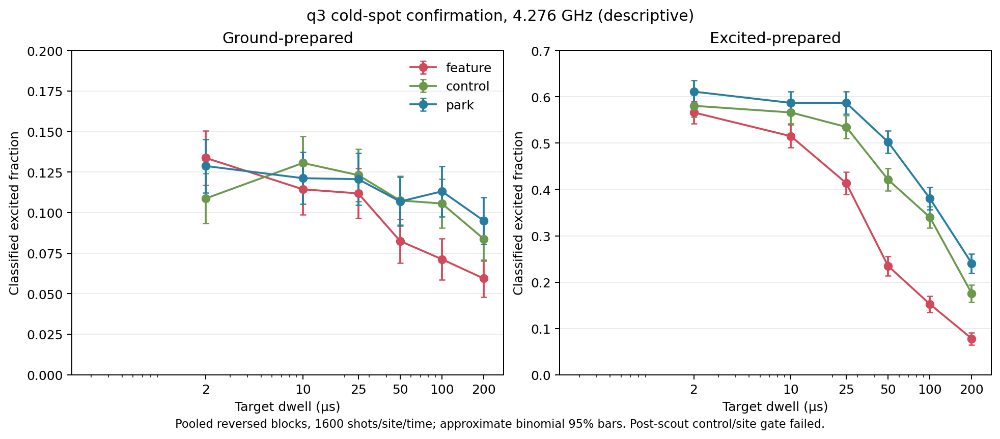

### Late-population test with two flanks

`TLSLossSinkReset --plateau` makes the next cold-spot question narrower:
does the line lead to a lower **late population**, or does it only shorten
the time required to reach the same population? A fresh 3.8–4.3-GHz scout
selects one early-loss line only if it has at least one independently quiet
flank with a clean five-point pre-scout neighborhood. A second flank is
included when available. The science sequence visits the feature, one or
two flanks, and a matched no-excursion park arm at 0.1 us and 200, 500,
or 1000 us. Ground/excited preparations and all sites are interleaved
within each shot (12 or 16 subshots); the second block reverses order. All
return to park for 40 us before readout. The post scout allows the line to
move by one 2-MHz grid step but requires the original control site(s) to
remain locally quiet. Pre/post readout and
park-transfer references are required as before.

The decisive comparison is the 500–1000-us g/e convergence at each site.
A lower feature plateau than park **and the clean flank(s)**, reproduced in both
orders and projected raw IQ with the controls passing, would support a
colder effective environment at the line. If the curves converge to the
same value, the earlier effect was faster relaxation of residual excitation.
Even a positive result would not calibrate absolute TLS temperature.

The first plateau attempt produced only the pre scout,
`q3_12_41_16_TLS_Cold_Spot_Plateau_Scout_pre`: the same 4.276-GHz line
remained strong, but a separate loss around 4.288–4.290 GHz occupied the
upper flank. The initial two-flank gate stopped before any science shots.
The revised selector accepts the clean 4.258-GHz lower control and park,
using 12 interleaved subshots; it still includes both flanks when available.
The next attempt produced only the 12:51:22 pre scout. A real minimum
remained at 4.276–4.278 GHz with clean lower controls, but the up/down
profile shifted by one 2-MHz bin and the old three-point mean/local-minimum
criterion rejected it before science. The plateau selector now tests the
minimum within ±2 MHz in each scan direction against local flank medians;
replaying that scout selects 4.278 GHz and a clean 4.262-GHz lower control.

The completed science run is
`q3_tls_cold_spot_plateau_20260929T172047Z_e6e07aeb` (commit
`35bdc82e`). All six 800-shot, 12-condition programs and both reversed
blocks completed. A fresh scout selected a 4.218-GHz loss feature and a
4.242-GHz upper control. The feature remained at 4.218 GHz in the post
scout (25-us normalized survival 0.504 pre, 0.471 post), and the pre/post
readout fidelities were 0.884/0.873 with valid park-transfer references.
The upper control, however, dropped from 0.798 to 0.655 combined survival;
its up-scan post value was 0.567. The recorded status is consequently
`complete_controls_unstable`.

Pooled across orders, the ground-prepared classified excited fractions at
200/500/1000 us were 0.092/0.081/0.091 on the feature, 0.087/0.074/0.091
at the upper site, and 0.110/0.103/0.086 at park. The corresponding
excited-prepared fractions were 0.198/0.101/0.076, 0.168/0.081/0.074,
and 0.313/0.146/0.096. At 500 us the feature-minus-park ground difference
was -0.023 (simple paired-shot bootstrap 95% interval [-0.044, -0.003]),
but the upper site showed comparable or stronger cooling. At 1000 us the
feature-minus-park ground difference was +0.005 [-0.014, +0.025]; projected
raw IQ gave -0.006 [-0.032, +0.021] in pre-reference-normalized units.
Both g/e contrasts have almost vanished by then. These intervals are
exploratory shot-level estimates and do not model slow serial drift.

This run supports faster transient relaxation on a flux excursion but
**does not support a lower line-specific plateau**. The 4.242-GHz control
became lossy, and the late classified fractions are near or below the
pre/post ground-reference false-excitation floor (~0.12–0.13), so they
cannot establish an absolute population or defect temperature. Do not
repeat this plateau protocol simply to chase a nominal cold-spot value.

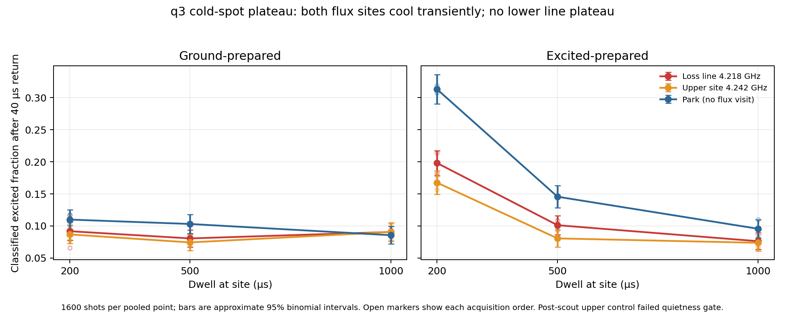

```bash
git -c gc.auto=0 pull --ff-only origin tls-spectroscopy
python -u -m WorkingProjects.TLS_Spectroscopy.Client_modules.Runners.TLSLossSinkReset --plan --plateau
Q3_CODE_COMMIT=$(git rev-parse HEAD) python -u -m WorkingProjects.TLS_Spectroscopy.Client_modules.Runners.TLSLossSinkReset --run --plateau
```

## Weak-site delayed-afterglow screen

`TLSWeakAfterglowScreen` tests a different possibility: a less conspicuous
loss site may store excitation for hundreds of microseconds even though the
strong q3 lines have shown no replicated short-gap return. A fresh 3.8–4.3-GHz
passive wide scout shortlists at most three bidirectional weak dips with a
10-us loading advantage and a quiet 14–20-MHz control. The repeatedly tested
3.982–4.010, 4.080–4.190 and 4.270–4.290-GHz regions are excluded from this
exploratory screen. Each shortlisted region gets a 45-point, 1-MHz local
rescan over ±22 MHz before the actual pump/probe frequency is fixed. A failed
local rescan is recorded and skipped; no science runs if all fail.

For each accepted site, a park π or zero-gain π is followed by a 10-us
corrected feature or control visit. After the full 40-us return and first
park readout, a ground-prepared qubit makes a second 10-us visit to the
feature and is read out again. Three complete subshots—cold-on, hot-on,
hot-off—are interleaved in each hardware shot. The added waits after the
first readout are 100, 300 and 1000 us; the second block reverses both
condition and wait order. Six hundred logical shots per program and a
5-ms gap after each three-arm group limit cross-shot carryover. Pre/mid/post
reference bundles, every paired raw IQ record, and a post wide scout are
saved. The old production scan and active-reset code paths are unchanged.

A *screen candidate* requires at least 100 confidently ground-heralded shots
per condition, hot-on minus both cold-on and hot-off ≥0.04 in both reversed
blocks, agreeing signs in unthresholded IQ, stable reference axes, and a
still-present loss feature with a quiet original control after the run.
This is a deliberately conservative **screen**, not a TLS discovery rule.
The first readout can itself affect later populations, as the September 27
readout-memory control showed; a positive candidate needs local frequency
refinement and a follow-up without that readout confound. A null only bounds
return after the 40-us return and first readout, not earlier memory.

On the measurement PC, after stopping other q3 acquisitions:

```bash
git -c gc.auto=0 pull --ff-only origin tls-spectroscopy
python -u -m WorkingProjects.TLS_Spectroscopy.Client_modules.Runners.TLSWeakAfterglowScreen --plan
Q3_CODE_COMMIT=$(git rev-parse HEAD) python -u -m WorkingProjects.TLS_Spectroscopy.Client_modules.Runners.TLSWeakAfterglowScreen --run
```

The weak-site delayed-afterglow run was paused initially, then resumed on
September 29. Session `q3_tls_weak_afterglow_screen_20260929T151524Z_a9b946e8`
completed all six 600-shot science programs at the sole fresh candidate,
4.026 GHz (4.010-GHz loading control). The fine scout had a normalized
25-us loss depth of 0.257; pre/mid/post readout references passed. After
confident-ground heralding, pooled reversed-order final excited fractions
for cold-on / hot-on / hot-off were 0.162 / 0.171 / 0.213 at 100 us,
0.122 / 0.137 / 0.129 at 300 us, and 0.063 / 0.052 / 0.109 at 1000 us.
Hot-on never exceeds **both** controls consistently in the two orders or
unthresholded IQ. Several individual hot arms had fewer than the preset
100 accepted heralds, so some block-level scores are unavailable.

The post scout still shows the 4.026-GHz loss dip, now deeper (combined
25-us depth 0.263 versus 0.121 in the pre wide scout), so it did **not**
simply disappear. The strict weak-site stability gate rejected it because
post depth exceeded its 0.24 weak-site ceiling and the 10-us early advantage
was 0.017 in one scan direction versus 0.256 in the other. The manifest
therefore says `complete_controls_uncertain`. This run provides no evidence
of delayed energy return after the 40-us return, first readout, and
100–1000-us added waits; it is not a clean bound on a stationary site's
return probability. The earlier readout-free two-visit confirmation at a
stronger line also found no reproducible 0.5–40-us memory. The afterglow
screen should not be repeated unchanged.

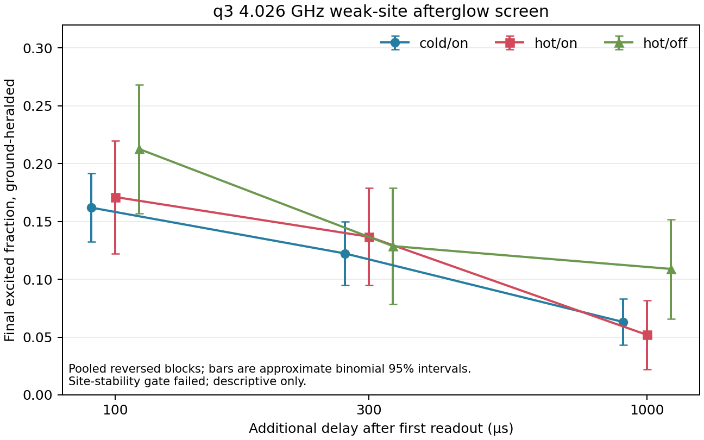

## q3 millisecond loss-flank sentinel (September 29)

The intervening experiment after the initial afterglow pause was the
millisecond sentinel: measure the motion of a strong *loss line* itself using
an eight-subshot, palindromic stream and frozen single-shot readout axis.
This studies loss-line dynamics, not direct TLS excitation or saturation.

`TLSMillisecondSentinel` begins with a fresh, passive 3.8–4.3-GHz scout. It
requires two qualified lines at least 20 MHz apart, prefers the 4.0947-GHz
family for line A if still present, and requires a quiet control C. Both
lines receive 20 repeated seven-point ±6-MHz local profiles with 25-µs
excited-state visits. A Lorentzian fit supplies the center and half-width;
the measured ±6-MHz-to-center contrast must be at least 0.15 and the fit
residual must be small. The runner
stops before the long stream if a site, reference, profile, or timing gate
fails, and retains the completed scout/profile files and manifest.

Each science hardware shot visits `[A−, A+, B−, C, C, B−, A+, A−]` for 25 µs
after a park π pulse, with the pinned corrected 40-µs return and one park
readout per subshot. A− and A+ are placed at the fitted center ±HWHM/√3
with individually inverted *integer* flux DAC gains; B is placed on its
lower-frequency flank. The passive setting retains the established 500-µs
recovery between subshots. A 64-shot pilot estimates shot cadence, followed
by 12 approximately five-second science chunks. After each is an eight-arm
calibration with ±0.5-MHz dithers at all three flanks plus ground/excited
park readout references. Three final chunks move A−, A+, and B to distinct
quiet windows. Pre/post frozen-axis and transfer references, post profiles,
and a post wide scout close the run. All raw IQ and shot order are saved.
The 100-shot dither estimates are deliberately not gated one chunk at a
time: their Bernoulli uncertainty is comparable to the expected slope.
The run pools all interleaved dither records, requires each signed slope
to exceed three standard errors, and uses the pooled slope for position
conversion while retaining each local readout reference and raw record.

The optional `--reset dump` mode adds a 60-µs visit to the strong loss line
*after* every readout. It requires `--passive-manifest` pointing to a
completed, control-valid passive pass with the same correction. It is not
the first acquisition command; its own readout references and static
profiles must pass before any fast-mode interpretation.

Two corrections to the proposed analysis are essential. First, QICK's
resident data-memory stream pauses at bank handshakes, so a global fixed
period does not give correct timestamps. The runner records the host UTC
time of every completed **hardware shot**, retains pauses, and marks shots
whose host callbacks bunch within 0.5 ms. These times are polling-limited, and individual
subshots have ordered positions but no hardware timestamp. The offline
analysis uses those irregular times and caps its science band by both shot
cadence and measured host jitter. The A-position estimator has one combined
value per hardware shot, so the passive pass does **not** promise a 1-ms
position measurement or a 200-Hz A-position band. Second, the ± flank
calibration slopes are signed and opposite: line displacement is the
*average* of the two flank signals divided by their signed line-shift
slopes, not their difference after signed division.

`TLSMillisecondSentinelAnalyze` saves a JSON report, derived-stream NPZ,
and a four-panel PNG. It computes binary and continuous-IQ position proxies,
gap-aware spectra/cross-spectra, Allan deviation only where enough adjacent
bins exist, lag statistics, an exploratory one-/two-/three-state Gaussian
HMM, and a penalized Gaussian-block change-point cross-check. Each chunk's
predicted Bernoulli white-noise PSD is subtracted before comparing the
science and quiet-null bands. A line-specific candidate also needs
significant negative A−/A+ cross-spectrum in both temporal halves and
valid closing controls. The raw exploratory spectra remain available if
a line moved. Shared A/B motion is
reported as possible common qubit-frequency motion, **not** automatically
identified as flux noise. Pulse-tube attribution requires an independently
measured frequency supplied with `--pt-frequency-hz`; the repository does
not document the q3 fridge head frequency. No PT frequency is inferred from
the same target spectrum being tested.

Initial measurement-PC command, only after other q3 acquisitions stop:

```bash
git -c gc.auto=0 pull --ff-only origin tls-spectroscopy
python -u -m WorkingProjects.TLS_Spectroscopy.Client_modules.Runners.TLSMillisecondSentinel --plan
Q3_CODE_COMMIT=$(git rev-parse HEAD) python -u -m WorkingProjects.TLS_Spectroscopy.Client_modules.Runners.TLSMillisecondSentinel --run
```

The standalone analysis can be run after a completed manifest exists:

```bash
python -u -m WorkingProjects.TLS_Spectroscopy.Client_modules.Runners.TLSMillisecondSentinelAnalyze "Z:/FluxTeam/Data/FTT02_AlOxJJ_2026_08_28/RFSOC/q3/<session_id>/manifest.json"
```

The first passive attempt, `q3_tls_millisecond_sentinel_passive_20260929T100651Z_ce58a340`,
stopped at site selection after the scout and collected no sentinel shots.
The scout contained a strong bidirectional loss at 4.134 GHz and a second
candidate at 4.026 GHz. The initial control gate demanded that every one
of 33 normalized survival estimates in an 11-frequency, three-direction
window exceed 0.75. That was incompatible with the actual quiet-region
baseline and its 125-shot directional fluctuations: the 4.260-GHz center
had about 0.89 survival, yet one directional neighbor fell near 0.65.
The revised gate requires each directional window median to exceed 0.68,
each frequency's median across directions to exceed 0.58, and the center
median to exceed 0.62. This tolerates an isolated noisy estimate while
still vetoing a reproducible narrow loss. Replaying the saved scout through
the revised selector qualifies A=4.134, B=4.026, C=4.072 GHz and three
separated quiet null windows (4.008, 4.218, 4.250 GHz). The next acquisition
must still repeat a fresh scout and all static-profile/reference gates.

The next attempt, `q3_tls_millisecond_sentinel_passive_20260929T143223Z_2c2c15e3`,
also stopped after its scout, before sentinel shots. It showed two substantial
loss troughs at 4.112 and 4.142 GHz, 30 MHz apart. The earlier selector
rejected 4.112 GHz because the down-scan lowest bin shifted 2 MHz relative
to the combined minimum, despite bidirectional depths of 0.476 and 0.385.
Site qualification now requires a local minimum in the combined scan and
positive depth in both directions; the 20-cycle static profile is still
the decisive fit and contrast gate. Replaying this scout selects A=4.112,
B=4.142, C=4.092 GHz, plus null windows at 4.166, 4.178, and 4.250 GHz.
The same saved scout exposed a profile-gate mistake: the seven measured
points are ±6 MHz about the *scout* center, while the fitted center can
land between bins. Their actual outer points now set measured edge-to-center
contrast, with the fitted center constrained to the inner ±2 MHz. Both
scout-based seven-point fits pass provisionally (measured contrasts 0.187
and 0.168); the fresh higher-shot profiles on the next run remain required.

The third attempt, `q3_tls_millisecond_sentinel_passive_20260929T144839Z_df50be8c`,
passed readout calibration (fidelity 0.846 and ground/excited transfer 0.543)
but stopped after both 20-cycle profiles. Its scout chose 3.896 and 3.966
GHz; their *raw* readout-fraction edge contrasts were only 0.051 and 0.095,
so neither passed the earlier raw 0.15 gate. No sentinel shots were taken.
There are two distinct issues. The scout uses `(Ps25−P0)/(P1−P0)`, whereas
the profile gate used unnormalized classified fractions; applying one 0.15
threshold to both was inconsistent. Profiles now normalize by the frozen
pre/post C ground/excited transfer before fitting. The 3.896-GHz profile
then has normalized contrast 0.094 and still fails; 3.966 GHz reaches
about 0.175. Separately, the same scout showed a more promising 4.116-GHz
trough, but a strict center-bin condition prevented its selection. The
runner now ranks distinct broad, bidirectional troughs that have a
provisional seven-point contrast, then profiles up to six in priority order
until two separated sites pass the higher-shot gate. Replaying the third
scout ranks 4.116, 3.896, and 4.148 GHz; a failed 3.896-GHz profile would
allow testing 4.148 GHz without another wide scan. The fresh scout and
all original controls remain mandatory in the next run.

The fourth passive attempt, `q3_tls_millisecond_sentinel_passive_20260929T150151Z_17b19a8d`,
executed the fallback profiles and stopped at the profile gate. The readout
axis fidelity was 0.874 and the C ground/excited transfer was 0.553. The
fresh scout queued 3.950, 3.968, and 4.148 GHz. After 20 cycles each, the
normalized measured center-to-edge contrasts were 0.130, 0.185, and
0.097. The 3.968-GHz fit centered at 3.9656 GHz, outside the inner ±2-MHz
profile guard; a recentered profile might characterize this individual
line, but its separation from the 3.950-GHz fit is only 15.1 MHz. The
4.148-GHz fit collapsed to an unresolved 0.29-MHz width with its fitted
depth against the 1.5 bound, and the measured contrast failed. No
science/pilot/null stream has been acquired in any of the four attempts.
The 20-cycle profiles show a changing and currently insufficient set of
qualified, separated lines. Do not keep rerunning the unchanged two-line
sentinel or relax the separation and contrast gates merely to get a
stream; the line-specific versus common qubit-frequency jitter comparison
would no longer satisfy this protocol's stated result criterion.

### Dual-transition loss probe (prepared 2026-09-29)

`TLSDualTransitionLoss.py` is an experimental, passive-reset test of one
freshly selected q3 loss line through both g–e and e–f relaxation. It first
calibrates a park e–f pulse by opposed frequency scans and a 0/π/2π IQ
return audit. A standard wide five-point scout then picks a bidirectional
loss line below 4.155 GHz so the e–f matching bias remains reachable.
The science loop interleaves g–e and e–f offsets in transition-frequency
coordinates and reverses order on its second pass. Each point has local
readout references, a 0.25 µs short dwell, a 10 µs long dwell, and a
matched long-dwell ground control. Raw IQ and differential loss are saved
after every arm. The readout begins after the 0.5 µs corrected return prefix
while the 40 µs tail continues, retaining a chance to observe |f⟩ before
it relaxes; the tail is complete before the next shot. This is the **intended
and now enforced timing**. The first three runs below inherited the standard
five-point `opx_feedback_pre_measure_sync=True` setting, which inserted an
all-channel sync inside the readout call. Their readout actually waited until
the full 40-µs flux tail completed. The experimental runner now explicitly
sets this field to `False` after loading the five-point timing defaults;
it retains the official ADC wait and raw-IQ collection.

The e–f transition frequency at the excursion bias is inferred from the
park-calibrated anharmonicity rather than measured locally. A coincident
peak is therefore suggestive but cannot establish exact line identity
until the local e–f frequency is calibrated. An absent peak is also
inconclusive if that extrapolation misses by more than the ±8 MHz scan.
The new runner does not print progress; its manifest records each step.

The first run, `q3_tls_dual_transition_loss_20260929T185615Z_8a4867a9`,
calibrated the park e–f transition at 4187.292 MHz with π gain 11250 and
passed a fresh 0/π/2π audit. Its scout selected a deep 4.018-GHz loss line
(bidirectional normalized depth about 0.42). It stopped after the first
short-dwell g/e reference because the code demanded at least 70% *single-shot*
readout assignment at the prompt-return point. Saved IQ shows a 0.617
held-out single-shot fidelity but a 7.91-SE **difference of the ensemble
means**, reproduced in both halves of the 300-shot reference. The experiment
measures ensemble decay, so the 70% assignment gate was the wrong criterion;
this run contains no long-dwell or e–f science data. The runner now requires
mean-IQ contrast above 5 SE overall and 3 SE in each half, and estimates
loss by projecting short/long IQ means along the local preparation axis with
matched ground-drift subtraction. `--reuse-recent-ef` can reuse this passed
park pulse for two hours, but repeats a fresh 0/π/2π audit and wide scout.
After two hours it falls back to the complete e–f calibration.

The second run, `q3_tls_dual_transition_loss_20260929T191204Z_f0e68d0b`,
re-audited the e–f pulse and acquired 35/36 science points before the last
g–e reference missed the 3-SE half-block gate by about 0.06 SE. The apparent
e–f loss profile peaks near a predicted transition frequency of 4.024 GHz
in both passes. This is **not yet evidence of a shared TLS**: the wide scout
also has a separate g–e loss line at the corresponding *bias* around
4.204 GHz. Its 25-µs survival drops to 0.268, versus 0.7–0.96 at many
nearby points. The e–f IQ profile follows that shifted-bias g–e trough,
and the three direct-readout centroids are too nearly collinear for a stable
g/e/f population inversion. See `q3_dual_transition_pilot_20260929.png`.
The next run requires the entire shifted e–f bias window to have quiet
10- and 25-µs g–e survival. Replaying the latest scout selects the
4.076-GHz loss line (shifted bias 4.256 GHz; minimum 10-/25-µs survival
0.738/0.662). One extra reference acquisition is now attempted if a
single point misses the ensemble contrast gate; persistent failures are
recorded as unresolved and the rest of the scan continues.

The third run, `q3_tls_dual_transition_loss_20260929T192658Z_dfc59fe7`,
completed all 36 science points. A fresh scout selected the 3.950-GHz line,
with bidirectional 25-µs normalized depth 0.29–0.33. The e–f matching bias
was 4.130 GHz, where g–e survival at the apparent e–f peak offsets +2/+4 MHz
was 0.84/0.92 after 25 µs; this avoids the obvious shifted-bias loss that
confounded the second run. The projected-IQ e–f loss peaked at +2/+4 MHz in
both reversed-order passes: the mean over those offsets was 0.472 and 0.484,
versus 0.248 and 0.090 over selected nearby flanks −6, −4, −2,
+6, +8 MHz. Their pooled peak-minus-flank difference is about 0.31 with
conditional shot-noise SE about 0.10, but the peak offsets were chosen after
seeing the data. See `q3_dual_transition_clean_bias_20260929.png`.

Direct 2-D g/e/f IQ inversion of the saved shots does **not** robustly
confirm the projected-IQ peak: it yields negative or near-zero inferred
f-loss at +4 MHz in pass 0 and +2 MHz in pass 1. The nearly collinear state
centroids make that inversion ill-conditioned, so this discrepancy neither
proves nor rules out an e–f-coupled defect. The inherited 40-µs pre-readout
sync is the stronger limitation: the reported peak is a **delayed** readout
effect, not evidence of prompt e–f loss into the same TLS. The
park-calibrated −180-MHz anharmonicity also remains an extrapolation at the
4.130-GHz bias.

The bounded follow-up is `TLSDualTransitionLoss --run --shelved-confirm`.
It selects a fresh bidirectional line and takes only e–f science
arms, in two reversed-order passes. At each offset it acquires g/e/f
references and long-dwell g/e/f data both directly and after an e–f then
g–e park mapping. The mapping is scheduled with a fixed reference-time delay
while the 40-µs flux correction tail is already playing; an all-channel
sync before readout would wait out the tail and erase |f⟩. The two mapped
IQ views allow a response-matrix estimate of f population, with the long-e
arm explicitly testing e→g cascade/readout leakage. The run checkpoints all
raw shots and remains silent apart from the standard SS-cal/five-point and
hardware output. A positive result needs repeatable f-population loss on the
line, low inferred f population in the long-e control, and a feature absent
at nearby frequency controls. A null or failed response-matrix gate closes
this particular two-transition claim without redefining a projected-IQ peak
as a detection.

The first mapped attempt, `q3_tls_dual_transition_loss_20260929T195349Z_80192d29`,
passed its reused park e–f 0/π/2π audit but stopped after the fresh scout:
the one-axis selector still demanded a quiet g–e window at the shifted e–f
bias. The scout retained a strong bidirectional line at 3.952 GHz (depths
0.231 combined, 0.448 up, 0.288 down), but its e–f bias 4.132 GHz contained
separate g–e loss (minimum 10-/25-µs normalized survival 0.639/0.482
across the science window). No mapped science arms ran. That quiet-bias gate
was essential when only a projected IQ axis was available; it is not a
prerequisite for the two-map f-population measurement. The mapped mode now
admits such a site while recording the shifted-bias scout values, and
retains the long-e control at every science offset. The older one-axis
mode keeps the quiet-bias gate unchanged.

The next mapped attempt, `q3_tls_dual_transition_loss_20260929T200259Z_5e62cd92`,
again passed the park e–f audit but stopped at site selection, with no
science arms. Readout contrast in its wide scout weakened: the median
combined P1−P0 contrast fell from 0.220 in the previous scout to 0.176,
and 65/251 individual frequencies fell below the selector's 0.15 cutoff.
Requiring every center and flank frequency to clear that cutoff therefore
discarded the evident local loss structure. Pooling P0/P1/P25 counts
across each three-frequency center or flank group keeps the same 0.15
*group-average* contrast threshold and still requires bidirectional depth.
Replaying this scout with that method selects 3.894 GHz, with normalized
center-to-flank depth 0.318 combined, 0.289 up, and 0.347 down; its e–f
bias is 4.074 GHz. This pooled selector applies only to the two-map f-state
measurement. The older one-axis selector remains unchanged. This is a
candidate for the next science run, not a retrospective e–f result.

The following mapped run,
`q3_tls_dual_transition_loss_20260929T201232Z_e4de5bad`, completed all
18 offsets/passes, but only 6 passed the original two-view matrix gate.
Those six are **not valid e–f loss detections**. The saved direct and mapped
IQ references show that mapping failed to permute the prepared |f⟩ state:
at every point the mapped |f⟩ centroid moved less than 0.24 of the direct
|f⟩–|g⟩ separation toward |g⟩, usually less than 0.1. A rank/condition
gate alone can accept noise in that situation and yield unphysical state
populations. The original two-view values therefore cannot support a
shared-defect claim.

The next mapped run waits for the full corrected flux return in both its
direct and mapped arms, then applies the e–f and g–e mapping pulses at park
with all-channel alignment between them. It first verifies the permutation
on park g/e/f references, before a wide scout; it also requires the local
short-dwell |f⟩ centroid to move at least halfway toward |g⟩ at every
science point. Both views have matching return timing. This is a deliberate
tradeoff: the |f⟩ population may decay during the 40-µs return. If the
post-return reference contrast is too small, the mapped method cannot
resolve this TLS interaction in its current form.

The full-return mapped run,
`q3_tls_dual_transition_loss_20260929T203054Z_214d4888` (commit
`bf0b3974`), passed the independent **park** mapping audit: the mapped
|f⟩ centroid moved 0.741 of the way toward direct |g⟩, and the two-view
response matrix had condition number 1.97. The fresh five-point scout
selected a bidirectional g–e loss line at 3.900 GHz (pooled depths
0.281 combined, 0.310 up, 0.247 down); the predicted e–f matching bias
was 4.080 GHz. All 18 offset/pass points acquired their raw short/long
g/e/f direct and mapped shots. Every point nevertheless failed the
predeclared local reference gate: its g/e ensemble separation was only
3.34–4.37 SE, below the required 5 SE, although the g/f and e/f
separations were 8.18–10.76 and 5.18–8.64 SE, respectively. The local
matrix condition numbers were 2.88–5.87. The manifest correctly records
all 18 points as unresolved.

An exploratory reanalysis of the saved IQ, without relaxing that gate,
finds no reproducible e–f-specific loss peak. For a *predefined* center
(offsets −2, 0, +2 MHz) versus outer flanks (−8, −6, +6, +8 MHz), the
two-view inferred extra |f⟩ loss differs by +0.030; a conditional
3000-draw Gaussian shot-mean resampling interval is [−0.118, +0.182].
The two reversed passes give −0.015 and +0.074, so even the signs do not
replicate. This interval excludes neither a moderate effect nor zero and
does not include serial drift or site-selection uncertainty. The 4.080-GHz
g–e bias also had independent scout loss, making an e–f attribution harder.
There is no defensible shared-TLS detection from this branch, and more
shots with the same delayed-readout sequence are not justified by the
observed profile.

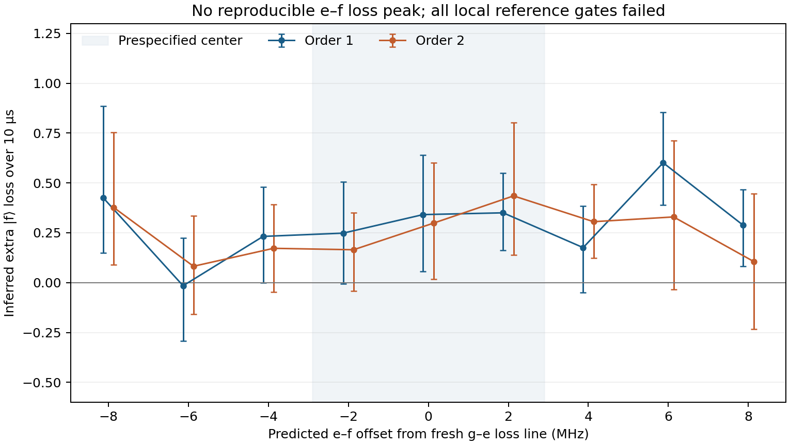

### Square-hop phantom-resonance pilot

`TLSPhantomResonance` tests whether a line can absorb from a qubit whose
*commanded dwell frequencies* alternate between two off-line values.
The ideal instantaneous 50%-duty square wave has central Floquet weight
`[sin(x)/x]²` with `x=π A/(2 f_h)`, where `A` is the peak frequency excursion and
`f_h=20 MHz` is the **complete-cycle** rate. Its narrow-line excess-loss
weights at `A=10`, `20`, and `40 MHz` would be about 0.811, 0.405, and
zero. These are predictions for an ideal delivered waveform, not calibrated predictions
for the q3 flux line. Actual flux transitions necessarily pass the center,
and the installed 500-ns-first-bin tail correction does not resolve the
25-ns square-wave half-period. A positive pilot calls for independent
fast-edge verification before a Floquet interpretation.

One fresh corrected 3.8–4.3-GHz five-point scout selects a bidirectional
line only if its 10-µs early loss is resolved and the pooled ±20- and
±40-MHz 25-µs endpoint neighborhoods are quiet. It adds the ±10-MHz arm
only if both of those endpoints are also quiet, recording the decision
in the manifest. The science programs compare a static center hold against
20-MHz full-cycle hops at the eligible ±10, ±20, and ±40 MHz excursions,
with both static endpoints at each excursion. Every pair interleaves
ground and excited park preparations in one four-condition QICK shot.
The two holds are 0.4 and 3.6 µs (8 and 72 nominal full cycles); the
second block reverses program/subshot order and starting hop polarity
after a midpoint scout. The 3.6-µs long hold keeps two correction-matched
flux envelopes plus park ramps within q3's 65,536-sample generator memory;
the originally suggested 5.6-µs pair would not fit. Each program uses
4,000 logical shots (16 or 24 programs). Pre/mid/post scouts, pre/post
readout and transfer references, all raw IQ, the exact programmed
waveforms, and realized
static endpoint DAC coordinates are saved. Only ordinary calibration,
five-point, and hardware output appears on the terminal.

The prespecified comparison is the apparent decay rate of each hop above
the mean rate of its static endpoints, divided by the center's rate above
the *same* static-endpoint mean. The eligible ±10-, ±20-, and ±40-MHz
series tests the predicted decrease with excursion. A reproducible
positive ±20-MHz effect, with a resolved center, stable line, quiet static endpoints,
and no ground-arm heating would motivate independent measurement of
the delivered 20-MHz square-wave edges. It alone would not demonstrate
coherence of a microscopic TLS or prove that the qubit never passed
through the line.

On the measurement PC, after stopping any other q3 acquisition:

```bash
git -c gc.auto=0 pull --ff-only origin tls-spectroscopy
python -u -m WorkingProjects.TLS_Spectroscopy.Client_modules.Runners.TLSPhantomResonance --run
```

The pilot completed at `q3_phantom_resonance_20260929T211914Z_a6d81116`
(commit `b42ec3f9`). The pre/mid wide scouts selected a loss line at
4.204 GHz, but the post scout found it at 4.212 GHz, so the manifest
correctly marked the overall controls unstable. The ±10-MHz arm was
omitted because the pre-scout +10-MHz endpoint fell just below its
quiet-site threshold; all 16 ±20/±40-MHz programs and all readout and
transfer references completed. Readout-reference fidelities were
0.798 before and 0.806 afterward; both transfer contrasts passed.

For the ±20-MHz static-endpoint background, the center's extra apparent
decay rate was +0.0228 [95% shot-only interval +0.0006, +0.0452] /µs
in the first block and +0.0523 [+0.0302, +0.0743] /µs in the reversed
block. The square hop's extra rate was −0.0027 [−0.0296, +0.0235] /µs
and −0.0107 [−0.0363, +0.0145] /µs, respectively. Thus the positive
phantom-loss effect was not observed. At ±40 MHz, the hop's extra rates
were +0.0072 [−0.0197, +0.0341] and −0.0061 [−0.0317, +0.0198]
/µs; both include zero and change sign. The intervals use a Gaussian
resampling of the saved interleaved g/e shot covariance within each program
covariance, but do not include flux-line transfer uncertainty, site
selection, or the observed 8-MHz line motion. The compiled square-wave
commands had 72 cycles over the 3.599-µs long hold and fit within the
65,536-sample envelope memory. Their analog delivery remains unmeasured.

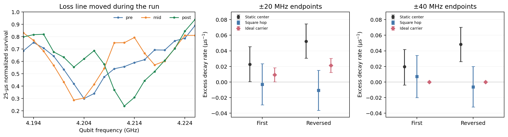

This is a null pilot for the proposed phantom resonance, not a bound on
the intrinsic TLS coupling. The second block alone disfavors the ideal
instantaneous-square-wave ±20-MHz carrier prediction under a fixed line,
but the fast analog edge response and within-run line motion are unknown.
Repeating the same pilot without an independent fast-edge measurement is
not justified.

## Target-resident Hahn-echo dephasing map (2026-09-29)

`TLSEchoDephasingMap` scans the same 3.800–4.300-GHz, 2-MHz grid as the
five-point T1 measurement. A fresh passive-reset, corrected five-point scout
provides the T1 comparison. At each echo site q3 starts in its ground state,
spends 30 µs at the target so the flux correction settles, then receives a
0.1-µs-sigma π/2 pulse, τ/2 idle, π pulse, τ/2 idle, and an analysis π/2 pulse,
all at the target frequency. The broad target pulses use twice the calibrated
park gains, preserving the Gaussian pulse area. The final pulse is phase
cycled through 0°, 90°, 180°, and 270° for τ = 0.3 and 1.8 µs. The magnitude
of the two quadratures removes the large deterministic phase accumulated at
different flux biases. One corrected 40-µs return precedes the only readout.

This sequence deliberately puts all three coherent pulses at the target.
The existing round-trip Ramsey echo puts the middle π pulse at park after a
flux return; the q3 flux tail can detune that pulse, especially for the
large excursions needed to cover the band. The settled-target version avoids
that failure mode but tests whether a broad target pulse is usable. A parked
phase cycle, repeated in reverse order, and a quiet-site target pilot must
pass before the 251-point map starts. A failed check is saved to the manifest
and stops the science scan. Raw IQ is saved per frequency, and the scan writes
no custom terminal progress messages.

For each frequency, the ratio of phase-cycle visibility at 0.3 and 1.8 µs
estimates an **effective Hahn-echo decay rate**. Points without short-delay
contrast are labeled unresolved, so failed target pulses cannot be called
dephasing hotspots. The fresh scout's 2-µs survival gives an approximate
Γ₁/2 comparison. A reproducible resolved echo-rate peak with no corresponding
T1 loss would motivate a local, higher-shot delay sweep and a control at the
same frequency slope. This first map does not by itself identify a TLS or
yield a flux-noise amplitude: pulse fidelity, target-frequency calibration,
and residual flux dynamics still limit that inference.

Run on the measurement PC after stopping other q3 acquisitions:

```bash
git -c gc.auto=0 pull --ff-only origin tls-spectroscopy
python -u -m WorkingProjects.TLS_Spectroscopy.Client_modules.Runners.TLSEchoDephasingMap --run
```

The first echo-map attempt stopped at its quiet-site gate:
`q3_echo_dephasing_map_20260929T220346Z_96f96c17` (commit `72251d9e`).
The park echo produced reproducible 0.3-µs phase-cycle visibility 0.581 and
0.611 in reversed orders, with readout-reference contrast 0.548. At the
freshly selected quiet 4.288-GHz site, however, the 0.3-µs visibility was
only 0.054 (continuous IQ projection gives about 0.147 of its reference
separation). The fresh five-point T1 fit there was about 81 µs; energy loss
over 0.3 µs cannot explain the missing echo. No band-map point was acquired.
The result is **unresolved**: detuned or inaccurate target pulses and very
fast dephasing are both possible. It cannot yet be called a dephasing hot
spot.

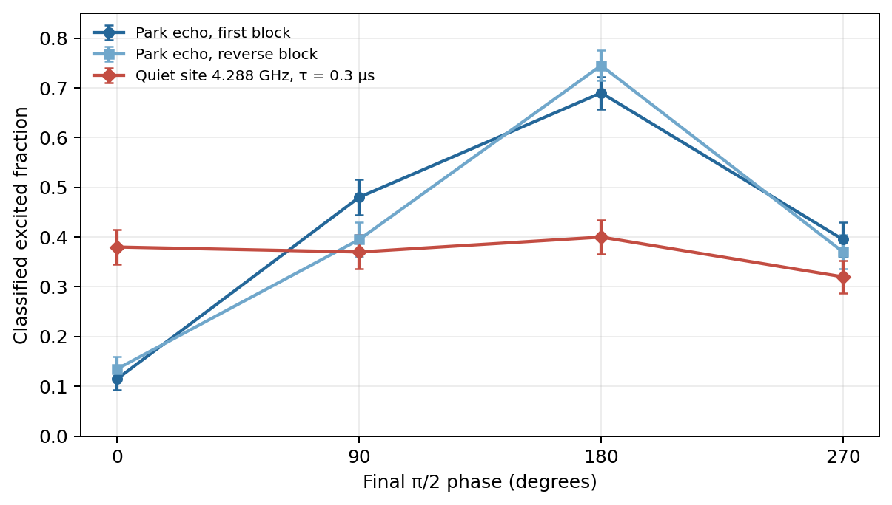

Earlier resident-drive scans at 4.1–4.13 GHz found the strongest qubit response
about 5 MHz above the flux-model frequency. The echo used zero detuning,
and its 0.1-µs Gaussian pulses can be weak several MHz off resonance. That
is a specific hypothesis for the quiet-site failure, not a measured
frequency offset at 4.288 GHz. The next prerequisite is a **calibrated
target π/2 pulse**; the echo's original area-scaled park pulse was never
calibrated at target flux. `TLSEchoPulseCalibration` takes a fresh five-point
scout, chooses one quiet site, and measures the response to one canonical
0.2-µs-sigma Gaussian pulse across nine drive offsets (−10 to +10 MHz)
and five coarse gains. At the strongest offset, it records a 0–30000-DAC
Rabi gain sweep. A first π turnover and its rising half-height select
candidate π and π/2 gains. Two target-resident π/2 pulses at relative
phases 0°, 90°, 180°, and 270°, repeated in reverse acquisition order,
must then show both inversion and cancellation. Ground and excited readout
references bracket the sequence, and all raw IQ is saved. The runner stops
without an echo map if any calibration check fails, and prints no custom
progress messages.

```bash
git -c gc.auto=0 pull --ff-only origin tls-spectroscopy
python -u -m WorkingProjects.TLS_Spectroscopy.Client_modules.Runners.TLSEchoPulseCalibration --run
```

That target calibration stopped before its frequency sweep:
`q3_echo_pi2_calibration_20260929T221943Z_cc8a106f` selected 4.266 GHz
from the fresh scout, but that point had an invalid five-point T1 fit.
Its 400-shot resident-program readout references had fidelity 0.691 and
assignment contrast 0.3825, just below their gates. No π/2 gain was measured.
The ground IQ cloud was similar to the preceding echo run, while the excited
reference moved substantially; the saved data do not identify whether the
existing park π preparation, readout, or return dynamics caused that change.
Repeating a whole-band scout would not answer the pulse question.

`TLSParkPi2Calibration` is the smaller prerequisite. It remains at q3's
verified park bias throughout and starts with a no-drive raw-IQ baseline,
not an excited reference made with the possibly mistuned old π pulse. It
scans ±6 MHz around the installed park drive with three gains, confirms the
selected response, takes a full 0–30000-DAC Rabi gain curve, and validates
the derived π/2 gain using two opposite-order, four-phase double-pulse
cycles. Zero-drive and π responses at the end test drift. It saves every raw
IQ arm and stops if the Rabi turnover or phase cycle is unresolved. It does
not locate a TLS, acquire a five-point scan, or run an echo map. Even a passed
park calibration does not establish a target-resident π/2 pulse; that remains
a separate prerequisite for the original target-resident echo map.

```bash
git -c gc.auto=0 pull --ff-only origin tls-spectroscopy
python -u -m WorkingProjects.TLS_Spectroscopy.Client_modules.Runners.TLSParkPi2Calibration --run
```

The first park-only attempt (`q3_park_pi2_calibration_20260929T222634Z_700f473b`)
failed during program construction, before any shots: the inherited
target-resident program required flux compensation even though park-to-park
has zero flux step. The park-only program now plays its microwave pulses
without entering that target-excursion path; its single- and double-pulse
timings are checked locally. This failure contains no calibration data.

The next park run (`q3_park_pi2_calibration_20260929T223007Z_7464f640`,
commit `41638ab3`) reached every measurement. The strongest repeated park
response was at the installed 4367.292-MHz drive, with no frequency offset;
the Rabi curve's first peak was 13500 DAC and its rising half-height was
7993 DAC for a 0.2-µs-sigma Gaussian. The independently measured one-pulse
response at 7993 was 0.608 in units where the Rabi-derived half-height was
0.528. The two 400-shot-per-phase cycles were strongly sinusoidal: fitted
centers 0.514 and 0.486, amplitudes 0.493 and 0.452, and maxima at 37.9°
and 37.0°. Zero- and π-drive end checks were stable. The original manifest
says `complete_controls_unstable` because its gate assumed the sinusoid's
maximum had to be at programmed phase 0°; it rejected the unequal 90° and
270° arms. That assumption is inappropriate for a fixed inter-pulse phase
offset. A retrospective phase-circle gate accepts both blocks, with a mean
peak phase of 37.4° and only 0.9° inter-block drift. The saved IQ therefore
supports a calibrated **park** π/2 pulse at gain 7993. The 37° phase offset
belongs to this pulse spacing and should not be transplanted to another
sequence without a phase check. The runner's gate now fits the full phase
circle so later runs are labeled correctly; the NAS manifest is unaltered.

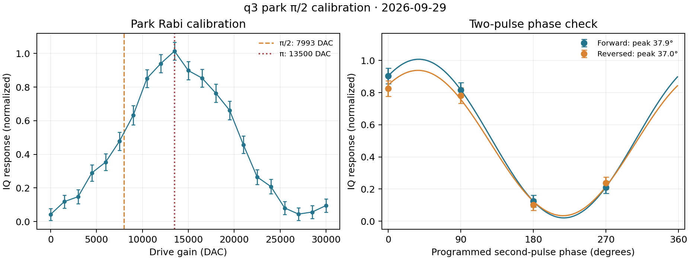

The next bounded run calibrates the **target-resident** pulse at 4.288 GHz,
the exact site where the echo pilot had unresolved contrast.
`TLSEchoTargetPi2Calibration` uses the same raw-IQ frequency, Rabi, and
two-block phase checks as the successful park calibration, but every pulse
is played during a 30-µs settled, corrected target visit; readout follows
the full 40-µs return. It checks a ±10-MHz drive offset and gains up to
30000 DAC. There is no new full-band scout and no reliance on the old park
π pulse to define an excited-state readout reference. If a target pulse is
found, its gain and drive offset apply at 4.288 GHz only; an echo map would
still require a strategy for target-pulse calibration across the band.

```bash
git -c gc.auto=0 pull --ff-only origin tls-spectroscopy
python -u -m WorkingProjects.TLS_Spectroscopy.Client_modules.Runners.TLSEchoTargetPi2Calibration --run
```

The target run (`q3_target_pi2_calibration_20260929T223917Z_0e7f4ab8`)
found a reproducible maximum at 4.288 GHz + 2.5 MHz: the chosen coarse arm
displaced raw IQ by 1158 units and its repeat by 916 units along almost
the same axis (cosine 0.995). Its 21-point Rabi sweep had a first maximum
near 18000 DAC and an estimated π/2 gain of 8174 DAC. It stopped at its
single-point midpoint gate before any phase cycle: the independent response
was 0.854, versus a sweep-derived midpoint 0.667. The independent point's
shot SEM alone was 0.164 in these normalized units; the 0.187 difference is
not significant, and the fixed 0.15 cutoff was too tight for this weaker
target readout. The source run does not establish a target π/2 pulse yet.

`TLSEchoTargetPi2Validate` reuses that measured drive frequency and DAC
without repeating the broad frequency or Rabi sweeps. It brackets the
candidate gain with five 1600-shot arms, checks an independently measured
half-height point using its uncertainty, then takes two 1600-shot four-phase
cycles and zero/π end controls. A phase-circle fit allows a fixed phase
offset but requires stable contrast across the reversed blocks. The only
outcome that licenses a target echo pilot is `complete_calibrated`.

```bash
git -c gc.auto=0 pull --ff-only origin tls-spectroscopy
python -u -m WorkingProjects.TLS_Spectroscopy.Client_modules.Runners.TLSEchoTargetPi2Validate --run
```

The high-shot target validation completed at
`q3_target_pi2_validation_20260929T224432Z_b1a0820d` with status
`complete_controls_unstable`. Its one-pulse gain response rose through the
local sweep, but the two reverse-order phase cycles had amplitudes 0.101 and
0.317 in pre-reference-normalized units and their fitted phase shifted by
25 degrees. The end zero and π references also drifted. Averaging the two
blocks gives a weak nonzero phase signal of about 0.21 (shot-bootstrap 95%
interval about 0.12–0.30), but not the repeatable π/2 control needed for an
echo-rate map. The wide dephasing map must not run with these Gaussian
target pulses.

`TLSEchoFastSquarePilot` makes one bounded check of whether pulse duration is
the problem at the **same quiet 4.288-GHz site**, using its previously
measured 4290.5-MHz drive. The original 0.2-us-sigma Gaussian lasts 0.8 us;
at gain 30000, a square π pulse should have a rough area-equivalent duration
near 0.29 us and π/2 near 0.14 us. These are predictions, not assumed
calibrations. Fourteen durations span 0.06–0.48 us, with interleaved zero
controls and a repeated first turnover. Only a resolved turnover and an
independent half-height check allow two forward/reversed, four-phase cycles.
Zero/π reference pairs bracket each cycle so linear readout drift cannot
masquerade as phase contrast. All raw IQ and a manifest are saved; there is
no fresh 5-point scan, TLS selection, or wide echo map, and no runner-specific
terminal messages. A passing phase test would justify designing a **local**
loss-line versus clean-control echo comparison with separately calibrated
pulses at both sites. It would not validate π/2 pulses across 3.8–4.3 GHz.
If phase contrast remains weak, stop the target-resident echo route rather
than relaxing its gate or launching the map.

```bash
git -c gc.auto=0 pull --ff-only origin tls-spectroscopy
python -u -m WorkingProjects.TLS_Spectroscopy.Client_modules.Runners.TLSEchoFastSquarePilot --run
```

The first square-pulse run is
`q3_echo_fast_square_pilot_20260929T231147Z_0230fd65` on commit
`75851bd6`. It completed the 14-duration sweep, five interleaved zero
controls, and a repeat of the largest response. That response was 3205 IQ
units initially and 2838 units on repeat, with axis cosine 0.9985. The
duration sweep shows a first maximum near 90 ns, a near-zero response at
180 ns, and a revival around 270 ns. A two-parameter weighted
`A sin²(πt/(2tπ))` fit gives `tπ=90.7 ns`, `tπ/2=45.4 ns`, and χ²=12.6 for
12 degrees of freedom. The saved 60-ns first point is already above the
half-height, so the original interpolation gate labeled the manifest
`complete_rabi_unresolved` and stopped before the phase cycles. That label
describes a **scan-range error**, not a failure to drive Rabi oscillations.
The raw data do not yet establish two-pulse coherence or echo visibility.

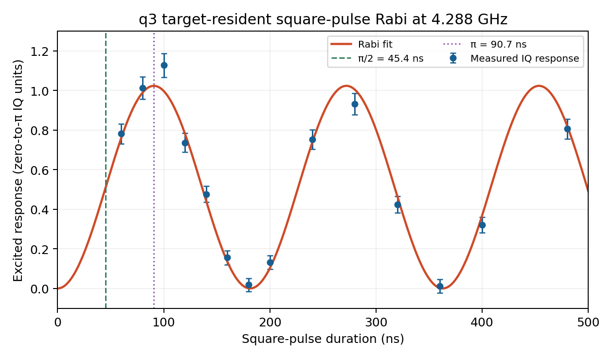

The revised Rabi fitter accepts a well-resolved turnover before the first
half-height sample, with a full-curve residual and revival check.
`--phase-only` re-fits the pinned saved sweep, measures three nearby
40/45/50-ns π/2 candidates against bracketed zero/π references, then runs
two reversed four-phase cycles if an independent midpoint is resolved.
There is no new duration sweep, five-point scout, or wide echo map. Only a
repeatable phase circle with stable local references licenses a later local
loss-line-versus-control echo comparison.

```bash
git -c gc.auto=0 pull --ff-only origin tls-spectroscopy
python -u -m WorkingProjects.TLS_Spectroscopy.Client_modules.Runners.TLSEchoFastSquarePilot --run --phase-only
```

The phase-only run completed at
`q3_echo_fast_square_phase_20260929T232207Z_1a22c113` with status
`complete_calibrated`. The independent 45-ns midpoint and two reversed
phase circles passed: fitted amplitudes were 0.454 and 0.482, phase drift
4.6 degrees, and zero/π IQ references remained stable. This establishes
square-pulse control **at 4.288 GHz only**.

The next experiment is a blind, coarse Hahn-echo screen, rather than a
loss-line selection. `TLSEchoSquareMap` visits all 126 frequencies from
4.300 to 3.800 GHz at 4-MHz spacing. At every site it brackets local IQ
with zero/π pulses, measures a four-phase two-π/2 control before and after
the echo, then measures four final phases at total free-evolution delays
0.3, 0.9, and 1.8 us. The π/2 and π square durations are the observed
45 and 90.7 ns at gain 30000, with a drive 2.5 MHz above the flux-model
frequency. A site is unresolved if its local pulse response or references
are weak/unstable, or if its echo envelope is nonmonotonic. All shot IQ and
site-level gates are saved. A standard five-point T1 scan runs afterward
only to distinguish loss-limited echo dips from candidate excess
dephasing; it does not choose where the echo scan runs. There is no
runner-specific terminal progress output during the echo sweep.

This first 4-MHz map is a screen, not an intrinsic TLS dephasing
measurement. Any candidate hotspot needs a finer, repeated local echo
scan with a simultaneous T1 comparison, particularly because the line
may move during the full-band pass.

```bash
git -c gc.auto=0 pull --ff-only origin tls-spectroscopy
python -u -m WorkingProjects.TLS_Spectroscopy.Client_modules.Runners.TLSEchoSquareMap --run
```

The blind run completed at
`q3_echo_square_map_20260929T233639Z_7eda1cdb` with all 126 sites and
the subsequent 251-site five-point T1 context scan. Only 25 echo sites
passed local pulse/readout checks; 47 had unstable two-pulse controls,
51 had insufficient zero/π IQ reference contrast, and three showed a
nonmonotonic three-delay echo envelope. In particular, the π reference
collapsed across much of 4.08–4.12 GHz. This sweep cannot identify or
exclude dephasing hotspots in that unresolved part of the band.

For the 12 control-valid sites with a valid later T1 fit, median apparent
echo decay rate was about 0.524/us versus median relaxation-limited
`1/(2*T1)` of 0.0077/us. The comparison suggests substantial loss of
coherent contrast beyond ordinary T1, but the different pulse sequences,
non-simultaneous T1 context, and possible pulse errors prevent an
intrinsic dephasing-rate claim. At 4.212 GHz the three measured echo
visibilities were 0.856, 0.659, and 0.141 for 0.3, 0.9, and 1.8 us,
giving an endpoint rate 1.20/us. The 4.208-GHz neighbor gave 0.55/us;
a shot-IQ bootstrap gave a broad 95% interval of about 0.02–1.55/us for
their difference before accounting for searching many sites. The later
T1 scan found a narrow loss dip near 4.210 GHz (T1 14 us there; 24 us at
4.212 GHz), but it is too slow to explain the apparent echo decay by
itself. This is a lead for a repeated delay trace, not a verified TLS
dephasing hotspot.

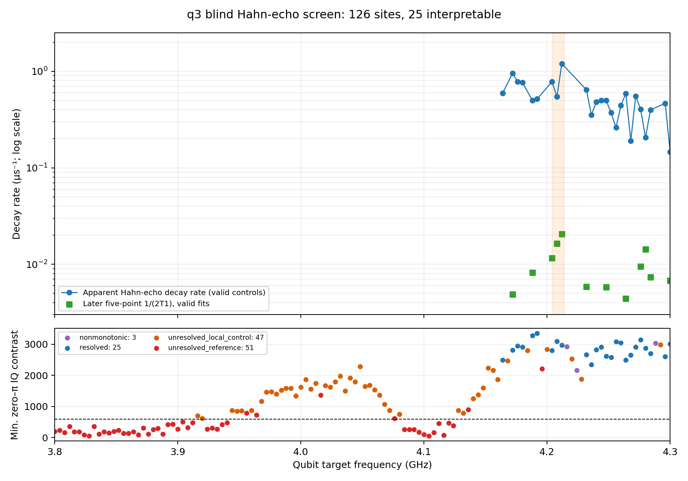

`TLSEchoFocusedTrace` repeats fixed sites 4.200–4.220 GHz around that
lead, plus 4.232 and 4.284 GHz controls. Each site gets two reversed
blocks, seven echo delays from 0.15 to 2.6 us, and four final-pulse
phases per delay. Local one-pulse half/π/twice-π checks and phase cycles
before/after the echo test the fixed square-pulse calibration at each
frequency. Narrow five-point T1 scans before and after track any moving
loss line but do not select or gate the echo sites. The run saves every
shot's IQ and emits no custom progress messages.

```bash
git -c gc.auto=0 pull --ff-only origin tls-spectroscopy
python -u -m WorkingProjects.TLS_Spectroscopy.Client_modules.Runners.TLSEchoFocusedTrace --run
```

The eight-site focused run completed at
`q3_echo_focused_trace_20260930T001018Z_fdc72d98`. Only six of its 16
site-blocks passed every local check. The proposed 4.212-GHz peak did
not repeat: apparent seven-delay rates were 0.536 and 0.609/us, and the
2π response failed the local pulse gate in both blocks. The T1 loss
center moved from about 4.210 GHz in the pre-scan to 4.208 GHz in the
post-scan, so these data do not settle whether the defect itself has a
dephasing signature. The useful control site is **4.284 GHz**: both
reversed blocks passed the reference, one-pulse, and phase-circle gates,
with apparent rates 0.456 and 0.579/us. Those are encouraging but are
only two repeats; the first trace has a broad short-delay plateau.

Before another frequency map, validate the flux-ramp echo sequence at
that empirically control-valid **4.284-GHz** point.
`TLSEchoFocusedTrace --run --single-point`
runs four blocks with reversed delay/phase order, nine delays from 0.08
to 4 us, and 1600 IQ shots per phase. Each block brackets the trace with
zero/π IQ references, a one-pulse π/2 and 2π turnover check, and
two-pulse phase cycles. It repeats the 0.08-us three-pulse echo at the
end of the block to expose within-block drift. No T1 scout or site
selection runs. The manifest calls an echo repeatable only when at least
three blocks pass the controls, their rates agree within 25% coefficient
of variation, and the delay traces are close to exponential. This is a
diagnostic criterion, not proof of a microscopic dephasing mechanism.

```bash
git -c gc.auto=0 pull --ff-only origin tls-spectroscopy
python -u -m WorkingProjects.TLS_Spectroscopy.Client_modules.Runners.TLSEchoFocusedTrace --run --single-point
```

### Four-block single-point echo and local map, September 30

The completed single-point run was
`q3_echo_single_point_20260930T002056Z_296cd873`. It used the older
`720d7c2c` code and therefore measured **4.288 GHz**, before the
subsequent target change to 4.284 GHz reached the measurement PC. All
four blocks passed the bracketed IQ, one-pulse, two-pulse phase, and
repeated short-echo checks. Their direct, interpolated 1/e visibility
crossings were **2.70, 2.71, 2.81, and 2.50 us**. The 4-us visibility
was only 0.07–0.15 of the first-delay visibility in each block. The
phase-circle data and the repeated short-echo sentinels make this a
credible flux-ramp echo measurement at one frequency.

The manifest status `complete_echo_unresolved` comes from the old
single-exponential gate: two of four log-fit RMS values were 0.278 and
0.254, just above its 0.25 cutoff. The traces show an early plateau and
are not described well by one exponential; the fitted rates of
0.463–0.625/us should not be presented as a precise T2. The directly
measured 1/e crossing is more stable here. It is an **effective echo
visibility time**, which can contain T1 loss as well as dephasing; it
does not establish a TLS dephasing hotspot.

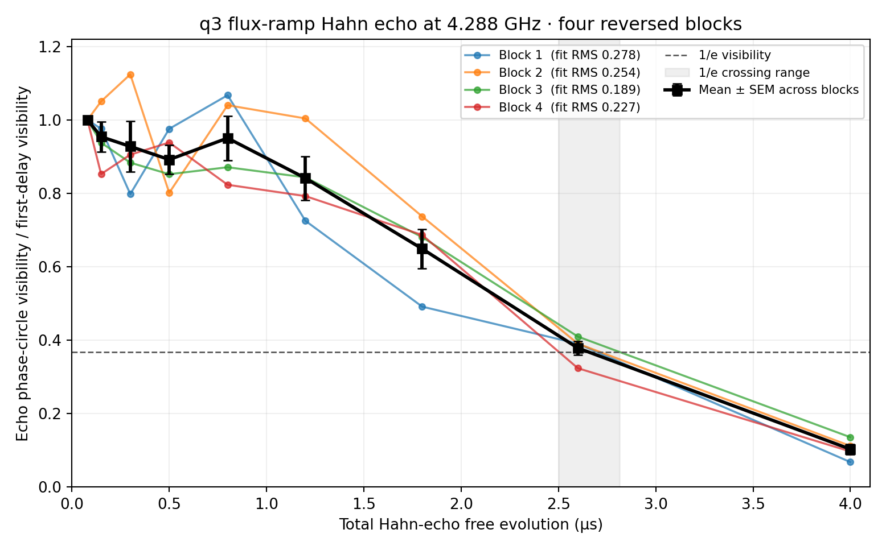

The next bounded experiment is a five-frequency local map at
4.280–4.296 GHz in 4-MHz steps, three reversed blocks, nine delays,
and 1200 shots per phase. Each site retains its own pulse and drift
controls. It reports the full four-phase trace and an interpolated 1/e
crossing when at least two blocks pass and agree within 20%; it does
not require an exponential shape. No T1 scout or loss-site selection
gates the map. This is a method-validation map over a small band, not
yet a claim about the 4.21-GHz candidate.

```bash
git -c gc.auto=0 pull --ff-only origin tls-spectroscopy
python -u -m WorkingProjects.TLS_Spectroscopy.Client_modules.Runners.TLSEchoFocusedTrace --run --local-map
```

### Completed local echo map, September 30

`q3_echo_local_map_20260930T042959Z_f78ae2f0` completed under
`3bfd4869`: all 15 planned site visits were acquired, 13 passed every
local control, and all five frequencies had at least two accepted repeats.
Independent recalculation from the saved NPZ IQ reproduces the saved
phase projections to 6e-16. No scout or loss-feature selection was used.

| Frequency (GHz) | Mean 1/e visibility time (us) | Repeat SD (us) | Accepted blocks |
| --- | --- | --- | --- |
| 4.280 | 1.113 | 0.039 | 3/3 |
| 4.284 | 1.238 | 0.176 | 3/3 |
| 4.288 | 1.243 | 0.114 | 3/3 |
| 4.292 | 1.347 | 0.101 | 2/3 |
| 4.296 | 1.268 | 0.107 | 2/3 |

These are interpolated times at which visibility reaches 1/e of the
0.08-us value, not fitted exponential or intrinsic pure-dephasing times.
The SD describes the observed repeats, not a full uncertainty budget.
For example, 800 bootstraps of consecutive 50-shot groups give conditional
shot-noise intervals of approximately [1.14, 1.58], [1.05, 1.25], and
[1.11, 1.54] us for the three 4.288-GHz visits. Those intervals include
uncertainty in the shared IQ references but do not bound slow calibration
drift or the interpolation model. The saved
`q3_echo_local_map_20260930_summary.json` includes all repeat values and
conditional intervals.

The two rejected visits were the final block at 4.292 and 4.296 GHz.
Their phase-circle maximum exceeded the existing upper calibration bound
(1.267 and 1.290 versus 1.25); the short-echo sentinel and one-pulse
checks still passed. They remain visible as rejected points in the plot.
No clearly localized dephasing minimum is established by this five-point,
16-MHz map; narrower or out-of-band features are not excluded.

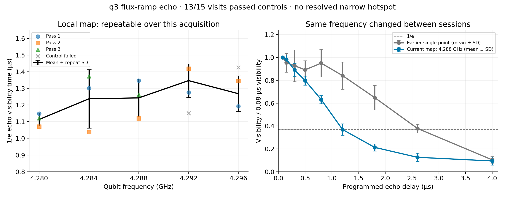

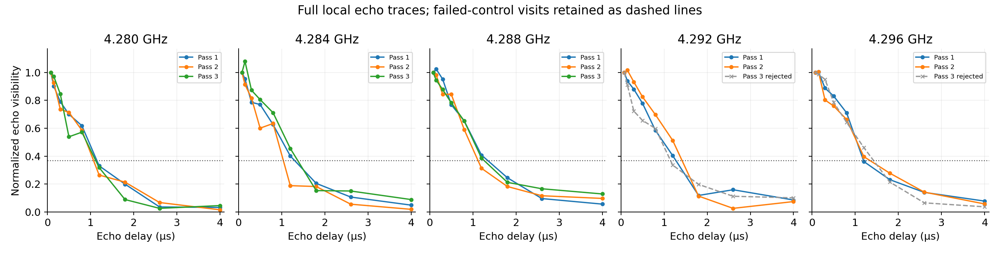

The larger difference is **between sessions**: 4.288 GHz changed from
2.50–2.81 us in the earlier single-point run to 1.12–1.35 us here, roughly
four hours later. A code audit found the same requested pulses, realized
frequency (4.2880150309 GHz), and correction SHA at that frequency.
The shorter decay is already evident by 1.2 us, before the first
within-window correction edge at 32 us of the target hold. Thus the
existing frozen-command approximation for longer echo windows does not
explain that early change. The older manifests do not save the effective
PC configuration or board clocks, so the cause cannot be assigned to
intrinsic qubit noise from the repository diff alone.

The next bounded diagnostic pairs Hahn-echo phase cycles with
ground/excited population contrasts at **4.288 GHz**, with the same
nominal total flux-visit and return duration at each delay. Delays stop
at 1.2 us so the science interval stays within the constant segment of
the pinned correction. It acquires three reversed blocks and retains
the pulse, readout, and short-echo checks. A delay-dependent population
contrast tests relaxation and transfer/readout effects alongside the
echo decay; its square-root ratio is a relaxation-only benchmark under
the usual two-level relaxation model, not an automatic pure-dephasing
measurement. The initial population pi pulse is longer than the first
echo pi/2 pulse, giving a fixed preparation-time offset; the comparison
is normalized to the shortest delay. Effective configurations, hardware
clock information, hashes of the executed pulse-source files, and
acquisition times are saved for the next run.
The benchmark follows the relaxation contribution
`Gamma_2 = Gamma_1/2 + Gamma_phi` described by
[Bylander et al.](https://arxiv.org/html/1101.4707v1); using it here assumes
stationary two-level population relaxation and stable readout transfer.
The 1120-test `tests/` suite passes, including an offline execution of all
144 planned acquisitions and metadata writes. The pinned correction is
constant at coefficient 1.0221692712219028 over 30.5–31.9107 us.

```bash
git -c gc.auto=0 pull --ff-only origin tls-spectroscopy
python -u -m WorkingProjects.TLS_Spectroscopy.Client_modules.Runners.TLSEchoFocusedTrace --run --population-check
```

### Population contrast survives while echo decays, September 30

`q3_echo_population_check_20260930T045711Z_c3a869fd`, acquired under
`2862e968`, completed all 144 arms (1600 IQ records each). All three
blocks passed the bracketed IQ, one-pulse turnover, two-pulse phase,
and repeated short-echo controls. Recalculation from the raw NPZ files
reproduces the saved projections within 4e-16. The five executed source
hashes agree with this checkout after accounting for Windows CRLF.
The saved board clocks are 430.08 MHz for the tProcessor and both used
generators. Each echo and population pair used the same requested flux
visit and correction.

At the 1.2-us programmed delay, relative to 0.08 us:

| Block | Echo visibility ratio | Population contrast ratio | Relaxation-only echo benchmark |
| --- | --- | --- | --- |
| 1 | 0.392 | 1.002 | 1.001 |
| 2 | 0.409 | 1.001 | 1.001 |
| 3 | 0.358 | 0.816 | 0.904 |

The mean echo ratio is **0.386**, versus a mean square-root population
benchmark of **0.968**. A 2000-draw bootstrap of consecutive 50-shot
IQ groups, including the shared bracket references, gives conditional
95% intervals [0.344, 0.434] and [0.943, 0.995], respectively. These are
within-arm sampling intervals, not bounds on between-arm drift or
systematic errors. Repeat 2 has a visibly different intermediate-delay
shape; do not fit all three curves with a single precise exponential.

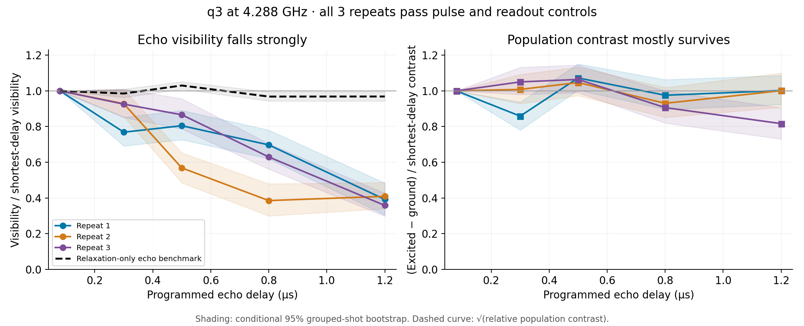

This is useful evidence: stationary two-level energy relaxation alone
cannot account for the observed echo attenuation. It supports continuing
the phase-coherence investigation. The population controls do not contain
the middle pi pulse and therefore do not exclude rotation errors,
pulse-induced leakage/loss, or coherent exchange. This is not yet an
intrinsic pure-dephasing rate or a TLS-specific hotspot. Linear IQ
contrast ratios slightly above one are estimator fluctuations and should
not be interpreted as literal probabilities above one. The horizontal
axis is the programmed added echo delay; legacy finite pulses/guards
add approximately 0.1557 us to the first-to-last pi/2 center separation,
with a few additional nanoseconds of clock rounding.

### Matched-time refocusing comparison at 4.288 GHz

The next bounded run stays at the same validated frequency and compares:

- Hahn X: X pi/2, X pi at the middle, analysis pi/2.
- Hahn Y: X pi/2, Y pi at the middle, analysis pi/2.
- CPMG2 Y: X pi/2, Y pi at one-quarter and three-quarters, analysis pi/2.

Every analysis pulse cycles through 0/90/180/270 degrees. Comparing
Hahn X with Hahn Y tests the pulse-axis dependence; comparing Hahn Y
with CPMG2 Y tests an extra refocusing pulse without changing that axis.
This follows the pulse-control motivation in
[Bylander et al.](https://arxiv.org/html/1101.4707v1), without assuming
its noise model applies to q3.

`TLSEchoFocusedTrace --run --refocus-check` uses three blocks of 1600
shots per arm, interleaves the three sequences at every phase/time, rotates
their acquisition order between blocks, and reverses delay/phase order in
the middle block. Each block retains the readout/pulse checks and repeats
the shortest phase circle for **each** sequence. The expected fixed
180-degree phase difference between Hahn X and the Y sequences is not a
drift failure: sentinels compare each sequence only with itself.

The new standalone pulse builder accounts for finite pulse widths on the
actual board clock. Realized first-to-last pi/2 center separations are
0.353423, 0.455729, 0.651042, 0.948661 and 1.348586 us. The pi/2 and pi
pulses are 19 and 39 ticks; the final guard is four ticks. All three
sequences have identical start/end times and corrected flux envelopes.
The smallest CPMG gaps are 9/37/9 ticks, safely positive. The longest
science window is 1.402065 us and remains on the constant correction
segment before the 32-us edge. Per-arm metadata includes realized pulse
starts, centers, widths, gaps, phases and flux-window timing.

Analyze absolute visibility and early-normalized curves together; the
latter alone could conceal an extra-pulse penalty. A repeatable CPMG2
improvement with valid controls would support recoverable phase contrast,
while pulse errors and deterministic phase evolution would still need
consideration. It is a test toward a trustworthy local T2 map, not a
replacement of Hahn T2 by a different filter's decay time. There is no
T1 scout, loss-site gate, or custom progress output. The production TLS
and active-reset code are unchanged.

```bash
git -c gc.auto=0 pull --ff-only origin tls-spectroscopy
python -u -m WorkingProjects.TLS_Spectroscopy.Client_modules.Runners.TLSEchoFocusedTrace --run --refocus-check
```

Verification before release: **1173 tests passed** in `tests/`, including
the full 258-acquisition offline refocusing run and checks that legacy
population mode still acquires its 144 arms. An independent audit also
compiled all 15 sequence/time combinations with the real resident parent,
saved board configuration and pinned QICK 0.2.133 source. That temporary
local compile required a NumPy-2 compatibility cast inside the downloaded
QICK source; no QICK or measurement-PC dependency was changed. The
compiled elapsed values match the timing report. No hardware was accessed
from the development machine.

### Two refocusing pulses preserve more contrast, September 30

`q3_echo_refocus_check_20260930T051540Z_5bf26954` completed all 258
acquisitions under `27e6db7d`, with 1600 records per arm. Every sequence
passed its controls in every block. Independent raw-IQ recalculation
agrees with the saved phase projections to floating-point precision.
The six source hashes match the saved Windows files after CRLF conversion.

At the longest realized center-to-center elapsed time, **1.348586 us**:

| Block | Hahn X, normalized | Hahn Y, normalized | CPMG2 Y, normalized |
| --- | --- | --- | --- |
| 1 | 0.347 | 0.437 | 0.787 |
| 2 | 0.444 | 0.457 | 0.632 |
| 3 | 0.476 | 0.434 | 0.663 |
| Mean | 0.422 | 0.443 | 0.694 |

The CPMG2 benefit remains in absolute visibility: means are **0.685**
for CPMG2, **0.386** for Hahn Y and **0.389** for Hahn X. Changing the
single refocusing pulse from X to Y does not explain the endpoint gain.
A 2000-draw bootstrap of consecutive 50-shot groups, including bracket
reference uncertainty, gives a conditional 95% interval **[0.189, 0.313]**
for the mean normalized CPMG2-minus-Hahn-Y gain. Each individual block's
interval is positive: [0.237, 0.472], [0.076, 0.276], [0.127, 0.324].
These quantify sampling uncertainty; they do not include slow drift or
systematic pulse/calibration errors. The intermediate 0.65-us point does
not show a consistent normalized benefit, so do not describe the gain as
uniform at every elapsed time.

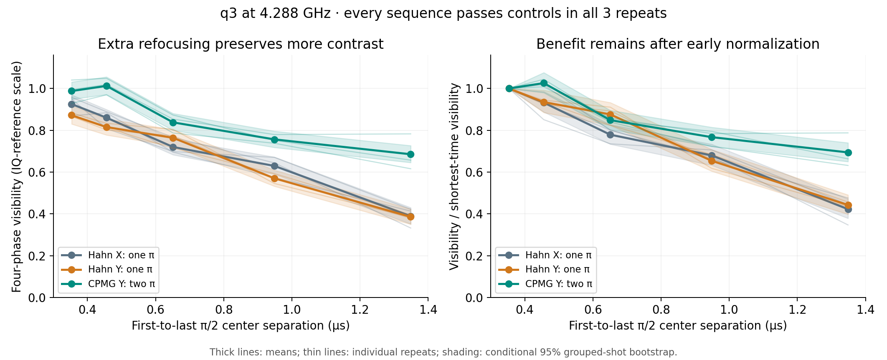

This establishes a repeatable recovery of phase contrast with an extra
refocusing pulse. It is a positive control result for the flux-ramp
coherence program. It does **not** yet identify a TLS dephasing hotspot,
a stochastic-noise mechanism, or a numerical CPMG T2. Finite pulse errors,
deterministic detuning and the extra driven interval remain possible
contributors. Some phase-circle centers/opposite-phase sums move, and
projected visibility can exceed one on the IQ-reference scale. Preserve
raw contrasts and controls rather than treating those values as calibrated
absolute populations. CPMG2 has not reached 1/e within this short window.

### Extend the single-point decay before returning to the local map

`TLSEchoFocusedTrace --run --refocus-decay` keeps the validated 4.288-GHz
point and compares Hahn Y with CPMG2 Y at requested elapsed times
**0.35, 0.65, 0.95, 1.35, 1.8, 2.4, 3.2 and 4.2 us**. Three blocks,
1600 shots per arm, four analysis phases, reversed delay order and
interleaved sequences remain. The purpose is to bracket each decay and
measure its shape before applying the protocol over a narrow frequency
interval. No T1 scout or loss-site selection runs.

The longer window crosses native correction edges at 32 and 34 us.
The new opt-in builder therefore queues the **entire corrected flux
waveform** while microwave pulses run at explicit clock timestamps.
It does not freeze the flux command during the long echo, and it does
not synchronize to the end of the queued flux tail between microwave
pulses. One common end synchronization precedes the corrected return.
Hahn and CPMG share the full flux envelope and elapsed time. Actual
microwave and flux-event timings are saved in every program configuration.
The original short builder and all older modes retain their behavior.

Two checks are embedded in the same acquisition:

- At 1.35 us, each phase/filter is immediately followed by the original
  short builder. A bridge gate checks old/new visibility ratios 0.65–1.35,
  phase disagreement at most 25 degrees and both visibilities at least
  0.20. This catches a playback-path difference without aborting or
  discarding the remaining measurements.
- At the longest hold, an adjacent pi/2 pair ends at exactly the same
  final-pulse time as the science sequence. Its phase circle checks
  whether the projection pulse remains usable later in the flux visit.
  The standard phase-circle gate applies; a failed late control marks the
  long-trace interpretation unresolved while preserving all raw IQ.

There are 294 acquisitions, normally about five to ten minutes. The
runner adds no custom progress output. Production spectroscopy and active
reset code are unchanged.

```bash
git -c gc.auto=0 pull --ff-only origin tls-spectroscopy
python -u -m WorkingProjects.TLS_Spectroscopy.Client_modules.Runners.TLSEchoFocusedTrace --run --refocus-decay
```

Release verification: **1213 tests passed** in `tests/`, including the
294-acquisition offline run, legacy-mode regression coverage, correction
edges during the microwave train, matched envelopes, and short-builder
waveform equivalence. All 68 new science/late-control programs compiled
against the saved board using the pinned QICK source (460–479 instructions).
The independent review found no blocking issue. The overlap thresholds are
screening criteria; analyze the overlap's raw-IQ uncertainty before claiming
quantitative equivalence with the older playback implementation.

### Extended echoes reach 1/e reproducibly, September 30

`q3_echo_refocus_decay_20260930T053227Z_3ce8cb27` completed all 294
acquisitions under `5be8bae2`, 1600 records per arm, in about 5m19s.
Every raw array is finite, all six saved source hashes match after
Windows CRLF conversion, and independent raw-IQ projections reproduce
the saved values to floating-point precision. Hahn and CPMG share the
realized elapsed times and full flux envelope through the 32/34-us
correction edges. All three late-pulse phase controls passed, with
visibility **0.958, 0.989 and 1.004** on the IQ-reference scale.

Both curves now cross 1/e of their first measured visibility. The
horizontal coordinate is the actual separation of the first and last
pi/2 centers; the reference point is **0.353423 us**.

| Block | Hahn crossing (us) | Hahn accepted? | CPMG2 crossing (us) | CPMG2 accepted? |
| --- | --- | --- | --- | --- |
| 1 | 1.343 | No: bridge mismatch | 2.466 | Yes |
| 2 | 1.441 | Yes | 2.532 | Yes |
| 3 | 1.457 | Yes | 2.539 | Yes |

Accepted means are **1.449 us for Hahn** and **2.512 us for CPMG2**.
These are interpolated elapsed coordinates where visibility is 1/e of
the 0.353-us reference, not fitted exponential T2 or intrinsic dephasing
times. Measured from that reference point, the corresponding intervals
are 1.095 and 2.159 us. Do not quote their ratio as an established
intrinsic-T2 improvement. The separation supports the earlier observation
that the extra refocusing pulse preserves measurable coherence contrast.

A 2000-draw bootstrap of consecutive 50-shot IQ groups, including shared
bracket references, gives conditional 95% crossing intervals of
[1.299, 1.589] and [1.300, 1.625] us for the two accepted Hahn blocks;
CPMG2 intervals are [2.242, 2.694], [2.275, 2.849] and [2.296, 2.753] us.
These capture within-arm sampling uncertainty, not slow drift, systematic
errors, or uncertainty in linear interpolation between sampled times.
The close repeat means must not be mistaken for a percent-level total
error bar. Phase-cycle magnitudes acquire a positive noise floor near
zero; the 1/e crossings occur well above that floor.

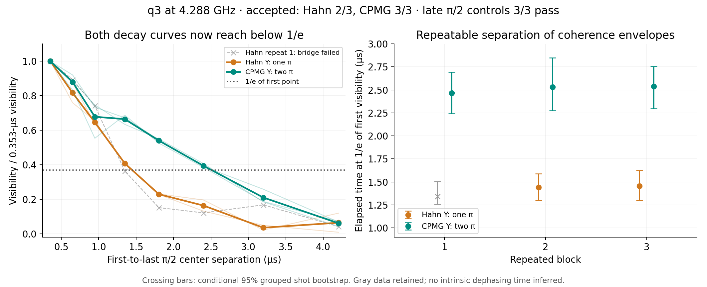

The first Hahn block remains excluded under the predeclared bridge gate.
At the 1.35-us overlap, the old/new visibility ratio was **1.400**, beyond
the 1.35 limit. The raw visibility difference is +0.118 with conditional
95% interval [+0.016, +0.224], so this is not dismissed as a harmless
threshold crossing. The other two Hahn bridges and all three CPMG bridges
passed; their conditional difference intervals include zero. The failed
trace is retained as gray dashed data. No gate was relaxed and no new
calibration-only run is required to use the accepted repeats.

### Return to a controlled local frequency map

`TLSEchoFocusedTrace --run --refocus-map` applies these same full Hahn-Y
and CPMG2-Y decays at **4.280, 4.284, 4.288, 4.292 and 4.296 GHz**.
This is a fixed grid with no T1 scout or loss-site selection. Three blocks
reverse the site/delay/phase order and retain 1600 records per arm. All
readout, pulse, short-sentinel, legacy-overlap and late-projection checks
remain local to each site. Failed controls mark the affected sequence
unresolved and retain the data while the rest of the map continues.

The map takes approximately **25–30 minutes**: 15 site-blocks and 1470
acquisitions. It saves a separate raw NPZ for each site/block and a unique
program-configuration file for every arm, including frequency in the
filename. This prevents the single-site configuration names from
silently overwriting earlier frequencies. The final assessment reports
accepted counts separately for each frequency and sequence.

The goal is a trustworthy narrow-band coherence-versus-frequency plot,
with full decay shapes and uncertainty, before expanding the frequency
range or claiming a dephasing hotspot. No custom terminal progress
messages are added. Production spectroscopy and active reset are unchanged.

```bash
git -c gc.auto=0 pull --ff-only origin tls-spectroscopy
python -u -m WorkingProjects.TLS_Spectroscopy.Client_modules.Runners.TLSEchoFocusedTrace --run --refocus-map
```

Release verification: **1215 tests passed** across `tests/` (34 focused
runner tests, including all 1470 simulated map acquisitions and unique
configuration provenance, plus the remaining 1181 tests). The independent
review found no blocking issue. No pulse-builder, production spectroscopy,
or active-reset changes were needed for this map extension.

### Completed paired coherence map, September 30

`q3_echo_refocus_map_20260930T060121Z_bf0d77fa` completed under
`8d4bf73c` in **28m30s**. All **1470 acquisitions** contain 1600 records;
all **15 site visits and 30 decay traces** passed the unchanged controls.
No trace was excluded. There are 1470 unique saved program configurations.
All six executed source hashes match the repository after Windows CRLF
normalization. Independent raw-IQ reanalysis reproduces the saved phase
projections to **4.5e-16**.

The elapsed times, science windows, total visits and full flux waveform
match between Hahn and CPMG in every one of 480 paired science cases.
Readout axes remain stable (cosine >=0.9985), pre/post phase-circle drift
is at most 8.04 degrees, pi/2 responses span 0.460–0.601, 2pi responses
span -0.018–0.098, and late-pulse visibility spans 0.826–1.063.

| Frequency (GHz) | Hahn crossing (us), mean ± repeat SD | CPMG2 crossing (us), mean ± repeat SD |
| --- | --- | --- |
| 4.280 | 1.378 ± 0.092 | 2.523 ± 0.037 |
| 4.284 | 1.393 ± 0.061 | 2.529 ± 0.164 |
| 4.288 | 1.453 ± 0.105 | 2.493 ± 0.136 |
| 4.292 | 1.433 ± 0.087 | 2.392 ± 0.153 |
| 4.296 | 1.517 ± 0.077 | 2.630 ± 0.192 |

As before, these are elapsed pi/2-center coordinates where the measured
visibility falls to **1/e of its 0.353423-us reference**, not exponential
fit parameters or intrinsic dephasing times. The reported SD describes
three repeats. The accompanying JSON also contains conditional 95%
intervals from 1600 grouped-shot bootstrap draws (50 shots per group),
including the shared IQ references; these exclude drift/systematic and
interpolation-model uncertainty. A small repeat SD alone does not imply
an equally small total uncertainty.

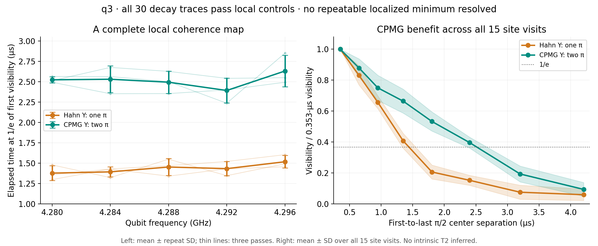

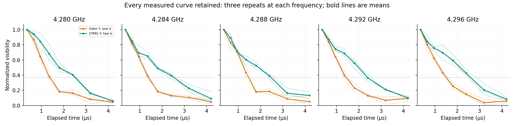

**Result:** this is a usable local coherence map, with a repeatable CPMG
benefit across the band. Every individual CPMG crossing exceeds its paired
Hahn crossing. At 1.8 us, average normalized visibility is approximately
0.206 for Hahn and 0.533 for CPMG2; the absolute CPMG visibility is higher
in all 15 visits. No convincing localized dephasing hotspot is resolved
on this 4-MHz grid within this band. Narrower or out-of-band features are
not excluded, and the result does not identify a TLS-specific mechanism.

The apparent CPMG dip at 4.292 GHz is not consistent across repeats. The
mean of its immediate neighbors minus its crossing is **0.440, 0.047,
and 0.024 us** across the three blocks. It is driven mainly by the first
pass, not a repeatable isolated line. Do not turn that shallow average dip
into a feature claim.

A calibration limitation remains visible despite all gates passing:
the legacy Hahn bridge is systematically higher than the concurrent
builder by an average **0.0308 visibility units** (site-visit SEM 0.0091;
12/15 differences positive). The CPMG bridge offset averages 0.0023
(SEM 0.0170). Therefore the builders are not established as quantitatively
interchangeable. The map itself uses the concurrent builder consistently
at every frequency; keep the legacy bridge as an explicit diagnostic and
do not describe these measurements as intrinsic Gamma_phi.

### Adjacent lower-frequency map with an overlapping reference

The next bounded continuation is the same full protocol at **4.260,
4.264, 4.268, 4.272 and 4.276 GHz**, with **4.288 GHz** repeated as an
anchor. The archival blind square-echo scan had usable phase controls at
all sampled frequencies from 4.240–4.280 GHz, supporting this modest
extension. The new run retains its own pulse and late-projection checks
rather than assuming that older calibration remains valid.

Use `--refocus-map --lower-band`. Three blocks, both Hahn/CPMG curves,
eight delays and 1600 shots per arm are unchanged: **18 site visits and
1764 acquisitions**, approximately **35 minutes**. The fixed grid does
not use T1 or loss-site selection. A failed local control still preserves
all data and lets the remaining points run. The 4.288-GHz overlap allows
comparison with the completed map before combining sessions. There are
no pulse-builder or production-pipeline changes and no new terminal
progress messages.

```bash
git -c gc.auto=0 pull --ff-only origin tls-spectroscopy
python -u -m WorkingProjects.TLS_Spectroscopy.Client_modules.Runners.TLSEchoFocusedTrace --run --refocus-map --lower-band
```

Release verification: **1224 tests passed** across `tests/`: 43 focused
runner tests (including complete 1470- and 1764-acquisition map simulations)
and 1181 remaining tests. The lower-band plan was also inspected through
the CLI. Independent review found no blocking issue; the original map
grid and all acquisition schedules remain unchanged unless the new option
is selected.

### First dense few-point Hahn screen, September 30

The user requested a 50-MHz demonstration before expanding the fast screen.
`TLSEchoFewPointMap` covers **4.300 down to 4.250 GHz in 0.5-MHz steps**
(101 frequencies), overlapping the successful full map. It deliberately
measures a screening contrast, not a fitted or intrinsic T2. No T1 scout
or loss-site selection is performed.

At every frequency, one hardware cycle interleaves short Hahn Y
(0.35 us), longer Hahn Y (1.35 us), and a late adjacent-pi/2 control
(at the long echo's final-pulse time), at final phases 0/90/180/270 degrees.
There are **200 cycles, 12 subshots per cycle**, each independently
returned through the complete 40-us correction and passively relaxed
for 500 us. The physics/timing builder is the same concurrent-correction
builder used for the successful full map. Batching removes repeated
program uploads; it does not shorten the physical relaxation.

Expected runtime is **4–7 minutes**, including reference/control overhead;
this is an estimate to verify on the first hardware run. The 101-point
science pass plus three anchors, the 12-arm individual comparison, and
24 reference acquisitions total **261600 readouts in 140 acquisitions**.
Every IQ record and exact compiled configuration is saved. Names contain
integer kHz and a site index so adjacent half-MHz points cannot overwrite
one another. The normal grid announcement now receives the actual
0.5-MHz step. No custom progress prints are introduced.

The first demonstration includes:

- Ground/pi reference brackets at 4.288 GHz, 400 shots per state, before
  and after each ten-point group; pooled references have an independent
  axis/center stability check.
- Repeated batched 4.288-GHz anchors before, halfway through, and after
  the scan.
- All twelve individual-program measurements at the initial anchor,
  to compare directly with the batched acquisition on current hardware.
- Short-echo and late-control contrast/SNR checks at every frequency;
  non-sinusoidal four-phase records are flagged. A low long-echo amplitude
  is a possible signal and is not itself a rejection criterion.

The primary map is long/short four-phase visibility, with a moment
correction for the positive magnitude noise floor. Raw ratios remain
available. Four-phase information prevents coherent phase rotation from
masquerading as lost visibility. Shared-cycle and shared-reference
bootstrap intervals quantify conditional sampling noise only; they do
not establish stability or control the false-positive rate across the
whole scan. Failed controls retain raw data and mark the point unresolved;
reference drift also masks the accepted ratio. The scan continues past
these local failures. An acquisition or hardware exception still stops
the run and saves a failed manifest. Complete cycles recovered from a
stream timeout are also archived before propagating the exception.

Short/late controls do not fully calibrate the refocusing pi pulse, or
separate T1 from dephasing. Any dip needs repetition and full curves.
Before expanding, inspect the batched/individual comparison, repeated
anchors, control coverage, and overlap with 4.280–4.296 GHz. Completion
alone is not a claim that the fast method has been demonstrated.

Offline compilation against the actual saved QICK 0.2.133 board and
correction at 4.250, 4.288 and 4.300 GHz uses **4920–4952 of 8192
instructions**. Independent review found all 36 batched subshot flux,
microwave and readout instruction sequences identical to independently
compiled single-arm programs. Each cycle writes 24 IQ words. Both stream
banks fit in 4096-word DMem: 84 cycles per bank and a final 32 cycles.
This validates compilation/scheduling, not yet hardware performance.

Only the three new experimental few-point modules, their tests and this
notebook are changed. Production spectroscopy and active reset are unchanged.

```bash
git -c gc.auto=0 pull --ff-only origin tls-spectroscopy
python -u -m WorkingProjects.TLS_Spectroscopy.Client_modules.Runners.TLSEchoFewPointMap --run
```

Release verification: the complete suite passed **1256 tests**. The final
seven-test runner recheck also passed after adding recovery of timeout
records (one new test), giving **1257 distinct passing tests** across the
suite and focused verification. Independent review additionally exercised
the real session/build path at all 101 DAC settings; maximum frequency
rounding error was 0.017645 MHz. Production files remain unchanged.

### Completed first fast screen and terminal progress, September 30

`q3_echo_few_point_20260930T071413Z_5ff77c82` completed under `eeca9d4f`
in **199.083 seconds (3m19s)**: all 101 frequencies and all 140
acquisitions were saved. Raw shapes were independently verified: 104
arrays of 200x12 IQ values, 24 reference arrays of 400 values, and 12
individual comparison arrays of 200 values. All seven hardware-source
hashes match the recorded commit after Windows newline normalization.

**100/101 frequencies passed the local controls.** Only 4.250 GHz failed
the short-echo visibility threshold; no reference bracket failed its
stability check. This demonstrates a minutes-scale dense contrast screen
with broad local-control coverage, not an intrinsic T2 measurement.

The three 4.288-GHz anchor ratios are 0.425, 0.410, and 0.380, with
conditional 95% intervals [0.207, 0.749], [0.195, 0.618], and
[0.187, 0.596]. They agree within sampling uncertainty. The current
individual-program comparison is 0.238 [0.000, 0.498], also compatible
with the batched anchor at this precision. A previous incomplete attempt
(`070611Z_8313cc75`) had a discrepant long-echo comparison; do not treat
one compatible comparison as a precision equivalence calibration.

The two earlier few-point attempts saved no map: one recorded
KeyboardInterrupt and the next a zero-progress timeout. The saved
exception alone does not establish who or what generated the interrupt;
the user explicitly reported not pressing Ctrl+C. The newer completed
run is the result to analyze.

The user requested a progress bar and ETA for future runs, superseding
the earlier fully quiet preference. `TLSEchoFewPointMap` now shows one
updating progress line with acquisition stage, completed frequencies,
elapsed time and ETA. Progress is weighted by the actual **261600
readouts**, so short references and full 12-condition batches are not
counted as equal-duration work. Completion is labeled only after the
final manifest is saved; failures close the display as stopped.
`--quiet` restores the prior display behavior. Future experimental
runners should use a concise progress/ETA display without per-condition
log messages. No pulse, timing, calibration or analysis settings changed
for this display update.

The normal run command is unchanged after pulling the branch. The
already-completed measurement does not need repeating to enable the bar.

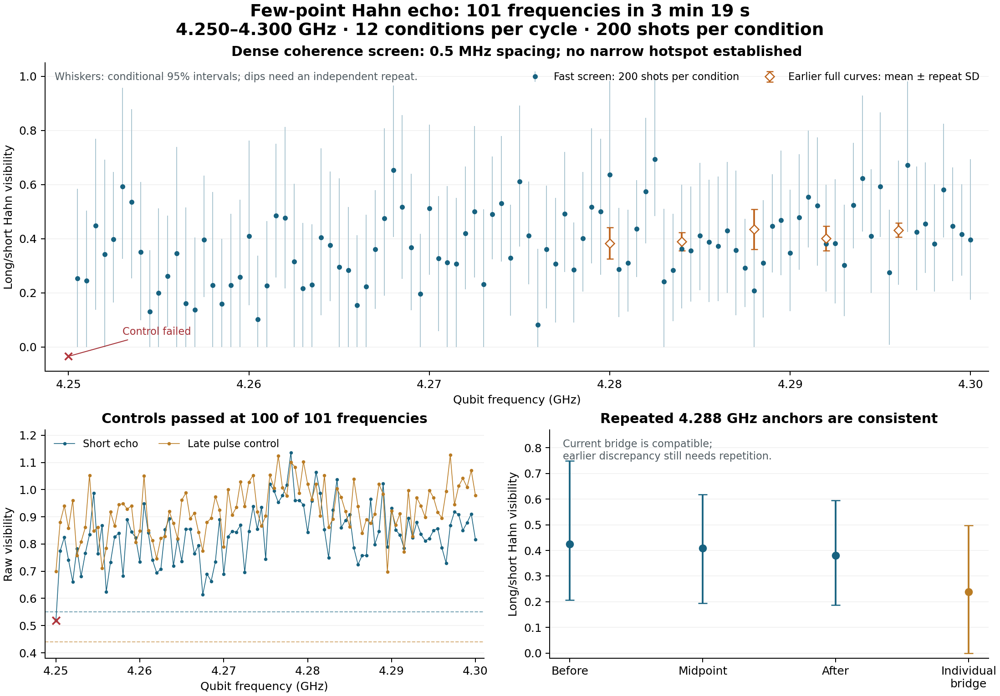

The map's individual points remain noisy: median conditional ratio
standard error is 0.118, and median 95% interval width is 0.464. No
convincing narrow hotspot is established. The low point at 4.276 GHz
is not compelling after screening 101 frequencies. A broad lower-frequency
reduction accompanies lower short/late control contrast; frequency and
time are confounded in this descending scan. The clean next scientific
check is a reversed repeat of the same band before expansion.

The detailed JSON records the raw checks, intervals, exploratory
background comparison and its limitations. Current bridge difference
(individual minus batched) is -0.186 with shared-reference bootstrap
95% interval [-0.544,+0.158]. Raw visibility reconstruction agrees with
the saved analysis to 3.33e-16.

Progress-display verification: **1257 tests passed** in the complete
`tests/` suite, including success/failure progress accounting. An offline
terminal check confirmed the elapsed/ETA display.

## 2026-09-30: finite q3 quasiparticle-pumping screen

The user chose experiment #2 from the pulse-sequence shortlist and explicitly
specified **q3**, after stopping q4's continuous T1 acquisition. The new
`Q3QuasiparticlePumping` runner has independent q3 settings: 4367.292 MHz,
Gaussian sigma 0.2 us, pi gain 13500, readout 6933.026 MHz, flux park -25146.
The park pi agrees with the September 29 park calibration documented above.
It does not import `initialize.py` or local overrides, so q4 settings cannot
silently enter this experiment. Fresh readout/reset calibration is mandatory.
No production runner, shared active-reset code, q4 runner, or initialization
file changes are part of this implementation.

The question is whether repeated excitation and relaxation changes q3's
subsequent relaxation, inspired by [quasiparticle pumping](https://arxiv.org/abs/1612.08462).
It is a conditioning screen at park, not a TLS scan or an identification of
quasiparticles. There are five arms: matched idle, 4 and 20 spaced pi pulses,
and 4 and 20 pulses grouped into adjacent +pi/-pi pairs. Every arm occupies
601 us. Spaced pulses start 30 us apart; small trains use the final four slots
of the twenty-slot window. Pair controls have the same envelope, gain, pulse
count and final pulse time as their corresponding train, with a 40-ns gap
between adjacent envelopes. They test microwave exposure with much less
qubit excitation; their cancellation is not assumed perfect.

Each cell is: 2 ms passive washout; readout plus active reset; 10 us ringdown;
conditioning; readout plus active reset; 10 us ringdown; zero-gain or pi
preparation; variable delay; readout plus reset. Both preparations consume
the same envelope duration. q3 stays at park throughout. All ten arm/state
combinations are interleaved within each hardware cycle. Four blocks change
their order, and delays are permuted within each block. The nine delays are
0.1, 2, 5, 15, 30, 60, 120, 250 and 500 us. Each block has 250 shots per
arm/state/delay: 1000 pooled shots, 90,000 probes total. Expected wall time is
roughly 5–10 minutes, including fresh pre/post calibration and host overhead.
A single normal progress bar reports elapsed time and ETA.

Raw accumulator IQ and all three reset records are saved for every cell,
alongside board configuration, effective config, source snapshots/hashes,
compiled memory checks, condition order and acquisition timestamps. Partial
timeout data are retained when available. Acquisition errors stop the run;
Ctrl+C aborts hardware before any NAS save. Calibration and measurement both
explicitly select q3's verified `official_wait_all` feedback timing, pre-readout
sync, no flush readout and 10-us accumulator wait.

Analysis retains separate g/e traces and fits their difference with a free
amplitude. This avoids interpreting an initial-population change as a T1
change. A simple exponential is only a descriptor, with uncertainty and shape
diagnostics. The model-free comparison is the area under the contrast curve
normalized at 0.1 us, paired by block against idle and equal-count controls;
its uncertainty includes normalization covariance and uses the larger of
shot noise and observed block scatter. Raw curves and `relaxation.png` remain
available if a fit is invalid. Reclassification using the post-run calibration
is saved separately as a readout-drift sensitivity check.

The main limitation is the feedback between conditioning and probing: its
readouts, extra pi pulses and arm-dependent latency can change the bath or
erase a short-lived effect. The conditioned-stage reset telemetry must be
examined before attributing a positive result to quasiparticles. A null only
constrains an effect surviving this sequence. Initial short-delay contrast,
paired-control excitation, block consistency, and pre/post readout stability
must also be checked before interpreting the pooled comparison.

Offline verification used QICK 0.2.133 with the saved q3 board and actual q3
classifier coefficients. All four condition orders compile to 3635/8192
instruction words; drive envelopes use 11008/65536 samples and flux envelopes
55040/65536. The actual loader accepted their addressed ranges in an offline
memory check. A complete synthetic run exercised all 90,000 probes, 24-word
cell decoding across stream-bank boundaries, NAS-format files, progress
accounting, pre/post classification and plotting. It recovered injected
50-us control and 100-us conditioned decays as 49.90 and 99.63 us. These are
software checks, not hardware measurements of this new sequence.

The complete regression suite passed: **1288 tests**, including 11 new tests
for q3 settings, matched schedules, ordering, decoding, analysis and abort/save
ordering. Independent review found the delayed-abort issue described above;
the local runner now stops hardware immediately before error persistence.

After stopping q4, run:

```bash
git -c gc.auto=0 pull --ff-only origin tls-spectroscopy
python -u -m WorkingProjects.TLS_Spectroscopy.Client_modules.Runners.Q3QuasiparticlePumping --run
```

### Completed first pumping screen and bounded feedback-free follow-up

NAS session `q3_quasiparticle_pumping_20260930T193046Z_0a816d94`, commit
`86cca7da`, completed all 36 acquisitions and 90,000 probes in about five
minutes. Both saved runner sources match the local commit after newline
normalization. Every raw array has shape (2500, 24), every terminal reset
status is confirmed-ground, and independent reclassification of all 90,000
records reproduces every saved probability exactly. Confirmed-ground is the
classifier's decision, not a claim of perfect physical preparation.

| Conditioning | Fitted decay time (us, 1 SE) |
| --- | --- |
| Idle | 102.4 ± 9.1 |
| 4 spaced pi pulses | 101.2 ± 10.5 |
| 4 paired pulses | 121.5 ± 11.6 |
| 20 spaced pi pulses | 103.7 ± 10.6 |
| 20 paired pulses | 115.4 ± 11.8 |

**No resolved relaxation improvement.** The block-paired normalized-area
effect for 20 pulses is +5.4 ± 16.1 us against idle, and −5.4 ± 16.8 us
against its equal-count paired control. Its signs reverse across the four
blocks. Post-calibration reanalysis gives idle 98.9 us and 20-pulse 102.8 us,
with the same null conclusion. Payload reference peak assignment fidelity was
0.784 before and 0.7835 after, below the earlier approximately 0.90 calibration
but stable across this run. The fits retain useful contrast and do not justify
discarding the result, nor do they tightly exclude a small improvement.

The stimulation was delivered: conditioned-stage classified excitation was
0.065 for idle, 0.262 after four spaced pulses and 0.308 after twenty, versus
0.133 and 0.144 for the paired controls. However, the ensuing reset averaged
1.13 pi pulses for idle and 2.17 for the twenty-pulse train; mean loop attempts
were 1.70 and 2.78, with 99th percentiles 24 and 28. Feedback therefore adds
different excitation/relaxation histories and delays before probing. At the
shortest probe delay, ground-prepared classified excitation was 0.172 for idle
and 0.230 after twenty pulses. This limits the claim to the complete sequence,
including feedback; it is not proof against quasiparticle pumping in general.

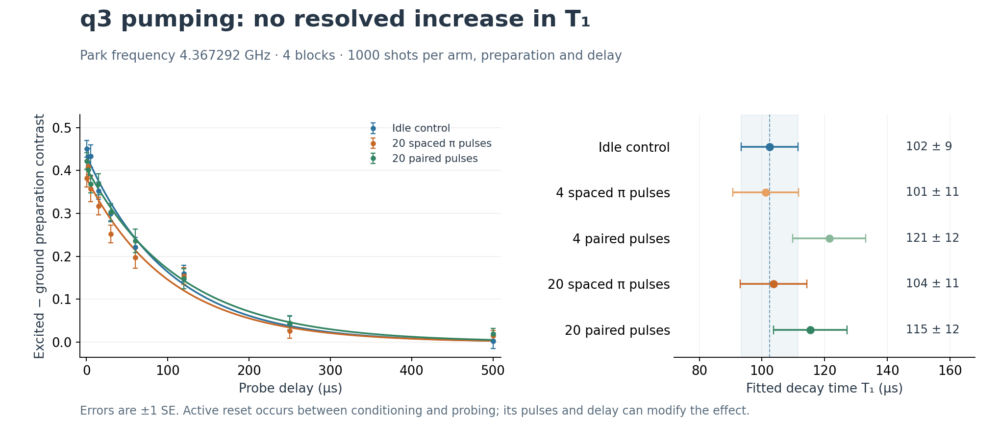

The follow-up `--feedback-free` mode directly tests this remaining sequence
confound. Each science cell has a 2000-us passive washout, the same 601-us
conditioning window, **50 us fixed quiet recovery**, no-pi or pi probe
preparation, the chosen delay, and one final readout. There is **no readout or
feedback anywhere between conditioning and probing**, and no feedback in any
science cell. The final conditioning pulse ends about 79.2 us before probe
preparation, including the train's existing trailing idle. This wait trades
some bath-memory sensitivity for recoverable pi/no-pi contrast; a null does
not constrain effects that disappear faster than this interval.

The labels `g`/`e` remain condition identifiers for file compatibility but in
this mode mean **no pi / pi**, not confirmed ground/excited states. Their
difference is fitted with free amplitude to accommodate residual qubit
excitation. Paired controls, interleaving, four blocks, nine delays, 1000 pooled
shots per condition, and pre/post readout-reference checks are retained.
Calibration still records both reference contexts for provenance, but only
payload discrimination is required (peak fidelity at least 0.70 and classified
reference contrast at least 0.30); unused reset thresholds cannot abort this
mode. Records contain two raw IQ words per probe, with no fabricated reset
telemetry. The default active-reset mode is retained unchanged in its pulse
sequence. Production reset, TLS scanning, q4 and initialization files remain
untouched.

Verification: **1292 tests passed**, including 15 pumping-runner tests.
Offline QICK compilation with the first run's actual classifier and the saved
q3 board uses 1255/8192 instruction words in all four orders. The verification
fails if any intermediate-record or reset-pulse emitter is called, and checks
exactly one IQ readout per cell. A full 90,000-probe synthetic acquisition
passes two-word stream-bank decoding, source/raw/summary saving, plotting and
pre/post reclassification. Independent review found no blocking issue; its
requested no-pi labeling is included in the plot and per-condition metadata.

```bash
git -c gc.auto=0 pull --ff-only origin tls-spectroscopy
python -u -m WorkingProjects.TLS_Spectroscopy.Client_modules.Runners.Q3QuasiparticlePumping --run --feedback-free
```

### Completed feedback-free pumping screen: no resolved benefit

NAS session `q3_quasiparticle_pumping_feedback_free_20260930T200556Z_8206de0f`,
commit `fabdf758`, completed all 36 acquisitions and 90,000 probes in 4 min
41 s. The saved plan confirms feedback-free mode, with 50 us fixed recovery
after the conditioning window and approximately 79.2 us from the final pump
pulse to probe preparation. Both saved sources match the committed runner
after newline normalization. All 36 raw arrays have shape (2500, 2).
Independent decoding and classification reproduce every saved probability
exactly; complete pre/post summaries reproduce within numerical fit tolerance.

| Conditioning | Fitted decay time (us, 1 SE) |
| --- | --- |
| Idle | 81.7 ± 3.5 |
| 4 spaced pi pulses | 80.9 ± 5.7 |
| 4 paired pulses | 78.1 ± 4.2 |
| 20 spaced pi pulses | 84.2 ± 7.4 |
| 20 paired pulses | 82.7 ± 4.7 |

Every fitted curve passes the runner's shape/precision checks. The fitted
amplitudes are free, so reduced initial contrast is not counted as faster
relaxation. The block-paired normalized-area differences also show no benefit:
four pulses minus idle is −4.0 ± 8.2 us, twenty minus idle is −7.7 ± 12.4 us,
and twenty minus its paired control is −6.7 ± 11.6 us. The twenty-pulse
comparisons change sign across blocks. Area differences are model-free curve
descriptors, not differences in fitted T1.

Payload reference peak fidelity is 0.898 before and 0.9045 after. Applying
the post-run classifier to all saved science IQ gives idle 77.1 ± 3.3 us,
four pulses 85.7 ± 6.1 us and twenty pulses 86.8 ± 8.2 us. The corresponding
twenty-minus-idle area difference is +2.7 ± 12.4 us: still unresolved. These
axis-dependent shifts are a sensitivity check, not additional independent
measurements. Do not pool the earlier active-reset run with this mode or
attribute the between-run change in baseline T1 to pumping.

At the shortest delay the classified no-pi excitation is 0.046 for idle,
0.214 after four spaced pulses, 0.218 after twenty, and 0.123/0.151 for the
paired controls. Conditioning therefore changes the starting population, but
its subsequent decay does not show a resolved rate change. These are
readout-floor-inclusive fractions; they do not by themselves establish bath
heating, quasiparticle generation or a calibrated thermodynamic temperature.
Pair cancellation is imperfect, as anticipated in the protocol.

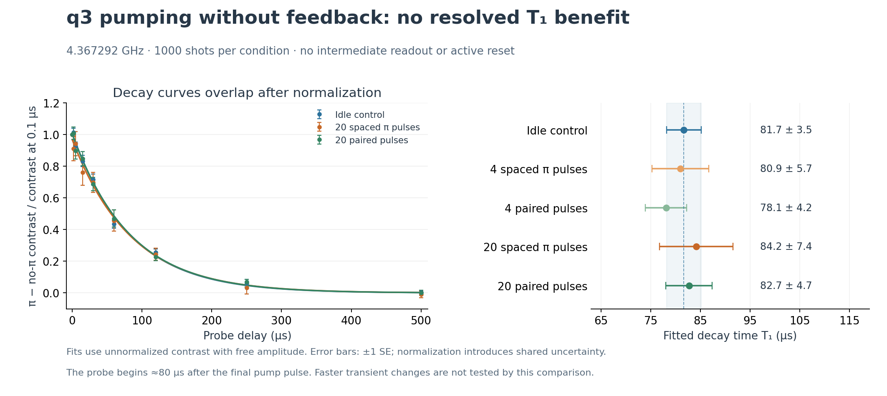

**Decision: stop this tested pumping protocol.** Two doses, paired exposure
controls and removal of intermediate feedback have produced no reproducible
T1 improvement. A further identical repeat is not justified by the current
signal. This conclusion applies to these pulse trains at q3 park and effects
surviving approximately 80 us; it does not exclude faster transient changes,
small effects below the present sensitivity, or quasiparticles in general.
No acquisition or shared production code changes accompany this analysis.

The local frozen analysis at
`~/.codex/visualizations/2026/09/30/q3-qp-feedback-free/` includes all raw
science records, source snapshots, calibration files, an executable
`analyze_result.py`, the audit JSON, and PNG/PDF plots. The plot was inspected
after rendering. Normalized-curve error bars include the shared-denominator
variance; exponential fitting uses the original unnormalized contrast.

### Next ranked experiment: controlled frequency noise across one loss feature

After closing the tested quasiparticle-pumping protocol, proceed to #3 in the
agreed sequence (#2 pumping, #3 controlled noise, #4 spin locking). The question
is whether the temporal structure of applied frequency noise changes the
loss profile beyond its programmed frequency exposure. This is an intervention
during the loss interaction; it does not require stored TLS population,
coherent qubit–TLS swaps, or a second qualified defect.

`TLSControlledNoise` first takes one ordinary passive 3.8–4.3 GHz five-point
scout at 2 MHz spacing and selects one loss site visible in both scan
directions. It then acquires a local comparison without further site-selection
gates: offsets −8, −4, −2, 0, +2, +4 and +8 MHz, plus the quieter scout point
at either −16 or +16 MHz. The latter is a comparison point, not a certified
defect-free background. The scout must show local loss contrast; absence of a
qualified site is recorded as a completed screen with no science acquisition,
without automatically repeating scouts. Modest subsequent line movement does
not abort the local scan; the off arm records its evolving profile.

Each science cell is:

1. Wait 1000 us at q3 park, then apply no pi or the calibrated park pi.
2. Step to the target with the pinned DC compensation and 0.55 us arrival/prehold.
3. Hold with off, slow, or fast frequency noise, using the same corrected DC
   samples in every arm and nominal excursions of ±4 MHz from the static flux
   curve. The two noise patterns have exactly equal positive/negative exposure
   and identical zero-valued boundary guards.
4. Execute the full corrected 40 us return and read out once at park.

There is no feedback or intermediate readout in the science sequence. Labels
`g`/`e` mean no-pi/pi preparations rather than heralded states. All six
pattern/preparation combinations are interleaved within a hardware shot;
ordering rotates between blocks. Eight balanced pseudorandom realizations
are used, each repeated for 500 shots per condition. This is a frozen-noise
ensemble, not a fresh noise trajectory on each shot. Sites and hold durations
are shuffled within blocks. On the saved 430.08 MHz generator fabric clock,
the chip widths are 37.202 ns and 297.619 ns, and the two total noise holds
(including guards) are 1.264881 us and 3.645833 us. All actual clocks, integer
gains, realized static frequencies, waveforms and compiler diagnostics are saved.

There are 128 programs and 384,000 science probes. The initial duration estimate
is 12–20 minutes including scout, calibration and NAS overhead. Apart from
ordinary calibration/scout output, the runner displays one progress bar with
elapsed time and ETA, without custom per-point experiment messages.

Analysis uses preparation contrast C = P(pi) − P(no pi), and reports the
finite-window rate log(Cshort/Clong)/(tlong−tshort). It is a descriptive decay
rate under each noise ensemble, not an assertion of exponential decay or an
intrinsic T1. Each rate and the primary fast-minus-slow difference use the same
complete seed blocks, pooling contrast before taking logarithms. Weak-contrast
seeds remain in the pool: discarding them would preferentially discard strong
decay and could reverse the apparent effect. Uncertainties are the larger of
binomial shot errors and propagated between-block contrast covariance, including
paired fast/slow covariance. Pooled unresolved contrast is marked unresolved.
Per-seed results are retained as diagnostics. All raw IQ is also reclassified
with an independent post-run readout reference as a calibration sensitivity check.

In an instantaneous static-rate model, exactly equal delivered frequency
histograms give equal integrated decay. A structured spectral-overlap model can
give different profiles for the two temporal patterns. Ideal waveform overlap
calculations with MHz-wide Lorentzians give a plausible center/shoulder difference
for these parameters. However, the fast flux transfer has **not** been calibrated
for this waveform: equal commanded histograms do not establish equal on-chip
histograms. A repeatable positive result would justify that follow-up calibration;
it would not alone establish a Zeno effect, coherent defect dynamics, or exclude
ordinary frequency averaging of differently filtered waveforms. The conceptual
dephasing/bath-overlap precedent is
[Harrington et al., arXiv:1703.08371](https://arxiv.org/abs/1703.08371), whose
engineered-bath experiment is distinct from this candidate TLS experiment.

Implementation is confined to two new runners and their tests. q3 settings
are supplied explicitly in a scoped context and restored afterward, so a q4
`initialize.py` on the PC cannot silently redirect this run. No initialization,
production TLS, active-reset or q4 runner code changes are required. Envelope
memory requires a 1 us startup/shutdown park ramp, as in prior modulation
runners; the correction metadata records a 4 us calibration-context ramp.
This known difference is saved in the manifest and compiler log. The target
hard steps retain the pinned correction, and every science cell has a 1000 us
park wait. The off waveform is encoded as constant segments to fit the same
DC samples plus both noise envelopes in QICK memory; any sub-three-clock DC
sliver merger is shared across arms and explicitly recorded.

Verification before release: **1302 tests passed**, including ten new runner
tests. All 128 programs compile against the saved q3 board and actual readout
classifier, with a maximum of 1947/8192 instruction words and 63936/65536 flux
envelope samples. The offline check exercises the actual envelope loader and
requires six final IQ records and no reset-pulse emission per logical shot.
A full 384,000-probe synthetic run passes stream-bank decoding, source/raw/
summary saving, plotting and post-reference reclassification; its plot was
visually inspected. The scoped configuration restores a simulated q4 setup
afterward. Independent review caught contrast-dependent seed censoring;
the regression test now retains all eight seeds in a case where censoring
would reverse the effect's sign. Re-review found no remaining consequential
analysis issue. These are software checks, not a completed device measurement.

```bash
git -c gc.auto=0 pull --ff-only origin tls-spectroscopy
python -u -m WorkingProjects.TLS_Spectroscopy.Client_modules.Runners.TLSControlledNoise --run
```

### September 30, 20:56 UTC: pumping repeat received instead of controlled noise

The next completed NAS session was
`q3_quasiparticle_pumping_feedback_free_20260930T205649Z_4b67dea5`, running
commit `7ea028e1`. The new code had been pulled, but the saved sources and
manifest identify another feedback-free quasiparticle-pumping acquisition.
It completed all 36 programs and 90,000 probes, finishing at 21:01:30 UTC.
No controlled-noise session was visible in the q3 directory at this check.

Raw-IQ reclassification reproduces every saved probability exactly and both
saved summaries within numerical fit tolerance; source snapshots match the
committed pumping runner. Fitted T1 values (us, 1 SE) are idle **57.3 ± 3.7**,
four spaced pulses **61.1 ± 4.7**, four paired pulses **60.4 ± 5.0**, twenty
spaced pulses **65.0 ± 5.8**, and twenty paired pulses **57.4 ± 4.0**.
The primary paired normalized-area differences are 10.4 ± 9.2 us for four
pulses minus idle and 13.3 ± 9.8 us for twenty minus idle. There is no clear
pumping benefit. The baseline changed from the earlier session, so it should
not be interpreted as a between-session treatment effect.

Payload reference fidelity was 0.894 before and 0.875 after. Post-reference
classification gives a marginal four-minus-idle area difference of 20.0 ±
8.5 us, while fitted T1 remains unresolved and the other comparisons do not
establish an effect. This classifier-sensitive indication does not justify
reopening the pumping protocol. Continue to the already-pushed controlled-noise
experiment. Frozen raw files, calibration snapshots, reproducible audit and
inspected PNG/PDF plots are saved locally under
`~/.codex/visualizations/2026/09/30/q3-qp-feedback-free-repeat/`.

### Completed controlled-noise comparison: no resolved temporal-noise effect

NAS session `q3_controlled_noise_20260930T211042Z_2c999402` (commit `f8cb6499`)
completed all 128 acquisitions and 384,000 science probes in 10 min 18 s.
The scout selected 4.142 GHz; the acquired no-noise profile has its largest
sampled rate at 4.144 GHz. This loss remains visible in both halves of the
science run: off rates 0.082 ± 0.025 and 0.081 ± 0.044 per us, respectively.
The comparison therefore obtained data at a persistent loss site rather than
failing a selection/calibration gate.

At 4.144 GHz, the finite-window rates (per us, 1 SE) are:

| Noise | Rate |
| --- | --- |
| Off | 0.0814 ± 0.0235 |
| Slow | 0.0701 ± 0.0182 |
| Fast | 0.0826 ± 0.0173 |

The primary fast-minus-slow difference there is **+0.0125 ± 0.0254 per us**.
At the original scout center, 4.142 GHz, it is −0.0516 ± 0.0271 per us, but
the quieter 4.126 GHz comparison also gives −0.0417 ± 0.0214. Subtracting that
comparison with matched-block covariance gives **−0.0099 ± 0.0331 per us** at
4.142 GHz. No individual primary fast-minus-slow difference exceeds two standard
errors across the eight sampled frequencies with the pre-run classifier.
These are multiple, correlated comparisons, not independent discoveries.
The negative noisy estimates are retained with uncertainty; they are not
interpreted as negative physical decay.

Post-run classification changes the center difference to −0.0559 ± 0.0252
per us and the peak difference to +0.0132 ± 0.0254. This leaves the conclusion
unchanged. Payload-reference peak fidelity is 0.883 before and 0.893 after.
Independent raw reclassification reproduces all 768 saved arm probabilities
exactly and both complete summaries within floating-point tolerance. All three
source snapshots match the run commit; all 128 raw arrays have shape (3000, 2).
Every saved waveform pair has equal additive noise-offset exposure, correct
duration and no DAC clipping. The **full** DAC-code histograms are not identical:
different noise orderings traverse the common time-dependent DC correction at
different times. Equal programmed offsets are verified; equal delivered
frequency distributions still require an on-chip transfer check if a signal
is found. No causal Floquet/Zeno interpretation follows from this run.

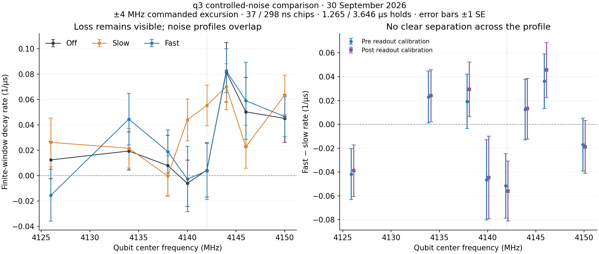

**Decision: inconclusive; one longer-window follow-up is justified.** The
1.265–3.646 us interval leaves roughly 0.02–0.03 per us uncertainty in the
comparison, so this does not exclude a useful smaller rate change. The full
frozen run, executable audit, JSON report, primary PNG/PDF and block-resolved
diagnostic plot are under
`~/.codex/visualizations/2026/09/30/q3-controlled-noise/`.

The `--long-hold` follow-up keeps the 1.264881 us short hold and extends the long
hold to **10.193452 us**, preserving the ±4 MHz programmed swing, 37.202/297.619 ns
chips, eight sites, eight realizations, preparation controls, passive washout,
full return, pre/post classification and finite 384,000-probe schedule. It
scouts afresh rather than assuming 4.144 GHz remains the correct center.

Both short and long holds in this mode use constant flux segments for every
arm, bypassing the envelope-memory limit. The shared DC correction boundaries
are delayed to a common 16-fabric-clock grid (at most 15 clocks, 34.9 ns).
Reconstruction of the segment lists reproduces the saved sample arrays exactly.
The minimum segment is 16 clocks. On the verified v4 generator with equal
tProc/generator clocks, each segment emits five `regwi` and one `set`:
the [QICK v1 control RTL](https://github.com/openquantumhardware/qick/blob/main/firmware/ip/axis_tproc64x32_x8_v1/src/ctrl.sv)
gives 14 issue clocks, leaving two clocks of margin. The check charges opcodes
explicitly, rejects unverified opcodes/clock configurations, and saves the actual
margin. Every acquisition is checked for instruction and envelope capacity.
This changes the playback and DC-edge quantization relative to the first run;
do not pool rates across the two modes as though the pulse sequences were
identical. The temporal comparison remains internal to each mode.

Verification: **1305 tests passed**, including 13 controlled-noise tests.
All 128 long-mode programs compile with the saved board and the completed
run's classifier; maxima are 4151/8192 instruction words and 13760/65536 flux
envelope samples. A complete 384,000-probe synthetic run passes decoding,
saving, plotting and pre/post reclassification. The original mode also passes
all 128 offline compilations and its complete synthetic acquisition. Independent
review identified and confirmed the correction from a generic instruction
estimate to the explicit 14-clock issue budget. No shared production, reset,
initialization or q4 code changes accompany this follow-up.

```bash
git -c gc.auto=0 pull --ff-only origin tls-spectroscopy
python -u -m WorkingProjects.TLS_Spectroscopy.Client_modules.Runners.TLSControlledNoise --run --long-hold
```

### Longer controlled-noise window: resolved loss-profile change; repeat near this band

NAS session `q3_controlled_noise_long_20260930T220058Z_0c80bdd1`, acquired at
`499d9686`, completed all 128 programs and 384,000 probes in **10 min 20 s**
(22:00:58–22:11:18 UTC). The scout selected **4.042 GHz**, with a quieter
comparison at **4.026 GHz**. The largest sampled no-noise rate was at
**4.044 GHz**. This is a different loss band from the preceding 4.142 GHz
session; do not pool the sessions or attribute the changed result solely to
the longer hold.

Finite-window contrast-decay rates, per us, with 1-SE uncertainties:

| Frequency and role | Off | Slow noise | Fast noise | Fast minus slow |
| --- | --- | --- | --- | --- |
| 4.026 GHz, quiet comparison | 0.0020 ± 0.0022 | 0.0085 ± 0.0031 | 0.0065 ± 0.0037 | −0.0020 ± 0.0033 |
| 4.038 GHz, lower flank | 0.0135 ± 0.0039 | 0.0320 ± 0.0047 | 0.0146 ± 0.0036 | **−0.0174 ± 0.0039** |
| 4.042 GHz, scout center | 0.0476 ± 0.0067 | 0.0414 ± 0.0040 | 0.0441 ± 0.0037 | +0.0027 ± 0.0052 |
| 4.044 GHz, sampled peak | 0.0613 ± 0.0036 | 0.0354 ± 0.0056 | 0.0518 ± 0.0054 | **+0.0165 ± 0.0049** |

At the sampled peak, slow noise reduces this rate by **42%** relative to off.
The paired slow-minus-off difference is **−0.0259 ± 0.0042 per us**. At the
lower flank, slow-minus-off is **+0.0185 ± 0.0052 per us**. Thus the response
is a reshaping of the measured loss profile, with lower peak loss and higher
flank loss. These are two-hold contrast-decay estimates, not full T1 fits or
intrinsic defect linewidths.

With matched-block covariance, the spatial contrast
`(fast − slow at 4.044) − (fast − slow at 4.038)` is **+0.0338 ± 0.0060 per us**.
The fast-minus-slow sign is positive at the peak and negative at the flank in
**all eight threshold-classified blocks**, using either pre- or post-run
classification. Slow-minus-off is negative in all eight peak blocks and
positive in seven of eight flank blocks. Continuous-IQ projection reproduces
the pooled pattern; its flank fast-minus-slow sign agrees in seven of eight
blocks. The pattern is also visible separately in the first and second four
blocks, despite changes in the off profile. These are eight realizations
within one session, not eight independent replications.

Post-run classification gives peak fast-minus-slow **+0.0161 ± 0.0043** and
flank **−0.0181 ± 0.0037 per us**. Payload-reference fidelity was **0.909 before
and 0.911 after**. The quiet comparison has no resolved fast-minus-slow
difference. Peak and flank were highlighted after observing this run, so
their uncertainties are pointwise/exploratory, not a prespecified global
discovery test. An exploratory block bootstrap gives a 31–56% interval for
the peak's fractional reduction; it is not an independently confirmed bound.

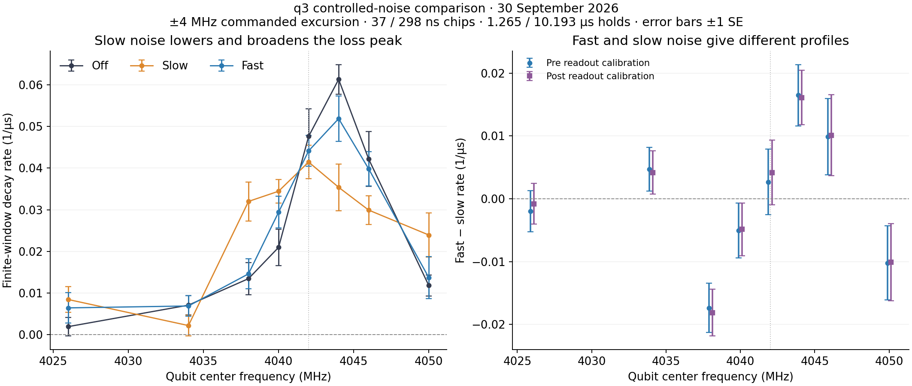

Audit: all 128 raw arrays have shape `(3000, 2)`; all 768 saved arm
probabilities reproduce exactly, and both summaries agree within numerical
tolerance. All three source snapshots match the acquisition commit. Every
saved constant-segment list reconstructs its waveform exactly, without
clipping, with the intended durations, equal additive offset histograms and
at least two clocks of issue margin. Only 8/128 slow/fast pairs have identical
**full DAC-code** histograms, because the reordered offsets cross the common
time-dependent DC correction differently. Equal delivered frequency
distributions have not been established. Frozen raw files, executable audits,
JSON reports and inspected PNG/PDF figures are under
`~/.codex/visualizations/2026/09/30/q3-controlled-noise-long/`.

**Conclusion:** this setup resolves a noise-dependent loss-profile change.
It does not establish TLS saturation, microscopic defect modification,
coherent Floquet physics, a Zeno effect, motional narrowing or intrinsic
linewidth. Different filtering of the slow and fast flux waveforms, and their
ordering relative to the DC correction, remain possible explanations.

**Next: one repeat with new realizations near this loss band.**
`--anchor-ghz 4.044` restricts the fresh scout's qualified candidate centers to
±8 MHz of that frequency, without falling back to another band.
`--seed-offset 100` uses seeds 100–107. The same long-mode pulse sequence,
condition order, exposure and 384,000-probe schedule are retained. If this
band has no qualified candidate, the run records that outcome and stops
normally. No shared production, initialization, reset or q4 settings change.

Before acquiring the repeat, freeze the primary spatial comparison:
`D = (fast − slow at scout center +2 MHz) − (fast − slow at scout center −4 MHz)`.
This maps the two sites from the present result to the newly selected scout
center. Report D using paired-block covariance and the shot-noise floor;
use a two-sided 95% t interval with seven degrees of freedom. A confirmation
claim requires a positive lower interval bound, positive fast-minus-slow at
+2 MHz, negative fast-minus-slow at −4 MHz, and the same qualitative result
with post-run classification. Report the quiet comparison and no-noise
profile alongside it. If the loss profile no longer covers those sites, or
the primary contrast fails, label this comparison unconfirmed; do not replace
it with whichever neighboring points look strongest. Other sampled sites
remain secondary. An independently confirmed response would justify the
separate on-chip transfer calibration needed to investigate its mechanism.

Verification: **1307 tests passed**, including 15 controlled-noise tests.
All 128 fresh-seed long-mode programs compile against the saved board, with
maxima of **4115/8192 instruction words** and **13760/65536 flux envelope
samples**. A full offline 384,000-probe synthetic acquisition passes decoding,
saving, plotting and pre/post reclassification, and restores the original q4
configuration after scoped q3 setup. Read-only code review found no
consequential issue and requested the prespecified comparison above.
Allow approximately **12–20 minutes** including scout and NAS overhead.

```bash
git -c gc.auto=0 pull --ff-only origin tls-spectroscopy
python -u -m WorkingProjects.TLS_Spectroscopy.Client_modules.Runners.TLSControlledNoise --run --long-hold --anchor-ghz 4.044 --seed-offset 100
```

### Anchored controlled-noise repeat: prespecified profile contrast confirmed

`q3_controlled_noise_long_20260930T222753Z_e932655b` at commit `d529ac22`
completed all **128 programs and 384,000 probes** in **10 min 20 s**
(22:27:53–22:38:13 UTC). The anchor remained 4.044 GHz and seeds were
100–107. The fresh scout selected **4.044 GHz**, 2 MHz above the previous
scout center, and chose **4.060 GHz** as the quiet comparison. The sampled
off-profile maximum stayed at **4.044 GHz**. The profiles are analyzed
within each session, without pooling the sessions.

The comparison fixed before acquisition therefore uses **4.046 GHz**
(scout +2 MHz) and **4.040 GHz** (scout −4 MHz). It does not substitute the
observed 4.044-GHz maximum for the prescribed upper site.

| Readout classification | D (per us, ±1 SE) | Paired-block 95% t7 interval |
| --- | --- | --- |
| Pre-run | **+0.04200 ± 0.00801** | **[+0.02305, +0.06094]** |
| Post-run | **+0.04001 ± 0.00791** | **[+0.02129, +0.05872]** |

Here `D = (fast − slow at 4.046) − (fast − slow at 4.040)`, retaining
cross-site/block covariance and the shot-noise variance floor. The required
pooled constituent signs also hold: upper fast-minus-slow is **+0.02535 ±
0.00477 per us**, lower is **−0.01664 ± 0.00449 per us**. Post-classification
values are +0.02311 and −0.01689. Thus **the prespecified confirmation rule
passes**. The upper sign agrees in 8/8 blocks and the lower sign in 7/8;
D is positive in 7/8 blocks, using either classifier. Do not describe this
as all-eight-block agreement. Both half-run profiles retain the pattern.

The observed peak at 4.044 GHz is a secondary descriptive comparison:

| Noise | Finite-window rate (per us, ±1 SE) |
| --- | --- |
| Off | 0.06166 ± 0.00385 |
| Slow | 0.03126 ± 0.00258 |
| Fast | 0.05301 ± 0.00385 |

Slow-minus-off at this peak is **−0.03040 ± 0.00488 per us**, a **49.3%**
reduction, compared with 42.3% in the first session. This is an estimated
two-hold contrast-decay rate reduction, not a full fitted T1 or proof of TLS
saturation. The lower-flank slow-minus-off difference at 4.040 GHz is
**+0.02545 ± 0.00383 per us**. At the quiet 4.060-GHz site, fast-minus-slow is
**−0.00097 ± 0.00308 per us**, unresolved; post-classification is similarly
−0.00133 ± 0.00310. Continuous-IQ projection reproduces the pooled spatial
pattern independently of threshold selection.

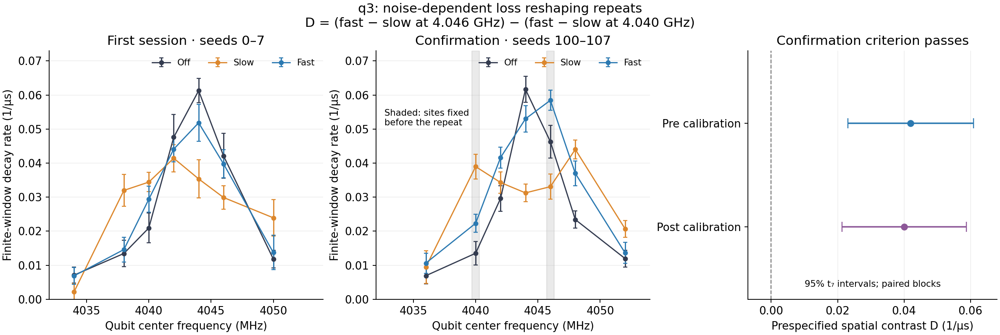

Audit: all 384,000 records were reclassified from raw IQ; every saved pre-run
arm probability agrees exactly and both complete summaries agree within
numerical tolerance. Readout-reference fidelity is **0.9185 before / 0.9095
after**. Three source snapshots match the commit and saved hashes. All 128
waveform files reconstruct from their constant segments with correct duration,
no clipping, equal additive-offset exposure and at least two clocks of issue
margin. **None** of the 128 slow/fast pairs has identical full DAC-code
histograms; ordering relative to the shared time-varying correction remains
relevant. The new seeds, hardware playback and initial passive waits match
the intended repeat. Independent read-only review reproduced the primary
statistics and found no consequential audit issue.

Frozen run files, raw-IQ and waveform audits, prespecified statistics,
continuous-IQ sensitivity results, and inspected PNG/PDF figures are in
`~/.codex/visualizations/2026/09/30/q3-controlled-noise-confirm/`.

**Interpretation and next step:** a noise-dependent loss-profile change has
reproduced with a fresh set of waveforms and an evaluation fixed before the
repeat. This establishes reproducibility of the measured response in this
setup. It does not show that the defect itself was saturated or permanently
changed, or separate dynamical coupling effects from flux-line filtering and
DC-correction correlations. The next useful task is an independent on-chip
measurement of the delivered slow/fast flux response, using the verified
target-resident phase-control sequence as the starting point. It must include
zero-noise and static-offset references and fresh phase-visibility checks;
do not reuse the earlier failed park-Ramsey transfer inference. That new
calibration is a design task, not an already validated or pushed hardware
command. No acquisition code changes accompany this result entry.

### Next bounded run: even-phase response to slow versus fast flux offsets

`TLSNoiseFluxResponse --run` implements the authorized on-chip flux-response
check at the previously calibrated **4.288-GHz** target (resident drive
4290.5 MHz, gain 30000, square π/2 = 19 fabric clocks, π = 39 clocks).
It uses explicit scoped q3 settings and does not require a TLS scout. It
starts with fresh passive SS calibration and an adjacent-pulse phase circle,
π/2 population and 2π control; it stops after this control if unresolved.
The same controls and another SS calibration bracket the completed run.

Sequence, with one readout per subshot:

1. Passive park preparation, then the pinned compensated step to the target.
2. A target-resident Hahn-Y echo: π/2 at phase 0, centered π at 90°, final
   π/2 at 0/90/180/270°. First-to-last pulse-center spacing is 580 fabric
   clocks = 1.34859 µs. All three microwave pulses are outside the commanded
   flux-offset window, with at least 32 fabric clocks of guard.
3. In the first free interval, apply either a constant offset for **128
   clocks = 297.62 ns**, or eight balanced **16-clock = 37.20-ns** chips.
   Each frozen fast waveform and its exact polarity inverse are acquired
   within the same hardware loop. Constant positive/negative offsets give
   the slow reference. Across the two polarities, the entire DAC-code
   histograms match exactly because this window has constant DC correction.
4. Repeat at **64, 250 and 375 DAC**, and two offset placements separated
   by 32 clocks = 74.40 ns. The higher amplitudes provide phase sensitivity;
   extrapolation to the original small TLS-test excursion is an assumption.
5. Complete the compensated 40-µs return and read out at park. Resident g/e
   references accompany every program; allow 1000 µs passive washout between
   all subshots. No active reset or herald-selection is used.

The correction is checked, not flattened. Its constant 30–32-µs segment
contains the entire science window: pre-delay 29.51 µs plus 0.5-µs settle,
823 clocks = 1.91360 µs of queued echo/offset playback, then 0.05 µs post.
All commands are timestamped. After setting the unchanged initial DC level,
microwave events are queued first, followed by the remaining flux edges.
Separate instruction-cost checks enforce both the earliest microwave and
first offset deadlines, including `safe_regwi` expansions into bitwise and
arithmetic instructions. The correction and calibration-source hashes are
pinned; raw IQ, every science-window fabric-clock waveform, pulse timing, board config,
source snapshots, and both readout-calibration analyses are saved.

Four complete blocks use four frozen seeds, with randomized setting order,
interleaved polarity/analysis phases, and zero-offset echo references before
and after each block. Total: **58 programs, 326,400 probes**, approximately
**8–15 minutes**. Terminal output retains ordinary calibration output plus
one progress bar with ETA; per-setting details go to the manifest.

The measured quantity is the **even phase**, formed separately for each
seed as half the principal argument of the positive/negative phase sum
relative to its interpolated zero-offset echo. It is modulo π; there is
no model-driven unwrap. Both raw polarity circles, visibility, uncertainty
and off-reference drift remain available. All four blocks must pass the
phase gates; failing seeds are not silently dropped. A failed final pulse
control invalidates the inference but retains all measured phases. The
250/375-DAC amplitude-squared consistency check flags a possible scaling or
branch problem without resolving that ambiguity automatically.

**Limits fixed before acquisition:** this is a signed, echo-weighted
response including pulse tails, not total delivered flux power or a unique
bandwidth/transfer function. Away from the sweet spot, even line distortion
or rectification can contribute through the linear frequency slope, along
with the desired curvature response. Amplitude-squared scaling alone does
not separate them; agreement between the two placements does not prove an
absence of tails. No automatic delivered-gain or filtering certificate is
produced. A short linear pulse-area Ramsey check was rejected because pulse
tails can preserve its area despite filtering. Nonlinear phase metrology is
inspired by [Rol et al., arXiv:1907.04818](https://arxiv.org/abs/1907.04818),
but this polarity-paired echo away from the sweet spot is an adaptation,
not an already validated Cryoscope reconstruction.

Offline verification uses the actual QICK 0.2.133 compiler and saved board,
correction and readout calibration. All 58 programs compile, with at most
4567 instructions and at least **64 fabric clocks** of checked queue margin.
Waveforms reconstruct exactly from their constant segments, fit memory,
and avoid clipping. A full 326,400-probe synthetic acquisition exercises
stream-bank decoding, NAS-style files, phase recovery, plotting, post-readout
reanalysis, and restoration of an initially supplied q4 configuration.
The ten focused tests cover timing, polarity pairing, phase wrapping,
missing/low-visibility data, failure of the final pulse control, and
non-censoring of failed seeds. The full suite passes **1317 tests**. An
additional synthetic failed-control run stops before science and saves its
raw IQ, summary and completion metadata. Independent read-only review found
no remaining consequential timing, readout or analysis fault. These checks
do not validate hardware fidelity.

```bash
git -c gc.auto=0 pull --ff-only origin tls-spectroscopy
python -u -m WorkingProjects.TLS_Spectroscopy.Client_modules.Runners.TLSNoiseFluxResponse --run
```

### Even-phase flux response completed: both waveforms produce a clear response

`q3_noise_flux_response_20260930T232122Z_50a3d618`, commit `b9fef51f`,
completed all **58 programs / 326,400 probes** in **6 min 42 s**. Both
resident pulse controls, all four zero-offset phase brackets and every
science phase circle pass. Payload readout fidelity is **0.920 / 0.922**
before/after. Phase-circle visibility ranges 0.784–1.041 and the largest
bracket phase drift is 5.19°. Visibility slightly above one reflects the
finite-shot normalization to resident g/e references, not gain of coherence.

The table averages the two placements within each of four blocks. Error
bars use the larger of block scatter and propagated shot noise, including
shared zero-offset-reference covariance. The paired difference is evaluated
before pooling blocks; it is not obtained by treating the two plotted means
as independent.

| Command amplitude | Slow-reference phase | Fast-waveform phase | Paired fast − slow |
| --- | --- | --- | --- |
| 64 DAC | −0.0586 ± 0.0402 rad | −0.0585 ± 0.0379 rad | +0.0000 ± 0.0255 rad |
| 250 DAC | +0.3488 ± 0.0380 rad | +0.3273 ± 0.0237 rad | −0.0214 ± 0.0205 rad |
| 375 DAC | +0.7002 ± 0.0302 rad | +0.6224 ± 0.0228 rad | −0.0778 ± 0.0223 rad |

At 375 DAC the fast response is approximately **11% smaller**. The paired
95% t3 interval is [−0.1490, −0.0067] rad; all four block differences are
negative. This is an exploratory comparison across several amplitudes and
placements, not a multiplicity-adjusted discovery claim. Early placement
alone gives −0.0391 ± 0.0308 rad and late gives −0.1165 ± 0.0350 rad.
Fast late-minus-early is −0.0623 ± 0.0306 rad, with a t3 interval containing
zero. Therefore do not claim either a resolved placement dependence or
placement equivalence. The 250-DAC difference is unresolved; the 64-DAC
response itself is unresolved. All amplitude-squared scaling warnings remain
false, which does not establish the correct modulo-π branch. Post-calibration
projection changes none of these conclusions.

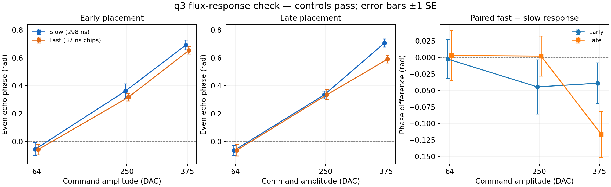

**Conclusion:** the fast commanded waveform produces a strong even-phase
response at the larger diagnostic amplitudes, close to the slow reference.
This is useful evidence that the fast waveform has a measurable action on
q3. It does **not** certify its small-amplitude delivered excursion at the
TLS bias. The response is signed and echo-weighted; filtering, tails and
rectification remain possible. Do not turn the 0.889 phase ratio into an
unqualified voltage-transfer estimate or use this run alone to establish
a coherent/Zeno mechanism for the earlier loss-profile change.

Audit: all 326,400 raw IQ records reproduce their saved means/SEs, and both
complete analysis summaries reproduce numerically. Six saved source hashes
match their snapshots, and the snapshots match the recorded commit after
Windows CRLF normalization. All science-window waveforms reconstruct from
saved constant segments, with no clipping, correct guards, matched full
code histograms across polarities, and at least 64 clocks of queue margin.
Raw files, audit script, paired statistics and inspected PNG/PDF figures are
frozen in `~/.codex/visualizations/2026/09/30/q3-noise-flux-response/`.

### Next TLS control: pair each noise waveform with its endpoint inverse

Add the opt-in `--paired-polarity` mode to `TLSControlledNoise --long-hold`.
Each hardware loop now contains a shared no-noise g/e reference pair plus
g/e × slow/fast × the two polarities,
with **1000 µs passive washout between every subshot**. At every noise tick,
the inverse swaps the low/high endpoint assignment; it leaves the shared
DC correction intact. This is an endpoint swap, not arithmetic negation:
the flux-frequency curve can make the two DAC offsets asymmetric.

Pooling both polarities gives **exactly identical full commanded DAC-code
histograms** for slow and fast, even during the changing correction. Every
compiled waveform pair must pass this check. This removes the original
comparison's mismatch of full code distributions without flattening or
changing the flux correction. Matching is across the two polarities, not
necessarily within an individual subshot. It does not make their delivered
waveforms identical, or ensure identical averaged survival under every
incoherent model: nonlinear averaging of decay and line response remain
relevant. Treat this as a stronger reproducibility/control test, not a unique
mechanism witness.

Use eight fresh seeds **200–207**, one fresh scout anchored within ±8 MHz of
4.044 GHz, the same seven relative profile points plus a quiet control, and
the same 1.26488/10.19345-µs hold comparison. Preserve separate raw polarity
rows; pool their g/e contrasts before the logarithmic rate estimate. The
primary comparison is fixed again at `D = (fast−slow at scout+2 MHz) −
(fast−slow at scout−4 MHz)`, with positive upper, negative lower differences
and a positive paired-block 95% t7 interval, checked with both readout
calibrations. Do not substitute the eventual observed peak for either point.

The run has **128 programs / 640,000 probes**, 500 shots per condition per
block, approximately **16–25 minutes** including the scout. All 128 programs
are preflighted before acquisition. There are ten conditions; duplicate no-noise references were removed after
compilation found a twelve-condition program exceeding 8192 instructions.
Noise arms retain both polarities, each with 500 shots; the shared no-noise
reference has 500 shots per state. Analysis uses these actual shot counts.
Defaults remain the original six-condition
protocol. Production TLS, active reset and initialize settings are unchanged.

```bash
git -c gc.auto=0 pull --ff-only origin tls-spectroscopy
python -u -m WorkingProjects.TLS_Spectroscopy.Client_modules.Runners.TLSControlledNoise --run --long-hold --paired-polarity --anchor-ghz 4.044 --seed-offset 200
```

Validation before push: **1319 tests pass**. All 128 paired programs compile
with QICK 0.2.133 against the saved board/correction/calibration, at most
**7547 of 8192 instructions**, 13760 FF-envelope samples and at least two
clocks of constant-segment issue margin. Every full-code histogram check
passes. A complete **640,000-probe synthetic acquisition** passes stream
bank decoding, storage, rates, plotting, post-calibration reclassification
and restoration of prior q4 settings. The original six-condition runner
also passes its complete 384,000-probe synthetic acquisition. Independent
read-only review found no remaining consequential code or statistics issue
and independently reproduced the 375-DAC paired phase result. These are
software checks; the new polarity-paired TLS protocol awaits measurement.

### Polarity-paired TLS run: the loss-profile difference survives the stricter control

`q3_controlled_noise_paired_20261001T000851Z_22f82e50`, commit `aed9cada`,
completed **128 programs / 640,000 probes** in **16 min 46 s**. Seeds were
200–207. The scout selected **4.042 GHz**, with quiet comparison at
**4.058 GHz**. The sampled no-noise maximum was at 4.044 GHz. All ten arms
were present in each hardware loop, including both polarities of slow/fast
noise and the shared g/e no-noise reference.

**Question:** can the temporal pattern of deliberately applied qubit-frequency
noise control the loss measured around a persistent resonance, when the
commanded excursion and exposure distribution are matched? Slow chips last
297.62 ns; fast chips last 37.20 ns. Both use the same nominal ±4-MHz endpoints.
The endpoint-inverted pairs match the *full commanded DAC-code distribution*,
including the changing DC compensation. This is an experiment on the
qubit's interaction with the loss feature, not a demonstrated change in the
TLS's population or microscopic properties.

The comparison prescribed before this run uses upper **4.044 GHz**
(scout +2 MHz) and lower **4.038 GHz** (scout −4 MHz):

| Readout projection | D (per µs, ±1 SE) | Paired-block 95% t7 interval |
| --- | --- | --- |
| Pre-run | **+0.03525 ± 0.00435** | **[+0.02497, +0.04552]** |
| Post-run | **+0.03545 ± 0.00435** | **[+0.02516, +0.04575]** |

`D = (fast−slow at 4.044) − (fast−slow at 4.038)`. The constituent pooled
signs also pass: upper **+0.01432 ± 0.00368 /µs**, lower **−0.02093 ±
0.00301 /µs**. D is positive in **8/8 blocks**, upper is positive in 7/8,
and lower is negative in 8/8. Both half-run profiles retain these signs.
The confirmation rule therefore passes with either readout calibration.

| Center frequency | No-noise rate | Slow-noise rate | Fast-noise rate |
| --- | --- | --- | --- |
| 4.038 GHz (prescribed lower flank) | 0.01346 ± 0.00345 | 0.03766 ± 0.00304 | 0.01673 ± 0.00279 |
| 4.042 GHz (scout center, descriptive) | 0.05880 ± 0.00502 | 0.02711 ± 0.00297 | 0.05016 ± 0.00450 |
| 4.044 GHz (prescribed upper site) | 0.06276 ± 0.00339 | 0.03684 ± 0.00471 | 0.05116 ± 0.00298 |

Rates are the two-hold contrast-decay estimates in /µs, not independently
fitted full exponential T1 curves. Slow-noise reduction is **41.3%** at the
prescribed upper point and **53.9%** at the scout center. The enhancement of
loss on the flanks matters: this reshapes the measured loss profile rather
than establishing that the defect has disappeared. The quiet-site fast-minus-
slow difference is **+0.00576 ± 0.00257 /µs**; its t7 interval includes zero,
but do not claim exact absence of a background effect. The primary spatial
contrast removes a uniform fast/slow offset.

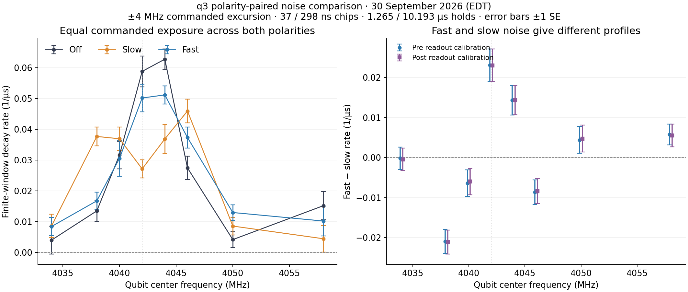

**Interpretation:** the earlier profile response is reproducible after
matching complete commanded-code distributions across the polarity pairs.
This rules out their original aggregate histogram mismatch as the sole
explanation. It does not establish identical delivered frequency trajectories,
rule out flux filtering or nonlinear survival averaging, or demonstrate TLS
saturation, coherent exchange or a Zeno mechanism. A mechanism claim requires
quantitative comparison with those alternatives. The practical question of
whether this programmed control can change the measured loss profile has a
positive answer in this protocol.

Audit: all **640,000 raw IQ records** reproduce every saved probability exactly,
and the entire pre/post summaries reproduce numerically. Payload fidelity is
**0.924 / 0.929**. All three saved source snapshots match the current recorded
commit content and their byte hashes (Windows line endings normalized only
for source-content comparison). All **128** paired waveform sets have exactly
matched full DAC histograms; all four driven traces reconstruct from saved
constant segments without clipping and retain ≥2 clocks of instruction issue
margin. The independent continuous-IQ estimator reproduces the spatial sign
pattern: fast-minus-slow is −0.02108 /µs at 4.038, +0.02659 /µs at 4.042,
and +0.01598 /µs at 4.044 GHz. Per-polarity raw rows are retained.

Frozen data, raw audit, paired-block analysis and inspected PNG/PDF figures:
`~/.codex/visualizations/2026/10/01/q3-controlled-noise-paired/`. This entry
records the result and the experimental question; it does not introduce a
new acquisition protocol or make a mechanism claim.

### Next run: sweep the programmed switching duration

The user requested the next measurement after the polarity-paired result.
Implement an opt-in `--switching-sweep` mode in the existing controlled-noise
runner, requiring `--long-hold --paired-polarity`. The question is whether the
reproduced loss-profile contrast changes as the programmed chip duration is
increased from 37 to 149 ns, using the same nominal ±4-MHz endpoints and
paired full-code exposure control. This is a programmed-timescale test; the
chip duration is not a calibrated correlation time. Adjacent equal signs
extend individual constant-value runs.

The three variable-chip settings are **16/32/64 fabric clocks =
37.20/74.40/148.81 ns**. Every program compares one setting with a separately
acquired **128-clock = 297.62-ns** reference and the shared off g/e arms.
Each hardware loop retains ten subshots: off g/e and slow/variable-chip ×
g/e × endpoint-inverse polarity. DC correction remains quantized on the
same **16-clock grid** for all settings. Slow-reference waveforms are
identical at fixed site/hold/seed across all three chip cases; their
*measurements* remain separately indexed to capture acquisition drift.
No global chip setting is mutated.

Use a single scout anchored within ±8 MHz of **4.044 GHz**, followed by four
centers: scout **−4, 0, +2 MHz** and the selected quieter **±16-MHz control**.
All centers, the two existing 1.26488/10.19345-µs holds, and three chip cases
are randomized within each block. Eight fresh seeds **300–307** give
**192 programs / 960,000 probes** at 500 shots per condition, approximately
**22–35 minutes** including scouting, calibration and NAS overhead. Passive
1000-µs washout and the full corrected 40-µs return remain unchanged. The
usual SS/scout output and one progress bar with ETA remain the terminal UI.

**Analysis fixed before acquisition:**

- Keep chip cases separate. Pool polarities within each preparation/hold
  before the logarithmic contrast-decay estimate, as in the previous run.
- For each chip setting, calculate
  `D(chip) = (variable−slow at scout+2) − (variable−slow at scout−4)`.
- The primary comparison is **E = D(16 clocks) − D(64 clocks)**. Calculate
  it from pooled contrasts, using one common complete-block set across the
  eight constituent rate terms and the full 16-component contrast covariance.
  Retain the propagated shot-noise variance floor; do not drop measured
  low-contrast seeds. Report a paired-block t interval and whether all eight
  planned blocks are available.
- Require the endpoint 37-vs-298-ns response itself to retain the previous
  constituent signs before interpreting a positive E as a weakening of that
  response at longer chips. E's sign is a test, not a fit constraint. The
  74-ns point describes shape; no forced monotonic curve or extracted TLS
  linewidth is produced. Check both pre/post readout classifications, actual
  site rates and the quiet control.

A resolved E would add a programmed timescale dependence to the already
reproduced effect. A null would bound the change over this interval; it
would not negate the earlier 37-vs-298-ns comparison. Even a clear crossover
would require quantitative alternatives for delivered-waveform filtering,
nonlinear averaging and qubit–TLS dynamics before a microscopic interpretation.
This run is not an assertion of TLS saturation, coherent exchange or Zeno
physics. Existing six-condition and ten-condition default behavior is kept;
production spectroscopy, active reset and initialize settings are untouched.

```bash
git -c gc.auto=0 pull --ff-only origin tls-spectroscopy
python -u -m WorkingProjects.TLS_Spectroscopy.Client_modules.Runners.TLSControlledNoise --run --long-hold --paired-polarity --switching-sweep --anchor-ghz 4.044 --seed-offset 300
```

Validation before push: **1,322 tests pass**. All **192 programs** compile
against the saved QICK 0.2.133 board configuration, with a maximum of
**7,283/8,192 instructions**, **13,760 flux waveform samples**, and at least
two clocks of instruction issue margin. A complete **960,000-probe synthetic
acquisition** exercises streaming, decoding, storage, per-chip analysis,
plotting, post-readout reclassification and restoration of the prior q4
settings. The existing 640,000-probe paired acquisition also passes its
offline end-to-end check. Independent review verifies unchanged existing
schedules/waveforms and the pooled primary estimator with its full covariance.
These checks validate implementation and resource fit; they are not hardware
measurements or evidence for the proposed physical dependence.

### Switching-duration sweep completed: a resolved endpoint change

`q3_controlled_noise_switching_20261001T010015Z_4d04042a`, source commit
`5bbeec59`, completed all **192 programs / 960,000 probes** in **24 min 6 s**
(21:00–21:24 EDT on September 30). The fresh scout selected **4.046 GHz**;
the other science sites were **4.042, 4.048 and 4.062 GHz**. All eight
planned blocks (seeds 300–307) contribute; no measured seed was dropped.

The prespecified statistic is
`D = (variable−298 ns rate at 4.048) − (variable−298 ns rate at 4.042)`.
Positive D means the two waveforms give different shapes across the line,
after cancelling a frequency-independent rate offset. These are finite-window
contrast-decay estimates from 1.26488/10.19345-us holds, not full T1 fits.

| Variable chip | D (/us), ±1 SE | 95% paired-block t7 interval |
| --- | --- | --- |
| 37.20 ns | +0.02641 ± 0.00427 | [+0.01631, +0.03652] |
| 74.40 ns | +0.01571 ± 0.00625 | [+0.00093, +0.03049] |
| 148.81 ns | +0.00791 ± 0.00458 | [−0.00292, +0.01873] |

The primary **E = D(37 ns) − D(149 ns)** is
**+0.01850 ± 0.00585 /us**, with **95% t7 interval
[+0.00466, +0.03235] /us** (two-sided t comparison p=0.0159). Reclassifying
the same raw shots with the final calibration gives **+0.01852 ± 0.00589**,
interval **[+0.00460, +0.03244] /us**; this is a calibration sensitivity
check, not an independent replication. The required 37-ns constituent
signs hold: variable-minus-slow is **+0.01056 ± 0.00398 /us** at 4.048 and
**−0.01585 ± 0.00292 /us** at 4.042 GHz.

At the scout center (secondary observation), the variable-waveform rate
decreases **0.05721 → 0.04250 → 0.03711 /us** across the three intervals.
Its separately acquired slow references are **0.02100, 0.03124, 0.03132**,
and no-noise references **0.05932, 0.06954, 0.07768 /us**. These changing
references are why a single pooled baseline or raw center-rate trend is
insufficient; each chip case keeps its own controls.

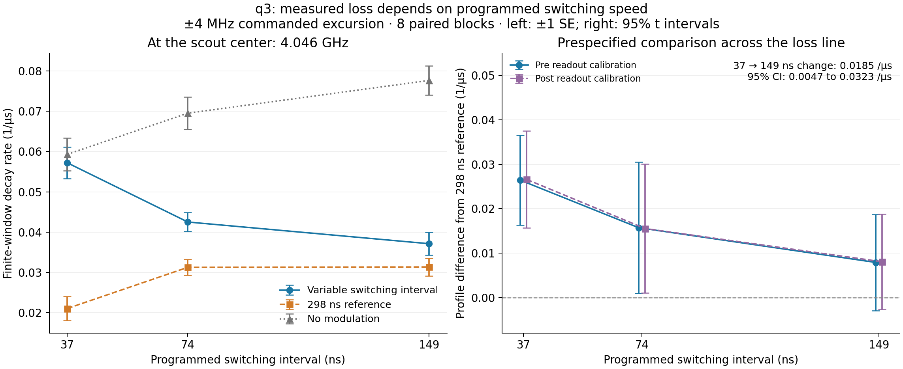

**Stability and limitations:** E is positive in **7/8 individual blocks**,
and deleting any one block leaves its pooled estimate positive
(0.01567–0.02155 /us). However, the first/second halves give
**+0.02923 ± 0.00838** and **+0.00780 ± 0.00819 /us** respectively; the
second half alone is unresolved. The quiet-site 37-minus-298-ns difference
is **−0.00598 ± 0.00226 /us**, with a t7 interval excluding zero. Thus do
not claim a completely unchanged background, a stationary response, a
resolved microscopic crossover time, or a precise monotonic law from three
central estimates. A common rate offset cancels in D; frequency-dependent
instrumental effects do not.

**Conclusion:** this bounded run provides evidence that the measured
loss-profile response depends on programmed switching duration. It passes
the fixed endpoint comparison and sign checks. It does not distinguish
flux-line filtering, nonlinear survival averaging or qubit–TLS dynamics,
and does not demonstrate saturating or permanently changing a TLS. The
earlier larger-amplitude even-phase diagnostic is not a calibration of
these small-amplitude delivered trajectories.

Audit: all **960,000 raw IQ records** reproduce every saved probability
exactly, and both complete summaries reproduce. Three source snapshots
match their saved byte hashes and the recorded source after CRLF
normalization. All **192 waveform sets** have matched full DAC-code
histograms across polarities, reconstruct from saved constant segments,
avoid clipping and retain at least two clocks of instruction issue margin.
All **64 site/hold/seed groups** retain identical off/slow waveforms across
the three chip settings. Payload fidelity is **0.922 / 0.911** before/after.
An independently assembled pooled-log estimator and full covariance reproduce
E and its standard error; continuous, unthresholded IQ gives E=**+0.01967
/us**. The block bootstrap is a sensitivity check, not the primary interval.

Frozen data, reproducible audit, block/control figure and inspected PNG/PDF:
`~/.codex/visualizations/2026/10/01/q3-controlled-noise-switching/`.

**Next: one confirmation with fresh seeds 400–407.** Keep the same
waveforms, ±4-MHz command, holds, paired controls, offsets and primary
statistic; use a fresh scout within ±8 MHz of **4.046 GHz**. The aim is to
test reproducibility of E in another measurement, given the weaker second
half, before adding more chip durations or fitting a timescale. Require
positive E with its paired 95% interval excluding zero under both readout
calibrations and the original 37-ns constituent signs. Retain failed signs,
all measured blocks, half-run checks and background controls. Even a
successful confirmation leaves delivered-waveform calibration unresolved.

```bash
git -c gc.auto=0 pull --ff-only origin tls-spectroscopy
python -u -m WorkingProjects.TLS_Spectroscopy.Client_modules.Runners.TLSControlledNoise --run --long-hold --paired-polarity --switching-sweep --anchor-ghz 4.046 --seed-offset 400
```

This continuation uses the already validated runner; no acquisition,
production spectroscopy, active-reset or initialize code changes are made.

### Fresh-seed confirmation: switching-duration profile effect reproduced

`q3_controlled_noise_switching_20261001T013857Z_15627da6`, source commit
`7b75a01b`, completed all **192 programs / 960,000 probes** in **25 min 20 s**
(21:38–22:04 EDT on September 30). The fresh scout again selected
**4.046 GHz**. The same four sites, paired polarities, nominal ±4-MHz
commands, hold times and comparison against the 297.62-ns reference were
used, with new seeds **400–407**. All eight planned blocks are retained.

The statistic and pass criteria were fixed in the preceding entry. For
`D = (variable−298 ns rate at 4.048) − (variable−298 ns rate at 4.042)`, the
new initial-calibration results are:

| Variable chip | D (/us), ±1 SE | 95% paired-block t7 interval |
| --- | --- | --- |
| 37.20 ns | +0.01977 ± 0.00379 | [+0.01082, +0.02872] |
| 74.40 ns | +0.00815 ± 0.00621 | [−0.00654, +0.02284] |
| 148.81 ns | −0.00110 ± 0.00374 | [−0.00995, +0.00774] |

The primary endpoint change **E = D(37 ns) − D(149 ns)** is
**+0.02087 ± 0.00532 /us**, with **95% t7 interval
[+0.00829, +0.03346] /us** (two-sided t comparison p=0.00574).
Final-calibration reclassification gives **+0.01809 ± 0.00526 /us**,
interval **[+0.00566, +0.03052] /us**. Both required 37-ns constituent
signs also hold under both classifiers. With the initial calibration,
variable-minus-slow is **+0.00920 ± 0.00272 /us** at 4.048 and
**−0.01057 ± 0.00263 /us** at 4.042 GHz. **The confirmation passes the
prespecified criteria.** Reclassifying the same raw shots is a sensitivity
check; the new acquisition with different seeds is the replication.

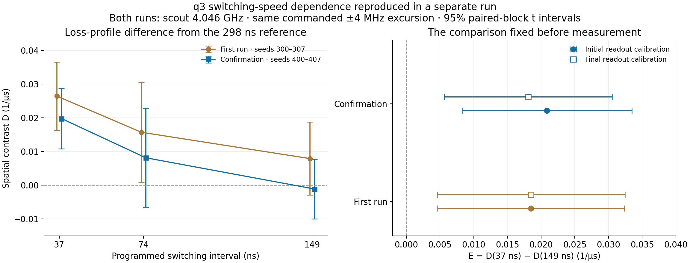

The first run gave E=**+0.01850 /us**, interval **[+0.00466, +0.03235]**.
The new estimate is comparable. E is positive in **all eight new blocks**,
and removing any one block leaves the pooled estimate positive
(0.01840–0.02213 /us). First/second halves give
**+0.01917 ± 0.00804** and **+0.02281 ± 0.00710 /us**, respectively.
There is no recurrence of the first run's smaller second-half central
estimate, although four-block half-run intervals are broad and do not
establish stationarity. Neither adjacent chip-duration difference is
individually resolved; do not fit a precise crossover time or claim a
resolved monotonic law from these three points.

**What reproduced is the spatial profile comparison.** The center-only
variable-minus-slow differences are now approximately +0.01042, +0.01005
and +0.00920 /us across the three chip durations. Thus the earlier strong
center-only trend is not separately reproduced. Absolute reference rates
also changed. At the nominal quiet control (4.062 GHz), the corresponding
differences are −0.01149, −0.01163 and −0.00392 /us: the background is not
unchanged. D cancels a uniform rate offset, not a frequency-dependent
instrumental response.

Audit: all **960,000 raw IQ records** reproduce every saved classified
probability exactly, and the complete initial/final summaries reproduce.
The three saved source hashes match; source snapshots agree with the
recorded implementation after CRLF normalization. All **192 waveform
sets** have matched full commanded DAC histograms, reconstruct exactly
from saved constant segments, avoid clipping and retain at least two
clocks of issue margin. Off/slow waveforms are identical across the three
chip settings within all **64 site/hold/seed groups**. Payload SS fidelity
is **0.9105 / 0.9065** before/after. An independently assembled estimator
and full contrast covariance reproduce E and its standard error.
Continuous, unthresholded IQ gives E=**+0.01390 /us**, preserving the sign
but not the exact classified magnitude.

**Conclusion and next decision:** programmed switching duration has a
reproduced effect on the measured loss-profile shape. These finite-window
contrast-decay rates do not demonstrate TLS saturation, a changed TLS
population, coherent TLS exchange or an intrinsic TLS timescale. Equal
commanded histograms do not establish equal delivered frequency
histograms: flux-line filtering and nonlinear survival averaging remain
alternatives to a dynamical qubit–TLS explanation. Another identical
confirmation is not the most useful next acquisition. The next
mechanistic task should quantify whether delivered-waveform distortion
can explain the observed profile change, using a diagnostic with adequate
sensitivity to the actual small commands. The previous large-amplitude
phase measurement does not settle that question. No new acquisition mode
has been prepared in this results-only update.

Frozen data, raw audit, comparison script, statistics and inspected
PNG/PDF figures:
`~/.codex/visualizations/2026/10/01/q3-controlled-noise-switching-confirm/`.

### Switching investigation deferred; same-frequency prerequisite for two-frequency swap spectroscopy

The user asked to keep the reproduced switching-duration result for a later
return and start the energy-return direction. The eventual question is
whether excitation deposited at one load frequency reappears at that same
frequency or elsewhere. **Do not expand to a two-frequency grid until a
same-frequency return signal has been independently confirmed.** The flux
transfer/line-filtering question above remains open; it is not abandoned or
answered by the new experiment.

`TLSAfterglowDiagonal` implements the first bounded screen. It visits every
point in **4.020–4.080 GHz at 1 MHz spacing**, independent of T1-dip depth.
This region includes the recent 4.046-GHz loss site and its surrounding
frequencies; it is not a search across the entire accessible band.
At every frequency, each hardware logical shot contains six subshots:

1. Park π (hot) or a timing-matched zero-gain π (cold).
2. A **10-us loading visit** to the selected frequency.
3. The established **40-us compensated return**, park readout, and existing
   readout/accumulator guard. Retain first-readout IQ for offline ground
   heralding; this is conditional ground preparation, not active reset.
4. A ground probe at the **same frequency** for **0.1, 10 or 40 us**, followed
   by the same corrected return and final park readout. These are requested
   hold durations; the 0.5-us target-settle prefix also remains in place.
5. A **5-ms recovery between every subshot**, including between hot and cold
   controls. There is no additional intentional wait between loading and
   probing beyond the required return, readout and guard.

The second block reverses both the initial randomized frequency order and
the complete six-condition order. There are **400 logical shots per point
per block**, **122 science programs**, **292,800 paired-readout science
records**. Pre/mid/post reference triplets each use 1,200 shots per arm,
adding 10,800 records. Paired references prepare their known states after
the flux return, and assess holdout herald discrimination. Terminal output
is limited to usual setup/SS-calibration output and one science progress
bar with elapsed time and ETA. Expect roughly **30–40 minutes**.

The saved observables include all-shot excitation, first-readout acceptance,
ground-heralded final excitation, and unthresholded final IQ. The return
test is hot-minus-cold excitation **and its increase above the 0.1-us probe
baseline**. A decaying residual qubit excitation by itself fails that growth
test. Every paired logical shot contributes to the covariance of these
contrasts, including their shared short-probe baseline.

Candidate triage requires at least 80 accepted shots in each contributing
arm per block, hot-minus-cold and growth both ≥0.03 in each order, agreeing
continuous-IQ signs, passing reference checks, and both pooled contrasts
larger than **3.35 descriptive standard errors**. The SE includes the paired
shot covariance and an order-disagreement floor. The 3.35 factor is motivated
by a one-sided normal screen over 61 × 2 comparisons, but two acquisition
orders and possible temporal correlations do **not** establish a calibrated
discovery p-value. Every curve and raw record is saved regardless of this
triage. Final-reference reclassification is a sensitivity check on the same
shots. No positive screen automatically launches a 2-D map.

**What differs from the earlier null:** the September 29 weak-site screen
accepted only one site and added 100–1000 us of waiting. This measurement
uses a blind local frequency grid with no added wait and explicitly measures
short-to-long growth of a ground-probe signal. It still cannot access memory
that dies during the 40-us return plus readout/guard. It is an exploratory
screen for a sizable return signal, not a precision exclusion of small
afterglow: low herald acceptance particularly reduces sensitivity.

A candidate must next survive independent repetition, excited loading at an
off-target frequency, matched readout-history and carryover controls, and a
storage-delay check. Only then should independent load/probe coordinates be
scanned. A broad response or an isolated positive pixel is not evidence of
interacting TLSs. The inspiration is the pump/excitation-probe protocol in
[Guimarães et al., arXiv:2609.31280v1, Fig. 3](https://arxiv.org/html/2609.31280v1).

The implementation is a separate experimental runner. It scopes explicit
q3 parameters and restores prior runner settings; production spectroscopy,
active reset, `initialize.py` and q4 runners are unchanged.

```bash
git -c gc.auto=0 pull --ff-only origin tls-spectroscopy
python -u -m WorkingProjects.TLS_Spectroscopy.Client_modules.Runners.TLSAfterglowDiagonal --run
```

Validation: **1,329 tests pass** in `tests/`. All **131 science/reference
programs** compile with the saved QICK 0.2.133 board configuration; maximum
program size is **4,211/8,192 instructions**, and maximum flux-envelope
allocation is **55,040/65,536 samples** with the 4-us startup/shutdown ramp.
A complete synthetic acquisition saves and reanalyzes **303,600 paired
records**, detects an injected return at 4.046 GHz with both calibrations,
renders the output plot, checks streaming dimensions and actual pulse-memory
loading, and restores prior settings. A separate forced-disconnect test
preserves partial raw data and the original acquisition error even when
board-stop commands also fail. Independent review found no remaining
important implementation issue; it motivated the stricter candidate gate.
These are offline implementation checks, not evidence of measured afterglow.

The initial unscoped `pytest` command also collected hardware scripts
`Archive/q4diamond/Client_modules/Running_Experiments_MUX/Timing_test.py` and
`WorkingProjects/Inductive_Coupler/Client_modules/Running_Experiments_MUX/Timing_test.py`;
both raised missing-`qick` collection errors in the normal local Python
environment. That unscoped collection was interrupted. The maintained
`tests/` suite and the separate real-QICK compiler checks above pass.
Verification files are in `/tmp/q3_afterglow_diagonal_check/` on the analysis
computer.

### Diagonal afterglow screen completed: no qualified return site

`q3_afterglow_diagonal_20261001T025927Z_a2f0ad74`, source commit
`d34eadff`, completed in **27 min 50 s** (September 30, 22:59–23:27 EDT).
All **122 science programs / 292,800 paired science records**, plus
**10,800 reference records**, were saved. All 61 planned frequencies and
both reversed acquisition orders completed. Initial, midpoint and final
reference checks passed; this was not a site-selection or reset-calibration
abort. First-readout fidelity was approximately **0.936 / 0.922 / 0.925**;
the separately fitted final-readout fidelities were **0.808 / 0.904 / 0.820**.
These meet the defined gates but should not be described as identical,
unchanging readout quality.

**No frequency passes the preregistered return-screen rule**, under either
initial- or final-reference reclassification. The initial classifier gives
valid count coverage for all 122 long-probe/site comparisons; the final
classifier gives 120/122. All reported probabilities below are classified
excited fractions, not corrected absolute qubit populations.

There is a broad hot-minus-cold offset, but it is already present at the
shortest probe. The equal-weight means across the measured frequencies and
two orders are descriptive averages:

| Probe hold | Hot minus cold, percentage points | Increase above 0.1-us baseline |
| --- | --- | --- |
| 0.1 us | +4.05 | 0 |
| 10 us | +4.24 | +0.19 |
| 40 us | +3.23 | −0.82 |

The final classifier gives corresponding baseline/10/40-us excesses of
**+2.60 / +3.00 / +2.16 percentage points**, preserving the absence of
clear average growth. Continuous, unthresholded final IQ gives the same
qualitative pattern. Band averages are not a substitute for the local
return test and are not quoted with an independent-frequency confidence
interval.

The first-readout ground cut accepts roughly **35% of hot-loaded shots**
versus **90% of cold-loaded shots** (median 140.5/400 hot shots with the
initial cut). Roughly 60% of hot shots classify excited at that first
measurement, so false-ground assignments can leave appreciable residual
excitation in the selected subset. Tightening the excited-reference tail
cut from 5% to 2.5% reduces the band-mean short-probe offset from **4.05 to
2.10 points**; a 1% cut gives **1.58 points**, but retains only a median
46 hot shots. These are descriptive sensitivity checks, not optimized
candidate selection. They support carryover/selection as an explanation
for much of the broad offset; they do not prove a unique mechanism or
justify a strong null bound at the tighter cut.

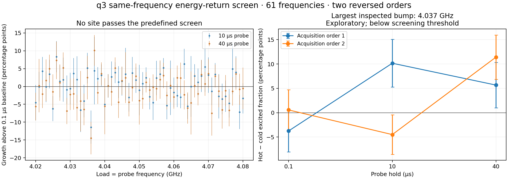

Two post-hoc hints are retained without upgrading the screening decision:

- **4.037 GHz, 40 us:** growth above baseline is **+10.13 ± 4.32 points**
  (descriptive 1 SE), or 2.35 SE, below the fixed 3.35-SE threshold. The
  two order estimates of growth are +9.41 and +10.85 points, but their
  10-us behavior disagrees. The final classifier gives +11.65 ± 4.56
  points; this is the same raw data, not an independent replication.
- **4.026 GHz:** initial-classifier hot-minus-cold is +10.33 ± 3.25
  points at 10 us and +9.33 ± 3.15 points at 40 us. Their baseline-subtracted
  growth estimates are only +8.34 ± 4.37 and +7.33 ± 5.25 points. With the
  final classifier, growth falls to +3.90 ± 4.67 and +2.61 ± 4.51 points.
  It therefore also fails the fixed rule. Its proximity to the previously
  tested 4.026-GHz weak site does not establish identity of the defect or
  turn the earlier null into a positive result.

At the recent switching-sweep center, **4.046 GHz**, the initial-classifier
10/40-us growth estimates are +3.45 ± 7.32 / +2.46 ± 7.13 points: unresolved.
The reproduced switching result and energy storage remain separate questions.

**Decision:** do not launch a two-frequency map on these results. The
same-frequency prerequisite is still unmet. This is no evidence for a
qualified, localized return in this band and timing window, not evidence
that every TLS is memoryless. The minimum 40-us return plus readout/guard
can erase faster storage, and the actual hot-herald acceptance limits
sensitivity. Any later focused test of the post-hoc hints must be explicitly
independent and include off-target loading/readout/carryover controls;
do not weaken the original screen threshold after inspecting the data.
No new acquisition mode is introduced in this results update.

Audit: all three source snapshots match their saved hashes and the committed
source after newline normalization. Every raw science record reproduces its
saved summary, all pre/mid/post reference reports reproduce, and both full
initial/final analysis summaries reproduce. An independently constructed
conditional-mean influence calculation at 4.037 GHz agrees with the saved
growth and paired covariance. Frozen raw data, reproducible audit,
threshold sensitivity, and inspected PNG/PDF figures are in
`~/.codex/visualizations/2026/10/01/q3-afterglow-diagonal/`.

## 2026-10-01: repeated loading before a write--erase experiment

The user authorized a bounded accumulation test. The question is whether
repeated, controlled excited preparations deposit a detectable population
that survives our return/reset and re-excites a ground-prepared probe. This
is different from the previous single-load diagonal screen. It does not yet
implement active erasure or a two-frequency map; either requires a confirmed
return signal first. The mechanism is inspired by
[Spiecker et al.](https://arxiv.org/abs/2204.00499), but their 2-us cycle and
>50-ms reservoir memory must not be assumed for q3.

`TLSRepeatedLoading` uses explicit q3 settings and eight predetermined probe
frequencies: 4.020, 4.026, 4.030, 4.037, 4.040, 4.046, 4.060 and 4.080 GHz.
The two earlier post-hoc hints are included without labelling them confirmed
storage sites; other frequencies need not have a strong T1 dip. There is no
scout-selection gate. Detuned loading is 16 MHz below each probe frequency;
this is a frequency-locality control, not an assertion that the detuned site
is free of loss or other defects.

Each trial has 32 visits of 10 us, each preceded by reset at park. The final
N visits use excited preparation, with N=0,1,8,32. Earlier visits use a
zero-gain preparation of the same length. Every visit has the full 40-us
native corrected return. A final reset precedes a ground/no-pi probe of
0.1 or 40 us at the target, followed by the identical corrected return and
park readout. The short/long probes alternate within each hardware shot;
the whole task order and probe order reverse in block two. Separate zero-dose
controls exist for on- and off-target loading. Each condition has 600 shots
per block, 1,200 across two blocks: 128 science programs and 153,600 probes.
Expected duration is approximately 40--60 min with progress and ETA.

The reset is local to this experiment: four readout/conditional-pi rounds,
then a fifth verification readout. Each feedback branch plays a pi or a
zero-gain waveform of identical length, with the same 20-us scheduled guard.
There are no early exits, variable retries or stream handoffs inside a train.
Every one of the 33 resets saves all five raw IQ pairs, plus final-probe IQ:
332 words per probe. Verification failures remain in the raw data. They are
not silently labelled ground. Counts of confident preparations and inferred
feedback-pi counts are saved by visit. Confidence fractions are compared to
the freshly calibrated ground/false-ground acceptance, not to an absolute
50% threshold; the conservative classifier does not accept every ground shot.
Raw IQ outside the tProc multiplier range invalidates a science cell.

Fresh experiment-local classifier references reproduce the four preceding
readouts, 20-us guard, zero/pi waveform duration and alignment/settle timing.
Independent ground/excited final-readout references bracket both blocks.
The final reference axis is trained/validated on separate shots; frozen-axis
mid/post checks and a post-final-axis refit are saved. The refit changes the
final-readout analysis only, not the classifier that controlled hardware reset.
The established production reset policy and code are unchanged.

On the saved board configuration, compiled scheduled timing is 128.441 us
per reset, 179.748 us per loading cycle, and 5.752 ms for 32 cycles. The gap
from the end of the last loading hold to the probe excursion is approximately
169.250 us, before the probe's 0.5-us arrival interval. These are programmed
times, not an analog transfer measurement. Consequently, a null cannot rule
out population memory shorter than this gap.

Analysis forms long-minus-short ground-conditioned excitation, subtracts the
same loading location's zero-dose value, then compares on-target with detuned
loading. It also saves all-shot populations and continuous-IQ contrasts.
A candidate must reproduce in both orders, pass references and preparation
checks, have positive IQ support, and exceed descriptive pooled uncertainty
thresholds. This is an exploratory screen, not a discovery p-value. With
this many sites/controls it is intended to detect substantial accumulation;
a few-percent effect may require a focused higher-statistics follow-up.

The 5-ms recovery between independent trials is **not a demonstrated bath
washout**. No such wait occurs inside a train. A positive result requires
independent replication, a longer-washout/order check, and review of reset
histories before attributing it to stored TLS energy or attempting erase.
Repeated high-dose trials could condition a long-lived reservoir across
trials; nominal N alone would then not determine its population.

All completed program files are checkpointed. A timeout also retains partial
records exposed by the acquisition layer. Interruptions/transport failures
can lose the current program's drained records when that layer supplies no
partial payload; completed files survive. Hardware abort is attempted before
saving failure metadata, and an abort failure does not hide the original
exception. No hardware acquisition was executed on the analysis computer.

```bash
git -c gc.auto=0 pull --ff-only origin tls-spectroscopy
python -u -m WorkingProjects.TLS_Spectroscopy.Client_modules.Runners.TLSRepeatedLoading --run
```

Offline verification: all 134 science/final-reference programs compile with
QICK 0.2.133 and the saved q3 board, using at most **1,985/8,192 instructions**
and **55,040/65,536 flux samples**. Instruction-path simulation exercised both
classifier orientations, every dose, both feedback decisions and all four
calibration-reference contexts; it checked pulse counts, equal preparation
timestamps and exactly 664 saved words per paired science shot. This is an
offline scheduling check, not hardware validation. A complete synthetic run
saved/reanalyzed **157,200 records**, detected an injected local return with
both final-readout axes, and rendered the summary plot. Unit tests reject
carryover-only and broad-excitation signals, insufficient reset verification,
IQ arithmetic overflow and calibration-confidence mistakes. Interrupt/timeout
checks retain completed files, save supplied timeout partials, preserve the
original error if board stopping fails, and restore prior q3 runner settings.
Verification artifacts are in `/tmp/q3_repeated_loading_check/` on the analysis
computer. Production TLS, reset and initialization files and q4 are unchanged.

Final maintained-suite verification: **1,342 tests passed** in `tests/`,
including 13 repeated-loading regressions. No measurement outcome is inferred
from these software checks.

### Repeated loading: short pilot before the dose screen (2026-10-01)

The user correctly requested a smaller first run before committing 40--60 min.
Start with `--pilot`: three sites (4.026, 4.037 and 4.046 GHz), zero versus
32 writes, on-target and detuned loading, and two reversed-order blocks.
The first two frequencies had weak, unconfirmed single-load hints; the third
is an unresolved switching site. These are hypotheses to test, not established
storage sites. A null at these fixed frequencies does not exclude other sites
or a shifted feature.

The pilot retains 600 shots per condition per block, both 0.1/40-us probes,
all 32 visits, identical reset timing, raw feedback records, and independent
pre/mid/post references. It reduces the number of sites and doses, not the
per-condition statistics or controls. There are 24 science programs and
28,800 science probe records, plus 3,600 final-reference records. Estimated
duration is **8--12 min**, including calibration and transport, with a progress
bar and ETA. The midpoint references occur after program 12.

First inspect whether reset and reference controls work, then whether 32 writes
produce additional long-minus-short excitation that reproduces in both blocks
and exceeds the detuned-loading response. An initial-population offset alone
is not a return signal. Pilot hits are labelled `pilot_followup_frequencies_ghz`,
not dose-dependent candidates: two doses cannot establish the shape of an
accumulation curve. The runner stops after the pilot. It never automatically
starts the full screen or an erase sequence.

A reproducible pilot response would justify a focused dose sweep at that site
and an order/washout check, rather than automatically expanding to eight sites.
An inconclusive or null pilot should be judged against its uncertainty and
reset performance before spending an hour. It cannot exclude small effects or
memory shorter than the approximately 169-us last-write-to-probe gap.

```bash
git -c gc.auto=0 pull --ff-only origin tls-spectroscopy
python -u -m WorkingProjects.TLS_Spectroscopy.Client_modules.Runners.TLSRepeatedLoading --run --pilot
```

Verification: all 30 pilot science/reference programs compiled against the
saved q3 board with unchanged pulse timing and a maximum of 1,985 instructions.
A complete synthetic pilot saved and reanalyzed 32,400 records, placed the
midpoint references between the two blocks, and flagged the injected local
return under both final-readout axes without claiming a dose curve. All
**1,344 maintained tests passed**, including 15 repeated-loading tests.

### Repeated-loading pilot: readout-train reference failure (2026-10-01)

NAS session `q3_repeated_loading_pilot_20261001T050454Z_a3302ee5`
stopped during calibration after about 28 s, with **zero science programs**.
All three attempts and their raw references were saved. Peak discrimination
fidelities in the payload context were 0.9105, 0.9135 and 0.8990. After the
four preceding readouts in the new loop reference, they were 0.6455, 0.6735
and 0.6500. Confident-ground acceptance was 0.001, 0.003 and 0.003, correctly
failing the existing minimum of 0.20.

Using each attempt's payload projection, approximately 44--50% of the nominal
loop-ground records lie above the payload discrimination threshold, compared
with 7--8% in the ordinary ground reference. This describes measured IQ, not
a calibrated excited-state population under the changed readout history.
The loop-ground distribution broadens substantially. These observations
localize the failure to the repeated-readout reference context, but do not
identify whether readout-induced state changes, recovery, pulse preparation
or feedback-read timing is responsible. They do not constitute a TLS null.

`TLSRepeatedLoadingResetCheck` is a bounded **1--3 minute park-only diagnostic**.
It compares zero, one, two and four preceding readouts at the current 20-us
guard; four at 50/100-us guards; and four with zero/half preceding readout
drive. The zero-drive arm still triggers the ADC and plays equal-duration
zero-drive resonator pulses. Every final readout retains gain 1880, duration
3.5 us and the existing frequency. No flux excursion, TLS loading or feedback
is played. There are 500 shots per nominal g/pi state and two blocks, reversing
both profile order and state order: 16,000 final-reference records in total.
The nominal g label after the readout train is deliberately not assumed to
represent a pure state.

Rejected fits are saved and do not stop the diagnostic; transport failures
still stop it. Raw data are saved after each state. It neither relaxes the
existing acceptance policy nor installs a classifier. A successful profile
would require a separate validation of actual feedback reset before resuming
the loading pilot. The original loading calibration's compiled instructions
are identical when no diagnostic overrides are supplied; production reset,
TLS scans and initialize.py are unchanged.

```bash
git -c gc.auto=0 pull --ff-only origin tls-spectroscopy
python -u -m WorkingProjects.TLS_Spectroscopy.Client_modules.Runners.TLSRepeatedLoadingResetCheck --run
```

Offline checks compiled all 32 state/profile programs with QICK 0.2.133,
at most 109 instructions each. Instruction-path simulation verified two
successive trials per program, exact readout drive restoration, readout/pulse
counts and no late pulses under the existing conservative timing model.
A synthetic acquisition saved all 16,000 records and completed despite
deliberately rejected profiles; a transport-failure check retained the first
state and stopped without retry. **1,347 maintained tests passed**. These
checks do not establish physical readout-train behavior on q3.

### Readout-train result: reduced drive restores reference contrast

`q3_repeated_loading_reset_check_20261001T053505Z_dafb9724` completed all
16 profile/block pairs in **47.6 s**. The useful discriminator is the final
g/pi accuracy on held-out shots, `(1 - false_pi + excited_fire)/2`, rather
than the training-set peak fidelity or the binary loop-acceptance flag.

| Preceding readouts | Block 1 held-out accuracy | Block 2 held-out accuracy |
| --- | ---: | ---: |
| None | 90.2% | 91.0% |
| One, gain 1880, 20-us guard | 82.4% | 84.2% |
| Two, gain 1880, 20-us guard | 77.0% | 75.0% |
| Four, gain 1880, 20-us guard | 69.8% | 64.4% |
| Four, gain 1880, 50-us guard | 68.6% | 70.0% |
| Four, gain 1880, 100-us guard | 71.4% | 68.4% |
| Four, zero preceding drive, 20-us guard | 92.0% | 92.8% |
| Four, gain 940, 20-us guard | 91.0% | 90.6% |

Every final readout used gain 1880. The reversed second block reproduces the
loss of reference contrast with repeated full-strength readout and its
recovery with weaker preceding drive. Longer guards alone do not restore it.
This points to a drive-dependent measurement-history problem. It does not
separate heating, leakage, preparation changes or all possible readout-chain
effects, and it does **not** establish discrimination at a weak final readout
or the fidelity of active reset. No TLS was loaded in this diagnostic.

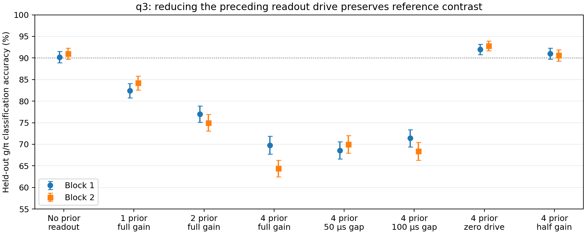

Plot error bars are binomial standard errors for the held-out shots, conditional
on each fitted threshold. Raw data and the reproducible analysis are copied to
`~/.codex/visualizations/2026/10/01/q3-readout-train-check/`.

The next bounded test, `TLSRepeatedLoadingFeedbackCheck`, calibrates both
feedback contexts freshly at gain 940, using one calibration attempt and the
unchanged confidence gate. It then compares the actual four-round fixed
feedback helper with a matched sham that plays only zero-gain correction
pulses. Both receive five gain-940 readouts, the same pulse lengths and
20-us guards. Nominal ground and excited initial preparations are both tested.
An independent gain-1880 readout follows the weak verification. Pre/post
ground/pi references use the same five-readout history and a final zero/pi
preparation slot. This slot also remains present at zero gain in science arms.

There are two reversed blocks, 500 shots per condition per block, 4,000
feedback/sham trials and 2,000 final-reference trials. All 12 raw IQ words per
trial are saved. Analysis retains all-shot and ground-conditioned outcomes,
verification acceptance and inferred correction counts. It reports readout
classification fractions, not an absolute ground-state purity. The matched
sham tests whether feedback adds benefit beyond readouts and elapsed time.
Estimated duration is **1--3 min** including calibration and transport.
The run stops for review; it never starts TLS loading automatically.

```bash
git -c gc.auto=0 pull --ff-only origin tls-spectroscopy
python -u -m WorkingProjects.TLS_Spectroscopy.Client_modules.Runners.TLSRepeatedLoadingFeedbackCheck --run
```

The original loading runner still defaults to gain 1880; only the new check
opts into gain 940. Production reset, initialization and TLS scans are
unchanged. Offline QICK compilation and instruction-path simulation exercised
all 12 tasks, both classifier orientations and both feedback outcomes for two
successive trials each. Checks verified five weak/one strong readouts, correct
gain restoration, correction pulses, fixed timestamps and 12-word records;
maximum program size was 212 instructions. A full synthetic run acquired and
reanalyzed all 6,000 probe records with the two independent reference axes.
**1,350 maintained tests passed**. Hardware feedback performance remains to
be measured.

### Half-gain feedback result: correction threshold is too permissive

`q3_repeated_loading_feedback_check_20261001T060037Z_c6f7f91f` completed
all 12 programs in **18.5 s**, including the fresh weak-readout calibration.
Strong final-reference held-out accuracy was 91.4% before and 93.0% after;
the post-refitted axis gives the same qualitative result. No feedback IQ was
outside the arithmetic range. Pooled across the two 500-shot blocks:

| Initial preparation | Matched sham: final classified excited | Feedback: final classified excited |
| --- | ---: | ---: |
| Ground/no pi | 5.8% | 21.8% |
| Excited/pi | 32.0% | 21.4% |

These are readout classification fractions, not calibrated absolute excited
populations. Feedback harms the ground-prepared condition reproducibly
(22.2/21.4% versus sham 6.2/5.4% across blocks). It reduces the initially
excited signal, but does not produce a satisfactory all-shot reset.
Conditioning on the fifth weak readout gives 7.4% and 8.2% final excited
classification for the feedback arms, accepting only 41.7% and 36.8% of shots.
That selected subset does not establish successful unconditional reset.

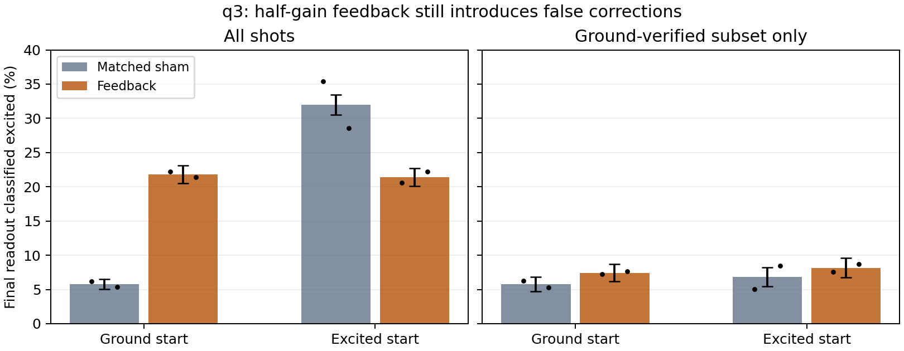

Bars pool both blocks; dots show individual blocks. Error bars are binomial
shot-noise standard errors, not estimates of slow drift uncertainty.

The weak classifier's held-out false-pi rates were **19.5% payload / 23.1%
loop**, with excited detection 77.9/75.9%. Its threshold maximized ordinary
state discrimination; such false-positive rates are costly when they trigger
physical correction pulses. Ground-prepared feedback shots received about
1.2 inferred corrections on average. This identifies a concrete threshold
policy to test rather than accepting the postselected subset as a fix.

Offline rethresholding uses only the even-index training ground references
to bound nominal-ground false triggering at 2%. Odd-index holdout estimates
are then **1.4/2.0% false pi**, with **29.8/31.0% excited detection**. This is
a sensitivity tradeoff, not a counterfactual prediction of hardware reset:
changing decisions changes subsequent qubit states. The next short run repeats
the identical benchmark using fresh calibration under that policy.

`--conservative` raises only the correction threshold, retaining the original
ground-verification threshold. It requires the existing minimum excited
detection/ground acceptance and additionally rejects a calibration whose
held-out false-pi rate exceeds 4%. Training shots select the threshold;
held-out shots only assess it. Both thresholds, the prior unconstrained
threshold and the policy are saved. The current experiment and production
defaults are untouched; there is no automatic loading run.

```bash
git -c gc.auto=0 pull --ff-only origin tls-spectroscopy
python -u -m WorkingProjects.TLS_Spectroscopy.Client_modules.Runners.TLSRepeatedLoadingFeedbackCheck --run --conservative
```

Allow **1--3 min**; the preceding hardware check took under 20 s. Software
verification includes a full synthetic conservative run with real offline
QICK compilation, held-out rejection before feedback, training/holdout
separation tests and sign/arithmetic review. **1,352 maintained tests passed**.

### Conservative feedback result and one intermediate-gain check

`q3_repeated_loading_feedback_check_20261001T062008Z_b1b9d630` completed
all 12 programs in **18.49 s**. Pre/post frozen-axis final-reference accuracies
were 91.6% / 92.7%; the independent post refit was 93.2%. No IQ arithmetic
overflow was found. Recomputing the classifications and verification masks
from saved raw IQ reproduces every saved cell summary.

| Initial preparation | Matched sham: final classified excited | Feedback: final classified excited | Feedback, ground-verified subset |
| --- | ---: | ---: | ---: |
| Ground/no pi | 7.4% | 9.9% | 7.1% (449/1000 accepted) |
| Excited/pi | 45.3% | 19.3% | 10.0% (380/1000 accepted) |

Each all-shot value pools two 500-shot reversed blocks. The ground-start
feedback values were 9.0/10.8%, versus sham 6.4/8.4%; excited-start feedback
was 17.8/20.8%, versus sham 43.8/46.8%. Refitting the final axis gives
9.4% and 19.3% for the two pooled feedback conditions, preserving the result.
These are classified fractions, not calibrated absolute excited populations.

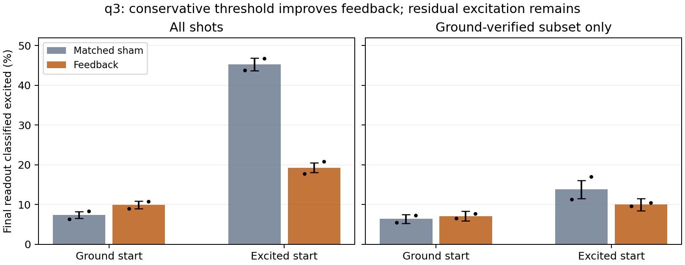

Dots show blocks; error bars are pooled binomial standard errors and do not
include calibration uncertainty or drift. The raw snapshot, analysis script
and pooled counts are in
`~/.codex/visualizations/2026/10/01/q3_repeated_loading_feedback_check_20261001T062008Z_b1b9d630/`.

The conservative policy reduces spurious corrections: held-out false-pi
rates were 2.0% payload / 2.5% loop, at excited detection 28.3% / 33.7%.
Ground-prepared shots received only 0.113 inferred corrections on average,
compared with about 1.2 in the previous permissive-threshold run. However,
initial-state dependence remains after four rounds. Even the selected subset
is not a demonstration of unconditional reset. The loop's calibrated
confidence minimum is 0.384; excited-start feedback verification acceptance
is 0.396 / 0.364 in the two blocks. This does not justify declaring the
loading reset validated or relaxing its confidence gate.

The next bounded comparison uses **gain 1200**, between the demonstrated
weak setting 940 and the problematic repeated-readout setting 1880. It
retains four feedback rounds, five decision/verification reads, the same
guards and trial timing, independent final readout at 1880, two reversed
blocks and the conservative 2% training false-pi target / 4% held-out cap.
Fresh calibration and actual feedback outcomes determine whether the
intermediate gain improves detection without restoring the readout-history
problem. No increase in reset-cycle duration or automatic loading is added.

```bash
git -c gc.auto=0 pull --ff-only origin tls-spectroscopy
python -u -m WorkingProjects.TLS_Spectroscopy.Client_modules.Runners.TLSRepeatedLoadingFeedbackCheck --run --conservative --readout-gain 1200
```

Allow **1--3 min** including setup; the previous two checks each took about
19 s. This is still preparation validation, not a TLS intervention result.
The original loading runner and production reset defaults remain unchanged.
Offline compilation and instruction-path simulation at gain 1200 verified
all 12 tasks, both classifier orientations and both feedback outcomes,
including exact gain restoration, fixed timing and 12-word records. A full
synthetic acquisition exercised all 8,000 calibration and 6,000 probe records
with saved gain metadata and both final-reference analyses.
The default gain-940 instruction-path checks also pass, as do all **1,354
maintained tests**. Independent code review found no actionable issues.

### Gain-1200 result: resume the bounded loading pilot

`q3_repeated_loading_feedback_check_20261001T065222Z_d439f373` completed
in **18.15 s**. Held-out pre strong-reference accuracy was 91.4%; post
accuracy was 92.2% on the frozen axis and 93.6% after refitting. All arithmetic
range checks passed. Fresh conservative classifiers had false-pi rates
1.6% payload / 2.3% loop and excited-detection rates 51.8% / 49.6%.

| Initial preparation | Sham: final classified excited | Feedback: final classified excited | Ground-verified feedback subset |
| --- | ---: | ---: | ---: |
| Ground/no pi | 8.0% | 8.4% | 5.77% (503/1000 accepted) |
| Excited/pi | 39.7% | 10.0% | 5.45% (495/1000 accepted) |

These are classification fractions, not absolute populations. Ground-start
feedback is now close to its matched sham, while excited-start feedback gives
a large reduction. The two selected feedback subsets are consistent within
counting uncertainty. Block-level all-shot feedback fractions are 8.0/8.8%
for ground starts and 12.2/7.8% for excited starts; selected fractions are
5.69/5.84% and 7.66/3.46%, respectively. Refitting the strong final axis gives
pooled all-shot fractions 7.8/9.6% and selected fractions 4.97/4.85%.

The loop classifier has ground acceptance 0.510 and false-ground acceptance
0.048, giving the unchanged loading confidence minimum **0.4176**. Each
feedback block exceeds it: 0.492/0.514 for ground starts, 0.470/0.520 for
excited starts. This supports proceeding to the bounded, ground-conditioned
pilot; it does not establish perfect unconditional reset or validate behavior
through an entire 32-visit loading train. The pilot retains those checks.

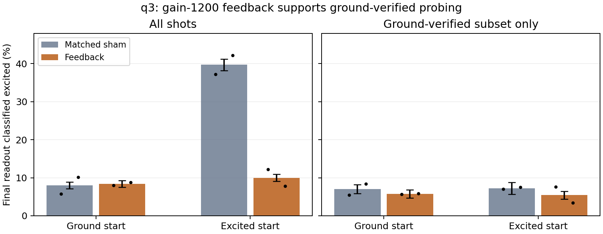

Dots are blocks; error bars are pooled binomial standard errors. The raw
snapshot and reproducible analysis, including checks of every saved fraction
against raw IQ, are in
`~/.codex/visualizations/2026/10/01/q3_repeated_loading_feedback_check_20261001T065222Z_d439f373/`.

`--reduced-readout-reset` opts the existing loading runner into fresh gain-1200
calibration and the conservative 2% training false-pi target / 4% held-out
cap. All five reads in each of 33 resets use gain 1200. Each trial's terminal
readout uses gain 1880, and the next trial restores gain 1200. Strong final
references use the same readout history. All confidence, reference, carryover
and locality requirements remain in place, and unselected outcomes and every
reset IQ record remain saved. Production reset and ordinary runner defaults
are unchanged.

The **8--12 minute pilot** compares 0 versus 32 excited writes at 4.026,
4.037 and 4.046 GHz. Every arm has 32 total visits; ground-prepared visits fill
the zero-dose train. Matching arms load 16 MHz lower, without assuming those
sites are quiet. Ground-verified probes compare 0.1 versus 40 us, and the full
order is reversed in block two. There are 28,800 science probe records and
3,600 pre/mid/post reference records. There is no automatic full run or erase.

```bash
git -c gc.auto=0 pull --ff-only origin tls-spectroscopy
python -u -m WorkingProjects.TLS_Spectroscopy.Client_modules.Runners.TLSRepeatedLoading --run --pilot --reduced-readout-reset
```

The scheduled loading cycle remains **179.748 us**, with **169.250 us** from
the end of the last load to the probe excursion, plus 0.5 us arrival. The
experiment can only reveal population memory surviving that gap. The short
probe, zero dose, detuned loading and reversed repeat test carryover and broad
effects; a positive pilot would still require confirmation and a dose study.

Offline checks compile all 30 pilot/reference programs (maximum 1,989
instructions). Instruction-path simulation exercises 104 paths with both
classifier orientations and feedback outcomes, two hardware shots each,
checking all 165 weak reads then the strong final read, gain restoration,
unchanged timing, record boundaries and no late pulses under the conservative
timing model. A synthetic end-to-end run saves all 32,400 records, uses fresh
conservative calibration, and recovers only the injected 4.037-GHz return
under both final-reference analyses.
Default science/reference binaries and timing match the preceding commit.
All **1,356 maintained tests pass**; independent review found no actionable
issues. These software checks do not establish a TLS return signal.

### Repeated-loading pilot completed: no qualified written-population return

`q3_repeated_loading_pilot_20261001T072326Z_00fce639`, source commit
`1472472a`, completed in **6 min 36 s**. All **24 science programs / 28,800
paired probe records**, plus **3,600 pre/mid/post reference records**, were
saved. All three sites and both reversed blocks completed. This was an actual
repeated-loading experiment, with no site-selection or reset-calibration abort.

The gain-1200 calibration retained the conservative correction policy:
held-out false-pi rates 1.6% payload / 3.0% loop and excited detection
51.3% / 52.3%. Final-reference fidelities were **92.85% pre, 91.55% mid,
92.18% post**, using the frozen pre axis; independent post refit was 92.55%.
All four reference reports and all 24 science-cell quality gates passed.
There were no out-of-range reset IQ records. The final ground cut retained
**12,349/28,800 science probes (42.88%)**, with individual condition acceptance
37.33--47.0%. Mean write-slot verification fractions for the 32-write arms
were 40.46--43.48%, above the unchanged calibrated minimum 34.62%. These
acceptance fractions are classifier responses, not absolute ground purity.

**No site passes the prespecified pilot follow-up rule**, using either the
initial or refitted final-readout axis. Define probe growth as the classified
excited fraction at 40 us minus that at 0.1 us. The on-target effect is this
growth after 32 writes minus growth after zero writes. The localized contrast
additionally subtracts the corresponding effect after loading 16 MHz lower.

| Probe frequency | On-target effect, percentage points | After detuned-loading subtraction, percentage points |
| --- | ---: | ---: |
| 4.026 GHz | +1.21 +/- 2.15 | +2.79 +/- 3.56 |
| 4.037 GHz | +3.54 +/- 2.57 | +3.52 +/- 3.51 |
| 4.046 GHz | +1.30 +/- 2.53 | +1.28 +/- 3.12 |

Uncertainties are descriptive **one-standard-error** estimates, taking the
larger of propagated shot noise and the two-block scatter estimate. They do
not include all calibration/drift uncertainty and are not precise confidence
limits on absolute populations. Refitting the final axis gives localized
contrasts **+2.48 +/- 4.14, +2.36 +/- 4.02, -0.28 +/- 3.38 points**,
preserving the absence of a qualified result.

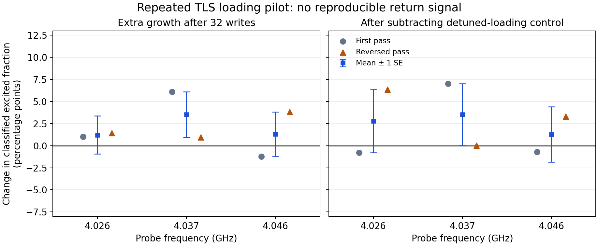

The largest first-pass on-target contrast is **+6.11 points at 4.037 GHz**,
but this is not a clear pumped upward-excitation trace. The 32-write arm
changes only **5.16% to 6.30%**, while the zero-write control decreases
**9.85% to 4.89%**. In the reversed pass, both decline: **6.59% to 4.91%**
after 32 writes and **7.14% to 4.49%** after zero writes. The localized
contrast therefore changes from **+7.03 to +0.01 points**, and continuous-IQ
on-target/localized contrasts reverse sign. This does not reproduce the
earlier post-hoc hint as a clear accumulation effect. Unselected-shot
on-target effects average -0.83, +1.83 and -1.17 points across the three
sites; they also provide no large hidden upward-growth signal.

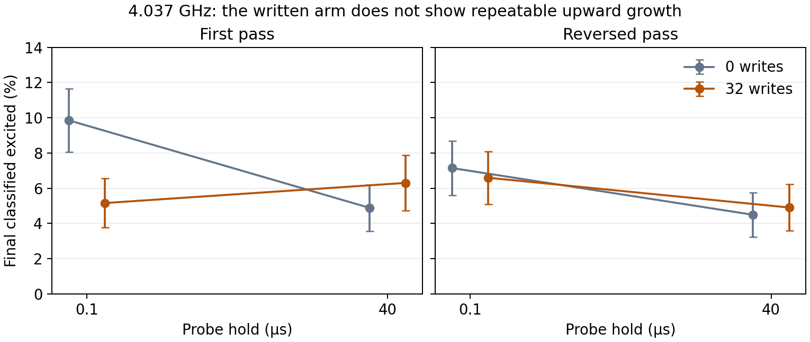

**Decision:** do not expand these data into the 40--60 minute dose sweep,
and do not implement erasure on the assumption that a population has been
written. Close this pilot at these sites and this timing unless independent
new evidence supplies a reason to reopen it. The original write--erase
prerequisite remains unmet. No additional hardware command is introduced
in this results update.

This is a limited null: it tests three fixed frequencies and population
surviving approximately **169.25 us from the last load to the probe excursion**,
plus 0.5 us arrival, with a **179.75-us loading cycle**. It cannot exclude
faster memory, smaller effects or storage at other frequencies. This pilot
does not include a fresh loss spectrum, so it does not independently establish
that the same defects remained at the chosen sites. Do not turn the result
into a claim that individual TLSs cannot store energy.

Audit: every raw cell reproduces its saved summary; independently computed
conditional means and paired influence variances reproduce the growth/error
values. All reference reports and both full analysis summaries reproduce,
and all saved source-file hashes match. All science/reference configurations
use the intended gain-1200 feedback and gain-1880 final readout. The raw
snapshot, `audit_and_plot.py`, numerical audit and inspected PNG/PDF figures
are saved under
`~/.codex/visualizations/2026/10/01/q3_repeated_loading_pilot_20261001T072326Z_00fce639/`.

## 2026-10-04 — fixed-grid afterglow versus wall-clock time

Implemented a blind repeated afterglow map using the existing paired-readout
diagonal sequence. Start with one 4.000--4.050 GHz pass at 2 MHz spacing and
400 shots per condition, then inspect references and growth contrasts before
continuous acquisition. The map requires no T1 site-selection gate. This is
an offline-heralded screen for memory surviving the corrected return and
first readout, not the paper's feed-forward protocol. No new measurement
result is claimed. Full protocol, commands, scope and validation are in
[q3_afterglow_time_map_20261004.md](q3_afterglow_time_map_20261004.md).

First pass `20261004T193258Z_8af4b9b7` completed all 26 frequencies in 6m17s,
with valid initial/final references. Raw IQ reproduces all saved summaries
and growth errors. No confirmed afterglow: strongest growth is 4.034 GHz,
40 us, +17.29 +/- 6.33 points (2.73 SE before the 52-comparison search
correction). Continuous IQ supports the direction but is not independent.
Next: three finite repeat passes at unchanged settings, with order reversal,
to establish a wall-clock map and test this hint before further expansion.

Three-pass repeat `20261004T202506Z_c3e9f87d` completed 78 cells in 18m31s;
all four reference boundaries and all accepted-shot gates passed. Raw IQ
reproduces summaries, errors and references. The 4.034 GHz/40-us hint did
not reproduce: growth +3.62, -9.25, -5.69 points, pooled -3.78 +/- 3.84.
The map contains no confirmed afterglow. A weaker 4.046 GHz/10-us candidate
is positive in all three passes (pooled +7.60 +/- 3.05 points), but remains
below the blind-search threshold. Next: one bounded six-frequency,
2,000-shot, two-pass independent confirmation (~13--15 min), with this
primary endpoint specified before collecting the new data. Full statistics,
scope and command are in the dedicated time-map note.

User steering supersedes the narrow confirmation: prioritize a blind
3.8--4.3 GHz afterglow search. Next run two 250-MHz blocks, one pass each at
2-MHz spacing and 400 shots, approximately 55 minutes total. Independent
initial/final references bound each block. The paper motivates broadband
coverage and does not identify a privileged 4.046-GHz site. Keep the
40-us-return/herald sensitivity limitation explicit. Commands and revised
decision are recorded in the time-map note; acquisition code is unchanged.

First full-band afterglow sweep `212318Z_601077f7` / `215155Z_e5a7c5d6`
completed 3.8--4.3 GHz in 57m09s, all reference boundaries valid. Raw data
reproduce all 252 cells and errors. The 4.000-GHz growth comparisons are
masked because 79 short hot shots fall below the 80-shot gate; other 502
planned comparisons pass. No confirmed afterglow: standardized growth has
mean approximately zero and SD 1.013, with maximum positive 2.84 SE before
the broad search correction. New 3.862/3.984-GHz hints and recurring
4.046-GHz growth remain exploratory. Next repeat the entire band once,
upper block first; independently score the three specified candidate
endpoints before pooling. Full statistics, caveats and commands are in the
dedicated time-map note.


Independent full-band repeat `225214Z_6f2d10a0` / `232144Z_5c01520e`
completed in 59m11s with all four reference boundaries and all504 growth
comparisons valid. All raw summaries, reference reports and paired growth
variances reproduce. None of the three prespecified endpoints passes:
3.862GHz/40us growth -1.03+/-3.81 points, 3.984GHz/40us +2.53+/-5.76,
4.046GHz/10us +3.57+/-5.84. The positive direct offset at3.984GHz does
not establish additional return above the short-probe control. New global
peaks remain consistent with descriptive shot-noise scatter. Decision:
stop broad400-shot repeats of the current offline-heralded protocol; a
preparation/timing change would require a short independently validated
pilot. No further measurement command or production-code change is issued.
Full statistics, plots and limitations are in the dedicated time-map note.

User authorized a short load--feedback-reset--probe pilot before any further
long spectrum. `TLSAfterglowFeedbackPilot` interleaves hot/cold loading,
gain-1200 four-opportunity feedback versus equal-time sham, and 0.1/40-us
probes at fixed 3.984/3.862/4.046-GHz sites, with two reversed-order blocks.
28,800 science trials plus fresh reset and independent final references;
expected 4--8 minutes. The short-probe conditional AND all-shot normalized IQ
must establish preparation equivalence before return can qualify. All reset
IQ, accepted and rejected shots, paired covariance, all-shot growth and
frozen/post-refit results are retained. No automatic long run or peak scout.
Compiled scheduled load-end-to-probe-excursion gap is 169.250 us: this tests
memory surviving the reset, and cannot exclude faster TLS memory. QICK
0.2.133 compile/emulator/workflow audits and the implementation are described
in `docs/q3_afterglow_feedback_pilot_20261004.md`. Production reset defaults,
TLS spectroscopy and initialize settings are unchanged.

Feedback pilot `20261005T020450Z_2ebf154f` completed in 2m59s: all 28,800
science trials and independent final references valid; raw summaries and
paired covariance reproduce. Feedback reduces short hot--cold all-shot IQ
carryover from approximately 10--15% to 2--5% of reference separation, but
none of the three sites establishes both ±5% preparation-equivalence checks.
3.984 GHz is borderline on the conditional interval, not demonstrably failed
preparation. No resolved added return: feedback conditional growth at
3.862/3.984/4.046 GHz is +2.25+/-2.08, +0.91+/-2.30 and +2.85+/-3.46
classified points; all-shot growth is consistent with zero or negative.
Post-refit agrees. Stop further long maps of this sequence; do not interpret
the null as exclusion of faster memory or TLS absence. Full control stats,
plots, scope and the decision are in the dedicated feedback-pilot note.

User authorized the e–f loss route with a quiet g–e bias. The September29
dual-transition attempt is acknowledged, not repeated unchanged. New
`TLSResidentEFPilot` calibrates both transitions at the target and applies
a local g–e mapping pulse before the full40-us return. Paired identity/map
IQ references can resolve preparation-relative f even after f→e return.
One wide scout, bounded local spectroscopy/Rabi/audits, at most one small
recenter, then one-bias0.25/2/8-us g/e/f decay if controls pass. Expected8–15min;
no automatic long profile. Production/reset/initialize code unchanged.
Full design, limitations, tests, offline compile/timing checks and commands
are in `docs/q3_resident_ef_pilot_20261004.md`. No hardware result yet.

First local e–f attempt `20261005T032401Z_b4a205d9` stopped after the
144.54s wide scout; zero local calibration/science arms. No candidate passed
the inherited whole±8MHz shifted-window25-us quiet gate. Loss features
remain, including4.092GHz with a potentially quiet shifted center4.272GHz
(25-us survival0.876); its nearby4.276GHz point0.547 caused rejection.
This gate was unnecessarily broad for the one-bias8-us pilot. No negative
e–f physics result exists. Stop unchanged reruns/broad selection loops;
only a bounded fixed-bias local preparation/readout check could justify
continuation. Details and limitations are appended to the dedicated note.

User approved the fixed-bias follow-up. `TLSResidentEFPilot --run --fixed-check`
reuses the hash-verified reviewed scout, holds model g–e4.272GHz, calibrates
both local transitions once, independently tests two-view g/e/f readout and
the ground/excited8us controls, then stops. No scout/selection, recenter or
f decay series.176programs, expected5–10min. Old feature4.092GHz is only
a saved prior, not evidence that the TLS remains there.1422tests and24
offline fixed-bias compiled/emulated cases pass. No production/default
changes. Commands, decision thresholds and limits are in the dedicated note.


Fixed-bias e–f check `20261005T035124Z_65a9b64b` (cdfb66e5) stopped after
66.44s/160arms at the training e/f separation gate:5.660 versus minimum6.
Both local transitions and gain responses are resolved (g–e4273.50MHz,
gain16004; e–f4093.25MHz,gain5845). All-shot two-view reference matrices
are distinguishable and well-conditioned; the gate miss is marginal,
not evidence of impossible f readout. Two-pulse inversion controls remain
poor (approximately51%/47% of the one-pulse increment), and no independent
final references, early8-us controls or decay data were acquired. Stop the
current e–f loss route without a longer run or gate relaxation. No negative
TLS physics conclusion follows. Raw-source checks, reference statistics,
plots and limits are recorded in `docs/q3_resident_ef_pilot_20261004.md`.

User pivoted to faster T1-versus-frequency measurements inspired by the
Oliver-group adaptive spectroscopy paper. Production uses active reset;
the passive-relax timing bound previously discussed is inapplicable.
`TLSFastLossMap --run` is a finite active-reset pilot: one wide250-shot
scout, one21-frequency/20MHz window, local250-shot pre/post references and
forty40-shot five-condition frames. Ordered raw integer IQ/classifications,
actual frame and host transfer times, reference-drift checks and a survival
heatmap are retained. Conservative paired-shot uncertainty guards avoid
selecting scout noise as a feature. Native correction/full40us return and
production instructions are unchanged; no FPGA estimator/adaptive-delay
claim. Expected5–10min, actual cadence unknown until measurement. No
production/reset/initialize edits. Design, verification, commands and limits
are in `docs/q3_fast_loss_map_20261005.md`. No hardware result yet.

Fast local pilot `20261005T052318Z_c0263e35` completed all43maps/534,250
records in1m42s. Wide scout46.60s; selected4.108GHz, local4.098–4.118GHz.
Median local acquisition0.684s, start interval0.894s including compile/save
gaps;40frames cover37.79s. Independent pre/post and pooled fast data resolve
the25us loss dip (survival0.304 at4.109GHz versus roughly0.65–0.71 atedges).
Pooled reference check passes. Useful cadence/contrast demonstrated, but
single-frame noise and model/reference sensitivity prevent a switching
claim from this short run. Next bounded extension: same sequence,1000
frames via `--frames 1000`, approximately15–22min. Default remains40;
no production/pulse/reset/initialize changes. Full audit, plots and limits
are appended to the dedicated fast-map note.
