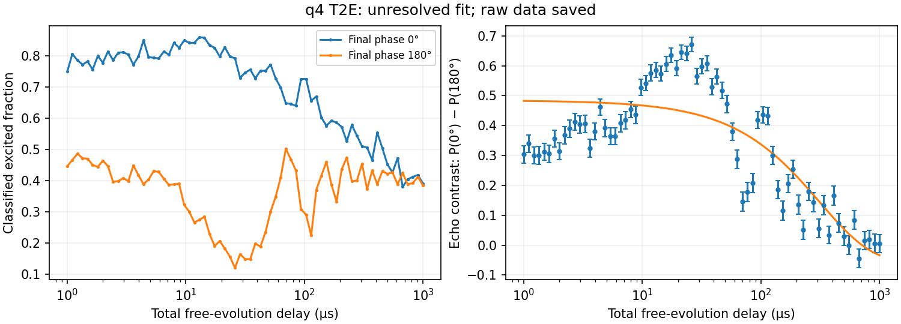

# q4 repeated Hahn echo — 2026-10-02

Requested: infinite T2E versus time, 71 delays, active reset, 1000 shots per
delay. The user selected a maximum delay of **1000 µs**. This runner uses q4's
previous pulse/readout settings independently of `initialize.py` and local
overrides. The measurement PC's initialization files are archived in each
session. No hardware measurement has been launched from the analysis Mac.

## Commands

Finish or stop the existing acquisition before starting this one.

First inspect one measured echo curve:

```bash
git -c gc.auto=0 pull --ff-only origin tls-spectroscopy
python -u -m WorkingProjects.TLS_Spectroscopy.Client_modules.Runners.Q4RepeatedT2E --run --max-runs 1 --max-delay-us 1000
```

Then continuous acquisition:

```bash
python -u -m WorkingProjects.TLS_Spectroscopy.Client_modules.Runners.Q4RepeatedT2E --run --forever --max-delay-us 1000
```

Ctrl+C stops the series. `--hours 12` is an alternative to `--forever`.
Without either flag, the default is 12 hours. `--plan` prints settings without
connecting to hardware. One progress bar per curve reports elapsed time and
ETA. Other output is limited to startup, SS calibration, fit results and errors.

## Sequence and counts

At q4's fixed frequency:

`Xπ/2 — τ/2 — Yπ — τ/2 — ±Xπ/2 — readout — active reset`

- 71 logarithmic free-evolution delays, 1–1000 µs. τ is the sum of the two
  free gaps; pulse durations are excluded. The actual clock-rounded delays
  and pulse start times are saved.
- At every delay, adjacent final-phase 0° and 180° subshots, repeated 500 times
  per phase: **1000 payload shots per delay, 71000 per curve**. Reset-loop
  readouts are additional and depend on feedback.
- Five hardware blocks contain 16, 16, 16, 16 and 7 delays. Each block cycles
  through its phase pairs before repeating. This stays within instruction
  memory and retains complete acquired blocks if a later block fails.
- Qubit drive 4367.760 MHz; Gaussian sigma 2 µs (approximately 8 µs envelope),
  π gain 32000, π/2 gain 16000. Identical envelope duration for all three pulses,
  with equally spaced centers. This uses the previous gains; it does not
  independently recalibrate π/2 rotation fidelity.
- Readout 7026.520 MHz, gain 1880, integration 5 µs. Flux stays at zero; no
  flux excursion or YOKO setting is requested.
- The established native `opx_unbounded` active reset follows each payload
  readout and prepares the next subshot. A fresh program starts with an
  1800 µs passive preroll. The shared watchdog stops a stalled stream.
- Fresh payload/reset-loop calibrations at startup and every 30 minutes
  between curves, with the same references and validation as q4 repeated T1.

The long payload/reset envelopes share one waveform address, as in the
successful q4 T1 runner. The 32-bit phase words for 90° and 180° use QICK's
safe register-write path, since they exceed the direct-immediate range.

## Analysis and saved data

Echo contrast is the signed difference `P(0°) − P(180°)`. Error bars use the
sample variance of adjacent phase differences. Fit a free-offset exponential
`c + a exp(-τ/T2E)` with those errors. Report T2E only when short-delay contrast
is above both 0.10 and five standard errors, relative fit uncertainty is below
50%, fitted decay is below five times the scan maximum, and reduced χ² ≤ 5.
This is a basic validity screen, not proof of exponential decay or pulse
fidelity. Raw fit parameters and reduced χ² are saved even for unresolved fits.

If the first curve has no detectable short-delay echo, stop after saving it.
After a good initial curve, stop after three consecutive curves without echo
contrast. Visible but nonexponential curves remain saved and the series
continues with T2E marked unresolved. Acquisition/calibration errors stop the
series; they do not silently fall back to passive reset.

NAS location:
`Z:/FluxTeam/Data/FTT02_AlOxJJ_2026_08_28/RFSOC/q4/q4_repeated_t2e_<UTC>_<id>/`.
Saved outputs include source/configuration/board snapshots, raw calibration,
phase-resolved normalized IQ arrays (71 × 2 × 500), actual/requested delays,
instruction and waveform preflight reports, transport telemetry, fit JSON and
PNG per curve, plus `t2e_summary.csv` and `manifest.json` with wall time and
calibration links. Raw IQ is saved before fitting/plotting.

On interruption, completed curves and completed blocks of the current curve
are retained. The in-flight block is recoverable only to the extent that the
existing transport supplies partial records; arbitrary Ctrl+C or I/O failure
does not guarantee recovery of the current block. Timeout records, when
supplied, are saved separately as unnormalized accumulator IQ.

## Offline verification

Using QICK 0.2.133 and the actual board configuration/classifiers from the
successful q4 T1 session:

- All five blocks compile: 3474 instructions for each 16-delay block and
  1539 for the last block, below 8192. Waveform use is 55040/65536 samples.
- Instruction emulation checks two passes through every block, both classifier
  orientations and both ground/hot reset branches (20 paths). Gains, phases,
  equal pulse spacing and record ordering pass; no scheduled pulse is late
  under the emulator's four-CPU-cycle instruction model. Every direct `regwi`
  immediate remains below the 30-bit magnitude limit.
- Full synthetic acquisition through the real classifier, fitter and file
  writers recovers 252.48 ± 13.67 µs from an injected 250 µs decay and writes
  the expected 71 × 2 × 500 IQ arrays and trace plot.
- Injected Ctrl+C and timeout after the first block preserve its 16 complete
  delay points and propagate the error. Supplied in-flight timeout records
  are also preserved.
- Full maintained suite: **1367 tests passed**. Runner regressions cover shot
  counts, configuration, signed contrast, exponential recovery and mismatch,
  indefinite repetition, recalibration, finite limits and completed-data saving.

These checks validate software integration. The first measured echo trace
must establish the current hardware contrast and decay before interpreting
an overnight series. Initialization and shared production/reset code are
unchanged; the only existing-runner change is an optional calibration metadata
label in `Q4RepeatedT1.calibrate_reset`, defaulting to its original T1 label.

## First hardware curve: echo present, exponential T2E unresolved

Session `q4_repeated_t2e_20261002T060725Z_122edf43`, commit `a29fdfc4`,
completed at 02:08 EDT on October 2. Calibration plus the single curve took
36.75 s; acquisition/analysis before plot save took 19.72 s. All 71000 payload
shots were saved as finite 71 × 2 × 500 IQ arrays. Reclassifying those arrays
exactly reproduces both saved phase populations, contrast and error bars.



The first calibration attempt passed: held-out peak fidelity 0.9135 for
payload and 0.9005 for the reset-loop context. These describe reference
separation, not a measurement of post-reset purity or π/2 fidelity.

The trace contains substantial echo contrast, but is strongly nonmonotonic:

| Free-delay interval (µs) | Mean classified phase contrast | Standard error |
| --- | ---: | ---: |
| 1–2 | 0.3165 | 0.0102 |
| 10–30 | 0.6035 | 0.0076 |
| 50–80 | 0.2928 | 0.0137 |
| 90–120 | 0.4287 | 0.0164 |
| 500–1000 | 0.0148 | 0.0109 |

The forced exponential yields 315.57 ± 27.45 µs but reduced χ² = 18.75:
**do not report that value as a reliable T2E**. The runner correctly stored
`signal_valid=true`, `fit_valid=false`, and null reported T2E. The early rise
and later oscillation occur within acquisition blocks as well as across them.
First-versus-second 250-shot halves agree at reduced difference χ² = 0.88
(71 points), so this run provides no evidence of a large drift during each
block. The largest saved absolute accumulator value is 26602, within the
signed 16-bit range. These checks find no raw-to-plot mismatch; they do not
prove that the physical pulses have the intended rotations.

Decision: **do not begin the infinite loop yet**. Check q4's current drive
frequency and π/π2 calibration, then repeat one echo trace. Detuning or pulse
imperfection is a candidate explanation, not an established cause from this
curve alone. No acquisition code or fit threshold was changed after this run.

## Finite pulse tune-up before repeating echo

The user approved checking drive frequency and π/π2 calibration. Run:

```bash
git -c gc.auto=0 pull --ff-only origin tls-spectroscopy
python -u -m WorkingProjects.TLS_Spectroscopy.Client_modules.Runners.Q4EchoTuneup --run
```

This is a finite diagnostic with the established q4 readout and active reset.
It archives initialization and code and writes under
`q4/q4_echo_tuneup_<UTC>_<id>/`. It does not edit `initialize.py`, apply new
settings to the repeated echo runner, or start an infinite loop. The pulse
shape remains the approximately 8 µs Gaussian, sigma 2 µs. Flux remains zero.
Reset pulses stay at the previous 4367.760 MHz / gain 32000 settings throughout
the diagnostic; payload pulse settings vary independently.

The stages are:

1. **Pulsed spectroscopy:** 51 frequencies over 4367.760 ± 0.250 MHz, in a
   fixed shuffled order, plus four zero-gain references. Select an interior
   peak with at least 0.15 classified-population contrast above the references.
   This coarse peak seeds the Ramsey check, rather than serving as the final
   frequency calibration.
2. **Four-phase Ramsey:** two drive frequencies at coarse center ±25 kHz,
   81 free gaps from 0.2 to 40.2 µs, and final pulse phases 0/90/180/270°.
   Each delay interleaves both drives and all phases. The complex contrast
   is `(P0−P180) + i(P90−P270)`. Fit a decaying rotating phasor with complex
   amplitude and offset. The known 50 kHz drive separation determines the
   hardware phase convention; both traces must resolve and show the expected
   beat-frequency shift. The constant pulse duration shifts the fitted phase,
   not the fringe frequency versus free gap.
3. **Rotation check:** at the Ramsey-derived frequency if qualified, otherwise
   at the coarse frequency for diagnostic purposes only, sweep 0–32000 gain
   for one and three equal-phase pulses, plus 8000–22000 gain for four pulses.
   Pulse gaps are 0.1 µs. Fit each train independently to a sinusoidal rotation
   response. The three-pulse fit estimates π gain; the four-pulse fit estimates
   π2 gain from its first full-rotation return. The one-pulse response and train
   agreement provide consistency checks.

There are 55 + 648 + 95 = **798 conditions**, 250 payload shots each:
**199500 payload shots**, plus reset readouts and fresh calibration references.
Acquisition uses 34 programs of at most 24 conditions, with one progress/ETA
bar per stage and raw IQ saved after every completed block. Full raw data,
conditions, timing and memory reports, classified populations, fit reports and
`diagnostic.png` are retained. On interruption, completed blocks remain saved;
recovery of the current block depends on partial records supplied by transport.

The saved candidate requires two qualified Ramsey fits, agreement with the
known drive shift, frequency within 40 kHz of the coarse center, independent
gain fits with resolved contrast and reduced χ² ≤ 5, agreement between pulse
trains, and a suggested π gain no higher than 32000. A failed Ramsey fit does
not prevent collecting the amplitude diagnostic, but disqualifies the final
candidate. Suggested gains are **not automatically applied**. Inspect this run
and repeat one measured echo before starting the continuous series.

Offline checks use QICK 0.2.133 and the saved q4 board/classifier. All 34
programs compile (maximum 2633/8192 instructions; waveform 55040/65536 samples).
Instruction emulation covers both classifier signs and ground/hot reset paths
for every block and verifies phases, frequencies, gains, gaps, reset-register
restoration and record ordering. Full synthetic acquisition recovers injected
frequency and rotation gains and saves all three stages; interrupt/timeout
injection preserves completed blocks. These are software checks, not evidence
that the actual hardware tune-up has succeeded.

Verification also includes nine targeted regression cases for phase-balanced
conditions, detuning recovery with both phase conventions, rejection of weak
or inconsistent Ramsey signals, independent rotation fits, bounded peak
selection and pulse limits. The full maintained suite passes 1376 tests.
